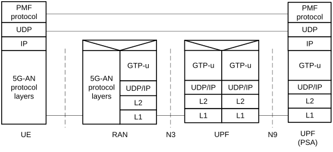
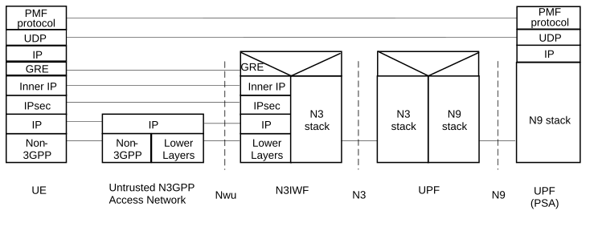
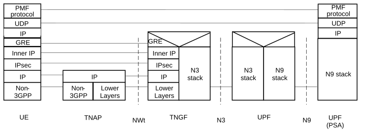

# 5.32.5.4 Protocol stack for user plane measurements and measurement reports

Figure 5.32.5.4-1: UE/UPF measurements related protocol stack for 3GPP access and for an MA PDU Session with type IP

In the case of an MA PDU Session with type Ethernet, the protocol stack over 3GPP access is that same as the one in the above figure, but the PMF protocol operates on top of Ethernet, instead of UDP/IP.

Figure 5.32.5.4-2: UE/UPF measurements related protocol stack for Untrusted non-3GPP access and for an MA PDU Session with type IP

In the case of an MA PDU Session with type Ethernet, the protocol stack over Untrusted non-3GPP access is the same as the one in the above figure, but the PMF protocol operates on top of Ethernet, instead of UDP/IP.

Figure 5.32.5.4-3: UE/UPF measurements related protocol stack for Trusted non-3GPP access and for an MA PDU Session with type IP

In the case of an MA PDU Session with type Ethernet, the protocol stack over Trusted non-3GPP access is the same as the one in the above figure, but the PMF protocol operates on top of Ethernet, instead of UDP/IP.
