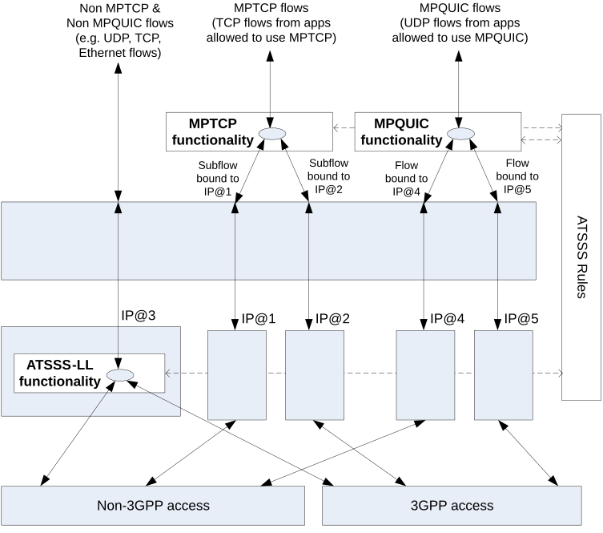

# 5.32.6.1 General

The functionality in an ATSSS-capable UE that can steer, switch and split the MA PDU Session traffic across 3GPP access and non-3GPP access, is called a "steering functionality". An ATSSS-capable UE may support one or more of the following types of steering functionalities:

\- High-layer steering functionalities, which operate above the IP layer:

\- In this release of the specification, two high-layer steering functionalities are specified:

\- The first applies the MPTCP protocol (IETF RFC 8684 \[81\]) and is called "MPTCP functionality" (see clause 5.32.6.2.1). This steering functionality can be applied to steer, switch and split the TCP traffic flows identified in the ATSSS/N4 rules. The MPTCP functionality in the UE may communicate with an associated MPTCP Proxy functionality in the UPF, by using the MPTCP protocol over the 3GPP and/or the non-3GPP user plane.

\- The second applies the QUIC protocol (RFC 9000 \[166\], RFC 9001 \[167\], RFC 9002 \[168\]) and its multipath extensions (draft-ietf-quic-multipath \[174\]) and it is called "MPQUIC functionality" (see clause 5.32.6.2.2). This steering functionality can be applied to steer, switch and split the UDP traffic flows identified in the ATSSS/N4 rules. The MPQUIC functionality in the UE may communicate with an associated MPQUIC Proxy functionality in the UPF, by using the QUIC protocol and its multipath extensions over the 3GPP and/or the non-3GPP user plane.

\- Low-layer steering functionalities, which operate below the IP layer:

\- One type of low-layer steering functionality defined in the present document is called "ATSSS Low-Layer functionality", or ATSSS-LL functionality (see clause 5.32.6.3.1). This steering functionality can be applied to steer, switch and split all types of traffic, including TCP traffic, UDP traffic, Ethernet traffic, etc. ATSSS-LL functionality is mandatory for MA PDU Session of type Ethernet. In the network, there shall be in the data path of the MA PDU session one UPF supporting ATSSS-LL.

NOTE: Filters used in ATSSS rules related with a MA PDU Session of type Ethernet can refer to IP level parameters such as IP addresses and TCP/UDP ports.

The UE indicates to the network its supported steering functionalities and steering modes by including in the UE ATSSS Capability one of the following:

1\) The "ATSSS-LL functionality with any steering mode allowed for ATSSS-LL supported" capability.

In this case, the UE indicates that it is capable to steer, switch and split all traffic of the MA PDU Session by using the ATSSS-LL functionality with any steering mode allowed for ATSSS-LL, as specified in clause 5.32.8.

2\) The "MPTCP functionality with any steering mode supported" capability and the "ATSSS-LL functionality with only Active-Standby steering mode supported" capability.

In this case, the UE indicates that:

a\) it is capable to steer, switch and split the MPTCP traffic of the MA PDU Session by using the MPTCP functionality with any steering mode specified in clause 5.32.8; and

b\) it is capable to steer and switch all other traffic (i.e. the non-MPTCP traffic) of the MA PDU Session by using the ATSSS-LL functionality with the Active-Standby steering mode specified in clause 5.32.8.

3\) The "MPTCP functionality with any steering mode supported" capability and the "ATSSS-LL functionality with any steering mode allowed for ATSSS-LL supported" capability.

In this case, the UE indicates that:

a\) it is capable to steer, switch and split the MPTCP traffic of the MA PDU Session by using the MPTCP functionality with any steering mode specified in clause 5.32.8; and

b\) it is capable to steer, switch and split all other traffic (i.e. the non-MPTCP traffic) of the MA PDU Session by using the ATSSS-LL functionality with any steering mode, as specified in clause 5.32.8.

4\) The "MPQUIC functionality with any steering mode supported" capability and the "ATSSS-LL functionality with only Active-Standby steering mode supported" capability.

In this case, the UE indicates that:

a\) it is capable to steer, switch and split the MPQUIC traffic of the MA PDU Session by using the MPQUIC functionality with any steering mode specified in clause 5.32.8; and

b\) it is capable to steer and switch all other traffic (i.e. the non-MPQUIC traffic) of the MA PDU Session by using the ATSSS-LL functionality with the Active-Standby steering mode specified in clause 5.32.8.

5\) The "MPQUIC functionality with any steering mode supported" capability and the "ATSSS-LL functionality with any steering mode allowed for ATSSS-LL supported" capability.

In this case, the UE indicates that:

a\) it is capable to steer, switch and split the MPQUIC traffic of the MA PDU Session by using the MPQUIC functionality with any steering mode specified in clause 5.32.8; and

b\) it is capable to steer, switch and split all other traffic (i.e. the non-MPQUIC traffic) of the MA PDU Session by using the ATSSS-LL functionality with any steering mode that can be used with ATSSS-LL, as specified in clause 5.32.8.

6\) The "MPTCP functionality with any steering mode supported" capability, the "MPQUIC functionality with any steering mode supported" capability and the "ATSSS-LL functionality with only Active-Standby steering mode supported" capability.

In this case, the UE indicates that:

a\) it is capable to steer, switch and split the MPTCP traffic of the MA PDU Session by using the MPTCP functionality with any steering mode specified in clause 5.32.8;

b\) it is capable to steer, switch and split the MPQUIC traffic of the MA PDU Session by using the MPQUIC functionality with any steering mode specified in clause 5.32.8; and

c\) it is capable to steer and switch all other traffic (i.e. the non-MPTCP traffic and the non-MPQUIC traffic) of the MA PDU Session by using the ATSSS-LL functionality with the Active-Standby steering mode specified in clause 5.32.8.

7\) The "MPTCP functionality with any steering mode supported" capability, the "MPQUIC functionality with any steering mode supported" capability and the "ATSSS-LL functionality with any steering mode allowed for ATSSS-LL supported" capability.

In this case, the UE indicates that:

a\) it is capable to steer, switch and split the MPTCP traffic of the MA PDU Session by using the MPTCP functionality with any steering mode specified in clause 5.32.8;

b\) it is capable to steer, switch and split the MPQUIC traffic of the MA PDU Session by using the MPQUIC functionality with any steering mode specified in clause 5.32.8; and

c\) it is capable to steer, switch and split all other traffic (i.e. the non-MPTCP traffic and the non-MPQUIC traffic) of the MA PDU Session by using the ATSSS-LL functionality with any steering mode that can be used with ATSSS-LL, as specified in clause 5.32.8.

The above steering functionalities are schematically illustrated in the Figure 5.32.6.1-1, which shows an example model for an ATSSS-capable UE supporting the MPTCP functionality, the MPQUIC functionality and the ATSSS-LL functionality. The MPTCP flows and the MPQUIC flows in this figure represent the traffic of the applications for which MPTCP can be applied and for which MPQUIC can be applied respectively. The five different IP addresses illustrated in the UE are further described in clause 5.32.6.2.1 and in clause 5.32.6.2.2. When the MPTCP functionality and the MPQUIC functionality are both applied, the addresses (IP@1, IP@2) used for MPTCP may be the same as the addresses (IP@4, IP@5) used for MPQUIC. The "Low-Layer" in this figure contains functionality that operates below the IP layer (e.g. different network interfaces in the UE), while the "High-Layer" contains functionality that operates above the IP layer.

Figure 5.32.6.1-1: Steering functionalities in an example UE model

Within the same MA PDU Session in the UE, it is possible to steer the MPTCP flows by using the MPTCP functionality, to steer the MPQUIC flows by using the MPQUIC functionality and, simultaneously, to steer all other flows by using the ATSSS-LL functionality. For the same packet flow, only one steering functionality shall be used.

All steering functionalities in the UE shall take ATSSS decisions (i.e. decide how to steer, switch and split the traffic) by using the same set of ATSSS rules. Similarly, all ATSSS decisions in the UPF shall be taken by applying the same set of N4 rules, which support ATSSS. The ATSSS rules and the N4 rules supporting ATSSS are provisioned in the UE and in the UPF respectively, when the MA PDU Session is established.

If the UE supports multiple steering functionalities, e.g. both the MPTCP functionality and the ATSSS-LL functionality, both the MPQUIC functionality and the ATSSS-LL functionality, or the MPTCP functionality, the MPQUIC functionality and the ATSSS-LL functionality, it shall use the provisioned ATSSS rules (see TS 23.503 \[45\]) to decide which steering functionality to apply for a specific packet flow.
