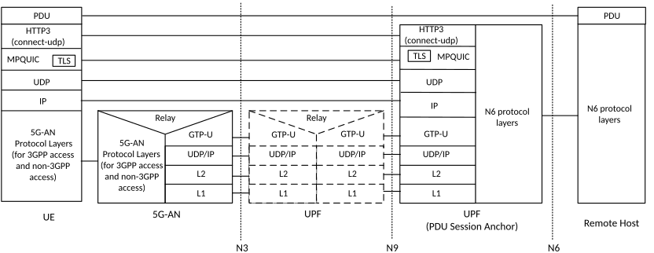

# 5.32.6.2 High-Layer Steering Functionalities

## 5.32.6.2.1 MPTCP Functionality

As mentioned in clause 5.32.6.1, the MPTCP functionality in the UE applies the MPTCP protocol (IETF RFC 8684 \[81\]) and the provisioned ATSSS rules for performing access traffic steering, switching and splitting. The MPTCP functionality in the UE may communicate with the MPTCP Proxy functionality in the UPF using the user plane of the 3GPP access, or the non-3GPP access, or both.

The MPTCP functionality may be enabled in the UE when the UE provides an "MPTCP capability" during PDU Session Establishment procedure.

The network shall not enable the MPTCP functionality when the type of the MA PDU Session is Ethernet.

If the UE indicates it is capable of supporting the MPTCP functionality, as described in clause 5.32.2 and the network agrees to enable the MPTCP functionality for the MA PDU Session then:

i\) An associated MPTCP Proxy functionality is enabled in the UPF for the MA PDU Session by MPTCP functionality indication received in the Multi-Access Rules (MAR).

ii\) The network allocates to UE one IP address/prefix for the MA PDU Session and two additional IP addresses/prefixes, called "MPTCP link-specific multipath" addresses/prefixes; one associated with 3GPP access and another associated with the non-3GPP access. In the UE, these two IP addresses/prefixes are used only by the MPTCP functionality. Each "MPTCP link-specific multipath" address/prefix assigned to UE may not be routable via N6. The MPTCP functionality in the UE and the MPTCP Proxy functionality in the UPF shall use the "MPTCP link-specific multipath" addresses/prefixes for subflows over non-3GPP access and over 3GPP access and MPTCP Proxy functionality shall use the IP address/prefix of the MA PDU session for the communication with the final destination. In Figure 5.32.6.1-1, the IP@3 corresponds to the IP address of the MA PDU Session and the IP@1 and IP@2 correspond to the "MPTCP link-specific multipath" IP addresses. The following UE IP address management applies:

\- The MA PDU IP address/prefix shall be provided to the UE via mechanisms defined in clause 5.8.2.2.

\- The "MPTCP link-specific multipath" IP addresses/prefixes shall be allocated by the UPF and shall be provided to the UE via SM NAS signalling.

NOTE 1: After the MA PDU Session is released, the same UE IP addresses/prefixes are not allocated to another UE for MA PDU Session in a short time.

NOTE 2: The act of the UPF performing translation on traffic associated with the "MPTCP link-specific multipath" addresses to/from the MA PDU session IP address can lead to TCP port collision and exhaustion. The port collision can potentially occur because the UE also uses the MA PDU session IP address for non-MPTCP traffic and this causes the port namespace of such address to be owned simultaneously by the UE and UPF. In addition, the port exhaustion can potentially occur when the UE creates a large number of flows, because multiple IP addresses used by the UE are mapped to a single MA PDU session IP address on the UPF. The UPF needs to consider these problems based on the UPF implementation and avoid them by, for example, using additional N6-routable IP addresses for traffic associated to the link-specific multipath addresses/prefixes. How this is done is left to the implementation.

iii\) The network shall send MPTCP proxy information to UE, i.e. the IP address, a port number and the type of the MPTCP proxy. The following type of MPTCP proxy shall be supported in this release:

\- Type 1: Transport Converter, as defined in IETF RFC 8803 \[82\].

The MPTCP proxy information is retrieved by the SMF from the UPF during N4 session establishment.

The UE shall support the client extensions specified in IETF RFC 8803 \[82\].

iv\) The network may indicate to UE the list of applications for which the MPTCP functionality should be applied. This is achieved by using the Steering Functionality component of an ATSSS rule (see clause 5.32.8).

NOTE 3: To protect the MPTCP proxy function (e.g. to block DDOS to the MPTCP proxy function), the IP addresses of the MPTCP Proxy Function are only accessible from the two "MPTCP link-specific multipath" IP addresses of the UE via the N3/N9 interface.

v\) When the UE indicates it is capable of supporting the MPTCP functionality with any steering mode and the ATSSS-LL functionality with only the Active-Standby steering mode (as specified in clause 5.32.6.1) and these functionalities are enabled for the MA PDU Session, then the UE shall route via the MA PDU Session the TCP traffic of applications for which the MPTCP functionality should be applied (i.e. the MPTCP traffic), as defined in bullet iv. The UE may route all other traffic (i.e. the non-MPTCP traffic) via the MA PDU Session, but this type of traffic shall be routed on one of 3GPP access or non-3GPP access, based on the received ATSSS rule for non-MPTCP traffic (see clause 5.32.2). The UPF shall route all other traffic (i.e. non-MPTCP traffic) based on the N4 rules provided by the SMF. This may include N4 rules for ATSSS-LL, using any steering mode as instructed by the N4 rules.

## 5.32.6.2.2 MPQUIC Functionality

The MPQUIC functionality enables steering, switching and splitting of UDP traffic between the UE and UPF, in accordance with the ATSSS policy created by the network. The operation of the MPQUIC functionality is based on RFC 9298 \[170\] "proxying UDP in HTTP", which specifies how UDP traffic can be transferred between a client (UE) and a proxy (UPF) using the RFC 9114 \[171\] HTTP/3 protocol. The HTTP/3 protocol operates on top of the QUIC protocol (RFC 9000 \[166\], RFC 9001 \[167\] , RFC 9002 \[168\]), which supports simultaneous communication over multiple paths, as defined in draft-ietf-quic-multipath \[174\].

The MPQUIC functionality in the UE communicates with the MPQUIC Proxy functionality in the UPF (see Figure 4.2.10-1) using the user plane of the 3GPP access, or the non-3GPP access, or both.

The MPQUIC functionality may be enabled for an MA PDU Session with type IPv4, IPv6 or IPv4v6, when both the UE and the network support this functionality. The MPQUIC functionality shall not be enabled when the type of the MA PDU Session is Ethernet.

The MPQUIC functionality is composed of three components:

1\) QoS flow selection & Steering mode selection: This component in the UE initiates the establishment of one or more multipath QUIC connections, after the establishment of the MA PDU Session and, for each uplink UDP flow, it selects a QoS flow (based on the QoS rules), a steering mode and a transport mode (based on the ATSSS rules). This component in the UPF selects, for each downlink UDP flow, a QoS flow (based on the N4 rules), a steering mode and a transport mode (based on the N4 rules). The supported transport modes are defined below.

In the UE, this component is only used in the uplink direction, while, in the UPF, this component is only used in the downlink direction.

2\) HTTP/3 layer: Supports the HTTP/3 protocol defined in RFC 9114 \[171\] and the extensions defined in:

\- RFC 9298 \[170\] for supporting UDP proxying over HTTP;

\- RFC 9297 \[172\] for supporting HTTP datagrams; and

\- RFC 9220 \[173\] for supporting Extended CONNECT.

The HTTP/3 layer selects a multipath QUIC connection to be used for each UDP flow and allocates a new QUIC stream on this connection that is associated with the UDP flow. It also configures this QUIC stream to apply a specific steering mode.

In the UE, the HTTP/3 layer implements an HTTP/3 client, while, in the UPF, it implements an HTTP/3 proxy.

3\) QUIC layer: Supports the QUIC protocol as defined in the applicable IETF specifications (RFC 9000 \[166\], RFC 9001 \[167\], RFC 9002 \[168\]) and the extensions defined in:

\- RFC 9221 \[169\] for supporting unreliable datagram transport with QUIC; and

\- draft-ietf-quic-multipath \[174\] for supporting QUIC connections using multiple paths simultaneously.

When the MPQUIC functionality is applied, the protocol stack of the user plane is depicted in figure below.

Figure 5.32.6.2.2-1: UP protocol stack when the MPQUIC functionality is applied

If the UE indicates that it is capable of supporting the MPQUIC functionality, as described in clause 5.32.2 and the network agrees to enable the MPQUIC functionality for the MA PDU Session then:

i\) An associated MPQUIC Proxy functionality is enabled in the UPF for the MA PDU Session.

ii\) The network allocates to UE one IP address/prefix for the MA PDU Session and two additional IP addresses/prefixes, called "MPQUIC link-specific multipath " addresses/prefixes; one associated with 3GPP access and another associated with the non-3GPP access. In the UE, these two IP addresses/prefixes are used only by the MPQUIC functionality. Each "MPQUIC link-specific multipath" address/prefix assigned to UE may not be routable via N6. The MPQUIC functionality in the UE and the MPQUIC Proxy functionality in the UPF shall use the "MPQUIC link-specific multipath" addresses/prefixes for transmitting UDP flows over non-3GPP access and over 3GPP access. The MPQUIC Proxy functionality shall use the IP address/prefix of the MA PDU session for the communication with the final destination. In Figure 5.32.6.1-1, the IP@3 corresponds to the IP address of the MA PDU Session and the IP@4 and IP@5 correspond to the "MPQUIC link-specific multipath" addresses. The following UE IP address management applies:

\- The MA PDU IP address/prefix shall be provided to the UE via mechanisms defined in clause 5.8.2.2.

\- The "MPQUIC link-specific multipath" IP addresses/prefixes shall be allocated by the UPF and shall be provided to the UE via SM NAS signalling.

NOTE 1: After the MA PDU Session is released, the same UE IP addresses/prefixes are not allocated to another UE for MA PDU Session in a short time.

iii\) The network shall send MPQUIC proxy information to UE, i.e. one IP address of UPF, one UDP port number and the proxy type (e.g. "connect-udp"). This information is used by the UE for establishing multipath QUIC connections with the UPF, which implements the MPQUIC Proxy functionality.

iv\) After the MA PDU Session is established, the UE determines the number of multipath QUIC connections to be established with the UPF. The UE determines to establish at least as many multipath QUIC connections as the number of QoS flows of the MA PDU Session, i.e. one multipath QUIC connection per QoS flow. Each multipath QUIC connection carries the UDP traffic mapped to a single QoS flow.

Security aspects are defined in TS 33.501 \[29\].

For the downlink traffic to which the MPQUIC functionality is to be applied, the QoS rules provided to UE include downlink QoS information and the UE applies the downlink QoS information to establish multipath QUIC connections for the QoS flows used for the downlink traffic only.

v\) During a QUIC connection establishment, the UE and UPF negotiate QUIC transport parameters and indicate (a) support of QUIC Datagram frames and (b) support of multipath. They indicate support of QUIC Datagram frames by providing the "max_datagram_frame_size" transport parameter with a non-zero value (see RFC 9221 \[169\]) and they indicate support of multipath by providing the "enable_multipath" transport parameter (see draft-ietf-quic-multipath \[174\]).

In addition, during a QUIC connection establishment the QoS flow associated with this connection is determined. The UE sends all traffic of a QUIC connection over the QoS flow associated with this QUIC connection. This enables the UPF to determine the QoS flow associated with a QUIC connection and to select a QUIC connection for sending the downlink traffic of a QoS flow.

vi\) After a QUIC connection establishment, the HTTP/3 client in the UE and the HTTP/3 proxy in the UPF negotiate HTTP settings and indicate support of HTTP Datagrams (see RFC 9297 \[172\]) and support of Extended CONNECT (see RFC 9220 \[173\]). To use MPQUIC proxying for a UDP traffic flow, the UE then sends a HTTP/3 CONNECT request (see RFC 9298 \[170\]) to the HTTP/3 proxy in the UPF.

vii\) The network may indicate to UE the list of applications for which the MPQUIC functionality should be applied. This is achieved by using the Steering Functionality component of an ATSSS rule (see clause 5.32.8).

### 5.32.6.2.2.1 Supported Transport Modes

The MPQUIC functionality supports the following transport modes for transmitting a UDP flow between UE and UPF. The PCF selects which of these transport modes shall be applied for a UDP flow (SDF). The selected transport mode is provided to UE and UPF within the ATSSS rules and N4/MAR rules respectively.

\- Datagram mode 2: This transport mode is the mode defined in RFC 9298 \[170\]. It encapsulates UDP packets within QUIC Datagram frames and provides unreliable transport with no sequence numbering and no packet reordering / deduplication.

\- Datagram mode 1: This transport mode is an extension of the mode defined in RFC 9298 \[170\]. It encapsulates UDP packets within QUIC Datagram frames and provides unreliable transport but with sequence numbering and with packet reordering / deduplication. It can be applied for any UDP flow. The details of the datagram mode 1 are defined in TS 24.193 \[109\].

\- Stream mode: This transport mode is readily supported by the QUIC protocol. It encapsulates UDP packets within QUIC Stream frames and provides reliable transport with sequence numbering and with packet reordering / deduplication. It can be applied for UDP flows where it is known that the application does not perform retransmissions.

NOTE 1: The Stream mode provides strict reliability and in-order delivery with re-transmissions and therefore can lead to melt down phenomena when reliable traffic (e.g. QUIC) is carried, or counteracts application decisions when UDP is selected to avoid reliability and/or in-order delivery. Therefore, it can be avoided for applications which perform their own reliability mechanisms.

NOTE 2: When a steering mode is supported by ATSSS-LL for a UDP flow (e.g. Active-Standby), the MPQUIC steering functionality can be selected if additional features, which are not supported by the ATSSS-LL steering functionality and PMF, are required for the traffic steering/switching/splitting of the UDP flow.
