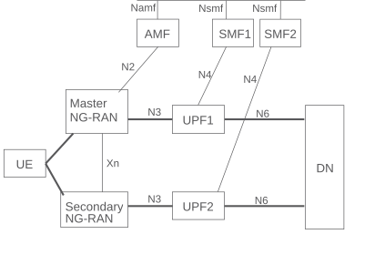
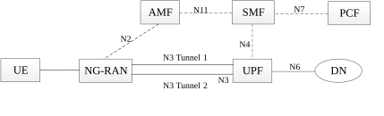
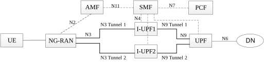

# 5.33.2 Redundant transmission for high reliability communication

## 5.33.2.1 Dual Connectivity based end to end Redundant User Plane Paths

In order to support highly reliable URLLC services, a UE may set up two redundant PDU Sessions over the 5G network, such that the 5GS sets up the user plane paths of the two redundant PDU Sessions to be disjoint. The user's subscription indicates if user is allowed to have redundant PDU Sessions and this indication is provided to SMF from UDM.

NOTE 1: It is out of scope of 3GPP how to make use of the duplicate paths for redundant traffic delivery end-to-end. It is possible to rely on upper layer protocols, such as the IEEE 802.1 TSN (Time Sensitive Networking) FRER (Frame Replication and Elimination for Reliability) \[83\], to manage the replication and elimination of redundant packets/frames over the duplicate paths which can span both the 3GPP segments and possibly fixed network segments as well.

NOTE 2: The following redundant network deployment aspects are within the responsibility of the operator and are not subject to 3GPP standardization:

\- RAN supports dual connectivity and there is sufficient RAN coverage for dual connectivity in the target area.

\- UEs support dual connectivity.

\- The core network UPF deployment is aligned with RAN deployment and supports redundant user plane paths.

\- The underlying transport topology is aligned with the RAN and UPF deployment and supports redundant user plane paths.

\- The physical network topology and geographical distribution of functions also supports the redundant user plane paths to the extent deemed necessary by the operator.

\- The operation of the redundant user plane paths is made sufficiently independent, to the extent deemed necessary by the operator, e.g. independent power supplies.

Figure 5.33.2.1-1 illustrates an example user plane resource configuration of dual PDU Sessions when redundancy is applied. One PDU Session spans from the UE via Master RAN node to UPF1 acting as the PDU Session Anchor and the other PDU Session spans from the UE via Secondary RAN node to UPF2 acting as the PDU Session Anchor. As described in TS 37.340 \[31\], NG-RAN may realize redundant user plane resources for the two PDU Sessions with two NG-RAN nodes (i.e. Master RAN node and Secondary RAN node as shown in Figure 5.33.2.1-1) or a single NG-RAN node. In both cases, there is a single N1 interface towards AMF.

Based on these two PDU Sessions, two independent user plane paths are set up. UPF1 and UPF2 connect to the same Data Network (DN), even though the traffic via UPF1 and UPF2 may be routed via different user plane nodes within the DN.

In order to establish two redundant PDU Sessions and associate the duplicated traffic coming from the same application to these PDU Sessions, URSP as specified in TS 23.503 \[45\] may be used, or alternatively the UE may perform this task independently from URSP.

When URSP is used to establish two redundant PDU Sessions, duplicated traffic from the application, associated to the redundant PDU Sessions, is differentiated by two distinct traffic descriptors, each in a distinct URSP rule. These traffic descriptors need to have different DNNs, IP descriptors or non-IP descriptors (e.g. MAC address, VLAN ID), so that the two redundant PDU Sessions are matched to the Route Selection Descriptors of distinct URSP rules. These Route Selection Descriptors of distinct URSP rules may include corresponding RSNs and PDU Session Pair IDs. The Route Selection Descriptors share same PDU Session Pair ID, if included, to denote the two traffic are redundant with each other. How does UE determines the PDU Session Pair ID and/or RSN from the matched URSP rules is described in clause 6.6.2 of TS 23.503 \[45\].

When the UE performs the establishment of two redundant PDU Sessions and the duplication of traffic independently from URSP, the UE may establish two redundant PDU Sessions even when the application does not duplicate the traffic and the application does not provide two distinct traffic descriptors. In this case the UE may set the RSN and PDU Session Pair ID in the PDU Session Establishment Request message based on UE implementation.

NOTE 3: As an example, the UE may use the implementation of FRER (Frame Replication and Elimination for Reliability), IEEE Std 802.1CB-2017 \[83\], in the UE's operating system.

If the operator decides to allow UE to use its own mechanisms to determine PDU Session Pair ID and RSN (where such UE capability is known based on local PCF configuration based on e.g. deployment, terminal implementation or policies per group of UE(s)), then the PCF shall not include PDU Session Pair ID and RSN in URSP rule.

The redundant user plane set up applies to both IP and Ethernet PDU Sessions.

Figure 5.33.2.1-1: Example scenario for end to end redundant User Plane paths using Dual Connectivity

Support of redundant PDU Sessions include:

\- UE initiates two redundant PDU Sessions and may provide PDU Session Pair ID (optional) and the RSN (optional). Different combinations of RSN, DNN and S-NSSAI are used for each PDU Session within a given pair of redundant PDU Sessions. Different combinations of PDU Session Pair ID, DNN and S-NSSAI are used between the different pairs of redundant PDU Session.

\- The UE may include a PDU Session Pair ID and/or RSN in each of the PDU Session establishment Request when it establishes redundant PDU Sessions. UE determines the PDU Session Pair ID and/or RSN based on UE local mechanism or the matched URSP rules.

\- The SMF determines whether the PDU Session is to be handled redundantly. The determination is based on the presence of the PDU Session Pair ID and/or RSN in the PDU Session Establishment Request or the determination is based on an indication that redundant PDU Session is required provided by PCF for the PDU Session, if dynamic PCC applies for the PDU Session or the combination of the S-NSSAI, DNN, user subscription and local policy configuration in the SMF if dynamic PCC is not used for the PDU Session. If the PDU session is to be handled redundantly and the PDU Session Pair ID was not included in the PDU Session Establishment request, the SMF uses S-NSSAI, DNN and local configuration to determine the PDU Session Pair ID. If the PDU session is to be handled redundantly and RSN was not included in the PDU Session Establishment request, the SMF uses S-NSSAI, DNN to determine the RSN value. The RSN differentiates the PDU Sessions that are handled redundantly and indicates redundant user plane requirements for the PDU Sessions in NG-RAN.

\- The SMF shall provide the RSN and PDU Session Pair ID to the NG-RAN for a redundant PDU Session.

\- Operator configuration of UPF selection ensures the appropriate UPF selection for disjoint paths.

\- At establishment of the PDU Sessions or at transitions to CM-CONNECTED state, the RSN parameter indicates to NG-RAN that redundant user plane resources shall be provided for the given PDU Sessions by means of dual connectivity. The PDU Session Pair ID identifies the two redundant PDU Sessions that belong together. The value of the RSN parameter and the PDU Session Pair ID indicates redundant user plane requirements for the PDU Sessions. This request for redundant handling is made by indicating the RSN to the NG-RAN node on a per PDU Session granularity. PDU Sessions associated with different RSN values shall be realized by different, redundant UP resources. Based on the RSN, the PDU Session Pair ID and RAN configuration, the NG-RAN sets up dual connectivity as defined in TS 37.340 \[31\] so that the sessions have end to end redundant paths. When there are multiple PDU Sessions with the RSN parameter set, of different values of RSN and the same PDU Session Pair ID, this indicates to NG-RAN that CN is requesting dual connectivity to be set up and the user plane shall be handled as indicated by the RSN parameter, the PDU Session Pair ID and the associated RAN configuration. If the RSN value and PDU Session Pair ID are provided to the NG-RAN, NG-RAN shall consider the RSN value and PDU Session Pair ID when it associates the PDU Sessions with NG-RAN UP.

NOTE 4: The decision to set up dual connectivity remains in NG-RAN as defined today. NG-RAN takes into account the additional request for the dual connectivity setup provided by the CN.

\- Using NG-RAN local configuration, NG-RAN determines whether the request to establish RAN resources for a PDU Session is fulfilled or not considering user plane requirements indicated by the RSN parameter and the PDU Session Pair ID by means of dual connectivity. If the request to establish RAN resources for PDU Session can be fulfilled by the RAN, the PDU Session is established even if the user plane requirements indicated by RSN cannot be satisfied. The decision for each PDU Session is taken independently (i.e. rejection of a PDU Session request shall not release the previously established PDU Session). The RAN shall determine whether to notify the SMF if the RAN resources indicated by the RSN parameter and the PDU Session Pair ID can no longer be maintained and SMF can use that to determine if the PDU Session should be released.

\- In the case of Ethernet PDU Sessions, the SMF has the possibility to change the UPF (acting as the PSA) and select a new UPF based on the identity of the Secondary RAN node for the second PDU Session if the Secondary RAN node is modified (or added/released), using the Ethernet PDU Session Anchor Relocation procedure described in clause 4.3.5.8 of TS 23.502 \[3\].

\- The SMF's charging record may reflect the RSN information.

\- The RSN parameter and the PDU Session Pair ID, if available, is transferred from Source NG-RAN to Target NG-RAN in the case of handover.

## 5.33.2.2 Support of redundant transmission on N3/N9 interfaces

If the reliability of NG-RAN node, UPF and CP NFs are high enough to fulfil the reliability requirement of URLLC services served by these NFs, but the reliability of single N3 tunnel is considered not high enough, e.g. due to the deployment environment of backhaul network, the redundant transmission may be deployed between PSA UPF and NG-RAN via two independent N3 tunnels, which are associated with a single PDU Session, over different transport layer path to enhance the reliability. SMF may make use of Redundant Transmission Experience analytics provided by NWDAF, as described in clause 6.13 of TS 23.288 \[86\], to determine whether redundant transmission for the PDU session of the URLLC shall be performed or (if activated) shall be stopped.

To ensure the two N3 tunnels are transferred via disjointed transport layer paths, the SMF or PSA UPF should provide different routing information in the tunnel information (e.g. different IP addresses or different Network Instances) and these routing information should be mapped to disjoint transport layer paths according to network deployment configuration. The SMF indicates NG-RAN and PSA UPF that one of the two CN/AN Tunnel Info is used as the redundancy tunnel of the PDU Session accordingly. The redundant transmission using the two N3/N9 tunnels are performed at QoS Flow granularity and are sharing the same QoS Flow ID.

During or after a URLLC QoS Flow establishment, if the SMF decided that redundant transmission shall be performed based on authorized 5QI, NG-RAN node capability, operator configuration and/or Redundant Transmission Experience analytics, the SMF informs the PSA UPF and NG-RAN to perform redundant transmission via N4 interface and N2 information accordingly. In this case, NG-RAN should also provide different routing information in the tunnel information (e.g. different IP addresses) and these routing information should be mapped to disjoint transport layer paths according to network deployment configuration.

NOTE 1: The NG-RAN node capability to support the redundant transmission on N3/N9 can be configured in the SMF per network slice or per SMF service area.

If duplication transmission is performed on N3/N9 interface, for each downlink packet of the QoS Flow the PSA UPF received from DN, the PSA UPF replicates the packet and assigns the same GTP-U sequence number to them for the redundant transmission. The NG-RAN eliminates the duplicated packets based on the GTP-U sequence number and then forwards the PDU to the UE.

For each uplink packet of the QoS Flow the NG-RAN received from UE, the NG-RAN replicates the packet and assigns the same GTP-U sequence number to them for redundant transmission. These packets are transmitted to the PSA UPF via two N3 Tunnels separately. The PSA UPF eliminates the duplicated packet based on the GTP-U sequence number accordingly.

NOTE 2: How to realize the sequence number for support of GTP-U duplication over N3/N9 is up to stage 3.

NOTE 3: For redundant transmission on N3/N9 interfaces, reordering is not required on the receiver side.

The PSA UPF and NG-RAN may transmit packets via one or both of the tunnels per QoS Flow based on SMF instruction.

NOTE 4: The AMF selects an SMF supporting redundant transmission based on the requested S-NSSAI and/or DNN.

During UE mobility, when the UE moves from NG-RAN supporting redundant transmission to NG-RAN not supporting redundant transmission, the SMF may release the QoS Flow which are subject to redundant transmission.

Figure 5.33.2.2-1 illustrates the case that the redundant transmission is performed only on N3 interface. These packets are transmitted to the NG-RAN via two N3 Tunnels separately. The RAN node and PSA UPF shall support the packet replication and elimination function as described above.

Figure 5.33.2.2-1: Redundant transmission with two N3 tunnels between the PSA UPF and a single NG-RAN node

Two Intermediate UPFs (I-UPFs) between the PSA UPF and the NG-RAN may be used to support the redundant transmission based on two N3 and N9 tunnels between a single NG-RAN node and the PSA UPF. The NG-RAN node and PSA UPF shall support the packet replication and elimination function as described above.

Figure 5.33.2.2-2: Two N3 and N9 tunnels between NG-RAN and PSA UPF for redundant transmission

In figure 5.33.2.2-2, there are two N3 and N9 tunnels between NG-RAN and PSA UPF for the URLLC QoS Flow(s) of the same PDU Session for redundant transmission established during or after a URLLC QoS Flow establishment. In the case of downlink traffic, the PSA UPF duplicates the downlink packet of the QoS Flow from the DN and assigns the same GTP-U sequence number to them. These duplicated packets are transmitted to I-UPF1 and I-UPF2 via N9 Tunnel 1 and N9 Tunnel 2 separately. Each I-UPF forwards the packet with the same GTP-U sequence number which receives from the PSA UPF to NG-RAN via N3 Tunnel 1 and N3 Tunnel 2 respectively. The NG-RAN eliminates the duplicated packet based on the GTP-U sequence number. In the case of uplink traffic, the NG-RAN duplicates the packet of the QoS Flow from the UE and assigns the same GTP-U sequence number to them. These duplicated packets are transmitted to I-UPF1 and I-UPF2 via N3 Tunnel 1 and N3 Tunnel 2 separately. Each I-UPF forwards the packet with the same GTP-U sequence number which receives from the NG-RAN to PSA UPF via N9 Tunnel 1 and N9 Tunnel 2 respectively. The PSA UPF eliminates the duplicated packets based on the GTP-U sequence number.

The I-UPFs inserted on one leg of the redundant paths shall not behave in an UL CL or Branching Point role.

## 5.33.2.3 Support for redundant transmission at transport layer

Redundant transmission can be supported within the 5G System without making any assumption on support for protocols such as IEEE FRER in the application layer (DN only) at the same time it can be supported without requiring redundant GTP-U tunnel over N3. The backhaul provides two disjoint transport paths between UPF and NG-RAN. The redundancy functionality within NG-RAN and UPF make use of the independent paths at transport layer. Support of redundant transmission at transport layer requires no 3GPP protocol impact.

Following are the required steps:

\- UE establishes the PDU session for URLLC services. Based on DNN, S-NSSAI, knowledge of supporting redundant transmission at transport layer and other factors as described in clause 6.3.3, SMF selects a UPF that supports redundant transmission at transport layer for the PDU session. One N3 GTP-U tunnel is established between UPF and NG-RAN.

The knowledge of supporting redundant transmission at transport layer can be configured in the SMF, or be configured in UPF and then obtained by the SMF via N4 capability negotiation during N4 Association setup procedure.

\- For DL data transmission, UPF sends the DL packets on N3 GTP-U tunnel. Redundant functionality in the UPF duplicates the DL data on the transport layer. Redundant functionality in the NG-RAN eliminates the received duplicated DL data and sends to NG-RAN.

\- For UL data transmission, NG-RAN sends the received UL packets on N3 GTP-U tunnel, the Redundant functionality in the NG-RAN performs the redundant handling on the backhaul transport layer. The Redundant functionality in the UPF eliminates the received duplicated UL data and sends to UPF.
