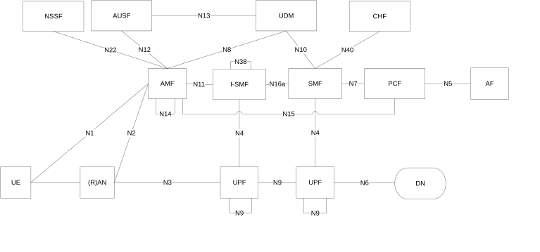
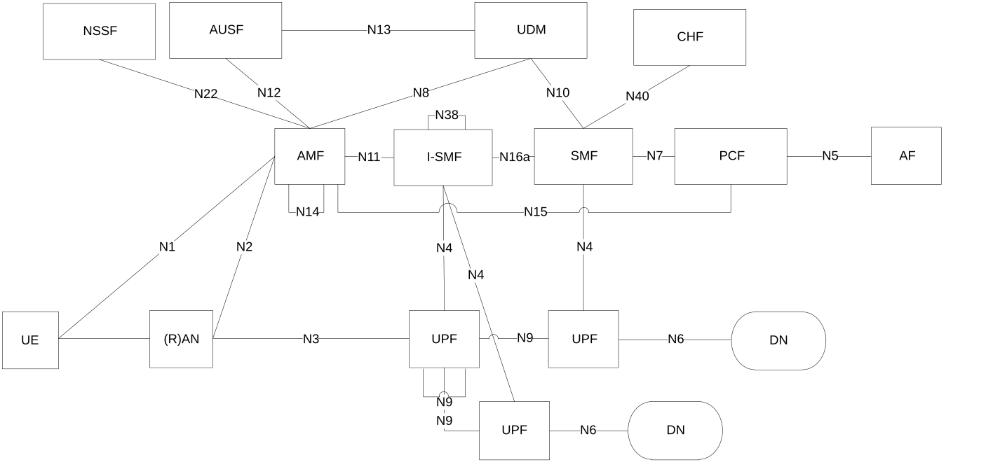
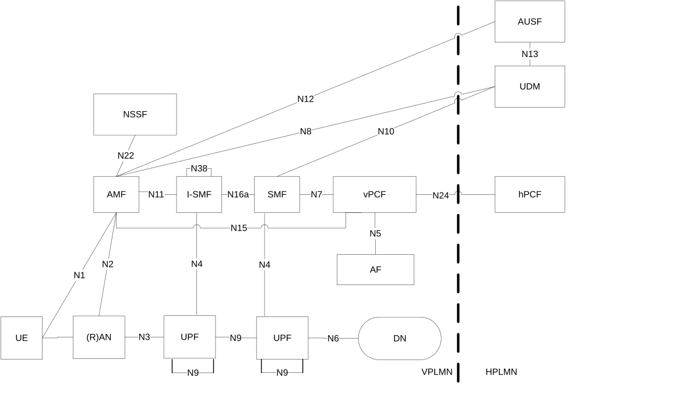
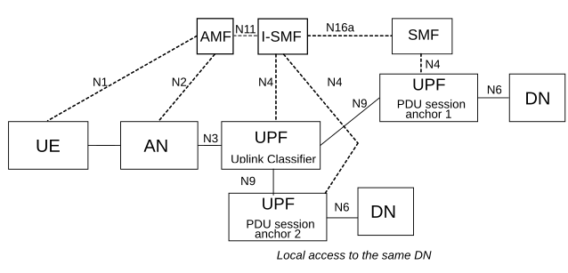

# 5.34 Support of deployments topologies with specific SMF Service Areas

## 5.34.1 General

When the UE is outside of the SMF Service Area, or current SMF cannot serve the target DNAI for the traffic routing for local access to the DN, an I-SMF is inserted between the SMF and the AMF. The I-SMF has a N11 interface with the AMF and a N16a interface with the SMF and is responsible of controlling the UPF(s) that the SMF cannot directly control. The exchange of the SM context and forwarding of tunnel information if needed are done between two SMFs directly without involvement of AMF.

Depending on scenario, a PDU Session in non-roaming case or local breakout is either served by a single SMF or served by an SMF and an I-SMF. When a PDU Session is served by both an SMF and an I-SMF, the SMF is the NF instance that has the interfaces towards the PCF and CHF.

In this Release of the specification, deployments topologies with specific SMF Service Areas apply only for 3GPP access.

The SMF shall release or reject the PDU Session if the DNN of the PDU Session corresponds to a LADN and the I-SMF is inserted to the PDU Session.

NOTE 1: This implies that operators need to plan the LADN deployment in such a way that the LADN Service area needs to be within the SMF Service Area, but not across SMFs' Service Areas.

NOTE 2: This is to cover the case where the UE is not in or moves out of SMF Service Area and an I-SMF is inserted to the PDU Session e.g. during PDU Session Establishment, Service Request. If the PDU Session is maintained with I-SMF, the SMF is not be able to enforce the LADN Service control, e.g. SMF is not notified in the case of Service Request.

Independent of whether deployments topologies with specific SMF Service Areas apply, the SMF may trigger the PDU Session re-establishment to the same DN, if the PDU Session is associated with the SSC mode 2 or SSC mode 3.

NOTE 3: SSC mode 2 or SSC mode 3 can be used to optimize SMF location for a PDU Session and/or, depending on deployment, ensure that the UE is always within the service area of the SMF controlling the PDU Session. In this case (when PDU Session continuity over the PLMN is not required) procedures described in this clause are not needed.

In this Release, how TSC (as defined in clauses 5.27 and 5.28) is supported for PDU Sessions involving an I-SMF is not specified.

In this Release, Redundant User Plane Paths as defined in clause 5.33.2.2 is not supported for PDU Sessions involving an I-SMF.

Redundant PDU sessions support as defined in clause 5.33.2.1 is supported for PDU Sessions involving an I-SMF, when different S-NSSAIs are used for the redundant PDU sessions.

Redundant User Plane Paths as defined in clause 5.33.2.3 is supported for PDU Sessions involving an I-SMF only if this PDU session is established for a S-NSSAI referring to network instances requiring redundant transmission at transport layer.

QoS monitoring (as defined in clause 5.33.3) is supported as long as SMF and not I-SMF initiates the QoS monitoring function.

Dynamic CN PDB provisioning (as defined in clause 5.7.3.4) is supported for PDU Sessions involving an I-SMF.

In this Release, no dedicated functionality is specified for I-SMF and N16a in order to support NPN.

## 5.34.2 Architecture

### 5.34.2.1 SBA architecture

In non-roaming case the SBA architecture described in Figure 4.2.3-1 shall apply. In local breakout scenarios the SBA architecture described in Figure 4.2.4-1 shall apply. In Home Routed scenarios the SBA architecture described in Figure 4.2.4-3 shall apply.

### 5.34.2.2 Non-roaming architecture

Figure 5.34.2.2-1 depicts the non-roaming architecture with an I-SMF insertion to the PDU Session without UL-CL/BP, using reference point representation.

NOTE 1: N16a is the interface between SMF and I-SMF.

NOTE 2: N38 is the interface between I-SMFs.

Figure 5.34.2.2-1: Non-roaming architecture with I-SMF insertion to the PDU Session in reference point representation, with no UL-CL/BP

Figure 5.34.2.2-2 depicts the non-roaming architecture for an I-SMF insertion to the PDU Session with UL-CL/BP, using reference point representation.

Figure 5.34.2.2-2: Non-roaming architecture with I-SMF insertion to the PDU Session in reference point representation, with UL-CL/BP

### 5.34.2.3 Roaming architecture

Figure 5.34.2.3-1 depicts 5G System roaming architecture in the case of local break out scenario where the SMF controlling the UPF connecting to NG-(R)AN is separated from the SMF controlling PDU Session anchor, using the reference point representation.

Figure 5.34.2.3-1: Roaming 5G System architecture with SMF/I-SMF - local breakout scenario in reference point representation

For the case of home routed scenario, Figure 4.2.4-6 applies.

## 5.34.3 I-SMF selection, V-SMF reselection

The AMF is responsible of detecting when to add or to remove an I-SMF or a V-SMF for a PDU Session. For this purpose, the AMF gets from NRF information about the Service Area and supported DNAI(s) of SMF(s).

During mobility events such as Hand-Over or AMF change, if the service area of the SMF does not include the new UE location, then the AMF selects and inserts an I-SMF which can serve the UE location and the S-NSSAI. Conversely if the AMF detects that an I-SMF is no more needed (as the service area of the SMF includes the new UE location) it removes the I-SMF and interfaces directly with the SMF of the PDU Session. If the AMF detects that the SMF cannot serve the UE location (e.g. due to mobility), then the AMF selects a new I-SMF serving the UE location. If the existing I-SMF (or V-SMF) cannot serve the UE location (e.g. due to mobility) and the service area of the SMF does not include the new UE location (or the PDU Session is Home Routed), then the AMF initiates an I-SMF (or V-SMF) change. A V-SMF change may take place either at intra-PLMN or inter-PLMN mobility.

According to the PCC rules related with AF influence traffic mechanism regarding DNAI(s), the SMF determines the target DNAI which is applicable to the current UE location and which can be based on the common DNAI (if applicable) as described in TS 23.548 \[130\]. If current (I-)SMF cannot serve the target DNAI or if the SMF can server the target DNAI and existing I-SMF is not needed, the SMF may send the target DNAI information to the AMF for triggering I-SMF (re)selection or removal, e.g. the AMF performs I-SMF (re)selection or removal based on the target DNAI and supported DNAI(s) of (I-)SMF. If the SMF determines that target DNAI currently served by I-SMF should not be used for the PDU Session hence the existing I-SMF is not needed (e.g. due to the updated PCC rules removes DNAI(s) that was provided in the previous PCC rules), the SMF sends the target DNAI information without including target DNAI to AMF, which may trigger the I-SMF removal.

At PDU Session Establishment in non-roaming and roaming with LBO scenarios, if the AMF or SCP cannot select an SMF with a Service Area supporting the current UE location for the selected (DNN, S-NSSAI) and required SMF capabilities, the AMF selects an SMF for the selected (DNN, S-NSSAI) and required capabilities and in addition selects an I-SMF serving the UE location and the S-NSSAI.

Compared to the SMF selection function defined in clause 6.3.2, the following parameters are not applicable for I-SMF/V-SMF selection:

\- Data Network Name (DNN).

\- Subscription information from UDM.

NOTE 1: All SMF(s) and I-SMF are assumed to be able to control the UPF mapping between EPC bearers and 5GC QoS Flows.

If HR-SBO roaming is allowed for a PDU Session, the DNN is also considered for V-SMF selection.

If delegated SMF discovery is used at PDU Session establishment:

1\. The AMF sends Nsmf_PDUSession_CreateSMContext Request to SCP and includes the parameters as defined in clause 6.3.2 (e.g. the DNN, required SMF capabilities, UE location) as discovery and selection parameters. If the SCP successfully selects an SMF matching all discovery and selection parameters, the SCP forwards the Nsmf_PDUSessionCreateSMContext Request to the selected SMF.

2\. If the SCP cannot select an SMF matching all discovery and selection parameters, the SCP returns a dedicated error to AMF. In this case the I-SMF also need be discovered.

3\. Upon reception of the error from the SCP that an SMF matching all discovery and selection parameters cannot be found, the AMF performs the discovery and selection of the SMF from NRF (thus not providing the UE location as a discovery parameter). The AMF may indicate the maximum number of SMF instances to be returned from NRF, i.e. SMF selection at NRF.

4\. The AMF sends Nsmf_PDUSession_CreateSMContext Request to SCP, which includes the endpoint (e.g. URI) of the selected SMF and the discovery and selection parameters as defined in clause 6.3.2 except the DNN and the required SMF capabilities, i.e. parameter for I-SMF selection. The SCP performs discovery and selection of the I-SMF and forwards the Nsmf_PDUSession_CreateSMContext Request to the selected I-SMF.

5\. The I-SMF sends the Nsmf_PDUSession_Create Request towards the SMF via the SCP; the I-SMF uses the received endpoint (e.g. URI) of the selected SMF to construct the target destination to be addressed. The SCP forwards the Nsmf_PDUSession_Create Request to the SMF.

6\. The SMF answers to the I-SMF that answers to the AMF; in this answer the AMF receives the I-SMF ID.

7\. Upon reception of a response from I-SMF, based on the received I-SMF ID, the AMF may obtain the SMF Service Area of the I-SMF from NRF. The AMF uses the SMF Service Area of the I-SMF to determine the need for I-SMF relocation upon subsequent UE mobility.

If delegated I-SMF discovery is used once the PDU Session establishment has been established, the procedure starts at step 4 above and is further detailed in the messages flows in clause 23 of TS 23.502 \[3\].

If delegated V-SMF discovery is used for V-SMF reselection, clause 6.3.2 applies, but there is no need for discovery and selection of the H-SMF. This is further detailed in the messages flows in clause 23 of TS 23.502 \[3\].

## 5.34.4 Usage of an UL Classifier for a PDU Session controlled by I-SMF

This clause applies only in the case of non-roaming or LBO roaming as control of UL CL/BP in VPLMN is not supported in HR case.

When I-SMF is involved for a PDU Session, it is possible that the UL CL controlled by I-SMF is inserted into the data path of the PDU Session. The usage of an ULCL controlled by I-SMF in the data path of a PDU Session is depicted in Figure 5.34.4-1.

Figure 5.34.4-1: User plane Architecture for the Uplink Classifier controlled by I-SMF

The I-SMF determines whether UL CL will be inserted based on information received from SMF and the I-SMF selects the UPFs acting as UL CL and/or PDU Session Anchor providing local access to the Data Network.

## 5.34.5 Usage of IPv6 multi-homing for a PDU Session controlled by I-SMF

This clause applies only in the case of non-roaming or LBO roaming as control of UL CL/BP in VPLMN is not supported in HR case.

When I-SMF is involved for a PDU Session, it is possible that the BP controlled by I-SMF is inserted into the data path of the PDU Session. The usage of a BP controlled by I-SMF in the data path of a PDU Session is depicted in Figure 5.34.5-1.

Figure 5.34.5-1: Multi-homed PDU Session: Branching Point controlled by I-SMF

The I-SMF determines whether BP will be inserted based on information received from SMF and the I-SMF selects the UPFs acting as BP and/or PDU Session Anchor providing local access to the Data Network.

## 5.34.6 Interaction between I-SMF and SMF for the support of traffic offload by UPF controlled by the I-SMF

### 5.34.6.1 General

This clause applies only in the case of non-roaming or LBO roaming as control of UL CL/Branching Point in VPLMN is not supported in HR case. It applies for the architectures described in clauses 5.34.4 and 5.34.5

When the I-SMF is inserted into a PDU Session, e.g. during PDU Session establishment or due to UE mobility, the I-SMF may provide the DNAI list it supports to the SMF. Based on the DNAI list information received from I-SMF, the SMF may provide the DNAI(s) of interest for this PDU Session for local traffic steering to the I-SMF e.g. immediately or when a new or updated or removed PCC rule(s) is/are received. The DNAI(s) of interest is derived from PCC rules.

The I-SMF is responsible for the insertion, modification and removal of UPF(s) to ensure local traffic steering. The SMF does not need to have access to local configuration or NRF output related with UPF(s) controlled by I-SMF. Based on the DNAI(s) of interest for this PDU Session for local traffic steering and UE location the I-SMF determines which DNAI(s) are to be selected, selects UPF(s) acting as UL CL/BP and/or PDU Session Anchor based on selected DNAI and insert these UPF(s) into the data path of the PDU Session.

When a UL CL/BP has been inserted, changed or removed, the I-SMF indicates to the SMF that traffic offload have been inserted, updated or removed for a DNAI, providing also the IPv6 prefix that has been allocated if a new IPv6 prefix has been allocated for the PDU Session.

From now on the SMF and I-SMF interactions entail:

\- Notifying the SMF with the new Prefix (multi-Homing case): the SMF is responsible of issuing Router Advertisement message. The SMF constructs a link-local address as the source IP address. The Router Advertisement message includes the IPv6 multi-homed routing rules provided to the UE to select the source IPv6 prefix among the prefixes related with the PDU Session according to RFC 4191 \[8\]. The SMF sends the Router Advertisement message to the UE via the PSA UPF controlled by the SMF.

\- N4 interactions related with traffic offloading. The SMF provide N4 information to the I-SMF for how the traffic shall be detected, enforced, monitored in UPF(s) controlled by the I-SMF: the SMF issues requests to the I-SMF containing N4 information to be used for creating / updating /removing PDR, FAR, QER, URR, etc. The N4 information for local traffic offload provided by the SMF to the I-SMF are described in clause 5.34.6.2.

\- Receiving N4 notifications related with traffic usage reporting: the I-SMF forwards to the SMF N4 information corresponding to UPF notifications related with traffic usage reporting; the SMF aggregates and constructs usage reports towards PCF/CHF.

NOTE: How the SMF decides what traffic steering and enforcement actions are enforced in UPF(s) controlled by I-SMF is left for implementation.

The I-SMF is responsible of the N4 interface towards the local UPF(s) including:

\- the usage of AN Tunnel Info received from the 5G AN via the AMF in order to build PDR and FAR;

\- requesting the allocation of the CN Tunnel Info between local UPFs (if needed);

\- to control UPF actions when the UP of the PDU Session becomes INACTIVE.

\- provide Trace Requirements on the N4 interface towards the UPF(s) it is controlling, using Trace Requirements received from AMF.

### 5.34.6.2 N4 information sent from SMF to I-SMF for local traffic offload

The SMF generates N4 information for local traffic offload based on the available DNAI(s) indicated by the I-SMF, PCC rules associated with these DNAI(s) and charging requirement. This N4 information is sent from the SMF to the I-SMF after UL CL/Branching Point insertion/update/removal and the I-SMF uses this N4 information to derive rules installed in the UPFs controlled by the I-SMF.

The N4 information for local traffic offload corresponds to rules and parameters defined in clause 5.8.5, i.e. PDR, FAR, URR and QER. It contains identifiers allowing the SMF to later modify or delete these rules.

N4 information for local traffic offload is generated by the SMF without knowledge of how many local UPF(s) are actually used by the I-SMF. The SMF indicates whether a rule within N4 information is enforced in UL CL/ Branching Point or local PSA. If the rule is applied to the local PSA, the N4 information includes the associated DNAI. The I-SMF generates suitable rules for the UPF(s) based on the N4 information received from SMF.

NOTE: The SMF is not aware of whether there is a single PSA or multiple PSA controlled by I-SMF.

The following parameters are managed by the I-SMF:

\- The 5G AN Tunnel Info.

\- CN tunnel info between local UPFs.

\- Network instance (if needed).

The N4 information exchanged between I-SMF and SMF are not associated with a N4 Session ID but are associated with an N16a association allowing the SMF to modify or delete the N4 information at a later stage.

The I-SMF generates an N4 Session ID and for each rule a Rule ID (unless the ones received from the SMF can be used) and maintains a mapping between the locally generated identifiers and the ones received from the SMF. The I-SMF replaces those IDs in the PDR(s), QER(s), URR(s) and FAR(s) received from the SMF. When the I-SMF receives the N4 information, the Network instance (if needed) included in the rules sent to the UPF is generated by I-SMF.

## 5.34.7 Event Management

### 5.34.7.1 UE's Mobility Event Management

When an I-SMF is involved in a PDU Session, the SMF and I-SMF independently subscribe to "UE mobility event notification" service provided by AMF. The AMF treats the SMF's and I-SMF's subscription separately and notifies the event directly to the SMF or I-SMF. If the SMF does not know the serving AMF address, the SMF gets the serving AMF address from the UDM as described in clause 5.2.3.2.4, TS 23.502 \[3\] and subscribes directly with the serving AMF.

In the case of AMF change (e.g. Inter NG-RAN node N2 based handover), the target AMF receives mobility event subscription information from the source AMF and updates the mobility event subscription information with the SMF and I-SMF independently (i.e. target AMF allocates the Subscription Correlation ID for each event and notifies the respective SMFs and I-SMF as described in clause 5.3.4.4).

In the case of I-SMF change or I-SMF insertion (e.g. at Inter NG-RAN node N2 based handover), the subscription of mobility event (from AMF) is not transferred from the old I-SMF or SMF to the new I-SMF, the new I-SMF triggers a new subscription event if the new I-SMF wants to receive the corresponding mobility event. In the case of I-SMF removal, the subscription of mobility event at the AMF is not transferred from the old I-SMF to the SMF, the SMF triggers a new subscription event if the SMF wants to receive the corresponding mobility event.

The subscription from the old SMF entity (old I-SMF, SMF) is removed via an explicitly request from this old SMF entity.

### 5.34.7.2 SMF event exposure service

Consumers of SMF events do not need to be aware of the insertion / removal / change of an I-SMF as they always subscribe to the SMF of the PDU Session.

Except for the events documented in the present clause, the I-SMF does not need to support the events defined in clause 5.2.8.3.1 of TS 23.502 \[3\].

For Events "First downlink packet per source of the downlink IP traffic (buffered / discarded / transmitted)" and UPF event exposure for User DataUsage Measures and User DataUsage Trends, when an I-SMF is involved in the PDU Session, the SMF subscribes / unsubscribes onto I-SMF for the PDU Session ID on behalf of the event consumer (e.g. at I-SMF insertion or when a consumer subscribes or un subscribes while an I-SMF serves the PDU Session) and the I-SMF or I-UPF directly notifies the event consumer. At I-SMF change, the related SMF event subscriptions are not transferred from source I-SMF to the target I-SMF. The SMF may trigger new subscription event to the target I-SMF if the SMF wants to receive the corresponding SMF or UPF event or to continue the UPF event subscription for the final consumer. At I-SMF change or removal the corresponding subscription is removed in the source I-SMF when it removes the context associated with the PDU Session Id.

### 5.34.7.3 AMF implicit subscription about events related with the PDU Session

When creating an association with a SMF or I-SMF for a PDU Session, the AMF implicitly subscribes to SMF / I-SMF about events related with the PDU Session (the AMF provides the relevant notification information to the SMF or the I-SMF respectively). This implicit subscription is implicitly released when the corresponding association with the SMF / I-SMF is removed (e.g. as no more needed due to a I-SMF insertion / change / removal).

## 5.34.8 Support for Cellular IoT

This clause defines the specific impacts of deployments topologies with specific SMF Service Areas on how 5GS supports Cellular IoT as defined in clause 5.31.

For a PDU Session supporting Control Plane CIoT 5GS Optimisation as defined in clause 5.31.4:

\- For a PDU Session towards a DNN/S-NSSAI for which the SMF Selection Subscription data includes Invoke NEF Indication (i.e. for a PDU Session which will be anchored in NEF), the AMF never inserts an I-SMF.

When an I-SMF is inserted to serve a PDU Session, the I-SMF supports the features that, as specified in clause 5.31, apply to the V-SMF in the case of Home Routed.

NOTE: This can require the SMF to subscribe onto I-SMF about RAT type change for a PDU Session as described in clause 4.23 of TS 23.502 \[3\].

## 5.34.9 Support of the Deployment Topologies with specific SMF Service Areas feature within and between PLMN(s)

When Deployments Topologies with specific SMF Service Areas need to be used in a PLMN for a S-NSSAI, all AMF serving this S-NSSAI are configured to support Deployments Topologies with specific SMF Service Areas.

NOTE 1: The specifications do not support AMF selection related with Deployment Topologies with specific SMF Service Areas.

For HR roaming, the AMF discovers at PDU Session establishment whether a H-SMF supports V-SMF change based on feature support indication received from the NRF, possibly via the SCP. When the V-PLMN requires Deployments Topologies with specific SMF Service Areas but no H-SMF can be selected that supports V-SMF change, a H-SMF not supporting V-SMF change may be selected by the VPLMN. In that case and if a V-SMF serving the full VPLMN is available, AMF should prefer to select such V-SMF.

In this release of the specifications, when an AMF detects the need to change the V-SMF while the H-SMF does not support V-SMF change, the AMF shall not trigger V-SMF change but shall trigger the release of the PDU Session.

NOTE 2: The AMF can determine whether the H-SMF supports V-SMF change based on NRF look up.

## 5.34.10 Support for 5G LAN-type service

This clause defines how 5GS supports 5G LAN-type service as defined in clause 5.29 in the case of deployments topologies with specific SMF Service Areas.

The UE may be connected with the PSA via an I-UPF which is controlled by the I-SMF. In this case, traffic switching (e.g. UPF local traffic switching) is controlled by the SMF as described in clause 5.29.4 without any specific knowledge or involvement of the I-SMF to support the 5G LAN-type service.
