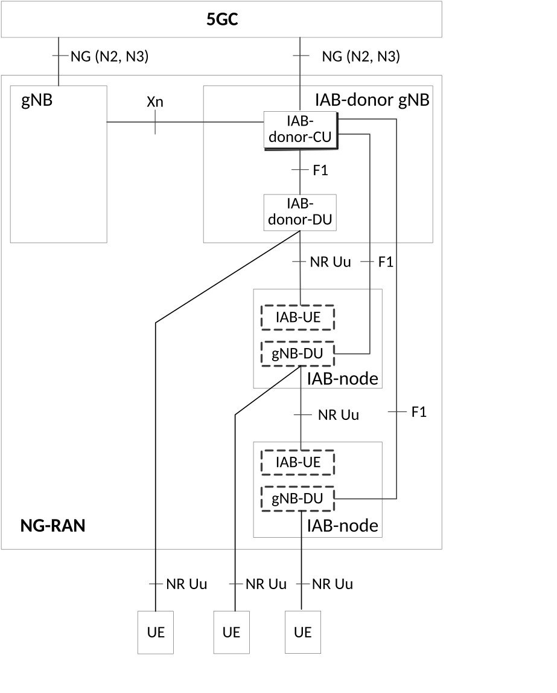

# 5.35 Support for Integrated access and backhaul (IAB)

## 5.35.1 IAB architecture and functional entities

Integrated access and backhaul (IAB) enables wireless in-band and out-of-band relaying of NR Uu access traffic via NR Uu backhaul links. In this Release of the specification, NR satellite access is not applicable. The serving PLMN may provide the mobility restriction for NR satellite access as specified in clause 5.3.4.1

The Uu backhaul links can exist between the IAB-node and:

\- a gNB referred to as IAB-donor; or

\- another IAB-node.

The part of the IAB node that supports the Uu interface towards the IAB-donor or another parent IAB-node (and thus manages the backhaul connectivity with either PLMN or SNPN it is registered with) is referred to as an IAB-UE.

In this Release of the specification, the IAB-UE function does not apply to the NR RedCap UE.

At high level, IAB has the following characteristics:

\- IAB uses the CU/DU architecture defined in TS 38.401 \[42\] and the IAB operation via F1 (between IAB-donor and IAB-node) is invisible to the 5GC;

\- IAB performs relaying at layer-2 and therefore does not require a local UPF;

\- IAB supports multi-hop backhauling;

\- IAB supports dynamic topology update, i.e. the IAB-node can change the parent node, e.g. another IAB-node, or the IAB-donor, during operation, for example in response to backhaul link failure or blockage.

Figure 5.35.1-1 shows the IAB reference architecture with two backhaul hops, when connected to 5GC.

Figure 5.35.1-1: IAB architecture for 5GS

The gNB-DU in the IAB-node is responsible for providing NR Uu access to UEs and child IAB-nodes. The corresponding gNB-CU function resides on the IAB-donor gNB, which controls IAB-node gNB-DU via the F1 interface. IAB-node appears as a normal gNB to UEs and other IAB-nodes and allows them to connect to the 5GC.

The IAB-UE function behaves as a UE and reuses UE procedures to connect to:

\- the gNB-DU on a parent IAB-node or IAB-donor for access and backhauling;

\- the gNB-CU on the IAB-donor via RRC for control of the access and backhaul link;

\- 5GC, e.g. AMF, via NAS;

\- OAM system via a PDU session or PDN connection (based on implementation).

NOTE: The 5GC, e.g. SMF, may detect that a PDU session for the IAB-UE is for the OAM system access, e.g. by checking the DNN and/or configuration. It is up to the operator configuration to choose whether to use 1 or multiple QoS Flows for OAM traffic and the appropriate QoS parameters, e.g. using 5QI=6 for software downloading and 5QI=80 with signalled higher priority or a pre-configured 5QI for alarm or control traffic.

The IAB-UE can connect to 5GC over NR (SA mode) or connect to EPC (EN-DC mode). The UE served by the IAB-node can operate in the same or different modes than the IAB-node as defined in TS 38.401 \[42\]. The operation mode with both UE and IAB-node connected to EPC is covered in TS 23.401 \[26\]. Operation modes with UE and IAB-node connected to different core networks are described in clause 5.35.6.

## 5.35.2 5G System enhancements to support IAB

In IAB operation, the IAB-UE interacts with the 5GC using procedures defined for UE. The IAB-node gNB-DU only interacts with the IAB-donor-CU and follows the CU/DU design defined in TS 38.401 \[42\].

For the IAB-UE operation, the existing UE authentication methods as defined in TS 33.501 \[29\] applies. Both USIM based methods and EAP based methods are allowed and NAI based SUPIs can be used.

The following aspects are enhanced to support the IAB operation in the Registration procedure as defined in clause 4.2.2.2 of TS 23.502 \[3\]:

\- The IAB-node provides an IAB-indication to the IAB-donor-CU when the RRC connection is established as defined in TS 38.331 \[28\]. When the IAB-indication is received, the IAB-donor-CU selects an AMF that supports IAB and includes the IAB-indication in the N2 INITIAL UE MESSAGE as defined in TS 38.413 \[34\] so that the AMF can perform IAB authorization;

\- the UE Subscription data as defined in clause 5.2.3 of TS 23.502 \[3\] is enhanced to include the authorization information for the IAB operation;

\- Authorization procedure during the UE Registration procedure is enhanced to perform verification of IAB subscription information;

\- If the IAB operation is not authorized and IAB-UE is not allowed to be registered, the AMF rejects the IAB-UE's registration or de-register the IAB-UE. The AMF initiates UE Context setup/modification procedure by providing IAB authorized indication with the value set to "not authorized" to the NG-RAN, if the IAB-UE is still allowed to be registered;

\- If the IAB operation is authorized, UE Context setup/modification procedure is enhanced to provide IAB authorized indication with the value set to "authorized" to NG-RAN.

After registered to the 5G system, the IAB-node remains in CM-CONNECTED state if the IAB operation is authorized. In the case of radio link failure, the IAB-UE uses existing UE procedure to restore the connection with the network. The IAB-UE uses Deregistration Procedure as defined in clause 4.2.2.3 of TS 23.502 \[3\] to disconnect from the network. In the case of controlled IAB-node release as specified in clause 8.9.10 of TS 38.401 \[42\] (including the case when authorization state of the IAB-node is changed from authorized to non-authorized), after UE Context Modification message to NG-RAN with authorization indication as not authorized and after a certain period (e.g. based on the expiration of a timer configured on the AMF), the AMF may trigger the IAB-UE Deregistration.

## 5.35.3 Data handling and QoS support with IAB

Control plane and user plane protocol stacks for IAB operation are defined in TS 38.300 \[27\].

QoS management for IAB can remain transparent to the 5GC. If NG-RAN cannot meet a QoS requirement for a QoS Flow to IAB-related resource constraints, the NG-RAN can reject the request using procedures defined in TS 23.502 \[3\].

The IAB-UE function can establish a PDU session or PDN connection, e.g. for OAM purpose (protocol stack not shown here). In that case, the IAB-UE obtains an IP address/prefix from the core network using normal UE procedures. The IAB-UE's IP address is different from that of the IAB-node's gNB DU IP address.

NOTE: For OAM traffic, based on their specific requirements, operators can select QoS characteristics and reference them by pre-configured 5QI(s) or using signalled QoS characteristics within the operator's network.

## 5.35.4 Mobility support with IAB

For UEs, all existing NR intra-RAT mobility and dual-connectivity procedures are supported when the UE is served by an IAB-node except for the cases of NR satellite access. For a UE served by an IAB-node when the serving IAB-node changes its IAB-donor-CU due to mobility, the mobility support is specified in clause 5.35A.1 and clause 5.35A.3.

## 5.35.5 Charging support with IAB

IAB-donor has all the information regarding the UE and the IAB-node and corresponding mapping of the bearers. The PDU sessions for the UE and IAB-node are separate from IAB-node onwards to the core network. Therefore, the existing charging mechanism as defined in clause 5.12 can be used to support IAB.

## 5.35.6 IAB operation involving EPC

When the IAB-donor gNB has connection to both EPC and 5GC, based on PLMN configuration, there are two possible operation modes:

\- the IAB-node connects to a 5GC via the IAB-donor gNB, while the UEs served by the IAB-node connect to EPC with Dual Connectivity as defined in TS 37.340 \[31\]. In this operation mode, the IAB-donor gNB has connection to an eNB and the 5GC is restricted for IAB-node access only; and

\- the IAB-node connects to an EPC via the IAB-donor gNB with Dual Connectivity as defined in TS 37.340 \[31\], while the UEs served by the IAB-node connect to the 5GC. In this operation mode, the EPC is restricted for IAB-node access only.

To support the above operation modes, the IAB-UE shall be configured to select only a specific PLMN (as defined in TS 23.122 \[17\]) and whether it needs to connect to 5GC or EPC.

NOTE: For a particular PLMN, it is expected that only one of the modes would be deployed in a known region.
