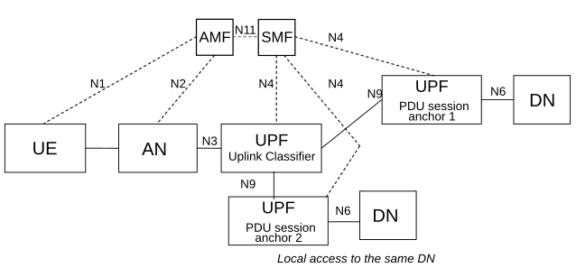
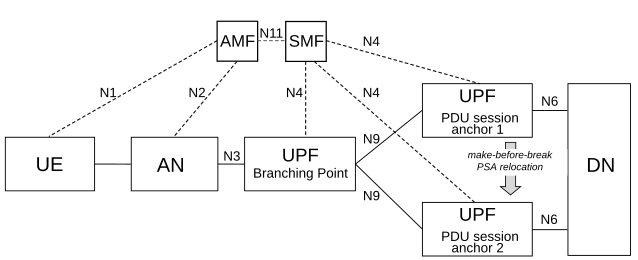
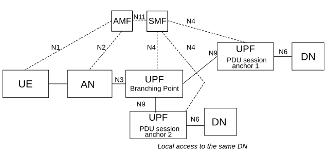

# 5.6.4 Single PDU Session with multiple PDU Session Anchors

## 5.6.4.1 General

In order to support selective traffic routing to the DN or to support SSC mode 3 as defined in clause 5.6.9.2.3, the SMF may control the data path of a PDU Session so that the PDU Session may simultaneously correspond to multiple N6 interfaces. The UPF that terminates each of these interfaces is said to support PDU Session Anchor functionality. Each PDU Session Anchor supporting a PDU Session provides a different access to the same DN. Further, the PDU Session Anchor assigned at PDU Session Establishment is associated with the SSC mode of the PDU Session and the additional PDU Session Anchor(s) assigned within the same PDU Session e.g. for selective traffic routing to the DN are independent of the SSC mode of the PDU Session. When a PCC rule including the Application Function influence on traffic routing Enforcement Control information defined in clause 6.3.1 of TS 23.503 \[45\] is provided to the SMF, the SMF can decide whether to apply traffic routing (by using UL Classifier functionality or IPv6 multi-homing) based on DNAI(s) included in the PCC rule.

NOTE 1: Application Function influence on traffic routing Enforcement Control information can be either determined by the PCF when requested by AF via NEF as described in clause 5.6.7.1 or statically pre-configured in the PCF.

NOTE 2: Selective traffic routing to the DN supports, for example, deployments where some selected traffic is forwarded on an N6 interface to the DN that is "close" to the AN serving the UE.

This may correspond to

\- The Usage of UL Classifier functionality for a PDU Session defined in clause 5.6.4.2.

\- The Usage of an IPv6 multi-homing for a PDU Session defined in clause 5.6.4.3.

SMF may also take decision to apply traffic routing (by using UL Classifier functionality or IPv6 multi-homing) in EAS Discovery with EASDF procedure described in TS 23.548 \[130\].

## 5.6.4.2 Usage of an UL Classifier for a PDU Session

In the case of PDU Sessions of type IPv4 or IPv6 or IPv4v6 or Ethernet, the SMF may decide to insert in the data path of a PDU Session an "UL CL" (Uplink classifier). The UL CL is a functionality supported by an UPF that aims at diverting (locally) some traffic matching traffic filters provided by the SMF. The insertion and removal of an UL CL is decided by the SMF and controlled by the SMF using generic N4 and UPF capabilities. The SMF may decide to insert in the data path of a PDU Session a UPF supporting the UL CL functionality during or after the PDU Session Establishment, or to remove from the data path of a PDU Session a UPF supporting the UL CL functionality after the PDU Session Establishment. The SMF may include more than one UPF supporting the UL CL functionality in the data path of a PDU Session.

The UE is unaware of the traffic diversion by the UL CL and does not involve in both the insertion and the removal of UL CL. In the case of a PDU Session of IPv4 or IPv6 or IPv4v6 type, the UE associates the PDU Session with either a single IPv4 address or a single IPv6 Prefix or both of them allocated by the network.

When an UL CL functionality has been inserted in the data path of a PDU Session, there are multiple PDU Session Anchors for this PDU Session. These PDU Session Anchors provide different access to the same DN. In the case of a PDU Session of IPv4 or IPv6 or IPv4v6 type, only one IPv4 address and/or IPv6 prefix is provided to the UE. The SMF may be configured with local policies for some (DNN, S-NSSAI) combinations to release the PDU Session when there is a PSA associated with the IPv4 address allocated to the UE and this PSA has been removed.

NOTE 0: The use of only one IPv4 address and/or IPv6 prefix with multiple PDU Session Anchors assumes that when needed, appropriate mechanisms are in place to correctly forward packets on the N6 reference point. The mechanisms for packet forwarding on the N6 reference point between the PDU Session Anchor providing local access and the DN are outside the scope of this specification.

The UL CL provides forwarding of UL traffic towards different PDU Session Anchors and merge of DL traffic to the UE i.e. merging the traffic from the different PDU Session Anchors on the link towards the UE. This is based on traffic detection and traffic forwarding rules provided by the SMF.

The UL CL applies filtering rules (e.g. to examine the destination IP address/Prefix of UL IP packets sent by the UE) and determines how the packet should be routed. The UPF supporting an UL CL may also be controlled by the SMF to support traffic measurement for charging, traffic replication for LI and bit rate enforcement (Session-AMBR per PDU Session).

NOTE 1: When N9 forwarding tunnel exists between source ULCL and target ULCL, the Session-AMBR per PDU Session can be enforced by the source UL CL UPF.

NOTE 2: The UPF supporting an UL CL may also support a PDU Session Anchor for connectivity to the local access to the data network (including e.g. support of tunnelling or NAT on N6). This is controlled by the SMF.

Additional UL CLs (and thus additional PDU Session Anchors) can be inserted in the data path of a PDU Session to create new data paths for the same PDU Session. The way to organize the data path of all UL CLs in a PDU Session is up to operator configuration and SMF logic and there is only one UPF supporting UL CL connecting to the (R)AN via N3 interface, except when session continuity upon UL CL relocation is used.

The insertion of an ULCL in the data path of a PDU Session is depicted in Figure 5.6.4.2-1.

Figure 5.6.4.2-1: User plane Architecture for the Uplink Classifier

NOTE 3: It is possible for a given UPF to support both the UL CL and the PDU Session Anchor functionalities.

Due to UE mobility the network may need to relocate the UPF acting as UL CL and establish a new PSA for local access to the DN. To support session continuity during UL CL relocation the network may establish a temporary N9 forwarding tunnel between the source UL CL and target UL CL. The AF may influence the creation of the N9 forwarding tunnel as described in clause 5.6.7.1.

The N9 forwarding tunnel is maintained until:

\- all active traffic flowing on it ceases to exist for:

\- a configurable period of time; or

\- a period of time indicated by the AF;

\- until the AF informs the SMF that it can release the source PSA providing local access to the DN.

During the existence of the N9 forwarding tunnel the UPF acting as target UL CL is configured with packet filters that:

\- force uplink traffic from existing data sessions between UE and the application in the source local part of the DN (as defined in TS 23.548 \[130\]) into the N9 forwarding tunnel towards the source UL CL.

\- force any traffic related to the application in the target local part of the DN to go to the new local part of the DN via the target PSA.

SMF may send a Late Notification to AF to inform it about the DNAI change as described in clause 4.3.6.3 of TS 23.502 \[3\]. This notification can be used by the AF e.g. to trigger mechanisms in the source local part of the DN to redirect the ongoing traffic sessions towards an application in the target local part of the DN. SMF can also send late notification to the target AF instance if associated with this target local part of the DN.

The procedure for session continuity upon UL CL relocation is described in clause 4.3.5.7 of TS 23.502 \[3\].

When an I-SMF is inserted for a PDU Session, the details of UL CL insertion which is controlled by an I-SMF is described in clause 5.34.4.

## 5.6.4.3 Usage of IPv6 multi-homing for a PDU Session

A PDU Session may be associated with multiple IPv6 prefixes. This is referred to as multi-homed PDU Session. The multi-homed PDU Session provides access to the Data Network via more than one PDU Session Anchor. The different user plane paths leading to the different PDU Session Anchors branch out at a "common" UPF referred to as a UPF supporting "Branching Point" functionality. The Branching Point provides forwarding of UL traffic towards the different PDU Session Anchors and merge of DL traffic to the UE i.e. merging the traffic from the different PDU Session Anchors on the link towards the UE.

The UPF supporting a Branching Point functionality may also be controlled by the SMF to support traffic measurement for charging, traffic replication for LI and bit rate enforcement (Session-AMBR per PDU Session). The insertion and removal of a UPF supporting Branching Point is decided by the SMF and controlled by the SMF using generic N4 and UPF capabilities. The SMF may decide to insert in the data path of a PDU Session a UPF supporting the Branching Point functionality during or after the PDU Session Establishment, or to remove from the data path of a PDU Session a UPF supporting the Branching Point functionality after the PDU Session Establishment.

Multi homing of a PDU Session applies only for PDU Sessions of IPv6 type. When the UE requests a PDU Session of type "IPv4v6" or "IPv6" the UE also provides an indication to the network whether it supports a Multi-homed IPv6 PDU Session.

The use of multiple IPv6 prefixes in a PDU Session is characterised by the following:

\- The UPF supporting a Branching Point functionality is configured by the SMF to spread UL traffic between the PDU Session Anchors based on the Source Prefix of the PDU (which may be selected by the UE based on routing information and preferences received from the network).

\- IETF RFC 4191 \[8\] is used to configure routing information and preferences into the UE to influence the selection of the source Prefix.

NOTE 1: This corresponds to Scenario 1 defined in IETF RFC 7157 \[7\] "IPv6 Multi-homing without Network Address Translation". This allows to make the Branching Point unaware of the routing tables in the Data Network and to keep the first hop router function in the PDU Session Anchors.

\- The multi-homed PDU Session may be used to support make-before-break service continuity to support SSC mode 3. This is illustrated in Figure 5.6.4.3-1.

\- The multi-homed PDU Session may also be used to support cases where UE needs to access both a local service (e.g. local server) and a central service (e.g. the internet), illustrated in Figure 5.6.4.3-2.

\- The UE shall use the method specified in clause 4.3.5.3 of TS 23.502 \[3\] to determine if a multi-homed PDU Session is used to support the service continuity case shown in Figure 5.6.4.3-1, or if it is used to support the local access to DN case shown in Figure 5.6.4.3-2.

Figure 5.6.4.3-1: Multi-homed PDU Session: service continuity case

NOTE 2: It is possible for a given UPF to support both the Branching Point and the PDU Session Anchor functionalities.

Figure 5.6.4.3-2: Multi-homed PDU Session: local access to same DN

NOTE 3: It is possible for a given UPF to support both the Branching Point and the PDU Session Anchor functionalities.
