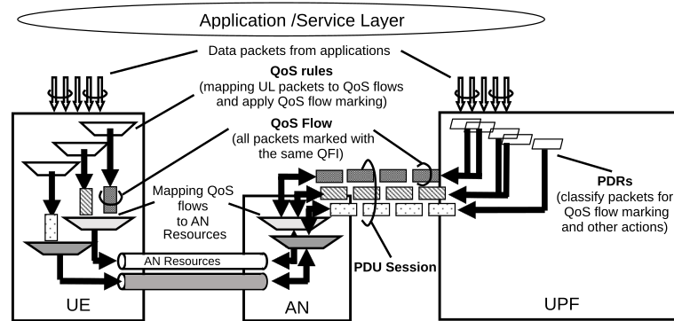

# 5.7.1.5 QoS Flow mapping

The SMF performs the binding of PCC rules to QoS Flows based on the QoS and service requirements (as defined in TS 23.503 \[45\]). The SMF assigns the QFI for a new QoS Flow and derives its QoS profile, corresponding UPF instructions and QoS Rule(s) from the PCC rule(s) bound to the QoS Flow and other information provided by the PCF.

When applicable, the SMF provides the following information for the QoS Flow to the (R)AN:

\- QFI;

\- QoS profile as described in clause 5.7.1.2.

\- optionally, Alternative QoS Profile(s) as described in clause 5.7.1.2a;

For each PCC rule bound to a QoS Flow, the SMF provides the following information to the UPF enabling classification, bandwidth enforcement and marking of User Plane traffic (the details are described in clause 5.8):

\- a DL PDR containing the DL part of the SDF template;

\- an UL PDR containing the UL part of the SDF template;

NOTE 1: If a DL PDR for an bidirectional SDF is associated with a QoS Flow other than the one associated with the default QoS rule and the UE has not received any instruction to use this QoS Flow for the SDF in uplink direction (i.e. neither a corresponding QoS rule is sent to the UE nor the Reflective QoS Indication is set in the PCC rule), it means that the UL PDR for the same SDF has to be associated with the QoS Flow associated with the default QoS rule.

\- the PDR precedence value (see clause 5.7.1.9) for both PDRs is set to the precedence value of the PCC rule;

\- QoS related information (e.g. MBR for an SDF, GFBR and MFBR for a GBR QoS Flow) as described in clause 5.8.2;

\- the corresponding packet marking information (e.g. the QFI, the transport level packet marking value (e.g. the DSCP value of the outer IP header);

\- optionally, the Reflective QoS Indication is included in the QER associated with the DL PDR (as described in clause 5.7.5.3).

For each PCC rule bound to a QoS Flow, when applicable, the SMF generates an explicitly signalled QoS rule (see clause 5.7.1.4) according to the following principles and provides it to the UE together with an add operation:

\- A unique (for the PDU Session) QoS rule identifier is assigned;

\- The QFI in the QoS rule is set to the QFI of the QoS Flow to which the PCC rule is bound;

\- The Packet Filter Set of the QoS rule is generated from the UL SDF filters and optionally the DL SDF filters of the PCC rule (but only from those SDF filters that have an indication for being signalled to the UE, as defined in TS 23.503 \[45\]);

\- The QoS rule precedence value is set to the precedence value of the PCC rule for which the QoS rule is generated;

\- for a dynamically assigned QFI, the QoS Flow level QoS parameters (e.g. 5QI, GFBR, MFBR, Averaging Window, see TS 24.501 \[47\]) are signalled to UE in addition to the QoS rule(s) associated to the QoS Flow. The QoS Flow level QoS parameters of an existing QoS Flow may be updated based on the MBR and GBR information received in the PCC rule (MBR and GBR per SDF are however not provided to UE over N1 in the case of more than one SDF) or, if the PCF has not indicated differently, when Notification control or handover related signalling indicates that the QoS parameter the NG-RAN is currently fulfilling for the QoS Flow have changed (see clause 5.7.2.4).

Changes in the binding of PCC rules to QoS Flows as well as changes in the PCC rules or other information provided by the PCF can require QoS Flow changes which the SMF has to provide to (R)AN, UPF and/or UE. In the case of changes in the explicitly signalled QoS rules associated to a QoS Flow, the SMF provides the explicitly signalled QoS rules and their operation (i.e. add/modify/delete) to the UE.

NOTE 2: The SMF cannot provide, update or remove pre-configured QoS rules or UE derived QoS rules.

The principle for classification and marking of User Plane traffic and mapping of QoS Flows to AN resources is illustrated in Figure 5.7.1.5-1.

Figure 5.7.1.5-1: The principle for classification and User Plane marking for QoS Flows and mapping to AN Resources

In DL, incoming data packets are classified by the UPF based on the Packet Filter Sets of the DL PDRs in the order of their precedence (without initiating additional N4 signalling). The UPF conveys the classification of the User Plane traffic belonging to a QoS Flow through an N3 (and N9) User Plane marking using a QFI. The AN binds QoS Flows to AN resources (i.e. Data Radio Bearers of in the case of 3GPP RAN). There is no strict 1:1 relation between QoS Flows and AN resources. It is up to the AN to establish the necessary AN resources that QoS Flows can be mapped to and to release them. The AN shall indicate to the SMF when the AN resources onto which a QoS Flow is mapped are released.

If no matching DL PDR is found, the UPF shall discard the DL data packet.

In UL:

\- For a PDU Session of Type IP or Ethernet, the UE evaluates UL packets against the UL Packet Filters in the Packet Filter Set in the QoS rules based on the precedence value of QoS rules in increasing order until a matching QoS rule (i.e. whose Packet Filter matches the UL packet) is found.

\- If no matching QoS rule is found, the UE shall discard the UL data packet.

\- For a PDU Session of Type Unstructured, the default QoS rule does not contain a Packet Filter Set and allows all UL packets.

NOTE 3: Only the default QoS rule exist for a PDU Session of Type Unstructured.

The UE uses the QFI in the corresponding matching QoS rule to bind the UL packet to a QoS Flow. The UE then binds QoS Flows to AN resources.
