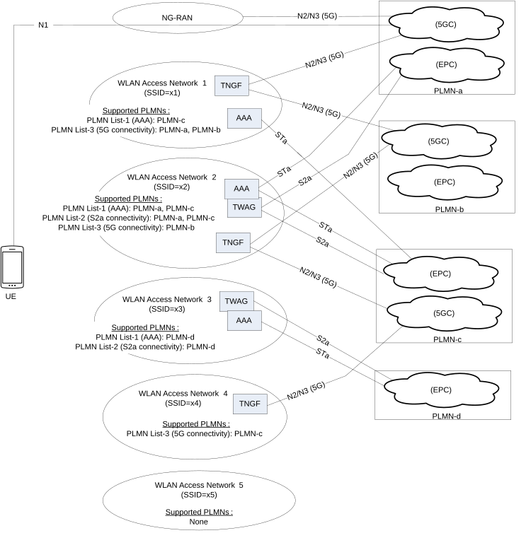

# 6.3.12 Trusted Non-3GPP Access Network selection

## 6.3.12.1 General

Clause 6.3.12 specifies how a UE, which wants to establish connectivity via trusted non-3GPP access and is not operating in SNPN access mode, selects a PLMN and a trusted non-3GPP access network (TNAN) to connect to.

NOTE: For UE operating in SNPN access mode refer to clause 5.30.2.13.

How the UE decides to use trusted non-3GPP access is not specified in this document. As an example, a UE may decide to use trusted non-3GPP access for connecting to 5GC in a specific PLMN based on:

\- the UE implementation-specific criteria; or

\- the UE configuration, e.g. the UE may be configured to try first the trusted non-3GPP access procedures; or

\- the UE capabilities, e.g. the UE may support only the trusted non-3GPP access procedures; or

\- the advertised capabilities of the discovered non-3GPP access networks, e.g. one or more available non-3GPP access networks advertise support of trusted connectivity to 5GC in a specific PLMN.

An example deployment scenario is schematically illustrated in Figure 6.3.12.1-1 below. In this scenario, the UE has discovered five non-3GPP access networks, which are WLAN access networks. These WLANs advertise information about the PLMNs they interwork with, e.g. by using the ANQP protocol, as defined in the HS2.0 specification \[85\]. Each WLAN may support "S2a connectivity" and/or "5G connectivity" to one or more PLMNs. Before establishing connectivity via trusted non-3GPP access, the UE needs to select (a) a PLMN, (b) a non-3GPP access network that provide trusted connectivity this this PLMN and (c) a connectivity type, i.e. either "5G connectivity" or "S2a connectivity".

Each non-3GPP access network may advertise one or more of the following PLMN lists:

1\) A PLMN List-1, which includes PLMNs with which "AAA connectivity" is supported. A non-3GPP access network supports "AAA connectivity" with a PLMN when it deploys an AAA function that can connect with a 3GPP AAA Server/Proxy in this PLMN, via an STa interface (trusted WLAN to EPC), or via an SWa interface (untrusted WLAN to EPC); see TS 23.402 \[43\].

2\) A PLMN List-2, which includes PLMNs with which "S2a connectivity" is supported. A non-3GPP access network supports "S2a connectivity" with a PLMN when it deploys a TWAG function that can connect with a PGW in this PLMN, via an S2a interface; see clause 16 of TS 23.402 \[43\].

3\) A PLMN List-3, which includes PLMNs with which "5G connectivity" is supported. A non-3GPP access network supports "5G connectivity" with a PLMN when it deploys a TNGF function that can connect with an AMF function and an UPF function in this PLMN via N2 and N3 interfaces, respectively; see clause 4.2.8.

When the UE wants to discover the PLMN List(s) supported by a non-3GPP access network and the non-3GPP access network supports ANQP, the UE shall send an ANQP query to the non-3GPP access network requesting "3GPP Cellular Network" information. If the non-3GPP access network supports interworking with one or more PLMNs, the response received by the UE includes a "3GPP Cellular Network" information element containing one or more of the above three PLMN Lists. The PLMN List-1 and the PLMN List-2 are specified in TS 23.402 \[43\] and indicate support of interworking with EPC in one or more PLMNs. The PLMN List-3 is a list used to indicate support of interworking with 5GC in one or more PLMNs. When the non-3GPP access network does not support ANQP, how the UE discovers the PLMN List(s) supported by the non-3GPP access network is not defined in the present specification.

The UE determines if a non-3GPP access network supports "trusted connectivity" to a specific PLMN by receiving the PLMN List-2 and the PLMN List-3 advertised by this access network. If this PLMN is not included in any of these lists, then the non-3GPP access network can only support connectivity to an ePDG or N3IWF in the PLMN (i.e. "untrusted connectivity").

Figure 6.3.12.1-1: Example deployment scenario for trusted Non-3GPP access network selection

## 6.3.12.2 Access Network Selection Procedure

The steps below specify the steps executed by the UE when the UE wants to select and connect to a PLMN over trusted non-3GPP access. Note that the UE executes these steps before connecting to a trusted non-3GPP access network. This is different from the untrusted non-3GPP access (see clause 6.3.6, "N3IWF selection"), where the UE first connects to a non-3GPP access network, it obtains IP configuration and then proceeds to PLMN selection and ePDG/N3IWF selection. In the case of trusted non-3GPP access, the UE uses 3GPP-based authentication for connecting to a non-3GPP access, so it must first select a PLMN and then attempt to connect to a non-3GPP access.

Step 1: The UE constructs a list of available PLMNs, with which trusted connectivity is supported. This list contains the PLMNs included in the PLMN List-2 and PLMN List-3, advertised by all discovered non-3GPP access networks. For each PLMN the supported type(s) of trusted connectivity is also included.

a\. In the example shown in Figure 6.3.12.1-1, the list of available PLMNs includes:

\- PLMN-a: "S2a connectivity", "5G connectivity"

\- PLMN-b: "5G connectivity"

\- PLMN-c: "S2a connectivity", "5G connectivity"

\- PLMN-d: "S2a connectivity"

Step 2: The UE selects a PLMN that is included in the list of available PLMNs, as follows:

a\. If the UE is connected to a PLMN via 3GPP access and this PLMN is included in the list of available PLMNs, the UE selects this PLMN. If this PLMN is not included in the list of available PLMNs, but it is included in the "Non-3GPP access node selection information" in the UE (see clause 6.3.6.1), the UE selects this PLMN and executes the combined ePDG/N3IWF selection procedure specified in clause 6.3.6.3.

b\. Otherwise (the UE is not connected to a PLMN via 3GPP access, or the UE is connected to a PLMN via 3GPP access but this PLMN is neither in the list of available PLMNs nor in the "Non-3GPP access node selection information"), the UE determines the country it is located in by using implementation specific means.

i\) If the UE determines to be located in its home country, then:

\- The UE selects the HPLMN, if included in the list of available PLMNs. Otherwise, the UE selects an E-HPLMN (Equivalent HPLMN), if an E-HPLMN is included in the list of available PLMNs. If the list of available PLMNs does not include the HPLMN and does not include an E-HPLMN, the UE stops the procedure and may attempt to connect via untrusted non-3GPP access (i.e. it may execute the N3IWF selection procedure specified in clause 6.3.6).

ii\) If the UE determines to be located in a visited country, then:

\- The UE determines if it is mandatory to select a PLMN in the visited country, as follows:

\- If the UE has IP connectivity (e.g. the UE is connected via 3GPP access), the UE sends a DNS query and receives a DNS response that indicates if a PLMN must be selected in the visited country. The DNS response includes also a lifetime that denotes how long the DNS response can be cached for. The FQDN in the DNS query shall be different from the Visited Country FQDN (see TS 23.003 \[19\]) that is used for ePDG/N3IWF selection. The DNS response shall not include a list of PLMNs that support trusted connectivity in the visited country, but shall only include an indication of whether a PLMN must be selected in the visited country or not.

\- If the UE has no IP connectivity (e.g. the UE is not connected via 3GPP access), then the UE may use a cached DNS response that was received in the past, or may use local configuration that indicates which visited countries mandate a PLMN selection in the visited country.

\- If the UE determines that it is not mandatory to select a PLMN in the visited country and the HPLMN or an E-HPLMN is included in the list of available PLMNs, then the UE selects the HPLMN or an E-HPLMN, whichever is included in the list of available PLMNs.

\- Otherwise, the UE selects a PLMN in the visited country by considering, in priority order, the PLMNs, first, in the User Controlled PLMN Selector list and, next, in the Operator Controlled PLMN Selector list (see TS 23.122 \[17\]). The UE selects the highest priority PLMN in a PLMN Selector list that is also included in the list of available PLMNs;

\- If the list of available PLMNs does not include a PLMN that is also included in a PLMN Selector list, the UE stops the procedure and may attempt to connect via untrusted non-3GPP access.

c\. In the example shown in Figure 6.3.12.1-1, the UE may select PLMN-c, for which "S2a connectivity" and "5G connectivity" is supported.

Step 3: The UE selects the type of trusted connectivity ("S2a connectivity" or "5G connectivity") for connecting to the selected PLMN, as follows:

a\. If the list of available PLMNs indicates that both "S2a connectivity" and "5G connectivity" is supported for the selected PLMN, then the UE shall select "5G connectivity" because it is the preferred type of trusted access.

b\. Otherwise, if the list of available PLMNs indicates that only one type of trusted connectivity (either "S2a connectivity" or "5G connectivity") is supported for the selected PLMN, the UE selects this type of trusted connectivity.

c\. In the example shown in Figure 6.3.12.1-1, the UE may select PLMN-c and "5G connectivity". There are two non-3GPP access networks that support "5G connectivity" to PLMN-c: the WLAN access network 2 and the WLAN access network 4.

Step 4: Finally, the UE selects a non-3GPP access network to connect to, as follows:

a\. The UE puts the available non-3GPP access networks in priority order. For WLAN access, the UE constructs a prioritized list of WLAN access networks by using the WLANSP rules (if provided) and the procedure specified in clause 6.6.1.3 of TS 23.503 \[45\]. When the UE supports the selection of Trusted access supporting the network slices it desires to use and has received extended WLANSP rule as specified in clause 6.6.1.1 of TS 23.503 \[45\], the UE selects the non-3GPP access network with the SSID(s) which can access to the TNGF supporting the S-NSSAI needed by the UE. If the UE is not provided with WLANSP rules, the UE constructs the prioritized list of WLAN access networks by using an implementation specific procedure. For other types of non-3GPP access, the UE may use access specific information to construct this prioritized list.

b\. From the prioritized list of non-3GPP access networks, the UE selects the highest priority non-3GPP access network that supports the selected type of trusted connectivity to the selected PLMN.

c\. In the example shown in Figure 6.3.12.1-1, the UE selects either the WLAN access network 2 or the WLAN access network 4, whichever has the highest priority in the prioritized list of non-3GPP access networks.

d\. Over the selected non-3GPP access network, the UE starts the 5GC registration procedure specified in clause 4.12a.2.2 of TS 23.502 \[3\].

e\. If the AMF detects the UE is using a wrong TNGF, the AMF may trigger a UE policy update and reject the UE registration

During the registration procedure the AMF may determine if the TNGF selected by the UE is suitable for the S-NSSAI(s) requested by the UE considering the UE subscription. If the AMF determines that a different TNGF should be selected as described in clause 4.12a.2.2 of TS 23.502 \[3\], the AMF:

\- may, if the UE supports slice-based TNGF selection, triggers the UE Policy Association Establishment or UE Policy Association Update procedure to provide the UE with updated TNGF selection information; when the AMF is informed by the PCF that the update of UE policy information on the UE is completed as described in clause 4.12a.2.2 of TS 23.502 \[3\], the AMF releases UE Policy Association if the UE is not registered over 3GPP access before proceeding to the Registration Reject over trusted non-3GPP access;

NOTE 1: To enable the V-PCF to provide the UE with Slice-specific TNGF selection information in the roaming case, the AMF provides the V-PCF with the Configured NSSAI for the serving PLMN during the UE Policy Association Establishment/Update procedure.

\- shall send a Registration Reject message to the UE. The AMF may include target TNAN information (SSID, TNGF ID) in the Registration Reject so that the UE can, if supported by the UE, use the target TNAN information to try again to register to 5GC if the UE wishes to send the same Requested NSSAI as during the previous Registration Request. The target TNAN information only applies to the one TNAN selection performed by the UE just after receiving the Registration Reject.

NOTE 2: A TNGF ID sent within a Registration Reject message to a UE trying to register over Trusted Non-3GPP access corresponds to a UE side interface of a TNGF while a TNGF Identifier of N3 terminations provided by a TNGF over N2 and defined in clause 6.3.3.3 corresponds to an internal 5GC identifier related with a TNGF.

The AMF may determine the target TNAN based on the list of supported TAs and the corresponding list of supported slices for each TA obtained as defined in clause 5.15.8 and considering UE location.

NOTE 3: The operator is assumed to ensure that UEs that do not support slice-based TNGF selection always select a TNGF that supports at least one slice requested by the UE. This is to avoid unnecessary and potentially repetitive rejections of those UEs. To ensure this, the operator is assumed to provide identifiers of TNGFs that only support a subset of the slices configured in the network only to UEs that support slice-based TNGF selection.
