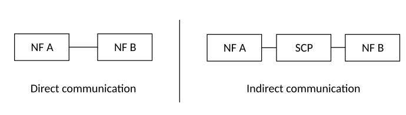
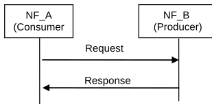
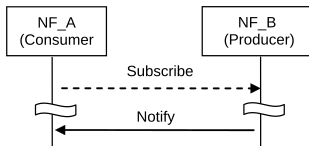
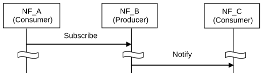
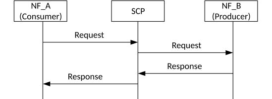
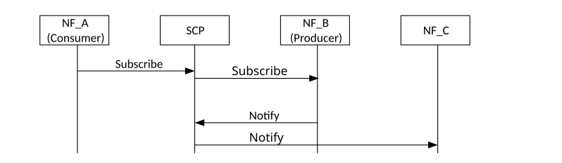

# 7.1 Network Function Service Framework

## 7.1.1 General

Service Framework functionalities include e.g. service registration/de-registration, consumer authorization, service discovery and inter service communication, which include selection and message passing. Four communication options are listed in Annex E and can all co-exist within one and the same network.

An NF service is one type of capability exposed by an NF (NF Service Producer) to other authorized NF (NF Service Consumer) through a service-based interface. A Network Function may expose one or more NF services. Following are criteria for specifying NF services:

\- NF services are derived from the system procedures that describe end-to-end functionality, where applicable (see TS 23.502 \[3\], Annex B drafting rules). Services may also be defined based on information flows from other 3GPP specifications.

\- System procedures can be described by a sequence of NF service invocations.

NF services may communicate directly between NF Service consumers and NF Service Producers, or indirectly via an SCP. Direct and Indirect Communication are illustrated in Figure 7.1.1-1. For more information, see Annex E and clauses 6.3.1 and 7.1.2. Whether a NF Service Consumer (e.g. in the case of requests or subscriptions) or NF Service Producer (e.g. in the case of notifications) uses Direct Communication or Indirect Communication by using an SCP is based on the local configuration of the NF Service Consumer/NF Service Producer. An NF may not use SCP for all its communication based on the local configuration.

NOTE: The SCP can be deployed in a distributed manner.

In Direct Communication, the NF Service consumer performs discovery of the target NF Service producer by local configuration or via NRF. The NF Service consumer communicates with the target NF Service producer directly.

In Indirect Communication, the NF Service consumer communicates with the target NF Service producer via a SCP. The NF Service consumer may be configured to perform discovery of the target NF Service producer directly, or delegate the discovery of the target NF Service Producer to the SCP used for Indirect Communication. In the latter case, the SCP uses the parameters provided by NF Service consumer to perform discovery and/or selection of the target NF Service producer. The SCP address may be locally configured in NF Service consumer.

Figure 7.1.1-1: NF/NF service inter communication

## 7.1.2 NF Service Consumer - NF Service Producer interactions

The end-to-end interaction between two Network Functions (Consumer and Producer) within this NF service framework follows two mechanisms, irrespective of whether Direct Communication or Indirect Communication is used:

\- "Request-response": A Control Plane NF_B (NF Service Producer) is requested by another Control Plane NF_A (NF Service Consumer) to provide a certain NF service, which either performs an action or provides information or both. NF_B provides an NF service based on the request by NF_A. In order to fulfil the request, NF_B may in turn consume NF services from other NFs. In Request-response mechanism, communication is one to one between two NFs (consumer and producer) and a one-time response from the producer to a request from the consumer is expected within a certain timeframe. The NF Service Producer may also add a Binding Indication (see clause 6.3.1.0) in the Response, which may be used by the NF Service Consumer to select suitable NF service producer instance(s) for subsequent requests. For indirect communication, the NF Service Consumer copies the Binding Indication into the Routing Binding indication, that is included in subsequent requests, to be used by the SCP to discover a suitable NF service producer instance(s).

Figure 7.1.2-1: "Request-response" NF Service illustration

\- "Subscribe-Notify": A Control Plane NF_A (NF Service Consumer) subscribes to NF Service offered by another Control Plane NF_B (NF Service Producer). Multiple Control Plane NFs may subscribe to the same Control Plane NF Service. NF_B notifies the results of this NF service to the interested NF(s) that subscribed to this NF service. The subscription request shall include the notification endpoint, i.e. a Notification Target Address and a Notification Correlation ID (e.g. the callback URL) of the NF Service Consumer to which the event notification from the NF Service Producer should be sent to.

NOTE 1: The notification endpoint can be a URL and contains both the Notification Target Address and the Notification Correlation ID.

The NF Service Consumer may add a Binding Indication (see clause 6.3.1.0) in the subscribe request, which may be used by the NF Service Producer to discover a suitable notification endpoint. For indirect communication, the NF Service Producer copies the Binding Indication into the Routing Binding Indication, that is included in the response, to be used by the SCP to discover a suitable notification target. The NF Service Producer may also add a Binding Indication (see clause 6.3.1.0) in the subscribe response, which may be used by the NF Service Consumer (or SCP) to select suitable NF service producer instance(s) or NF producer service instance. In addition, the subscription request may include notification request for periodic updates or notification triggered through certain events (e.g. the information requested gets changed, reaches certain threshold etc.). The subscription for notification can be done through one of the following ways:

\- Explicit subscription: A separate request/response exchange between the NF Service Consumer and the NF Service Producer; or

\- Implicit subscription: The subscription for notification is included as part of another NF service operation of the same NF Service; or

\- Default notification endpoint: Registration of a notification endpoint for each type of notification the NF consumer is interested to receive, as a NF service parameter with the NRF during the NF and NF service Registration procedure as specified in clause 4.17.1 of TS 23.502 \[3\].

The NF Service Consumer may also add a Binding Indication (see clause 6.3.1.0) in the response to the notification request, which may be used by the NF Service Producer to discover a suitable notification endpoint. For indirect communication, the NF Service Producer copies the Binding Indication into the Routing Binding indication that is included in subsequent notification requests. The binding indication is then used by the SCP to discover a suitable notification target.

Figure 7.1.2-2: "Subscribe-Notify" NF Service illustration 1

A Control Plane NF_A may also subscribe to NF Service offered by Control Plane NF_B on behalf of Control Plane NF_C, i.e. it requests the NF Service Producer to send the event notification to another consumer(s). In this case, NF_A includes the notification endpoint, i.e. Notification Target Address) and a Notification Correlation ID, of the NF_C in the subscription request. NF_A may also additionally include the notification endpoint and a Notification Correlation ID of NF A associated with subscription change related Event ID(s), e.g. Subscription Correlation ID Change, in the subscription request, so that NF_A can receive the notification of the subscription change related event. The NF_A may add Binding Indication (see clause 6.3.1.0) in the subscribe request.

Figure 7.1.2-3: "Subscribe-Notify" NF Service illustration 2

Routing of the messages for the NF interaction mechanisms above may be direct, as shown in the figures 7.1.2-1 to 7.1.2-3, or indirect. In the case of Indirect Communication, an SCP is employed by the NF service consumer. The SCP routes messages between NF service consumers and NF service producers based on the Routing Binding Indication if available and may do discovery and associated selection of the NF service producer on behalf of a NF service consumer. Figure 7.1.2-4 shows the principle for a request-response interaction and figure 7.1.2-5 shows an example of a subscribe-notify interaction.

Figure 7.1.2-4: Request response using Indirect Communication

Figure 7.1.2-5: Subscribe-Notify using Indirect Communication

NOTE: The subscribe request and notify request can be routed by different SCPs.

## 7.1.3 Network Function Service discovery

A Control Plane Network function (NF) within the 5G Core network may expose its capabilities as services via its service based interface, which can be re-used by Control Plane CN NFs.

The NF service discovery enables a CN NF or SCP to discover NF instance(s) that provide the expected NF service(s). The NF service discovery is implemented via the NF discovery functionality.

For more detail NF discovery refer to clause 6.3.1.

## 7.1.4 Network Function Service Authorization

NF service authorization shall ensure the NF Service Consumer is authorized to access the NF service provided by the NF Service Provider, according to e.g. the policy of NF, the policy from the serving operator, the inter-operator agreement.

Service authorization information shall be configured as one of the components in NF profile of the NF Service Producer. It shall include the NF type (s) and NF realms/origins allowed to consume NF Service(s) of NF Service Producer.

Due to roaming agreements and operator policies, a NF Service Consumer shall be authorised based on UE/subscriber/roaming information and NF type, the Service authorization may entail two steps:

\- Check whether the NF Service Consumer is permitted to discover the requested NF Service Producer instance during the NF service discovery procedure. This is performed on a per NF granularity by NRF.

NOTE 1: When NF discovery is performed based on local configuration, it is assumed that locally configured NFs are authorized.

\- Check whether the NF Service Consumer is permitted to access the requested NF Service Producer for consuming the NF service, with a request type granularity. This is performed on a per UE, subscription or roaming agreements granularity. This type of NF Service authorization shall be embedded in the related NF service logic.

NOTE 2: The security of the connection between NF Service Consumer and NF Service Producer is specified in TS 33.501 \[29\].

NOTE 3: It is expected that an NF authorization framework exists in order to perform consumer NF authorization considering UE, subscription or roaming agreements granularity. This authorization is assumed to be performed without configuration of the NRF regarding UE, subscription or roaming information.

## 7.1.5 Network Function and Network Function Service registration and de-registration

For the NRF to properly maintain the information of available NF instances and their supported services, each NF instance informs the NRF of the list of NF services that it supports.

NOTE: The NF informs the appropriate NRF based on configuration.

The NF instance may make this information available to NRF when the NF instance becomes operative for the first time (registration operation) or upon individual NF service instance activation/de-activation within the NF instance (update operation) e.g. triggered after a scaling operation. The NF instance while registering the list of NF services it supports, for each NF service, may provide a notification endpoint information for each type of notification service that the NF service is prepared to consume, to the NRF during the NF instance registration. The NF instance may also update or delete the NF service related parameters (e.g. to delete the notification endpoint information). Alternatively, another authorised entity (such as an OA&M function) may inform the NRF on behalf of an NF instance triggered by an NF service instance lifecycle event (register or de-registration operation depending on instance instantiation, termination, activation, or de-activation). Registration with the NRF includes capacity and configuration information at time of instantiation.

The NF instance may also de-registers from the NRF when it is about to gracefully shut down or disconnect from the network in a controlled way. If an NF instance become unavailable or unreachable due to unplanned errors (e.g. NF crashes or there are network issues), an authorised entity shall de-register the NF instance with the NRF.
