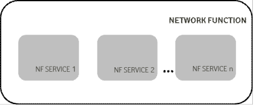
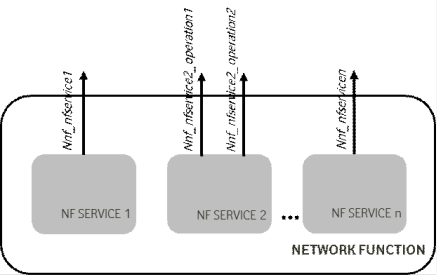
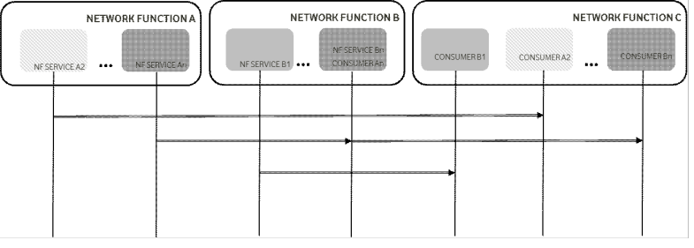

# 7.2.1 General

In the context of this specification, an NF service is offering a capability to authorised consumers.

Network Functions may offer different capabilities and thus, different NF services to distinct consumers. Each of the NF services offered by a Network Function shall be self-contained, reusable and use management schemes independently of other NF services offered by the same Network Function (e.g. for scaling, healing, etc).

The discovery of the NF instance and NF service instance is specified in clause 6.3.1.

NOTE 1: There can be dependencies between NF services within the same Network Function due to sharing some common resources, e.g. context data. This does not preclude that NF services offered by a single Network Function are managed independently of each other.

Figure 7.2.1-1: Network Function and NF Service

Each NF service shall be accessible by means of an interface. An interface may consist of one or several operations.

Figure 7.2.1-2: Network Function, NF Service and NF Service Operation

System procedures, as specified in TS 23.502 \[3\] can be built by invocation of a number of NF services. The following figure shows an illustrative example on how a procedure can be built; it is not expected that system procedures depict the details of the NF Services within each Network Function.

Figure 7.2.1-3: System Procedures and NF Services

NOTE 2: The SCP can be used for indirect communication between NF/NF service instances. For simplicity the SCP is not shown in the procedure.

The following clauses provide for each NF the NF services it exposes through its service based interfaces.
