# 8 Control and User Plane Protocol Stacks

## 8.1 General

Clause 8 specifies the overall protocol stacks between 5GS entities, e.g. between the UE and the 5GC Network Functions, between the 5G-AN and the 5GC Network Functions, or between the 5GC Network Functions.

## 8.2 Control Plane Protocol Stacks

### 8.2.1 Control Plane Protocol Stacks between the 5G-AN and the 5G Core: N2

#### 8.2.1.1 General

NOTE 1: N2 maps to NG-C as defined in TS 38.413 \[34\].

Following procedures are defined over N2:

\- Procedures related with N2 Interface Management and that are not related to an individual UE, such as for Configuration or Reset of the N2 interface. These procedures are intended to be applicable to any access but may correspond to messages that carry some information only on some access (such as information on the default Paging DRX used only for 3GPP access).

\- Procedures related with an individual UE:

\- Procedures related with NAS Transport. These procedures are intended to be applicable to any access but may correspond to messages that for UL NAS transport carry some access dependent information such as User Location Information (e.g. Cell-Id over 3GPP access or other kind of User Location Information for Non-3GPP access).

\- Procedures related with UE context management. These procedures are intended to be applicable to any access. The corresponding messages may carry:

\- some information only on some access (such as Mobility Restriction List used only for 3GPP access).

\- some information (related e.g. with N3 addressing and with QoS requirements) that is to be transparently forwarded by AMF between the 5G-AN and the SMF.

\- Procedures related with resources for PDU Sessions. These procedures are intended to be applicable to any access. They may correspond to messages that carry information (related e.g. with N3 addressing and with QoS requirements) that is to be transparently forwarded by AMF between the 5G-AN and the SMF.

\- Procedures related with Hand-Over management. These procedures are intended for 3GPP access only.

The Control Plane interface between the 5G-AN and the 5G Core supports:

\- The connection of multiple different kinds of 5G-AN (e.g. 3GPP RAN, N3IWF for Un-trusted access to 5GC) to the 5GC via a unique Control Plane protocol: A single NGAP protocol is used for both the 3GPP access and non-3GPP access;

\- There is a unique N2 termination point in AMF per access for a given UE regardless of the number (possibly zero) of PDU Sessions of the UE;

\- The decoupling between AMF and other functions such as SMF that may need to control the services supported by 5G-AN(s) (e.g. control of the UP resources in the 5G-AN for a PDU Session). For this purpose, NGAP may support information that the AMF is just responsible to relay between the 5G-AN and the SMF. The information can be referred as N2 SM information in TS 23.502 \[3\] and this specification.

NOTE 2: The N2 SM information is exchanged between the SMF and the 5G-AN transparently to the AMF.

#### 8.2.1.2 5G-AN - AMF

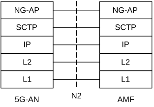

**Legend:**

\- **NG Application Protocol (NG-AP):** Application Layer Protocol between the 5G-AN node and the AMF. NG-AP is defined in TS 38.413 \[34\].

\- **Stream Control Transmission Protocol (SCTP):** This protocol guarantees delivery of signalling messages between AMF and 5G-AN node (N2). SCTP is defined in RFC 4960 \[44\].

Figure 8.2.1.2-1: Control Plane between the 5G-AN and the AMF

#### 8.2.1.3 5G-AN - SMF

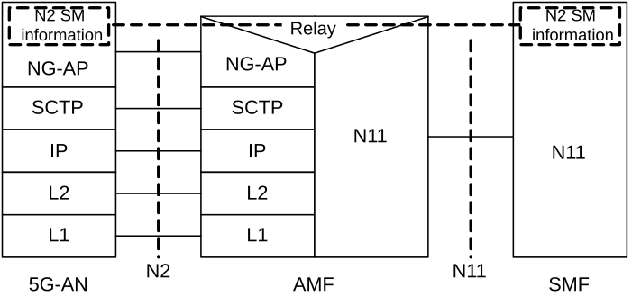

**Legend:**

\- **N2 SM information:** This is the subset of NG-AP information that the AMF transparently relays between the 5G-AN and the SMF and is included in the NG-AP messages and the N11 related messages.

Figure 8.2.1.3-1: Control Plane between the 5G-AN and the SMF

NOTE 1: From the 5G-AN perspective, there is a single termination of N2 i.e. the AMF.

NOTE 2: For the protocol stack between the AMF and the SMF, see clause 8.2.3.

### 8.2.2 Control Plane Protocol Stacks between the UE and the 5GC

#### 8.2.2.1 General

A single N1 NAS signalling connection is used for each access to which the UE is connected. The single N1 termination point is located in AMF. The single N1 NAS signalling connection is used for both Registration Management and Connection Management (RM/CM) and for SM-related messages and procedures for a UE.

The NAS protocol on N1 comprises a NAS-MM and a NAS-SM components.

There are multiple cases of protocols between the UE and a core network function (excluding the AMF) that need to be transported over N1 via NAS-MM protocol. Such cases include:

\- Session Management Signalling.

\- SMS.

\- UE Policy.

\- LCS.

RM/CM NAS messages in NAS-MM and other types of NAS messages (e.g. SM), as well as the corresponding procedures, are decoupled.

The NAS-MM supports generic capabilities:

\- NAS procedures that terminate at the AMF. This includes:

\- Handles Registration Management and Connection Management state machines and procedures with the UE, including NAS transport; the AMF supports following capabilities:

\- Decide whether to accept the RM/CM part of N1 signalling during the RM/CM procedures without considering possibly combined other non NAS-MM messages (e.g. SM) in the same NAS signalling contents;

\- Know if one NAS message should be routed to another NF (e.g. SMF), or locally processed with the NAS routing capabilities inside during the RM/CM procedures;

\- Provide a secure NAS signalling connection (integrity protection, ciphering) between the UE and the AMF, including for the transport of payload;

\- Provide access control if it applies;

\- It is possible to transmit the other type of NAS message (e.g. NAS SM) together with an RM/CM NAS message by supporting NAS transport of different types of payload or messages that do not terminate at the AMF, i.e. NAS-SM, SMS, UE Policy and LCS between the UE and the AMF. This includes:

\- Information about the Payload type;

\- Additional Information for forwarding purposes

\- The Payload (e.g. the SM message in the case of SM signalling);

\- There is a Single NAS protocol that applies on both 3GPP and non-3GPP access. When an UE is served by a single AMF while the UE is connected over multiple (3GPP/Non 3GPP) accesses, there is a N1 NAS signalling connection per access.

Security of the NAS messages is provided based on the security context established between the UE and the AMF.

Figure 8.2.2.1-1 depicts NAS transport of SM signalling, SMS, UE Policy and LCS.

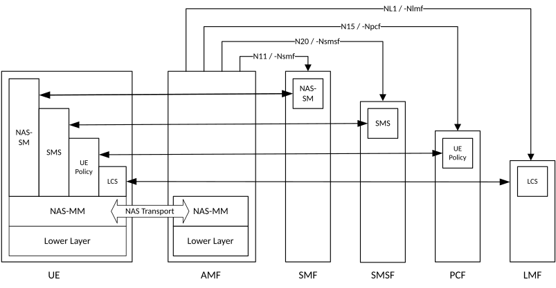

Figure 8.2.2.1-1 NAS transport for SM, SMS, UE Policy and LCS

#### 8.2.2.2 UE - AMF

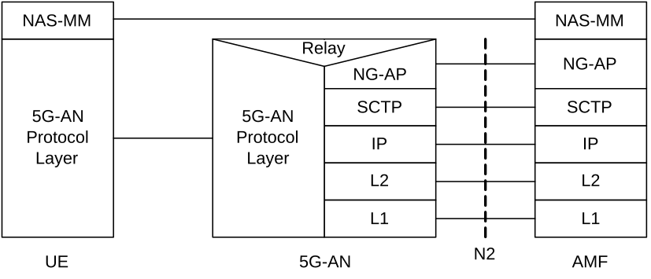

**Legend:**

\- **NAS-MM:** The NAS protocol for MM functionality supports registration management functionality, connection management functionality and user plane connection activation and deactivation. It is also responsible of ciphering and integrity protection of NAS signalling. 5G NAS protocol is defined in TS 24.501 \[47\]

\- **5G-AN Protocol layer:** This set of protocols/layers depends on the 5G-AN. In the case of NG-RAN, the radio protocol between the UE and the NG-RAN node (eNodeB or gNodeB) is specified in TS 36.300 \[30\] and TS 38.300 \[27\]. In the case of non-3GPP access, see clause 8.2.4.

Figure 8.2.2.2-1: Control Plane between the UE and the AMF

#### 8.2.2.3 UE – SMF

The NAS-SM supports the handling of Session Management between the UE and the SMF.

The SM signalling message is handled, i.e. created and processed, in the NAS-SM layer of UE and the SMF. The content of the SM signalling message is not interpreted by the AMF.

The NAS-MM layer handles the SM signalling is as follows:

\- For transmission of SM signalling:

\- The NAS-MM layer creates a NAS-MM message, including security header, indicating NAS transport of SM signalling, additional information for the receiving NAS-MM to derive how and where to forward the SM signalling message.

\- For reception of SM signalling:

\- The receiving NAS-MM processes the NAS-MM part of the message, i.e. performs integrity check and interprets the additional information to derive how and where to derive the SM signalling message.

The SM message part shall include the PDU Session ID.

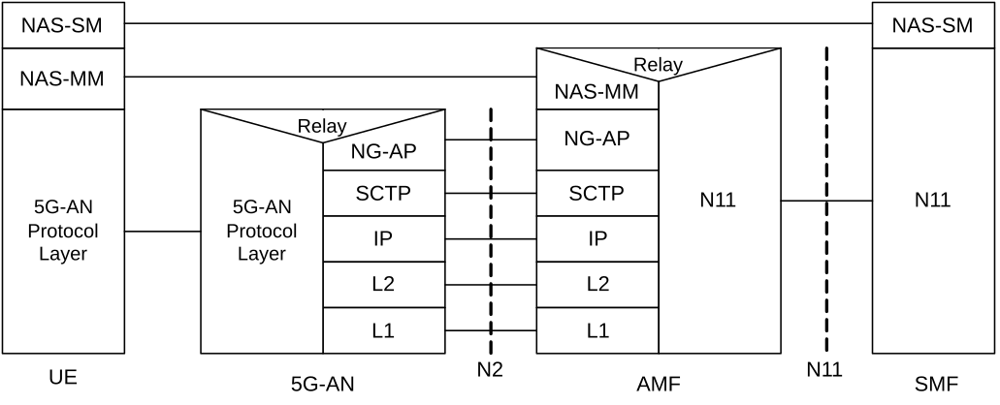

**Legend:**

\- **NAS-SM:** The NAS protocol for SM functionality supports user plane PDU Session Establishment, modification and release. It is transferred via the AMF and transparent to the AMF. 5G NAS protocol is defined in TS 24.501 \[47\]

Figure 8.2.2.3-1: Control Plane protocol stack between the UE and the SMF

### 8.2.3 Control Plane Protocol Stacks between the network functions in 5GC

#### 8.2.3.1 The Control Plane Protocol Stack for the service based interface

The control plane protocol(s) for the service-based interfaces listed in clause 4.2.6 is defined in the TS 29.500 \[49\]

#### 8.2.3.2 The Control Plane protocol stack for the N4 interface between SMF and UPF

The control plane protocol for SMF-UPF (i.e. N4 reference point) is defined in TS 29.244 \[65\].

### 8.2.4 Control Plane for untrusted non 3GPP Access

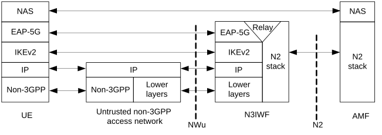

Figure 8.2.4-1: Control Plane before the signalling IPsec SA is established between UE and N3IWF

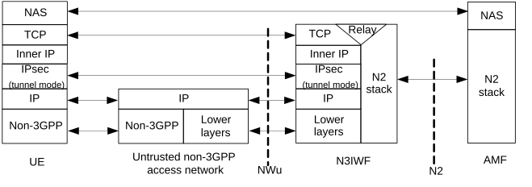

Figure 8.2.4-2: Control Plane after the signalling IPsec SA is established between UE and N3IWF

Large NAS messages may be fragmented by the "inner IP" layer or by TCP.

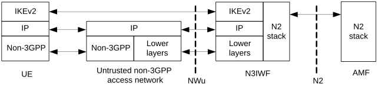

Figure 8.2.4-3: Control Plane for establishment of user-plane via N3IWF

In the above figures 8.2.4-1, 8.2.4-2 and 8.2.4-3, the UDP protocol may be used between the UE and N3IWF to enable NAT traversal for IKEv2 and IPsec traffic.

The "signalling IPsec SA" is defined in clause 4.12.2 of TS 23.502 \[3\].

### 8.2.5 Control Plane for trusted non-3GPP Access

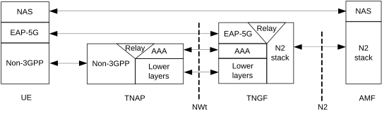

Figure 8.2.5-1: Control Plane before the NWt connection is established between UE and TNGF

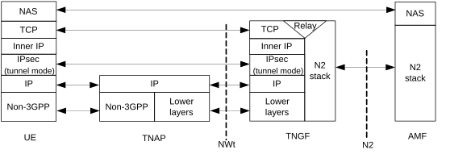

Figure 8.2.5-2: Control Plane after the NWt connection is established between UE and TNGF

Large NAS messages may be fragmented by the "inner IP" layer or by TCP.

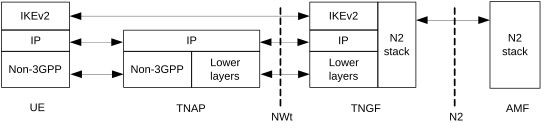

Figure 8.2.5-3: Control Plane for establishment of user-plane via TNGF

In the above figures 8.2.5-2 and 8.2.5-3, the UDP protocol may be used between the UE and TNGF to enable NAT traversal for IKEv2 and IPsec traffic.

The NWt connection is defined in clause 4.2.8.3 and in clause 4.12a.2.2 of TS 23.502 \[3\].

### 8.2.6 Control Plane for W-5GAN Access

The control plane for W-5GAN is defined in clause 6 of TS 23.316 \[84\].

### 8.2.7 Control Plane for Trusted WLAN Access for N5CW Device

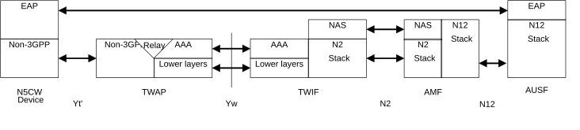

Figure 8.2.7-1: Control Plane for trusted WLAN access for N5CW device

The EAP protocol applies only for performing EAP-based access authentication procedure to connect to a trusted WLAN access network.

## 8.3 User Plane Protocol Stacks

### 8.3.1 User Plane Protocol Stack for a PDU Session

This clause illustrates the protocol stack for the User plane transport related with a PDU Session.

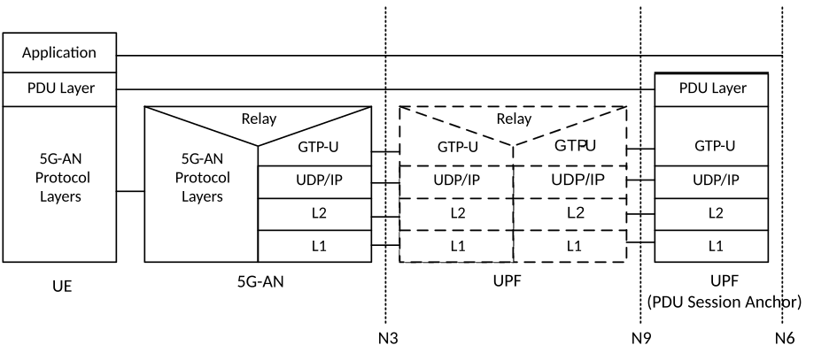

**Legend:**

\- **PDU layer:** This layer corresponds to the PDU carried between the UE and the DN over the PDU Session. When the PDU Session Type is IPv4 or IPv6 or IPv4v6, it corresponds to IPv4 packets or IPv6 packets or both of them; When the PDU Session Type is Ethernet, it corresponds to Ethernet frames; etc.

**- GPRS Tunnelling Protocol for the user plane (GTP‑U):** This protocol supports tunnelling user data over N3 (i.e. between the 5G-AN node and the UPF) and N9 (i.e. between different UPFs of the 5GC) in the backbone network, details see TS 29.281 \[75\]. GTP shall encapsulate all end user PDUs. It provides encapsulation on a per PDU Session level. This layer carries also the marking associated with a QoS Flow defined in clause 5.7. This protocol is also used on N4 interface as defined in TS 29.244 \[65\].

Figure 8.3.1-1: User Plane Protocol Stack

\- **5G-AN protocol stack**: This set of protocols/layers depends on the AN:

\- When the 5G-AN is a 3GPP NG-RAN, these protocols/layers are defined in TS 38.401 \[42\]. The radio protocol between the UE and the 5G-AN node (eNodeB or gNodeB) is specified in TS 36.300 \[30\] and TS 38.300 \[27\].

\- When the AN is an Untrusted non 3GPP access to 5GC the 5G-AN interfaces with the 5GC at a N3IWF defined in clause 4.3.2 and the 5G-AN protocol stack is defined in clause 8.3.2.

\- **UDP/IP:** These are the backbone network protocols.

NOTE 1: The number of UPF in the data path is not constrained by 3GPP specifications: there may be in the data path of a PDU Session 0, 1 or multiple UPF that do not support a PDU Session Anchor functionality for this PDU Session.

NOTE 2: The "non PDU Session Anchor" UPF depicted in the Figure 8.3.1-1 is optional.

NOTE 3: The N9 interface may be intra-PLMN or inter PLMN (in the case of Home Routed deployment).

If there is an UL CL (Uplink Classifier) or a Branching Point (both defined in clause 5.6.4) in the data path of a PDU Session, the UL CL or Branching Point acts as the non PDU Session Anchor UPF of Figure 8.3.1-1. In that case there are multiple N9 interfaces branching out of the UL CL / Branching Point each leading to different PDU Session anchors.

NOTE 4: Co-location of the UL CL or Branching Point with a PDU Session Anchor is a deployment option.

### 8.3.2 User Plane for untrusted non-3GPP Access

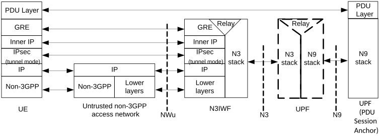

Figure 8.3.2-1: User Plane via N3IWF

Large GRE packets may be fragmented by the "inner IP" layer.

Details about the PDU Layer, the N3 stack and the N9 stack are included in clause 8.3.1. The UDP protocol may be used below the IPsec layer to enable NAT traversal.

### 8.3.3 User Plane for trusted non-3GPP Access

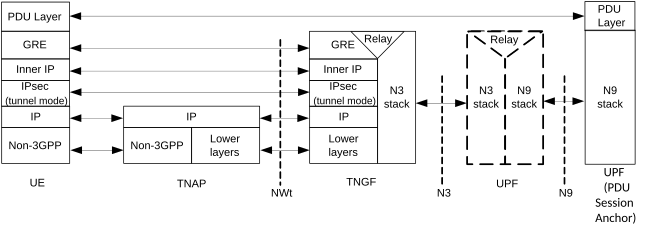

Figure 8.3.3-1: User Plane via TNGF

Large GRE packets may be fragmented by the "inner IP" layer.

Details about the PDU Layer, the N3 stack and the N9 stack are included in clause 8.3.1. The UDP protocol may be used below the IPsec layer to enable NAT traversal.

### 8.3.4 User Plane for W-5GAN Access

The user plane for W-5GAN is defined in clause 6 of TS 23.316 \[84\].

### 8.3.5 User Plane for N19-based forwarding of a 5G VN group

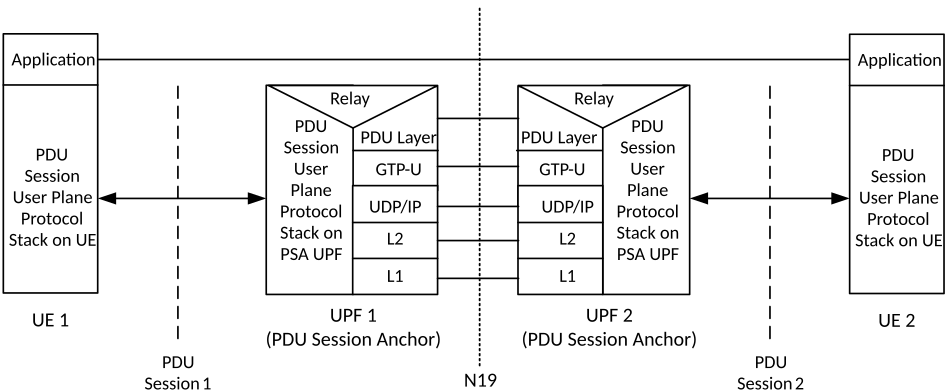

Figure 8.3.5-1: User Plane for N19-based forwarding

Details about the PDU Layer, PDU Session User Plane Protocol Stack are included in clause 8.3.1 and clause 8.3.2. The N19 is based on a shared User Plane tunnel connecting two PSA UPFs of a single 5G VN group.

### 8.3.6 User Plane for Trusted WLAN Access for N5CW Device

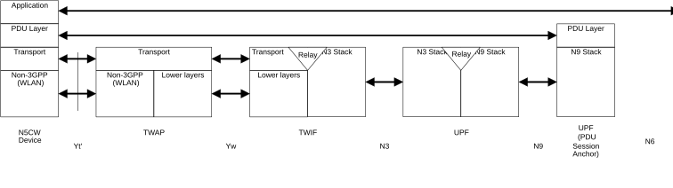

**Legend:**

\- Transport: this layer refers to the transport of PDUs between the N5CW device and TWIF (see clause 4.2.8.5.4).

In this Release of the specification, Trusted WLAN Access for N5CW Device only supports IP PDU Session type.

Figure 8.2.8-1: User Plane for trusted WLAN access for N5CW device
