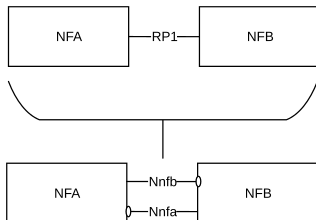
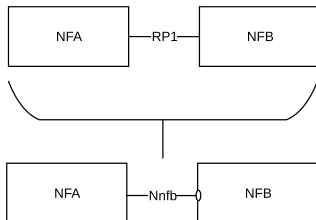
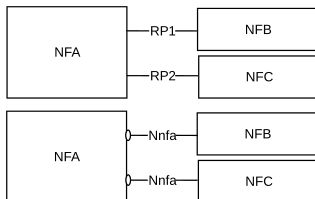
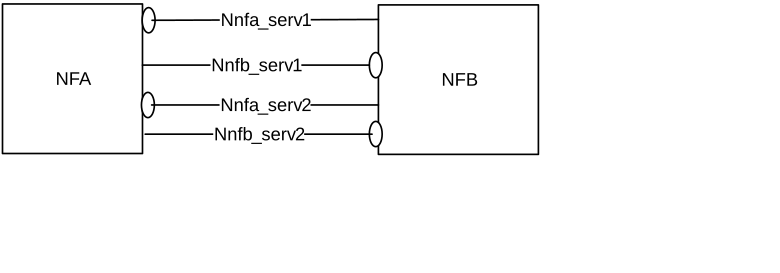

# Annex A (informative): Relationship between Service-Based Interfaces and Reference Points

Service-Based Interfaces and Reference Points are two different ways to model interactions between architectural entities. A Reference Point is a conceptual point at the conjunction of two non-overlapping functional groups (see TR 21.905 \[1\]). In figure A-1 the functional groups are equivalent to Network Functions.

A reference point can be replaced by one or more service-based interfaces which provide equivalent functionality.

Figure A-1: Example show a Reference Point replaced by two Service based Interfaces

Figure A-2: Example showing a Reference Point replaced by a single Service based Interface

Reference points exist between two specific Network Functions. Even if the functionality is equal on two reference points between different Network Functions there has to be a different reference point name. Using the service-based interface representation it is immediately visible that it is the same service-based interface and that the functionality is equal on each interface.

Figure A-3: Reference Points vs. Service-based Interfaces representation of equal functionality on the interfaces

A NF may expose one or more services through Service based interfaces.

Figure A-4: One or more Services exposed by one Network Function
