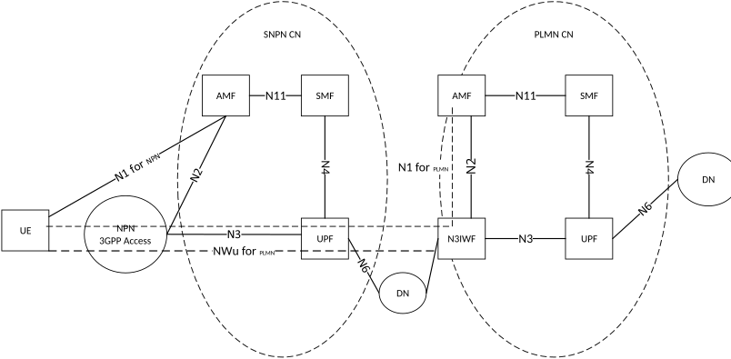
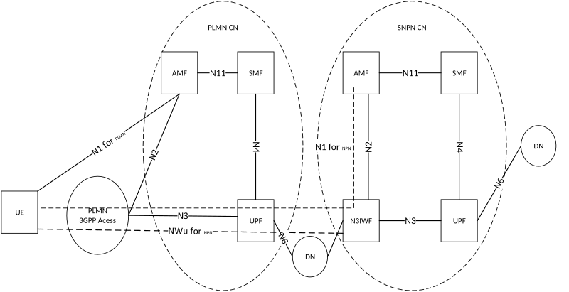
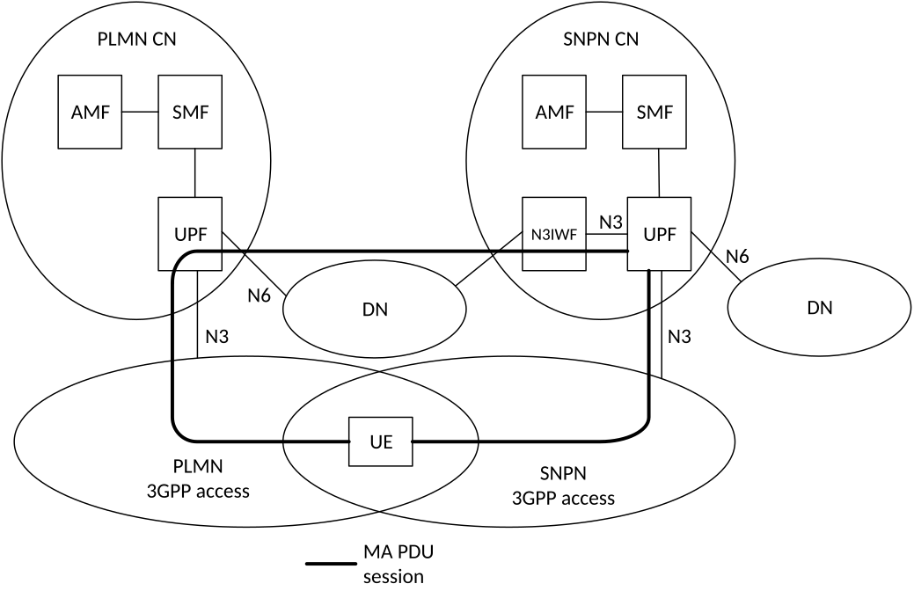

# Annex D (informative): 5GS support for Non-Public Network deployment options

## D.1 Introduction

This annex provides guidance on how 5GS features and capabilities can be used to support various Non-Public Network deployment options.

**Overlay network:** When UE is accessing SNPN service via NWu using user plane established in PLMN, SNPN is the overlay network. When UE is accessing PLMN services via NWu using user plane established in SNPN, PLMN is the overlay network.

**Underlay network:** When UE is accessing SNPN service via NWu using user plane established in PLMN, PLMN is the underlay network. When UE is accessing PLMN services via NWu using user plane established in SNPN, SNPN is the underlay network

## D.2 Support of Non-Public Network as a network slice of a PLMN

The PLMN operator can provide access to an NPN by using network slicing mechanisms.

NOTE: Access to PLMN services can be supported in addition to PNI-NPN services, e.g. based on different S-NSSAI/DNN for different services.

The following are some considerations in such a PNI-NPN case:

1\. The UE has subscription and credentials for the PLMN;

2\. The PLMN and NPN service provider have an agreement of where the NPN Network Slice is to be deployed (i.e. in which TAs of the PLMN and optionally including support for roaming PLMNs);

3\. The PLMN subscription includes support for Subscribed S-NSSAI to be used for the NPN (see clause 5.15.3);

4\. The PLMN operator can offer possibilities for the NPN service provider to manage the NPN Network Slice according to TS 28.533 \[79\].

5\. When the UE registers the first time to the PLMN, the PLMN can configure the UE with URSP including NSSP associating Applications to the NPN S-NSSAI (if the UE also is able to access other PLMN services);

6\. The PLMN can configure the UE with Configured NSSAI for the Serving PLMN (see clause 5.15.4);

7\. The PLMN and NPN can perform a Network Slice specific authentication and authorization using additional NPN credentials;

8\. The UE follows the logic as defined for Network Slicing, see clause 5.15;

9\. The network selection logic, access control etc are following the principles for PLMN selection; and

10\. The PLMN may indicate to the UE that the NPN S-NSSAI is rejected for the RA when the UE moves out of the coverage of the NPN Network Slice. However, limiting the availability of the NPN S-NSSAI would imply that the NPN is not available outside of the area agreed for the NPN S-NSSAI, e.g. resulting in the NPN PDU Sessions being terminated when the UE moves out of the coverage of the NPN Network Slice. Similarly access to NPN DNNs would not be available via non-NPN cells.

11\. In order to prevent access to NPNs for authorized UE(s) in the case of network congestion/overload and if a dedicated S-NSSAI has been allocated for an NPN, the Unified Access Control can be used using the operator-defined access categories with access category criteria type (as defined in TS 24.501 \[47\]) set to the S-NSSAI used for an NPN.

12\. If NPN isolation is desired, it is assumed that a dedicated S-NSSAI is configured for the NPN and that the UE is configured to operate in Access Stratum Connection Establishment NSSAI Inclusion Mode a, b or c, see clause 5.15.9, such that NG-RAN receives Requested NSSAI from the UE and it can use the S-NSSAI for AMF selection.

## D.3 Support for access to PLMN services via Stand-alone Non-Public Network and access to Stand-alone Non Public Network services via PLMN

Figure D.3-1: Access to PLMN services via Stand-alone Non-Public Network

NOTE 1: The reference architecture in Figure D.3-1 and Figure D.3-2 only shows the network functions directly connected to the UPF or N3IWF and other parts of the architecture are same as defined in clause 4.2.

In order to obtain access to PLMN services when the UE is camping in NG-RAN of Stand-alone Non-Public Network, the UE obtains IP connectivity, discovers and establishes connectivity to an N3IWF in the PLMN.

In the Figure D.3-1, the N1 (for NPN) represents the reference point between UE and the AMF in Stand-alone Non-Public Network. The NWu (for PLMN) represents the reference point between the UE and the N3IWF in the PLMN for establishing secure tunnel between UE and the N3IWF over the Stand-alone Non-Public Network. N1 (for PLMN) represents the reference point between UE and the AMF in PLMN.

Figure D.3-2: Access to Stand-alone Non-Public Network services via PLMN

In order to obtain access to Non-Public Network services when the UE is camping in NG-RAN of a PLMN, the UE obtains IP connectivity, discovers and establishes connectivity to an N3IWF in the Stand-alone Non-Public Network.

In Figure D.3-2, the N1 (for PLMN) represents the reference point between UE and the AMF in the PLMN. The NWu (for NPN) represents the reference point between the UE and the N3IWF in the stand-alone Non-Public Network for establishing a secure tunnel between UE and the N3IWF over the PLMN. The N1 (for NPN) represents the reference point between UE and the AMF in NPN.

When using the mechanism described above to access overlay network via underlay network, the overlay network can act as authorized 3rd party with AF to interact with NEF in the underlay network, to use the existing network exposure capabilities provided by the underlay network defined in clause 4.15 of TS 23.502 \[3\]. This interaction is subject of agreements between the overlay and the underlay network.

## D.4 Support for UE capable of simultaneously connecting to an SNPN and a PLMN

When a UE capable of simultaneously connecting to an SNPN and a PLMN and the UE is not set to operate in SNPN access mode for any of the Uu/Yt/NWu interfaces, the UE only performs PLMN selection procedures using the corresponding interface for connection to the PLMN.

A UE supporting simultaneous connectivity to an SNPN and a PLMN applies the network selection as applicable for the access and network for SNPN and PLMN respectively. Whether the UE uses SNPN or PLMN for its services is implementation dependent.

A UE supporting simultaneous connectivity to an SNPN and a PLMN applies the cell (re-)selection as applicable for the access and network for SNPN and PLMN respectively. Whether the UE uses SNPN or PLMN for its services is implementation dependent.

## D.5 Support for keeping UE in CM-CONNECTED state in overlay network when accessing services via NWu

When UE is accessing the overlay network via the underlay network as described in clause D.3, it is possible to keep the UE in CM-CONNECTED state in the overlay network:

\- UE maintains at least one PDU Session in underlay network, from where the N3IWF of the overlay network is reachable via the DN of the PDU Session in underlay network. In this case, the UE is considered as successfully connected to the non-3GPP access of the overlay network, thus UE always attempts to transit to CM-CONNECTED state from CM-IDLE, as described in NOTE 3 in clause 5.5.2.

\- IKEv2 liveness check procedure initiated either by UE or N3IWF as defined in clause 7.8 and clause 7.9 of TS 24.502 \[48\] can be utilized to ensure the signalling connection between UE and N3IWF is still valid when UE stays in CM-CONNECTED state. Adjusting the time interval of the liveness check to avoid the deletion of the IKEv2 SA due to inactivity, on both endpoints of the SA.

\- If NAT is used, so as to avoid a timeout of the NAT entries between the UPF in the underlay network and the N3IWF in the overlay network, NAT-Traversal mechanisms described in RFC 7296 \[60\] and NAT-Keepalive described in RFC 3948 \[138\] are recommended.

\- AMF in overlay network keeps the UE in CM-CONNECTED state unless UE or N3IWF triggers the release.

\- The NG-RAN node in the underlay network can use the existing information to decide an appropriate RRC state for the UE (e.g. whether release a UE to RRC_INACTIVE).

## D.6 Support for session/service continuity between SNPN and PLMN when using N3IWF

Depending on the UE's radio capability and implementation, the following existing mechanisms can be used to allow session/service continuity between SNPN and PLMN:

\- For Single Radio UE which includes single Rx/Tx and dual Rx/single Tx UE, seamless service continuity is not supported in this release when the UE is moving between the 3GPP access networks of SNPN and PLMN because of the single radio limitation. But the PDU session continuity between SNPN and PLMN can be realized by utilizing the existing handover procedure between non-3GPP access and 3GPP access as defined in clause 4.9.2 of TS 23.502 \[3\], where one network is acting as non-3GPP access of the other network.

\- For Dual Radio (Dual Rx/Dual Tx) UE, the service continuity can be achieved by utilizing the existing handover procedure between non-3GPP access and 3GPP access for PDU session on a single access and the existing user plane resource addition procedure for MA PDU session, where one network is acting as non-3GPP access of the other network

\- For PDU session on a single access, UE can register to the same 5GC via both Uu and NWu interfaces from two networks when it is possible, by following the procedure defined in clause 4.2.2 of TS 23.502 \[3\] if the registration is via Uu, or in clause 4.12.2 of TS 23.502 \[3\] if the registration is via NWu. The registration via NWu utilizes the user plane which is established in another 5GC using another network's Uu interface. For example, if UE is moving out of its SNPN 3GPP access coverage and would like to continue its SNPN service in PLMN, UE can register to its SNPN 5GC via PLMN's 3GPP access network using NWu interface with SNPN's 5GC before moving out SNPN NG-RAN coverage. Upon mobility, the existing handover procedure between non-3GPP access and 3GPP access defined in clause 4.9.2 of TS 23.502 \[3\] can be utilized.

\- For MA PDU session, if supported by UE and network, UE can register to the same 5GC via Uu and NWu interfaces and establish MA PDU session with ATSSS support to be anchored in the 5GC as defined in clause 4.22.2.2 of TS 23.502 \[3\], where one network is acting as non-3GPP access of the other network (Figure D.6-1 shows the example of UE with MA PDU session anchored in SNPN UPF when connected to SNPN via Uu and NWu interfaces). Upon mobility, UE can add/activate the user plane resource to the corresponding access type basing on the procedures defined in clause 4.22.7 of TS 23.502 \[3\].

Figure D.6-1: MA PDU session with ATSSS support for dual radio UE accessing to Stand-alone Non-Public Network services via Uu and NWu interfaces

## D.7 Guidance for underlay network to support QoS differentiation for User Plane IPsec Child SA

### D.7.1 Network initiated QoS

When UE is accessing an overlay network via an underlay network as described in clause D.3, in order to ensure the underlay network to support the QoS required by the overlay network User Plane IPsec Child SA, the QoS differentiation mechanism based on network-initiated QoS modification as described in clause 5.30.2.7 and clause 5.30.2.8 can be used with the following considerations:

\- An overlay network service can have specific QoS requirement that needs to be fulfilled by the underlay network, based on SLA between the two networks.

\- The SLA covers selective services of the overlay network which require QoS support in underlay network. The rest of the overlay network traffic could be handled in best efforts basis by underlay network.

\- The SLA between the overlay network and the underlay network includes a mapping between DSCP values of the User Plane IPsec Child SAs and the QoS requirement of the overlay network services. The QoS requirement includes the QoS parameters described in clause 5.7.2 that are necessary (e.g. 5QI, ARP, etc.) during the network-initiated QoS modification in underlay network. In order to facilitate the SLA, a guidance for details of the mapping between DSCP values of the User Plane IPSec Child SAs and QoS requirement of the overlay network services is described of TS 29.513 \[133\]. The SLA also includes the N3IWF IP address of the overlay network.

\- The mapping agreed in SLA is configured at N3IWF of the overlay network and at the SMF/PCF of the underlay network. If a dedicated DNN/S-NSSAI is used in the underlay network for providing access to the N3IWF in the overlay network, the SMF/PCF in the underlay network can be configured to enable packet detection (based on N3IWF IP address and DSCP value) for PDU sessions associated with the dedicated DNN/S-NSSAI.

\- When UE establishes a PDU Session in underlay network, the PCF in the underlay network determines PCC rules based on UE subscription information and local configuration which takes into account the SLA described above and installs the PCC rules on the SMF which generates and installs PDR/URR on UPF. The PCC rules indicate N3IWF IP address and the DSCP values of the User Plane IPsec Child SAs of the overlay network which require QoS differentiation by the underlay network. So, the UPF in the underlay network can detect packets of the User Plane IPsec Child SAs corresponding to the overlay network services which require QoS support by the underlay network.

\- UE registers and establishes PDU Session in the overlay network via the User Plane connectivity established in the underlay network. When UE is accessing a specific service of overlay network, a QoS Flow can be created by the overlay network, then N3IWF creates dedicated User Plane IPsec Child SA for each overlay network QoS Flow that requires underlay network QoS support.

\- N3IWF uses the QoS profile and the Session-AMBR it receives from SMF in overlay network along with the mapping agreed in the SLA to derive a specific DSCP value for the User Plane IPsec Child SA. N3IWF assigns a specific DSCP value only to one User Plane IPsec Child SA for a UE at the same time. UE (for UL) and N3IWF (for DL) will set the DSCP marking in the outer IP header of the User Plane IPsec Child SA accordingly.

\- The overlay network traffic between UE and N3IWF using the specific DSCP marking will be detected by the UPF in the underlay network, based on previous installed PDR/URR. The SMF/PCF in underlay network will be informed when the overlay network traffic is detected. Then the PCF installs new PCC rules on the SMF including the QoS parameters for handling of packets corresponding to the specific User Plane IPsec Child SA based on the N3IWF IP address and the DSCP value of the User Plane IPsec Child SA and the SMF generates a QoS profile that triggers the PDU Session Modification procedure as described in clause 4.3.3 of TS 23.502 \[3\]. The QoS parameters are derived from the mapping agreed in SLA based on the detected DSCP value.

### D.7.2 UE initiated QoS

When UE is accessing an overlay network via an underlay network as described in clause D.3, if UE-initiated QoS modification in clause 5.30.2.7 and clause 5.30.2.8 is used, the following principles can be considered to enable consistent QoS for User Plane IPsec Child SAs between the two networks:

\- UE registers and establishes PDU Session in the overlay network via the User Plane connectivity established in the underlay network. When UE is accessing a specific service of overlay network, a QoS Flow in overlay network can be created according to clause 4.3.3 of TS 23.502 \[3\]. UE receives the QoS Flow level QoS parameters (e.g. 5QI, GFBR, MFBR, as specified in TS 24.501 \[47\]) from SMF/PCF in overlay network for the QoS Flow which is created for the specific overlay network service.

\- N3IWF in overlay network creates dedicated User Plane IPsec Child SA for each overlay network QoS Flow that requires underlay network QoS support.

\- In order to ensure the traffic of the overlay network service is handled with the desired QoS in underlay network, UE can request new QoS Flow for the PDU session in the underlay network, by PDU Session Modification procedure described in clause 4.3.3 of TS 23.502 \[3\]. The requested QoS can be derived from the QoS Flow level QoS parameters which the UE has received from the overlay network. The Packet Filter in the QoS rule of the request includes overlay network N3IWF IP address and SPI associated with the User Plane IPsec Child SA.

\- SMF in the underlay network notifies the PCF that the UE has initiated resource modification, after receiving the PDU Session Modification Request. PCF in the underlay network determines if the request can be authorized based on UE subscription and local policy which can take into account the SLA between overlay network and underlay network. If the request is authorized, PCF generates new PCC rule and installs on SMF in order to create new QoS Flow in underlay network using the QoS Flow level QoS parameters from the overlay network. The PDR/FAR generated refers to the N3IWF IP address and the SPI (provided by the UE in Traffic filter in PDU Session Modification request) to enable filtering and mapping of DL traffic towards the right PDU Session/QoS Flow within the underlay network.

\- If SLA exists, it can include a mapping between the DSCP values of the User Plane IPsec Child SAs and the QoS requirement of the overlay network services. The SLA is configured at N3IWF in overlay network and at SMF/PCF in underlay network. N3IWF can provide DSCP value to UE for the User Plane IPsec Child SA at PDU Session Establishment (clause 4.12.5, step 4a and 4c of TS 23.502 \[3\]). UE can include the DSCP value as an addition in the Packet Filter by initiating the PDU Session Modification procedure in the underlay network. PCF in the underlay network performs QoS authorization of UE QoS request considering the UE subscription and local configuration which takes into account the mapping in the SLA. Details of the mapping between DSCP values of the User Plane IPSec Child SAs and QoS requirement of the overlay network services is described in TS 29.513 \[133\].
