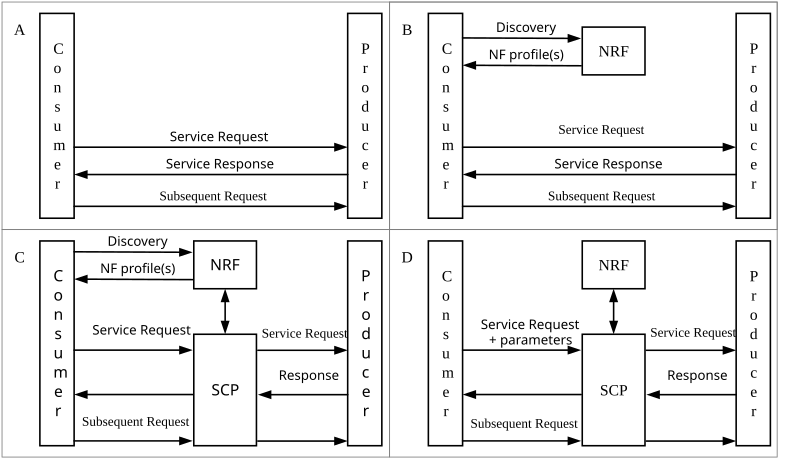

# Annex E (informative): Communication models for NF/NF services interaction

## E.1 General

This annex provides a high level description of the different communication models that NF and NF services can use to interact which each other. Table E.1-1 summarizes the communication models, their usage and how they relate to the usage of an SCP.

Table E.1-1: Communication models for NF/NF services interaction summary

| Communication between consumer and producer | Service discovery and request routing                                                                                               | Communication model |
|---------------------------------------------|-------------------------------------------------------------------------------------------------------------------------------------|---------------------|
| Direct communication                        | No NRF or SCP; direct routing                                                                                                       | A                   |
|                                             | Discovery using NRF services; no SCP; direct routing                                                                                | B                   |
| Indirect communication                      | Discovery using NRF services; selection for specific instance from the Set can be delegated to SCP. Routing via SCP                 | C                   |
|                                             | Discovery and associated selection delegated to an SCP using discovery and selection parameters in service request; routing via SCP | D                   |

**Model A - Direct communication without NRF interaction:** Neither NRF nor SCP are used. Consumers are configured with producers' "NF profiles" and directly communicate with a producer of their choice.

**Model B - Direct communication with NRF interaction:** Consumers do discovery by querying the NRF. Based on the discovery result, the consumer does the selection. The consumer sends the request to the selected producer.

**Model C - Indirect communication without delegated discovery:** Consumers do discovery by querying the NRF. Based on discovery result, the consumer does the selection of an NF Set or a specific NF instance of NF set. The consumer sends the request to the SCP containing the address of the selected service producer pointing to a NF service instance or a set of NF service instances. In the latter case, the SCP selects an NF Service instance. If possible, the SCP interacts with NRF to get selection parameters such as location, capacity, etc. The SCP routes the request to the selected NF service producer instance.

**Model D - Indirect communication with delegated discovery:** Consumers do not do any discovery or selection. The consumer adds any necessary discovery and selection parameters required to find a suitable producer to the service request. The SCP uses the request address and the discovery and selection parameters in the request message to route the request to a suitable producer instance. The SCP can perform discovery with an NRF and obtain a discovery result.

Figure E.1-1 depicts the different communication models.

Figure E.1-1: Communication models for NF/NF services interaction
