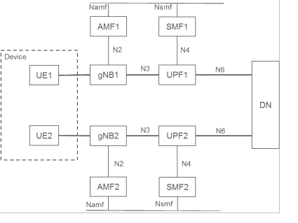
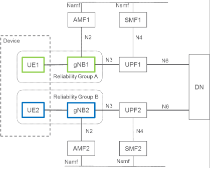

# Annex F (informative): Redundant user plane paths based on multiple UEs per device

This clause describes an approach to realize multiple user plane paths in the system based on a device having multiple UEs and specific network deployments.

The approach assumes a RAN deployment where redundant coverage by multiple gNBs (in the case of NR) is generally available. Upper layer protocols, such as the IEEE 802.1 TSN (Time Sensitive Networking), can make use of the multiple user plane paths.

The UEs belonging to the same terminal device request the establishment of PDU Sessions that use independent RAN and CN network resources using the mechanisms outlined below.

This deployment option has a number of preconditions:

\- The redundancy framework uses separate gNBs to achieve user plane redundancy over the 3GPP system. It is however up to operator deployment and configuration whether separate gNBs are available and used. If separate gNBs are not available for a device, the redundancy framework may still be applied to provide user plane redundancy in the rest of the network as well as between the device and the gNB using multiple UEs.

\- Terminal devices integrate multiple UEs which can connect to different gNBs independently.

\- RAN coverage is redundant in the target area: it is possible to connect to multiple gNBs from the same location. To ensure that the two UEs connect to different gNBs, the gNBs need to operate such that the selection of gNBs can be distinct from each other (e.g. gNB frequency allocation allows the UE to connect to multiple gNBs).

\- The core network UPF deployment is aligned with RAN deployment and supports redundant user plane paths.

\- The underlying transport topology is aligned with the RAN and UPF deployment and supports redundant user plane paths.

\- The physical network topology and geographical distribution of functions also supports the redundant user plane paths to the extent deemed necessary by the operator.

\- The operation of the redundant user plane paths is made sufficiently independent, to the extent deemed necessary by the operator, e.g. independent power supplies.

Figure F-1 illustrates the architecture view. UE1 and UE2 are connected to gNB1 and gNB2, respectively and UE1 sets up a PDU Session via gNB1 to UPF1, while UE2 sets up a PDU Session via gNB2 to UPF2. UPF1 and UPF2 connect to the same Data Network (DN), but the traffic via UPF1 and UPF2 might be routed via different user plane nodes within the DN. UPF1 and UPF2 are controlled by SMF1 and SMF2, respectively.

Figure F-1: Architecture with redundancy based on multiple UEs in the device

The approach comprises the following main components shown as example using NR in figure F-2.

\- **gNB selection:** The selection of different gNBs for the UEs in the same device is realized by the concept of UE Reliability Groups for the UEs and also for the cells of gNBs. By grouping the UEs in the device and cells of gNBs in the network into more than one reliability group and preferably selecting cells in the same reliability group as the UE, it is ensured that UEs in the same device can be assigned different gNBs for redundancy as illustrated in Figure F-2, where UE1 and the cells of gNB1 belong to reliability group A and UE2 and the cells of gNB2 belong to reliability group B.

Figure F-2: Reliability group-based redundancy concept in RAN

For determining the reliability grouping of a UE, one of the following methods or a combination of them can be used:

\- It could be configured explicitly to the UE and sent in a Registration Request message to the network using an existing parameter (such as an S-NSSAI in the Requested NSSAI where the SST is URLLC; the Reliability Group can be decided by the SD part).

\- It could also be derived from existing system parameters (e.g. SUPI, PEI, S-NSSAI, RFSP) based on operator configuration.

The Reliability Group of each UE is represented via existing parameters and sent from the AMF to the RAN when the RAN context is established, so each gNB has knowledge about the reliability group of the connected UEs.

NOTE: An example realisation can be as follows: the UE's Allowed NSSAI can be used as input to select the RFSP index value for the UE. The RAN node uses the RFSP for RRM purposes and can based on local configuration determine the UE's Reliability Group based on the S-NSSAI in Allowed NSSAI and/or S-NSSAI for the PDU Session(s).

The reliability group of the RAN (cells of gNBs) entities are pre-configured by the O&M system in RAN. It is possible for gNBs to learn the reliability group neighbouring cells as the Xn connectivity is set up, or the reliability group of neighbouring cells are also configured into the gNBs.

In the case of connected mode mobility, the serving gNB prioritizes candidate target cells that belong to different reliability group than the UE. It follows that normally the UE is handed over only to cells in the same reliability group. If cells in the same reliability group are not available (UE is out of the coverage of cells of its own reliability group or link quality is below a given threshold) the UE may be handed over to a cell in another reliability group as well.

If the UE connects to a cell whose reliability group is different from the UE's reliability group, the gNB initiates a handover to a cell in the appropriate reliability group whenever such a suitable cell is available.

In the case of an Idle UE, it is possible to use the existing cell (re-)selection priority mechanism, with a priori UE config using dedicated signalling (in the RRCConnectionRelease message during transition from connected to idle mode) to configure the UE to reselect the cells of the appropriate reliability group for camping in deployments where the cell reliability groups use different sets of frequencies.

\- **UPF selection.** UPF selection mechanisms as described in clause 6.3.3 can be used to select different UPFs for the UEs within the device. The selection may be based either on UE configuration or network configuration of different DNNs leading to the same DN, or different slices for the two UEs. It is possible to use the UE's Reliability Group, described above for gNB selection, as an input to the UPF selection. The proper operator configuration of the UPF selection can ensure that the path of the PDU Sessions of UE1 and UE2 are independent.

\- **Control plane.** The approach can optionally apply different control plane entities for the individual UEs within the device. This may be achieved by using:

\- different DNNs for the individual UEs within the device to select different SMFs,

\- or applying different slices for the individual UEs within the device either based on UE configuration or network subscription, to select different AMFs and/or SMFs.
