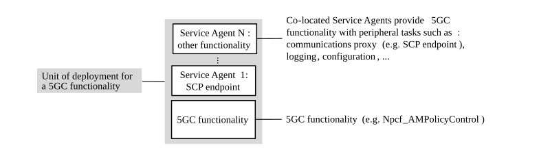
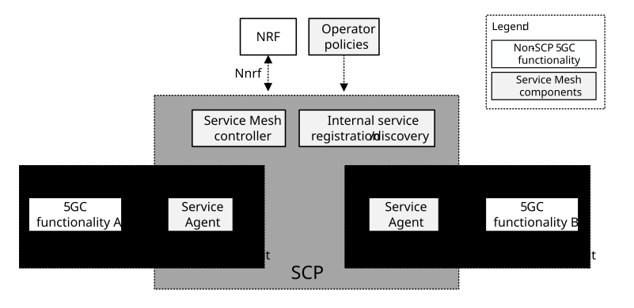
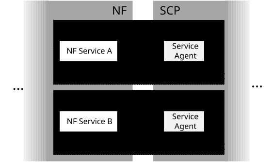
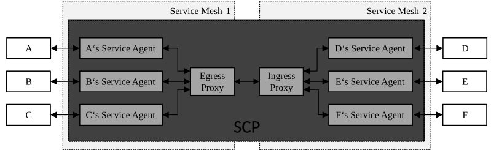
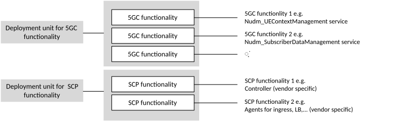
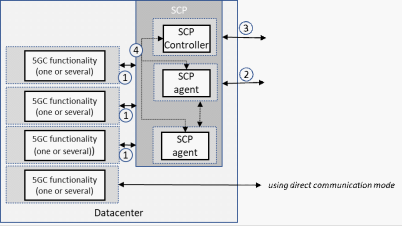
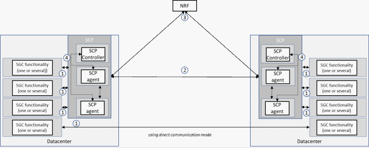
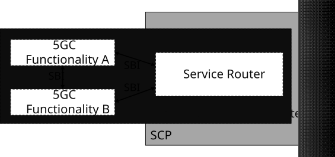
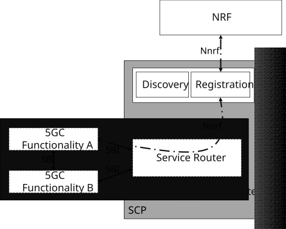
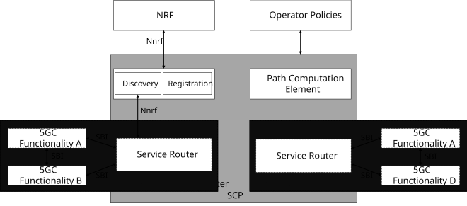

# Annex G (informative): SCP Deployment Examples

## G.1 General

This Annex provides deployment examples for the SCP but is not meant to be an exhaustive list of deployment options for the SCP. The first example G.1 is based on an SCP implement using (network wide) service mesh technology, while the second example builds on SCP and 5GC functions as independent deployment units.

## G.2 An SCP based on service mesh

### G.2.1 Introduction

This clause describes an SCP deployment based on a distributed model in which SCP endpoints are co-located with 5GC functionality (e.g. an NF, an NF Service, a subset thereof such as a microservice implementing part of an NF/NF service or a superset thereof such as a group of NFs, NF Services or microservices). This example makes no assumptions as to the internal composition of each 5GC functionality (e.g. whether they are internally composed of multiple elements or whether such internal elements communicate with means other than the service mesh depicted in this example).

In this deployment example, Service Agent(s) implementing necessary peripheral tasks (e.g. an SCP endpoint) are co-located with 5GC functionality, as depicted in Figure G.2.1-1. In this example, Service Agents and 5GC functionality, although co-located, are separate components.

Figure G.2.1-1: Deployment unit: 5GC functionality and co-located Service Agent(s) implementing peripheral tasks

In this deployment example, an SCP Service Agent, i.e. a service communication proxy, is co-located in the same deployment unit with 5GC functionality and provides each deployed unit (e.g. a container-based VNFC) with indirect communication and delegated discovery.

Figure G.2.1-2 shows an overview of this deployment scenario. For SBI-based interactions with other 5GC functionalities, a consumer (5GC functionality A) communicates through its Service Agent via SBI. Its Service Agent selects a target producer based on the request and routes the request to the producer's (5GC functionality B) Service Agent. What routing and selection policies a Service Agent applies for a given request is determined by routing and selection policies pushed by the service mesh controller. Information required by the service mesh controller is pushed by the Service Agents to the service mesh controller.

In this deployment, the SCP manages registration and discovery for communication within the service mesh and it interacts with an external NRF for service exposure and communication across service mesh boundaries. Operator-defined policies are additionally employed to generate the routing and selection policies to be used by the Service Agents.

This example depicts only SBI-based communication via a service mesh, but it does not preclude the simultaneous use of the service mesh for protocols other than SBI supported by the service mesh or that the depicted 5GC functionality additionally communicates via other means.

Figure G.2.1-2: SCP Service mesh co-location with 5GC functionality

From a 3GPP perspective, in this deployment example a deployment unit thus contains NF functionality and SCP functionality. Figure G.2.1-3 depicts the boundary between both 3GPP entities. In the depicted example, two NF Services part of the same NF and each exposing an SBI interface are deployed each in a container-based VNFC. A co-located Service Agent provides each NF Service with indirect communication and delegated discovery.

Figure G.2.1-3: Detail of the NF-SCP boundary

### G.2.2 Communication across service mesh boundaries

It is a deployment where a single service mesh covers all functionality within a given deployment or not. In cases of communication across the boundaries of a service mesh, the service mesh routing the outbound message knows neither whether the selected producer is in a service mesh nor the internal topology of the potential service mesh where the producer resides.

In such a deployment, as shown in Figure G.2.2.-1, after producer selection is performed, routing policies on the outgoing service mesh are only aware of the next hop.

Given a request sent by A, A's Service Agent will perform producer selection based on the received request. If the selected producer endpoint (e.g. D) is determined to be outside of Service Mesh 1, A's Service Agent routes the request to the Egress Proxy. For a successful routing, the Egress Proxy needs to be able to determine the next hop of the request. In this case, this is the Ingress Proxy of Service Mesh 2. The Ingress Proxy of Service Mesh 2 is, based on the information in the received request and its routing policies, able to determine the route for the request. Subsequently, D receives the request. No topology information needs to be exchanged between Service Mesh 1 and Service Mesh 2 besides a general routing rule towards Service Mesh 2 (e.g. a FQDN prefix) and an Ingress Proxy destination for requests targeting endpoints in Service Mesh 2.

Figure G.2.2-1: Message routing across service mesh boundaries

## G.3 An SCP based on independent deployment units

This clause shows an overview of SCP deployment based on the 5GC functionality and SCP being deployed in independent deployment units.

Figure G.3-1: Independent deployment units for SCP and 5GC functionality

The SCP deployment unit can internally make use of microservices, however these microservices are up to vendors implementation and can be for example SCP agents and SCP controller as used in this example. The SCP agents implement the http intermediaries between service consumers and service producers. The SCP agents are controlled by the SCP controller. Communication between SCP controller and SCP agents is via SCP internal interface (4) and up to vendors implementation.

In this model it is a deployment choice to co-locate SCP and other 5GC functions or not. The SCP interfaces (1), (2) and (3) are service based interfaces. SCP itself is not a service producer itself, however acting as http proxy it registers services on behave of the producers in NRF. Interface (2) represents same services as (1) however using SCP proxy addresses. Interface (3) is interfacing NRF e.g. for service registration on behalf of the 5GC functions or service discovery.

Figure G.3-2: 5GC functionality and SCP co-location choices

For SBI-based interactions with other 5GC functions, a consumer communicates through a SCP agent via SBI (1). SCP agent selects a target based on the request and routes the request to the target SCP agent (2). What routing and selection policies each SCP agent applies for a given request is determined by routing and selection policies determined by the SCP controller using for example information provided via NRF (3) or locally configured in the SCP controller. The routing and selection information is provided by the SCP controller to the SCP agents via SCP internal interface (4). Direct communication can coexist in the same deployment based on 3GPP specified mechanisms.

Figure G.3-3: Overview of SCP deployment

## G.4 An SCP deployment example based on name-based routing

### G.4.0 General Information

This clause provides a deployment example for the SCP which is based on a name-based routing mechanism that provides IP over ICN capabilities such as those described in Xylomenos, George, et al. \[G1\].

The scenario describes an SCP offering based on an SBA-platform to interconnect 5GC Services (or a subset of the respective services). The Name-based Routing mechanism, described in this deployment example, is realized through a Path Computation Element which is the core part of the SCP. The 5GC Services are running as microservices on cloud/deployment units (clusters). A Service Router is the communication node (access node/gateway) between the SCP and the 5GC Services and resides as a single unit within a Service Deployment Cluster. The Service Router acts as communication proxy and it is responsible for mapping IP based messages onto ICN publication and subscriptions. The Service Router serves multiple 5GC Service Endpoints within that cluster. For direct communication the Service Router is not used.

5GC Functionalities communicate with the Service Router using standardized 3GPP SBIs.

The Functionalities within the Service Deployment Cluster are containerized Service Functions.

Depicted in Figure G.4-1, the Service Router act as SCP termination point and offer the SBI to the respective 5GC Service Functionalities. In this example, Service Routers and 5GC functionality, although co-located, are separate components within the Service Deployment Cluster. Multiple Functionalities can exist within the Service Deployment Cluster, all served by the respective Service Router when needed to communicate to other Service Functionalities within different clusters.

Figure G.4-1: Deployment unit: 5GC functionality and co-located Service Agent(s) implementing peripheral tasks

In Figure G.4-1, the two depicted 5GC Service Functionalities (realized as Network Function Service Instances) may communicate in two ways. However, before the communication can be established between two 5GC Functionalities, Service Registration and Service Discovery need to take place, as described in Figure G.4.1-1. Service Registration and Service Discovery are provided in a standardized manner using 3GPP Service Based Interfaces.

### G.4.1 Service Registration and Service Discovery

Service registration can be done in several ways. One option is that ready 5GC Service Functions may register themselves with their service profile via the Nnrf interface. The registration request is forwarded to the internal Registry as well as forwarded to the operator's NRF. The internal registration is used to store the address to identifier relationship and the Service Deployment Cluster location. The external registration (NRF) is used to expose the Service Functionality to Services outside the depicted SCP.

Service discovery entails Function A requesting a resolvable identifier for Functionality B. This resolve request is received by the Service Router which performs the task with the help of the SCP. After the resolve is done, the 5GC Functionalities may communicate either directly without any further interaction through the SCP, when the targeted address is resolved within the same Service Deployment Cluster; or via the Service Router when the Functionality resides outside of the originator's Service Deployment Cluster. The Service Router then acts as gateway towards the underlying SCP platform.

Figure G.4.1-1: Registering 5GC Functionalities in the SCP

### G.4.2 Overview of Deployment Scenario

Figure G.4.2-1 shows an overview of this deployment scenario. For SBI-based interactions with other 5GC functionalities, a consumer entity (e.g. 5GC functionality B in the cluster on the left side) communicates through the cluster's Service Router with other entities in other clusters (e.g. 5GC Functionality D in the cluster on the right side). The target selection is performed through the platform's Discovery Service. From the client's perspective, the Service Router is the first and only contact point to the SCP. The platform resolves the requested Service identifier and aligns the results with the platform's policies. The Path Computation Element calculates a path between the consumer and the producer (e.g. the shortest path between the nodes).

Figure G.4.2-1: (NbR-) SCP interconnects multiple deployment clusters with external NRF

### G.4.3 References

\[G1\] Xylomenos, George, et al.: "IP over ICN goes live", 2018 European Conference on Networks and Communications (EuCNC). IEEE, 2018.
