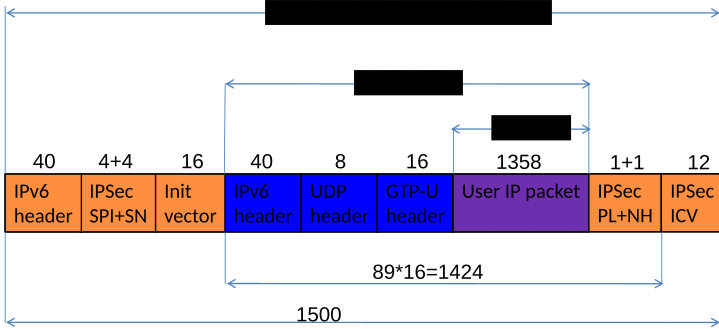

# Annex J (informative): Link MTU considerations

According to clause 5.6.10.4 networks can provide link MTU size for UEs. A purpose of the link MTU size provisioning is to limit the size of the packets sent by the UE to avoid packet fragmentation in the backbone network between the UE and the UPF acting as PSA (and/or across the N6 reference point). Fragmentation within the backbone network creates a significant overhead. Therefore operators might desire to avoid it. This Annex presents an overhead calculation that can be used by operators to set the link MTU size provided by the network. A UE might not employ the provided link MTU size, e.g. when the MT and TE are separated, as discussed in clause 5.6.10.4. Therefore, providing an MTU size does not guarantee that there will be no packets larger than the provided value. However, if UEs follow the provided link MTU value operators will benefit from reduced transmission overhead within backbone networks.

One of the worst-case scenarios is when GTP packets, e.g. between a NG-RAN node and the 5GC, are transferred over IPSec tunnel in an IPv6 deployment. In that case the user packet first encapsulated in a GTP tunnel which results in the following overhead:

\- IPv6 header, which is 40 octets;

\- UDP overhead, which is 8 octets;

\- Extended GTP-U header, which is 16 octets.

NOTE 1: The sending of a Reflective QoS Indicator within a GTP-U header extension, or the use of Long PDCP PDU numbers at handover , or the use of some other features specified in Release 17 or later Releases will further increase the GTP-U header size (see TS 29.281 \[75\] and TS 38.415 \[116\]).

NOTE 2: For UEs that start their PDN connection in EPS and can be subject to mobility to 5GS, the operator can use this smaller 5GS link MTU in EPS, rather than the EPS link MTU suggested by Annex C of TS 23.060 \[56\].

In this scenario the GTP packet then further encapsulated into an IPSec tunnel. The actual IPSec tunnel overhead depends on the used encryption and integrity protection algorithms. TS 33.210 \[115\] mandates the support of AES-GMAC with a key length of 128 bits and the use of HMAC_SHA-1 for integrity protection. Therefore, the overhead with those algorithms is calculated as:

\- IPv6 header, which is 40 octets;

\- IPSec Security Parameter Index and Sequence Number overhead, which is 4+4 octets;

\- Initialization Vector for the encryption algorithm, which is 16 octets;

\- Padding to make the size of the encrypted payload a multiple of 16;

\- Padding Length and Next Header octets (2 octets);

\- Integrity Check Value, which is 12 octets.

In order to make the user packet size as large as possible a padding of 0 octet is assumed. With this zero padding assumption the total overhead is 142 octets, which results a maximum user packet size of transport MTU minus 142 octets. Note that in the case of transport MTU=1500, this user packet size will result in a 1424 octets payload length to be ciphered, which is a multiple of 16, thus the assumption that no padding is needed is correct (see Figure J.1). Similar calculations can be done for networks with transport that supports larger MTU sizes.

Figure J-1: Overhead calculation for transport MTU=1500 octet

The link MTU value that can prevent fragmentation in the backbone network between the UE and the UPF acting as PSA depends on the actual deployment. Based on the above calculation a link MTU value of 1358 is small enough in most of the network deployments. However for network deployments where the transport uniformly supports for example ethernet jumbo frames, transport MTU\<=9216 octets can provide a much larger UE MTU and hence more efficient transfer of user data. One example of when it can be ensured that all links support larger packet sizes, is when the UE uses a specific Network Slice with a limited coverage area.

Note that using a link MTU value smaller than necessary would decrease the efficiency in the network. Moreover, a UE might also apply some tunnelling (e.g. VPN). It is desirable to use a link MTU size that assures at least MTU minus 220 octets within the UE tunnel to avoid the fragmentation of the user packets within the tunnel applied in the UE. In the case transport MTU is 1500 octets, this results a link MTU of 1280 octets (for the transport), which is the minimum MTU size in the case of IPv6.

The above methodology can be modified for calculation of the UE's link MTU when a UPF has MTU limits on the N6 reference point and is offering a PDU Session with Ethernet or Unstructured PDU Session type between the UPF and the UE.
