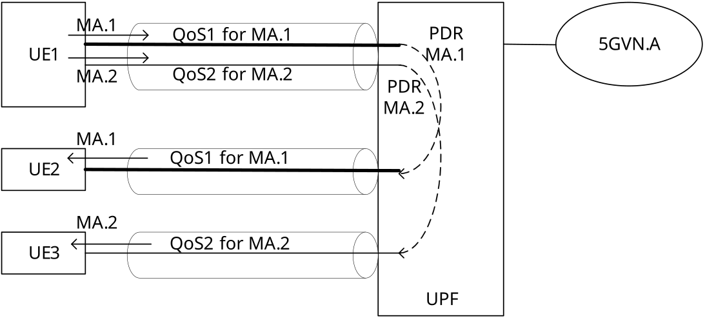
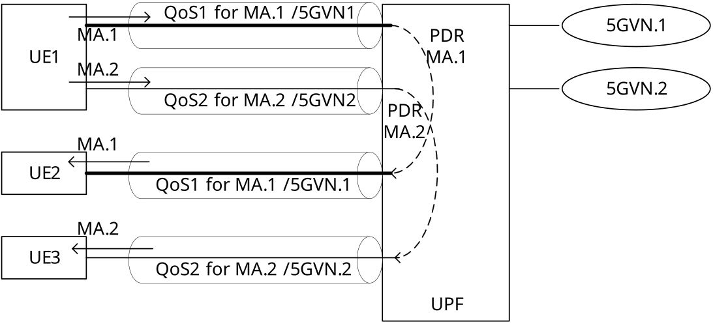
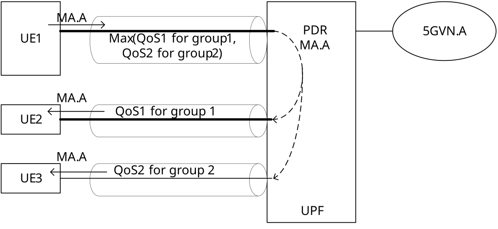

# Annex O (informative): Allowing UE to simultaneously send data to different groups with different QoS policy

This Annex provides deployment examples allowing a UE to simultaneously send data to different groups (i.e. IP or Ethernet multicast groups) with different QoS policy as in clause 6.13.2 of TS 22.261 \[2\].

## O.1 A PDU Session with multiple QoS Flows for different groups

In case the UE Application sends individual copies of data to different receivers, 5GS allows UE to simultaneously send data to different groups with different QoS policy via the following:

\- If different groups (IP or Ethernet multicast groups) are associated to the same DNN and S-NSSAI combination used for a 5G VN group, then different QoS Flows of a single PDU Session may be used to transfer the data copy sent to different groups.

Figure O.1-1 shows a PDU Session with multiple QoS Flows for different groups as an example.

\- Group1 (G1): a group of multicast address 1 with members UE1 and UE2 is associated with 5GVN.A group. The QoS for multicast address 1 is set to QoS1. For G1, its members, multicast address 1 and corresponding QoS1 are provisioned as part of the AF requested QoS information as described in clause 6.1.3.28 of TS 23.503 \[45\].

\- Group2 (G2): a group of multicast address 2 with members UE1 and UE3 is associated with 5GVN.A group. The QoS for multicast address 2 is set to QoS2. For G2, its members, multicast address 2 and corresponding QoS2 are provisioned as part of the AF requested QoS information as described in clause 6.1.3.28 of TS 23.503 \[45\].

\- During establishment or modification procedure for PDU Sessions targeting to DNN and S-NSSAI for 5GVN.A group, or upon detection of the UE joining a multicast address, the SMF and PCF can jointly use the AF requested QoS information for 5GVN.A group to set up the QoS flow in respective member's PDU Session. As a result:

\- There will have two QoS flows in UE1's PDU Session targeting to DNN and S-NSSAI for 5GVN.A group, one QoS flow (QoS Flow 1.1) is used to carry data destined to multicast address 1 with QoS1, the other one (QoS Flow 1.2) is used to carry data destined to multicast address 2 with QoS2.

\- There will have one QoS flow (QoS Flow 2) in UE2's PDU Session targeting to DNN and S-NSSAI for 5GVN.A group, this QoS flow is used to carry data destined to multicast address 1 with QoS1.

\- There will have one QoS flow (QoS Flow 3) in UE3's PDU Session targeting to DNN and S-NSSAI for 5GVN.A group, this QoS flow is used to carry data destined to multicast address 2 with QoS2.

\- UE1 sends data with multicast address 1 (MA.1) to a UPF via QoS Flow 1.1 of UE1's PDU session for 5GVN.A group. The UPF forwards the packet to UE2 as it is a member of multicast group represented by multicast address 1 via QoS Flow 2 of UE2's PDU Session for 5GVN.A group.

\- UE1 also sends the same data with multicast address 2 (MA.2) to the UPF via QoS Flow 1.2 of the same PDU Session for 5GVN.A group. The UPF forwards the packet to UE3 as it is a member of multicast group represented by multicast address 2 via QoS Flow 3 of UE3'sPDU Session for 5GVN.A group.

Figure O.1-1: A PDU Session with multiple QoS Flows for different groups

## O.2 Multiple PDU Sessions for different groups

In the case that the UE Application sends individual copies of data to different receivers, 5GS allows UE to simultaneously send data to different groups with different QoS policy via the following:

\- If different groups (IP or Ethernet multicast groups) are associated to different DNN and S-NSSAI combinations used for different 5G VN groups, then different PDU Sessions are used to transfer the data copy sent to different groups. As a result, the UE sends the same data to different groups using the QoS Flow of the respective PDU Sessions.

Figure O.2-1 shows multiple PDU sessions used for different groups as an example.

\- Group1 (G1): a group of multicast address 1 with members UE1 and UE2 is associated with 5GVN.1 group. The QoS for multicast address 1 is set to QoS1. For G1, its members, multicast address 1 and corresponding QoS1 are provisioned as part of the AF requested QoS information as described in clause 6.1.3.28 of TS 23.503 \[45\].

\- Group2 (G2): a group of multicast address 2 with members UE1 and UE3 is associated with 5GVN.2 group. The QoS for multicast address 2 is set to QoS2. For G2, its members, multicast address 2 and corresponding QoS2 are provisioned as part of the AF requested QoS information as described in clause 6.1.3.28 of TS 23.503 \[45\].

\- During establishment or modification procedure for PDU Sessions targeting to DNN and S-NSSAI for 5GVN.1 group, or upon detection of the UE joining a multicast address, the SMF and PCF can jointly use the AF requested QoS information for 5GVN.1 group to set up the QoS flow in respective member's PDU Session. During establishment or modification procedure for PDU Sessions targeting to DNN and S-NSSAI for 5GVN.2 group, or upon detection of the UE joining a multicast address, the SMF and PCF can jointly use the AF requested QoS information for 5GVN.2 group to set up the QoS flow in respective member's PDU Session. As a result:

\- There will have two PDU Sessions for UE1: one PDU Session is targeting to DNN and S-NSSAI for 5GVN.1 group and there will have one QoS flow setup to carry data destined to multicast address 1 with QoS1; the other PDU Session is targeting to DNN and S-NSSAI for 5GVN.2 group and there will have one QoS flow setup to carry data destined to multicast address 2 with QoS2.

\- There will have one PDU Session for UE2: this PDU Session is targeting to DNN and S-NSSAI for 5GVN.1 group and there will have one QoS flow setup to carry data destined to multicast address 1 with QoS1.

\- There will have one PDU Session for UE3: this PDU Session is targeting to DNN and S-NSSAI for 5GVN.2 group and there will have one QoS flow setup to carry data destined to multicast address 2 with QoS2.

\- UE1 sends data with multicast address 1 (MA.1) to a UPF via the QoS Flow of UE1's PDU session for 5GVN.1 group. The UPF forwards the packet to UE2 as it is a member of multicast group represented by multicast address 1 via the QoS Flow of UE2's PDU Session for 5GVN.1 group.

\- UE1 also sends the same data with multicast address 2 (MA.2) to the UPF via the QoS Flow of UE1's PDU Session for 5GVN.2 group. The UPF forwards the packet to UE3 as it is a member of multicast group represented by multicast address 2 via the QoS Flow of UE3's PDU Session for 5GVN.2 group.

Figure O.2-1: Multiple PDU Sessions for different groups

## O.3 A PDU Session targeting a predefined group formed of multiple sub-groups

In the case when the UE Application uses IP or Ethernet multicast, 5GS allows UE to simultaneously send data to different groups with different QoS policy via the following:

\- UE establishes a PDU Session to a DNN and S-NSSAI, which can be a special DNN and S-NSSAI configured by the operator for e.g. an electrical system. The DNN and S-NSSAI is associated with a 5GVN group, which is defined as a combination of multiple sub-groups (IP or Ethernet multicast groups).

\- The 5G VN group and each sub-group is associated with a separate multicast address and QoS, the QoS for a 5G VN group is set to refer to the QoS of the sub-group that has the strictest QoS requirements among all the sub-group groups. When a UE belongs to multiple groups, the QoS provisioning for the groups needs to be done in the order that enables the the strictest QoS profile to be selected for the UE. For each group, its members, multicast address, corresponding QoS information, associated DNN and S-NSSAI are provisioned as part of the AF requested QoS information as described in clause 6.1.3.28 of TS 23.503 \[45\].

\- The application sends traffic to a multicast address depending on which group(s) it wants to target. For example, an application sends traffic to the multicast address associated with the 5G VN group. This allows an application to send a single packet reaching multiple destinations and also multiple groups.

Figure O.3-1 shows a PDU Session targeting a predefined group formed of multiple sub-groups as an example.

\- Group1 (G1): a group of multicast address 1 with members UE1 and UE2 is associated with / mapped to 5GVN.1 group. The QoS for the group is set to QoS1. For G1, its members, multicast address 1, corresponding QoS1, DNN and S-NSSAI are provisioned as part of the AF requested QoS information for 5GVN.1 group as described in clause 6.1.3.28 of TS 23.503 \[45\].

\- Group2 (G2): a group of multicast address 2 with members UE1 and UE3 is associated with / mapped to 5GVN.2 group. The QoS for the group is set to QoS2. For G2, its members, multicast address 2 and corresponding QoS2, DNN and S-NSSAI are provisioned as part of the AF requested QoS information for 5GVN.2 group as described in clause 6.1.3.28 of TS 23.503 \[45\].

\- GroupA (GA): a group of multicast address A with members UE1, UE2 and UE3 is associated with 5GVN.A group. G1 and G2 are combined to form the GA. The QoS for the 5GVN.A group is indicated to refer to the strictest QoS among other groups the UE belongs to. For GA, its members, multicast address A and corresponding QoS indication, DNN and S-NSSAI are provisioned as part of the AF requested QoS information for 5GVN.A group as described in clause 6.1.3.28 of TS 23.503 \[45\].

\- During establishment or modification procedure for PDU Sessions targeting to the DNN and S-NSSAI, or upon detection of the UE joining a multicast address, the SMF and PCF can jointly use the AF requested QoS information to set up the QoS flow in respective member's PDU Session. As a result:

\- There will have two QoS flows in UE1's PDU Session targeting to DNN and S-NSSAI, one QoS flow is used to carry data destined to multicast address 1 with QoS1, the other one is used to carry data destined to multicast address 2 with QoS2. With the QoS indication for GA, the higher QoS between QoS1 of G1 and QoS2 of G2 is selected for UE1 since the UE1 belongs to both the G1 and G2, then the QoS flow with higher QoS requirements (QoS Flow 1) is also used to carry data destined to multicast address A.

\- There will have one QoS flow in UE2's PDU Session targeting to DNN and S-NSSAI, this QoS flow (QoS Flow 2) is used to carry data destined to multicast address 1 with QoS1. With the QoS indication for GA, the QoS1 of G1 is selected for UE1 since the UE2 only belongs to G1, then the same QoS flow is also used to carry data destined to multicast address A.

\- There will have one QoS flow in UE3's PDU Session targeting to DNN and S-NSSAI, this QoS flow (QoS Flow 3) is used to carry data destined to multicast address 2 with QoS2. With the QoS indication for GA, the QoS2 of G2 is selected for UE3 since the UE3 only belongs to G2, then the same QoS flow is also used to carry data destined to multicast address A.

\- UE1 sends data with multicast address A (MA.A) to a UPF via QoS Flow 1 of UE1's PDU Session for 5GVN.A group. The UPF forwards the packet to UE2 as it is a member of multicast group represented by multicast address A (MA.A) via the QoS Flow 2 of UE2's PDU Session and forwards the packet to UE3 as it is a member of the multicast group represented by multicast address A (MA.A) via the QoS Flow 3 of UE3's PDU Session.

Figure O.3-1: A PDU Session targeting a predefined group formed of multiple sub-groups
