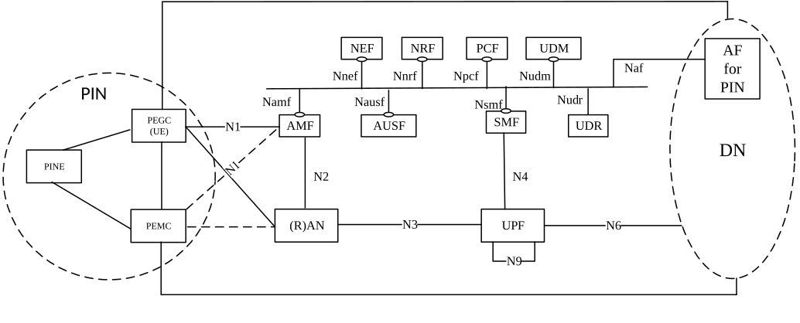
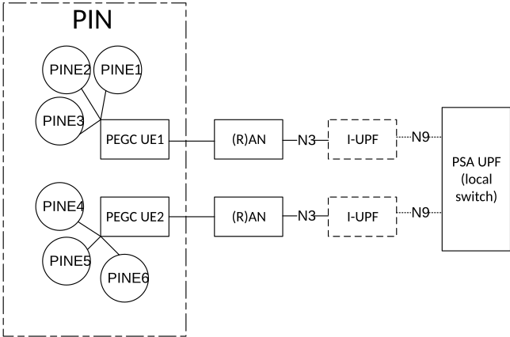

# Annex P (informative): Personal IoT Networks

## P.1 PIN Reference Architecture

Figure P.1-1 shows the logical Personal IoT Network (PIN) reference architecture.

Figure P.1-1: PIN reference architecture

A PIN consists of one or more devices providing gateway/routing functionality known as the PEGC to route the traffic towards the 5G network and one or more devices providing PIN management functionality known as the PEMC to manage the PIN; and device(s) enabling communication within the PIN called the PINE. A PINE and PEMC can be a non-3GPP device.

The PIN can also have an AF for PIN (see TS 23.542 \[181\]). The AF for PIN can be deployed by mobile operator or by an authorized third party. When the AF for PIN is deployed by third party, the interworking with 5GC is performed via the NEF.

With PIN-DN communication, the PEMC and PEGC communicates with the AF for PIN at the application layer over the user plane. The PEGC and PEMC can communicate with each other via PIN direct communication using 3GPP access (e.g. PC5) or non-3GPP access (e.g. WiFi, BT) or via PIN indirect communication using a PDU Session in the 5GS.

## P.2 Session management and traffic routing for PIN

The general session management principles as described in clause 5.6, the QoS model as defined in clause 5.7 and the User Plane management for 5GS as defined in clause 5.8 are applicable to PIN-DN communication and PIN indirect communication.

If a PIN has multiple PEGCs, 5G VN group communication mechanisms can be used for PIN indirect communication. In this case a dedicated SMF set is used for managing the PIN related PDU Sessions from all the PEGCs of that PIN and the PDU session management principles for 5G VN-LAN-type services as specified in clause 5.29.3 are applicable. The user plane handling for 5G LAN-type services as specified in 5.29.4 are applicable with following differences:

\- For PIN indirect communication N19-based traffic forwarding is not used i.e. the PIN traffic is forwarded using:

\- N6-based traffic forwarding method, where the UL/DL traffic for the PIN communication is forwarded to/from the DN;

\- local switching as depicted in Figure P.2-1 below, following the principles of local switching of traffic for 5G VN LAN-type service.

Figure P.2-1: Local-switch based user plane architecture for PIN

NOTE: Figure P.2-1 does not show traffic from a PEMC.

The SMF configures the UPF(s) to apply N6-based traffic forwarding to route traffic between PDU Sessions of different PEGCs of a PIN as specified in clause 5.8.2.13. The SMF can apply local switching as specified in clause 5.8.2.13 in order to enable UPF locally forward uplink stream from one PDU session of one PEGC of a PIN as downlink stream of PDU session of one or more PEGC(s) of the same PIN. For local switching of PIN traffic between PIN related PDU sessions from different PEGCs of a single PIN, based on the (DNN, S-NSSAI) combination that is used for the PDU session related to PIN, the SMF provides a Network Instance to the UPF in FAR and/or PDR via N4 Session Establishment/Modification procedures.
