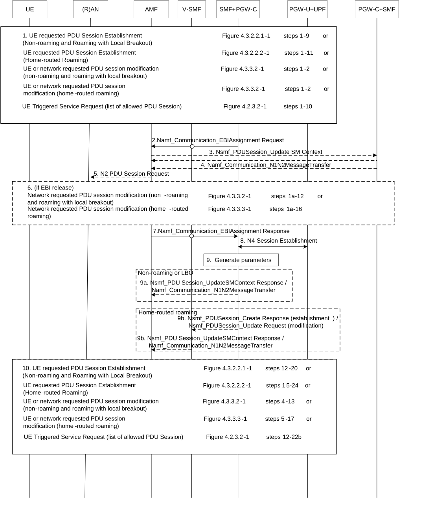
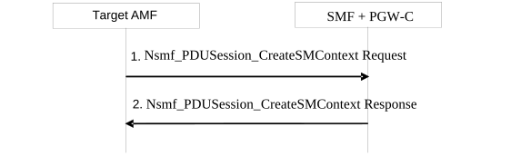

# 4.11.1.4 Procedures for EPS bearer ID allocation

## 4.11.1.4.1 EPS bearer ID allocation

Following procedures are updated to allocate EPS bearer ID(s) towards EPS bearer(s) mapped from QoS flow(s) and provide the EPS bearer ID(s) to the NG-RAN:

\- UE requested PDU Session Establishment (Non-roaming and Roaming with Local Breakout (clause 4.3.2.2.1) including Request Types "Initial Request", "Existing PDU Session", "Initial emergency request" and "Existing emergency PDU session".

\- UE requested PDU Session Establishment (Home-routed Roaming (clause 4.3.2.2.2) including Request Types "Initial Request" and "Existing PDU Session".

\- UE or network requested PDU Session Modification (non-roaming and roaming with local breakout) (clause 4.3.3.2).

\- UE or network requested PDU Session Modification (home-routed roaming) (clause 4.3.3.3).

\- UE Triggered Service Request (clause 4.2.3.2) to move PDU Session(s) from non-3GPP access to 3GPP access

EBI allocation shall apply to PDU Session via 3GPP access using SSC mode 1 and supporting EPS interworking with N26. EBI allocation shall not apply to PDU Session via 3GPP access supporting EPS interworking without N26 and shall not apply to PDU Session via non-3GPP access supporting EPS interworking. EBI allocation shall also not apply to PDU Session using SSC mode 2 or SSC mode 3.

Figure 4.11.1.4.1-1: Procedures for EPS bearer ID allocation

1\. Procedure as listed in this step is initiated as specified in the relevant clauses of this specification. The relevant steps of the procedure as specified in the figure above are executed.

2\. If the SMF+PGW-C (or H-SMF in the case of home routed case), determines, based on the indication of EPS interworking support with N26 as defined in clauses 4.11.5.2, 4.11.5.3 and 4.11.5.4 and operator policies e.g. User Plane Security Enforcement information, Access Type, that EPS bearer ID(s) needs to be assigned to the QoS flow(s) in the PDU Session, SMF+PGW-C invokes Namf_Communication_EBIAssignment Request (PDU Session ID, ARP list) (via V-SMF Nsmf_PDUSession_Update in the case of home routed case). When V-SMF receives Nsmf_PDUSession_Update request from H-SMF for EPS bearer ID allocation request, V-SMF needs to invoke Namf_Communication_EBIAssignment Request (PDU Session ID, ARP list). If the SMF+PGW-C (or H-SMF in the case of home-routed roaming) serves multiple PDU sessions for the same DNN but different S-NSSAIs for a UE, then the SMF shall only request EBIs for PDU sessions served by a common UPF (PSA). If different UPF (PSA) are serving those PDU sessions, then the SMF chooses one of the UPF (PSA) for this determination based on operator policy. When the PDU session is established via non-3GPP access, the SMF+PGW-C shall not trigger EBI allocation procedure.

Steps 3 to 6 apply only when AMF needs to revoke EBI previously allocated for an UE in order to serve a new SMF request of EBI for the same UE.

3\. \[Conditional\] If the AMF has no available EBIs, the AMF may revoke an EBI that was assigned to QoS flow(s) based on the ARP(s) and S-NSSAI stored during PDU Session establishment, EBIs information in the UE context and local policies. If an assigned EBI is to be revoked, the AMF takes the ARP pre-emption vulnerability and the ARP priority level into consideration and revokes EBIs with a higher value of the ARP priority level first. The AMF invokes Nsmf_PDUSession_UpdateSMContext (EBI(s) to be revoked) to request the related SMF (called "SMF serving the released resources") to release the mapped EPS QoS parameters corresponding to the EBI to be revoked. The AMF stores the association of the assigned EBI, ARP pair to the corresponding PDU Session ID and SMF address.

4\. The "SMF serving the released resources" that receives the request in step 3 shall evaluate if any of the revoked EBI(s) corresponds to the QoS Flow associated with the default QoS rule. If the revoked EBI corresponds to the QoS Flow associated with the default QoS rule, the SMF shall release the EBI(s) corresponding to all other QoS Flows of the PDU Session and update the AMF of this release by sending Namf_Communication_EBIAssignment Request (PDU Session ID, Released EBI List). Next, the SMF shall invoke Namf_Communication_N1N2Message Transfer (N2 SM information (PDU Session ID, EBI(s) to be revoked), N1 SM container (PDU Session Modification Command (PDU Session ID, EBI(s) to be revoked))) to inform the (R)AN and the UE to remove the mapped EPS QoS parameters corresponding to the EBI(s) to be revoked. In home routed roaming scenario, the H-SMF includes EBI(s) to be revoked to V-SMF to inform V-SMF to remove the mapped EPS bearer context corresponding to the EBI(s) to be revoked.

NOTE 1: The SMF can also decide to remove the QoS flow if it is not acceptable to continue the service when no corresponding EPS QoS parameters can be assigned.

For home routed roaming scenario, the "SMF serving the released resources" sends an N4 Session Modification Request to request the PGW-U+UPF to release N4 Session corresponding to the revoked EBI(s).

In home routed roaming case, the V-SMF starts a VPLMN initiated QoS modification for the PDU Session and the Namf_Communication_N1N2Message Transfer is invoked by the V-SMF based on the corresponding QoS modification message received from H-SMF.

5\. If the UE is in CM-CONNECTED state, the AMF sends N2 PDU Session Resource Modify Request (N2 SM information received from SMF, NAS message (PDU Session ID, N1 SM container (PDU Session Modification Command))) Message to the (R)AN.

If the UE is in CM-IDLE state and an ATC is activated, the AMF updates and stores the UE context based on the Namf_Communication_N1N2MessageTransfer and step 5-6 are skipped. When the UE is reachable, e.g. when the UE enters CM-CONNECTED state, the AMF forwards the N1 message to synchronize the UE context with the UE.

6\. The rest steps of the procedure are executed as specified in the figure above.

7 If the AMF successfully assigns EBI(s), it responds with the assigned EBI(s). Otherwise, it responds with a cause indicating EBI assignment failure. If the PDU Session is associated to an S-NSSAI subject for Network Slice-Specific Authentication and Authorization the AMF should indicate EBI assignment failure.

If a PDU Session from another SMF already exists towards the same DNN, the AMF either rejects the EBI assignment request, or revokes the EBI(s) from the existing PDU Session(s) to the same DNN but different SMFs if the AMF makes the decision based on the operator policy, that the existing PDU Session cannot support EPS interworking N26.

The AMF stores the DNN and SMF+PGW-C in which the PDU Session(s) support EPS interworking to UDM in clause 4.11.1.6.

NOTE 2: The above applies only when the S-NSSAI(s) for the PDU Sessions are different, otherwise the same SMF is selected for PDU Sessions to the same DNN.

8\. The SMF+PGW-C sends an N4 Session Establishment/Modification Request to the PGW-U+UPF.

For home routed roaming scenario, if the EBI is assigned successfully, the SMF+PGW-C prepares the CN Tunnel Info for each EPS bearer. For non roaming and LBO scenario, if the EBI is assigned successfully, the SMF+PGW-C may prepare the CN Tunnel Info for each EPS bearer.

The PGW-U+UPF allocates the PGW-U tunnel info for the EPS bearer and sends it to the SMF+PGW-C. The PGW-U+UPF is ready to receive uplink packets from E-UTRAN.

NOTE 3: In the home routed roaming scenario the SMF+PGW-C prepares the CN Tunnel Info for each EPS bearer and provide it to V-SMF. Thus when the UE move to EPC network, the V-SMF does not need interact with the SMF+PGW-C to get the EPS bearer context(s).

9\. If the SMF+PGW-C receives any EBI(s) from the AMF, it adds the received EBI(s) into the mapped EPS bearer context(s).

In home routed roaming scenario, the SMF+PGW-C generates EPS bearer context which includes per EPS bearer PGW-U tunnel information. In addition, if the default EPS bearer is generated for the corresponding PDN Connection of PDU Session (i.e. during the PDU Session establishment procedure), the SMF+PGW-C generates the PGW-C tunnel information of the PDN connection and include it in UE EPS PDN connection.

9a. \[Conditional\] In non-roaming or LBO scenario, the SMF+PGW-C includes the mapped EPS bearer context(s) and the corresponding QoS Flow(s) to be sent to the UE in the N1 SM container. SMF+PGW-C also indicates the mapping between the QoS Flow(s) and mapped EPS bearer context(s) in the N1 SM container. SMF+PGW-C also includes the mapping between the received EBI(s) and QFI(s) into the N2 SM information to be sent to the NG-RAN. The SMF+PGW-C sends the N1 SM container and N2 SM information to AMF via the Nsmf_PDUSession_UpdateSMContext Response in the case of the PDU Session Modification procedure triggered by UE or AN, or UE Triggered Service Request procedure that results in session transfer from N3GPP to 3GPP, otherwise, via the Namf_Communication_N1N2MessageTransfer.

9b \[Conditional\] In home routed roaming scenario, the SMF+PGW-C sends mapped EPS bearer context(s), the mapping between the received EBI(s) and QFI(s), linked EBI and EPS bearer context(s) to V-SMF via Nsmf_PDUSession_Create Response in the case of PDU Session Establishment, or via Nsmf_PDUSession_Update Request in the case of PDU Session Modification. The V-SMF stores the EPS bearer context(s) and generates N1 SM container and N2 SM information and forwards them to AMF via the Nsmf_PDUSession_UpdateSMContext Response in the case of the PDU Session Modification procedure triggered by UE or AN, or UE Triggered Service Request procedure that results in session transfer from N3GPP to 3GPP, otherwise, via the Namf_Communication_N1N2MessageTransfer.

10\. The N1 SM container and N2 SM information are sent to the UE and NG-RAN respectively. The relevant steps of the procedure as specified in the figure above are executed.

## 4.11.1.4.2 EPS bearer ID transfer

Following procedures are updated to transfer EPS bearer ID(s) allocation information to target AMF.

\- step 14d in figure 4.11.1.3.3-1 in EPS to 5GS Idle mode mobility with N26 (clause 4.11.1.3.3).

\- step 7 in figure 4.11.1.2.2.2-1 in EPS to 5GS handover using N26 interface prepare phase (clause 4.11.1.2.2.2).

Figure 4.11.1.4.2-1: Procedures for EPS bearer IDs transfer

1\. The AMF sends an Nsmf_PDUSession_CreateSMContext Request message to the SMF in above case;

2\. The SMF+PGW-C to AMF: Nsmf_PDUSession_CreateSMContext Response with the allocated EBI information.

## 4.11.1.4.3 EPS bearer ID revocation

Following procedures are updated to revoke the EPS bearer ID(s) assigned to the QoS flow(s):

\- UE or network requested PDU Session Release for Non-roaming and Roaming with Local Breakout (clause 4.3.4.2).

\- UE or network requested PDU Session Release for Home-routed Roaming (clause 4.3.4.3).

\- UE or network requested PDU Session Modification (non-roaming and roaming with local breakout) (clause 4.3.3.2).

\- UE or network requested PDU Session Modification (home-routed roaming) (clause 4.3.3.3).

\- Handover of a PDU Session procedure from 3GPP to untrusted non-3GPP access (non-roaming and roaming with local breakout) (clause 4.9.2.2)

\- Handover of a PDU Session procedure from 3GPP to untrusted non-3GPP access (home routed roaming) (clause 4.9.2.4

When the PDU Session is released as described in clauses 4.3.4.2 or 4.3.4.3, 4.9.2.2, or 4.9.2.4 and the SMF invokes Nsmf_PDUSession_StatusNotify to notify AMF that the SM context for this PDU Session is released, the AMF releases the association between the SMF ID and the PDU Session ID and releases the EBIs assigned for this PDU Session. When all the PDU sessions which are allocated with EBIs are released in the same SMF, the AMF may revoke DNN and SMF+PGW-C FQDN for S5/S8 interface in the UDM using Nudm_UECM_Update service operation.

NOTE 1: If the SMF+PGW-C in which the PDU sessions support EPS interworking is changed for the same DNN, the AMF can update the DNN and new SMF+PGW-C FQDN for S5/S8 interface in the UDM using Nudm_UECM_Update service operation.

When the UE initiates a PDU Session Modification as described in clauses 4.3.3.2 or 4.3.3.3 and the SMF needs to release the assigned EBI from a QoS flow (e.g. when the QoS flow is released), the SMF can indicate the Released EBI list in the Nsmf_PDUSession_UpdateSMContext Response to the AMF. The AMF releases the corresponding EBI allocation for this PDU Session.

When the AMF decides to revoke some EBI(s), e.g. when the AMF receives a new EBI allocation request but there is no EBI available, the AMF may decide to revoke EBI(s) for another PDU Session, the AMF initiates a PDU Session Modification as described in clauses 4.3.3.2 or 4.3.3.3 and includes EBI list to be revoked in the Nsmf_PDUSession_UpdateSMContext Request. The SMF releases the indicated EBI(s) for the PDU Session.

When the AMF initiates a PDU Session Modification as described in clauses 4.3.3.2 or 4.3.3.3 to change the status of EPS interworking with N26 to "not supported", the AMF releases the EBIs assigned for this PDU Session and SMF release the assigned EBIs from the QoS Flows belonging to this PDU Session.

When the SMF initiates a PDU Session Modification as described in clauses 4.3.3.2 or 4.3.3.3 and the SMF needs to release the assigned EBI from a QoS flow (e.g. when the QoS flow is released), the SMF invokes Namf_Communication_EBIAssignment and indicates the Released EBI list to the AMF. The AMF releases the corresponding EBI allocation for this PDU Session.

When the handover of a PDU Session procedure from 3GPP to untrusted non-3GPP access is performed in clause 4.9.2.2 or clause 4.9.2.4.1, the AMF, the SMF and the UE releases locally the EBI(s) allocated for this PDU Session.

When the handover of a PDU Session procedure from 3GPP to untrusted non-3GPP access is performed in clause 4.9.2.4.2, the H-SMF invokes Nsmf_PDUSession_StatusNotify to notify V-AMF to release the association between the SMF ID and the PDU Session ID and as a result, the EBI(s) assigned for this PDU Session are released. The UE releases locally the EBI(s) allocated for this PDU Session.
