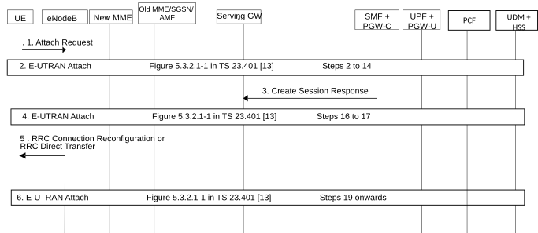
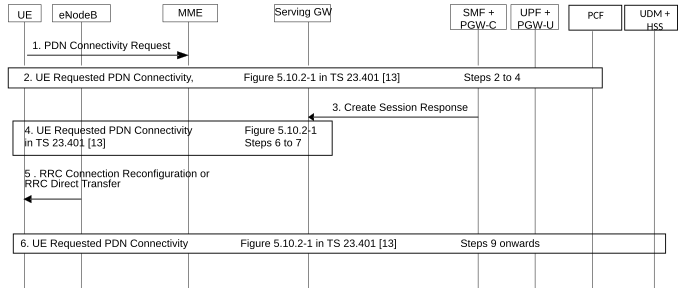

# 4.11.1.5 Impacts to EPS Procedures

## 4.11.1.5.1 General

This clause captures changes to procedures in TS 23.401 \[13\] due to interworking with 5GS based on N26. The handover procedures between EPS and 5GS captured in clause 4.11.1.2 capture impacts to clause 5.5.1.2.2 of TS 23.401 \[13\] (S1-based handover, normal).

## 4.11.1.5.2 E-UTRAN Initial Attach

The E-UTRAN Initial Attach Procedure specified in clause 5.3.2.1 of TS 23.401 \[13\] is impacted as shown in Figure 4.11.1.5.2-1 when interworking with 5GS using N26 interface is supported.

Figure 4.11.1.5.2-1: Impacts to E-UTRAN Initial Attach procedure

1\. The UE sends an Attach Request message as specified in TS 23.401 \[13\] with the following modifications:

\- If the UE was previously registered in 5GS, the UE provides in Access Stratum signalling a GUMMEI mapped from the 5G-GUTI and indicates it as a native GUMMEI and should in addition indicate it as "Mapped from 5G-GUTI".

\- If the UE was previously registered in 5GS, the UE provides, in the Attach Request message, an EPS GUTI mapped from 5G-GUTI sent as old Native GUTI and indicates that it is moving from 5GC. The UE integrity protects the Attach Request message using the 5G security context.

\- A UE that supports 5GC NAS procedures shall indicate its support of 5G NAS as part of its UE Core Network Capability IE.

\- If the UE includes ESM message container for PDN Connection Establishment and the Request type is "initial request", the UE shall allocate a PDU Session ID and include it in the PCO. The PDU Session ID shall be unique across all other PDN connections of the UE.

\- MME may steer the UE from EPC by rejecting the Attach request with an appropriate cause value. If the UE supports any of the CIoT 5GS Optimisations included in 5GC Preferred Network Behaviour, then the UE shall include its 5GC Preferred Network Behaviour if it included its EPC Preferred Network Behaviour in the Attach request. The MME should take into account availability of 5GC to the UE and the Preferred and Supported Network Behaviour (see clause 5.31.2 of TS 23.501 \[2\]) before steering the UE from EPC.

2\. The relevant steps of the procedure as specified in the figure above are executed with the following modification:

\- The HSS/UDM on receiving Update Location Request from MME, de-register any old AMF by sending an Nudm_UECM_DeregistrationNotification service operation to the registered AMF for 3GPP access.

\- Step 7 and step 10 as specified in clause 5.3.2.1 of TS 23.401 \[13\] (i.e. IP-CAN Session Termination) is replaced by SM Policy Association Termination procedure as specified in clause 4.16.6.

\- Step 14 as specified in clause 5.3.2.1 of TS 23.401 \[13\] (i.e. IP-CAN Session Establishment/Modification) are replaced by SM Policy Association Establishment/Modification procedure as specified in clause 4.16.4 and clause 4.16.5.

3\. Step 15 as specified in clause 5.3.2.1 of TS 23.401 \[13\] with the following modification:

\- The SMF+PGW-C allocates 5G QoS parameters corresponding to PDN connection, e.g. Session AMBR, QoS rules and QoS Flow level QoS parameters if needed for the QoS Flow associated with the QoS rule(s) and then includes them in PCO.

4\. The relevant steps of the procedure as specified in the figure above are executed.

5\. Step 18 as specified in clause 5.3.2.1 of TS 23.401 \[13\] with the following modification:

\- The 5G QoS parameters for the PDU session and for the QoS Flow associated with the default QoS rule are stored in the UE.

6\. The relevant steps of the procedure as specified in the figure above are executed.

## 4.11.1.5.3 Tracking Area Update

The following changes are applied to clause 5.3.3.1 (Tracking area update procedure with Serving GW change) in TS 23.401 \[13\]:

\- Step 2: The UE shall in Access Stratum signalling include GUMMEI that is mapped from 5G-GUTI following the mapping rules specified in TS 23.501 \[2\] and the UE indicates it as a native GUMMEI and should in addition indicate it as "Mapped from 5G-GUTI". The UE shall, in the TAU request message, include EPS GUTI that is mapped from 5G-GUTI following the mapping rules specified in TS 23.501 \[2\]. The UE indicates that it is moving from 5GC. The UE integrity protects the TAU request message using the 5G security context. If the UE supports any of the CIoT 5GS Optimisations included in 5GC Preferred Network Behaviour, then the UE shall include its 5GC Preferred Network Behaviour if it included its EPC Preferred Network Behaviour in the TAU request.

MME may steer the UE from EPC by rejecting the TAU request with an appropriate cause value. The MME should take into account availability of 5GC to the UE and the Preferred and Supported Network Behaviour (see clause 5.31.2 of TS 23.501 \[2\]) before steering the UE from EPC.

\- Step 5 and message Context Response may include new information Return preferred.

Return preferred is an indication by the AMF of a preferred return of the UE to the last used 5GS PLMN at a later access change to a 5GS shared network.

RFSP Index in Use Validity Time is provided by the AMF to the MME if the AMF selects the RFSP Index in use identical to the authorized RFSP Index as specified in clause 5.4.3.4 of TS 23.501 \[2\] and validity time is received from PCF as specified in clause 4.16.2.2 and in clause 6.1.2.1 of TS 23.503 \[20\]. The MME handles RFSP Index as specified in clause 4.11.1.5.8.

The MME may store the last used 5GS PLMN ID in UE's MM Context.

The MME may provide E-UTRAN with a Handover Restriction List taking into account the last used 5GS PLMN ID and the Return Preferred indication. The Handover Restriction List contains a list of PLMN IDs as specified by TS 23.251 \[35\].

\- Step 9a IP‑CAN Session Modification procedure:

It is replaced by SM Policy Association Modification as specified in clause 4.16.5.

\- Step 13 and HSS use of Cancel Location

The HSS/UDM de-registers any old AMF node by sending an Nudm_UECM_DeregistrationNotification service operation to the registered AMF for 3GPP access. The registered AMF for 3GPP access initiates AM Policy Association Termination procedure as defined in clause 4.16.3.2 and UE Policy Association Termination procedure as defined in clause 4.16.13.1.

\- Step 17: If the DNN and SMF+PGW-C FQDN for S5/S8 interface association exist, the HSS/UDM sends APN mapped form DNN and SMF+PGW-C FQDN for S5/S8 to UE.

\- Step 20 and MME processing of the partial Tracking Area Update (TAU) procedure.

The MME may use an indication Return preferred from Context Response at step 6 when deciding the PLMN list content.

The MME may provide the eNodeB with a PLMN list. The Handover Restriction List contains a list of PLMN IDs as specified by TS 23.501 \[2\].

## 4.11.1.5.4 Session Management

### 4.11.1.5.4.1 PDN Connection Request

The UE Requested PDN Connectivity Procedure specified in clause 5.10.2 of TS 23.401 \[13\] is impacted as shown in in Figure 4.11.1.5.4.1-1 when interworking with 5GS is supported.

Figure 4.11.1.5.4.1-1: Impacts to UE Requested PDN Connectivity Procedure

1\. UE sends a PDN connectivity Request to the MME as specified in Step 1 in clause 5.10.2 of TS 23.401 \[13\] with the following modification:

\- If the UE is 5G NAS capable and the Request type is "initial request", the UE shall allocate a PDU Session ID and include it in the PCO. The PDU Session ID shall be unique across all other PDN connections of the UE.

2\. The relevant steps of the procedure as specified in the figure above are executed. In step 4 of TS 23.401 \[13\], IP Session Establishment/Modification procedure is replaced by SM Policy Association Establishment/Modification procedure as specified in clauses 4.16.4 and 4.16.5.

3\. Step 6 as specified in clause 5.10.2 of TS 23.401 \[13\] is executed with the following modification:

\- If the SMF+PGW-C accepts to provide interworking of the PDN connection with 5GC, the SMF+PGW-C shall allocate 5G QoS parameters corresponding to PDN connection, e.g. Session AMBR, QoS rules and QoS Flow level QoS parameters if needed for the QoS Flow(s) associated with the QoS rule(s) and then include them in PCO.

\- If the SMF+PGW-C accepts to provide interworking of the PDN connection with 5GC, the SMF+PGW-C shall determine the S-NSSAI associated with the PDN connection based on the operator policy and send the S-NSSAI together with the PLMN ID to the UE in the PCO.

\- If the SMF+PGW-C accepts to provide interworking of the PDN connection with 5GC the SMF+PGW-C, if Small Data Rate Control is used, provides the Small Data Rate Control parameters to the UE in the PCO.

4\. The relevant steps of the procedure as specified in the figure above are executed.

5\. Step 8 as specified in clause 5.10.2 of TS 23.401 \[13\] with the following modification:

\- If 5G QoS parameters are included in the PCO, the UE shall store them. If 5G QoS parameters are not included in the PCO, the UE shall note that session continuity for this PDN connection on mobility to 5G is not provided by the network.

\- If the S-NSSAI and the PLMN ID associated with the PDN connection are included in the PCO, the UE shall store them.

\- If the Small Data Rate Control parameters are included in the PCO, the UE shall store them.

6\. The relevant steps of the procedure as specified in the figure above are executed.

### 4.11.1.5.4.2 UE or MME Requested PDN Disconnection

The procedure as specified in clause 5.10.3 of TS 23.401 \[13\] applies with the following modification:

Step 8. (RRC Connection Reconfiguration): On receiving the NAS Deactivate EPS Bearer Context Request(LBI) message, if the UE has mapped 5G parameters for the PDU session, the UE deletes the corresponding mapped 5GS PDU session.

In addition if the SMF+PGW-C has registered to HSS+UDM for this PDN connection before, the SMF+PGW-C invokes the Nudm_UECM_Deregistration service operation to notify the UDM to remove the association between the SMF+PGW-C identity and the associated DNN and PDU Session ID as described in the step 12 of clause 4.3.4.2. If there is no PDN connection for the associated (DNN, S-NSSAI) handled by the SMF+PGW-C, the SMF+PGW-C unsubscribes from Session Management Subscription data changes notification with the HSS+UDM by means of the Nudm_SDM_Unsubscribe (SUPI, DNN, S-NSSAI) service operation as described in step 12 of clause 4.3.4.2.

### 4.11.1.5.4.3 Dedicated Bearer Activation, Bearer Modification and Bearer Deactivation

The procedures specified in clauses 5.4.1 through 5.4.5 of TS 23.401 \[13\] apply with the following modifications:

\- PCRF initiated IP-CAN Modification in TS 23.401 \[13\] is replaced with PCF initiated SM Policy Association Modification as specified in clause 4.16.5.2. PCEF initiated IP-CAN Session Modification/Termination TS 23.401 \[13\] is replaced with SM Policy Association Modification/Termination as specified in clauses 4.16.5 and 4.16.6.

\- In the step where the PDN-GW sends a Create Bearer Request, i.e.:

\- Step 2 in clause 5.4.1 of TS 23.401 \[13\] (Dedicated Bearer Activation).

the PCO includes mapped 5GS QoS parameters for the EPS bearer being created.

\- In the step where the PDN-GW sends an Update Bearer Request, i.e.:

\- Step 2 in clause 5.4.2.1 of TS 23.401 \[13\] (PDN GW initiated bearer modification with bearer QoS update).

\- Step 5 in clause 5.4.2.2 of TS 23.401 \[13\] (HSS Initiated Subscribed QoS Modification).

\- Step 2 in clause 5.4.3 of TS 23.401 \[13\] (PDN GW initiated bearer modification without bearer QoS update) if TFT or APN-AMBR is being modified.

the PCO includes the modification to the mapped 5GS QoS parameters, if impacted by the modification, corresponding to the EPS bearer being modified.

\- In the step where the UE receives the NAS Session Management message from the MME which contains the PCO relayed via the MME, i.e.:

\- Step 5 in clause 5.4.1 of TS 23.401 \[13\] (Dedicated Bearer Activation).

\- Step 5 in clause 5.4.2.1 of TS 23.401 \[13\] (PDN GW initiated bearer modification with bearer QoS update).

\- Step 5 in clause 5.4.3 of TS 23.401 \[13\] (PDN GW initiated bearer modification without bearer QoS update) if TFT or APN-AMBR is being modified.

the UE updates the mapped 5G QoS parameters as included in the PCO from the PDN-GW.

\- In the step where the UE receives EPS bearer request message, i.e.:

\- Step 5 in clause 5.4.4.1 of TS 23.401 \[13\] (PDN GW initiated bearer deactivation).

the UE also deletes the mapped 5GS QoS flow and its associated parameter.

## 4.11.1.5.5 5GS to EPS handover using N26 interface

In step 3 of clause 4.11.1.2.1, the Forward Relocation Request may include new information Return Preferred.

Return Preferred is an indication by the AMF of a preferred return of the UE to the last used 5GS PLMN at a later access change to a 5GS shared network.

RFSP Index in Use Validity Time is provided by the AMF to the MME if the AMF selects the RFSP Index in use identical to the authorized RFSP Index as specified in clause 5.4.3.4 of TS 23.501 \[2\] and validity time is received from PCF as specified in clause 4.16.2.2 and in clause 6.1.2.1 of TS 23.503 \[20\]. The MME handles RFSP Index as specified in clause 4.11.1.5.8.

The MME may store the last used 5GS PLMN ID in UE's MM Context.

The MME may provide E-UTRAN with a Handover Restriction List taking into account the last used 5GS PLMN ID and the Return Preferred indication. The Handover Restriction List contains a list of PLMN IDs as specified by TS 23.251 \[35\].

## 4.11.1.5.6 UE triggered Service Request

The following changes are applied to clause 5.3.4.1 (UE triggered Service Request) in TS 23.401 \[13\]:

\- Step 4: MME may steer the UE from EPC by rejecting the service request with an appropriate cause value. The MME should take into account availability of 5GC to the UE and the Preferred and Supported Network Behaviour (see clause 5.31.2 of TS 23.501 \[2\]) before steering the UE from EPC.

## 4.11.1.5.7 Establishment of S1-U bearer during Data Transport in Control Plane CIoT EPS Optimisation

The following changes are applied to clause 5.3.4B.4 (Establishment of S1-U bearer during Data Transport in Control Plane CIoT EPS Optimisation) in TS 23.401 \[13\]:

\- Step 3: MME may steer the UE from EPC by rejecting the Control Plane Service Request with an appropriate cause value. The MME should take into account availability of 5GC to the UE and the Preferred and Supported Network Behaviour (see clause 5.31.2 of TS 23.501 \[2\]) before steering the UE from EPC.

## 4.11.1.5.8 Radio Resource Management functions and Information Storage

The following changes are applied to clause 4.3.6 (Radio Resource Management functions) in TS 23.401 \[13\]:

\- At 5GS to EPS mobility or during inter-MME mobility, if RFSP Index in Use Validity Time is received from the AMF or the old MME, the new MME uses the received RFSP Index in use by the time indicated in RFSP Index in Use Validity Time. Only when RFSP Index in Use Validity Time expires, the MME re-evaluates the RFSP Index in use as in clause 4.3.6 of TS 23.401 \[13\].

NOTE: RFSP Index in Use Validity Time is the validity time that is sent by the AMF to the MME as specified in clause 5.17.2.2 of TS 23.501 \[2\].

The following new parameter is to be added in Table 5.7.2-1 of TS 23.401 \[13\]:

Table 5.7.2-1: MME MM and EPS bearer Contexts

| Field                           | Description                                                                                                                                           |
|---------------------------------|-------------------------------------------------------------------------------------------------------------------------------------------------------|
| RFSP Index in Use Validity Time | Defines the validity period of RFSP Index in Use. The MME shall not re-evaluate the RFSP Index in Use before RFSP Index in Use Validity Time expires. |
