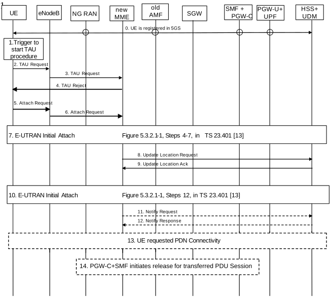
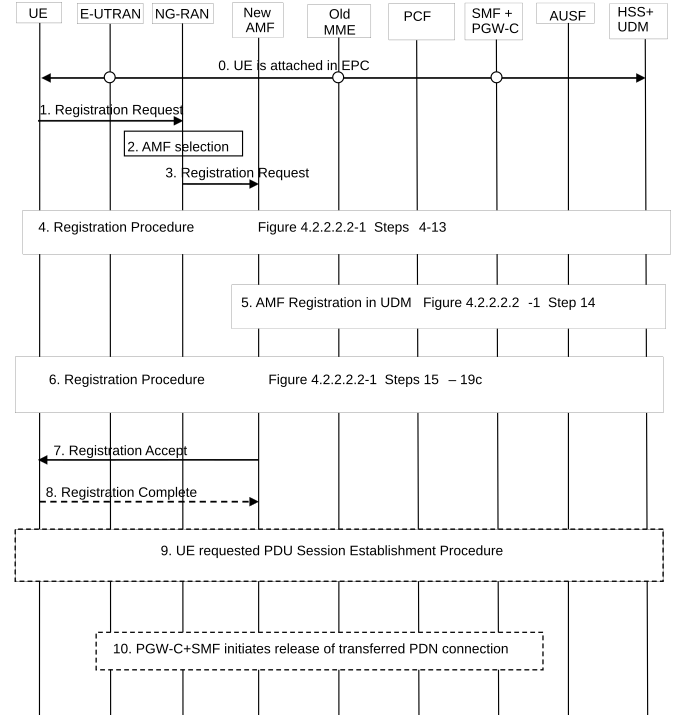

# 4.11.2 Interworking procedures without N26 interface

## 4.11.2.1 General

Clause 4.11.2 defines the procedures to support interworking between 5GS and EPS without any N26 interface between AMF and MME.

Interworking between EPS and 5GS is supported with IP address preservation by assuming SSC mode 1. The UE shall not request handover to EPS of a PDU session with SSC mode 2 or SSC mode 3.

During interworking from EPS to 5GS, as the SMF+PGW-C may have different IP addresses when being accessed over S5/S8 and N11/N16 respectively, the AMF shall discover the SMF instance by an NF/NF service discovery procedure using the FQDN for the S5/S8 interface received from the UDM as a query parameter.

This is required for both non-roaming and roaming with local breakout, as well as for home routed roaming.

NOTE: As the AMF is not aware of the S-NSSAI assigned for the PDN Connection, the NF/NF service discovery used to find the SMF instance can use PLMN level NRF.

## 4.11.2.2 5GS to EPS Mobility

The following procedure is used by UEs in single-registration or dual registration mode on mobility from 5GS to EPS.

In the case of network sharing the UE selects the target PLMN ID according to clause 5.18.3 of TS 23.501 \[2\].

Figure 4.11.2.2-1: Mobility procedure from 5GS to EPS without N26 interface

The UE operating in single-registration mode can start the procedure from Step 1 or Step 5. The UE operating in dual-registration mode starts the procedure from Step 5.

NOTE 1: The network has indicated the " Interworking without N26" to the UE. To support IP address preservation, the UE in single-registration mode starts the procedure from Step 5. If the UE in single-registration mode starts the procedure from Step 1, the IP address preservation is not provided.

0\. UE is registered in 5GS and established PDU sessions. The FQDN for the S5/S8 interface of the SMF+PGW-C is also stored in the UDM by the SMF+PGW-C during PDU Session setup in addition to what is specified in clause 4.3.2.2.1 and clause 4.3.2.2.2.

NOTE 2: At 5GS to EPS mobility, the MME use the FQDN for the S5/S8 interface of the SMF+PGW-C to find the SMF+PGW-C and when UE moves back from EPS to 5GS, the AMF uses FQDN for the S5/S8 interface of the SMF+PGW-C to find the SMF+PGW-C.

1\. Step 1 as in clause 5.3.3.1 (Tracking Area Update) in TS 23.401 \[13\].

2\. Step 2 as in clause 5.3.3.1 (Tracking Area Update) in TS 23.401 \[13\] with the following modifications:

The UE shall provide a EPS-GUTI that is mapped from the 5G-GUTI following the mapping rules specified in TS 23.501 \[2\]. The UE indicates that it is moving from 5GC.

3\. Step 3 as in clause 5.3.3.1 (Tracking Area Update) in TS 23.401 \[13\].

4\. If the MME determined that the old node is an AMF based on UE's GUTI mapped from 5G-GUTI and the MME is configured to support 5GS-EPS interworking without N26 procedure, the MME sends a TAU Reject to the UE.

5\. Step 1 as in clause 5.3.2.1 (E-UTRAN Initial Attach) in TS 23.401 \[13\] with the modifications captured in clause 4.11.2.4.1.

6\. Step 2 as in clause 5.3.2.1 (E-UTRAN Initial Attach) in TS 23.401 \[13\].

7\. Steps 4-7 as in clause 5.3.2.1 (E-UTRAN Initial Attach) in TS 23.401 \[13\], with the modifications captured in clause 4.11.2.4.1.

8\. Step 8 as in clause 5.3.2.1 (E-UTRAN Initial Attach) in TS 23.401 \[13\], with the modifications captured in clause 4.11.2.4.1.

9\. Step 11 as in clause 5.3.2.1 (E-UTRAN Initial Attach) in TS 23.401 \[13\], with the following modifications:

The subscription profile the MME receives from HSS+UDM includes per DNN/APN at most one SMF+PGW-C FQDN as described in in clause 5.17.2.1 of TS 23.501 \[2\].

10\. Steps 12-24 as in clause 5.3.2.1 (E-UTRAN Initial Attach) in TS 23.401 \[13\], with the modifications as described in clause 4.11.2.4.1.

11\. Step 25 as in clause 5.3.2.1 (E-UTRAN Initial Attach) in TS 23.401 \[13\].

12\. Step 26 as in clause 5.3.2.1 (E-UTRAN Initial Attach) in TS 23.401 \[13\].

13\. If the UE has remaining PDU Sessions in 5GS which it wants to transfer to EPS and maintain the same IP address/prefix, the UE performs the UE requested PDN Connectivity Procedure as specified in clause 5.10.2 of TS 23.401 \[13\] and sets the Request Type to "handover" or "handover of emergency bearer services" in Step 1 of the procedure with modification captured in clause 4.11.2.4.2. UE provides an APN and the PDU Session ID corresponding to the PDU Session it wants to transfer to EPS. The UE provides the PDU Session ID in PCO as described in clause 4.11.1.1.

UEs in single-registration mode performs this step for each PDU Session immediately after completing the E-UTRAN Initial Attach procedure. UEs in dual-registration mode may perform this step any time after the completing of E-UTRAN Initial Attach procedure. Also, UEs in dual-registration mode may perform this step only for a subset of PDU Sessions.

The MME determines the SMF+PGW-C address for the Create Session Request based on the APN if received from the UE, local Emergency Configuration Data (as in clause 4.11.0a.4) and the subscription profile which may include the Emergency Information received from the HSS+UDM in Step 9 or when the HSS+UDM notifies the MME for the new SMF+PGW-C ID in the updated subscription profile.

The SMF+PGW-C uses the PDU Session ID to correlate the transferred PDN connection with the PDU Session in 5GC.

As a result of the procedure the PGW-U+UPF starts routing DL data packets to the Serving GW for the default and any dedicated EPS bearers established for this PDN connection.

14\. For Non-Roaming case and Roaming with Local Breakout, the SMF+PGW-C initiates release of the PDU Session(s) in 5GS transferred to EPS as specified in clause 4.3.4.2 with the following clarification:

\- In step 2, the SMF+PGW-C shall not release IP address/prefix(es) allocated for the PDU Session;

\- If UP connection of the PDU Session is not active, step 3b is not executed, thus the steps triggered by step 3b are not executed;

If UP connection of the PDU Session is active, the SMF invokes the Namf_Communication_N1N2MessageTransfer service operation in step 3b without including N1 SM container (PDU Session Release Command);

\- In step 11, Nsmf_PDUSession_SMContexStatusNotify service operation invoked by the SMF to notify AMF that the SM context for this PDU Session is released due to handover to EPS.

For Home Routed roaming, the SMF+PGW-C initiates release of the PDU Session(s) in 5GS transferred to EPS as specified in clause 4.3.4.3 with the following clarification:

\- In step 3a, the H-SMF invokes the Nsmf_PDUSession_Update service operation without including N1 SM container (PDU Session Release Command);

\- In step 16a, Nsmf_PDUSession_StatusNotify operation invoked by H-SMF to notify the V-SMF that the PDU session context is released due to handover to EPS;

\- In step 16b, Nsmf_PDUSession_SMContexStatusNotify service operation invoked by the V-SMF to notify AMF that the SM context for this PDU Session is released due to handover to EPS.

## 4.11.2.3 EPS to 5GS Mobility

The following procedure is used by UEs in single-registration mode on mobility from EPS to 5GS.

In the case of network sharing the UE selects the target PLMN ID according to clause 5.18.3 of TS 23.501 \[2\].

This procedure is also used by UEs in dual-registration mode to perform registration in 5GS when the UE is also registered in EPC. The procedure is the General Registration procedure as captured in clause 4.2.2. Difference from that procedure are captured below.

The UE has one or more ongoing PDN connections including one or more EPS bearers. During the PDN connection establishment, the UE allocates the PDU Session ID and sends it to the SMF+PGW-C via PCO, as described in clause 4.11.1.1.

Figure 4.11.2.3-1: Mobility procedure from EPS to 5GS without N26 interface

0\. The UE is attached in EPC as specified in clause 4.11.2.4.1.

1\. Step 1 in clause 4.2.2.2.2 (General Registration) with the following clarifications:

The UE indicates that it is moving from EPC. The UE in single registration mode provides the Registration type set to "mobility registration update", a 5G-GUTI mapped from the 4G-GUTI and a native 5G-GUTI (if available) as an Additional GUTI. The UE includes the UE Policy Container containing the list of PSIs, indication of UE support for ANDSP and OSId if available. The UE shall select the 5G-GUTI for the additional GUTI as follows, listed in decreasing order of preference:

\- a native 5G-GUTI assigned by the PLMN to which the UE is attempting to register, if available;

\- a native 5G-GUTI assigned by an equivalent PLMN to the PLMN to which the UE is attempting to register, if available;

\- a native 5G-GUTI assigned by any other PLMN, if available.

The UE in dual registration mode provides the Registration type set to "initial registration" and a native 5G-GUTI or SUCI. In single registration mode, the UE also includes at least the S-NSSAIs (with values for the Serving PLMN) associated with the established PDN connections in the Requested NSSAI in RRC Connection Establishment.

2\. Step 2 as in clause 4.2.2.2.

3\. Step 3 as in clause 4.2.2.2.2 (General Registration), with the following modifications:

If the Registration type is "mobility registration update" and the UE indicates that it is moving from EPC in step 1 and the AMF is configured to support 5GS-EPS interworking procedure without N26 interface, the AMF treats this registration request as "initial Registration" and the AMF skips the PDU Session status synchronization.

NOTE 1: The UE operating in single registration mode includes the PDU Session IDs corresponding to the PDN connections to the PDU Session status.

If the UE has provided a 5G-GUTI mapped from 4G-GUTI in step 1 and the AMF is configured to support 5GS-EPS interworking procedure without N26 interface, the AMF does not perform steps 4 and 5 in clause 4.2.2.2 (UE context transfer from the MME).

4\. Steps 4-13 as in clause 4.2.2.2.2 (General Registration), with the following modifications:

If the UE has included an additional GUTI in the Registration Request, then the new AMF attempts to retrieve the UE's security context from the old AMF in steps 4 and 5.

If the UE's security context is not available in the old AMF or if the UE has not provided an additional GUTI then the AMF retrieves the SUCI from the UE in steps 6 and 7.

5\. Step 14 as in clause 4.2.2.2.2 (General Registration), with the following modifications:

If the UE indicates that it is moving from EPC and the Registration type is set to "initial registration" or "mobility registration update" in step 1 and AMF is configured to support 5GS-EPS interworking without N26 procedure, the AMF sends an Nudm_UECM_Registration Request message to the HSS+UDM indicating that registration of an MME at the HSS+UDM, if any, shall not be cancelled. The HSS+UDM does not send cancel location to the old MME.

NOTE 2: If the UE does not maintain registration in EPC, upon reachability time-out, the MME can implicitly detach the UE and release the possible remaining PDN connections in EPC.

The subscription profile the AMF receives from HSS+UDM includes the DNN/APN and SMF+PGW-C FQDN for S5/S8 interface for each PDN connection established in EPC. For emergency PDU Session, the AMF receives Emergency Information containing SMF+PGW-C FQDN from HSS+UDM.

6\. Steps 15-19c as in clause 4.2.2.2.2 (General Registration).

7\. Step 21 as in clause 4.2.2.2.2 (General Registration) with the following modifications:

The AMF includes an "Interworking without N26" indicator to the UE.

If the UE had provided PDU Session Status information in step 1, the AMF Sets the PDU Session Status to not synchronized.

8\. Step 22 as in clause 4.2.2.2.2 (General Registration)

9\. UE requested PDU Session Establishment procedure as in clause 4.3.2.2.1.

If the UE had setup PDN Connections in EPC which it wants to transfer to 5GS and maintain the same IP address/prefix and the UE received "Interworking without N26" indicator in step 7, the UE performs the UE requested PDU Session Establishment Procedure as in clause 4.3.2.2 and sets the Request Type to "Existing PDU Session" or "Existing Emergency PDU Session" in step 1 of the procedure. The UE provides a DNN for non-emergency PDU Session, the PDU Session ID and S-NSSAI corresponding to the existing PDN connection it wants to transfer from EPS to 5GS. The S-NSSAI is set as described in clause 5.15.7.2 of TS 23.501 \[2\].

If the Request Type indicates "Existing Emergency PDU Session", the AMF shall use the Emergency Information received from the HSS+UDM which contains SMF+PGW-C FQDN for S5/S8 interface for the emergency PDN connection established in EPS and the AMF shall use the S-NSSAI locally configured in Emergency Configuration Data.

UEs in single-registration mode performs this step for each PDN connection immediately after the step 8. UEs in dual-registration mode may perform this step any time after step 8. Also, UEs in dual-registration mode may perform this step only for a subset of PDU Sessions. The AMF determines the S5/S8 interface of the SMF+PGW-C for the PDU Session based on the DNN received from the UE and the SMF+PGW-C ID in the subscription profile received from the HSS+UDM in step 5 or when the HSS+UDM notifies the AMF for the new SMF+PGW-C ID in the updated subscription profile. The AMF queries the NRF in serving PLMN by issuing the Nnrf_NFDiscovery_Request including the FQDN for the S5/S8 interface of the SMF+PGW-C and the NRF provides the IP address or FQDN of the N11/N16 interface of the SMF+PGW-C. The AMF invokes the Nsmf_PDUSession_CreateSMContext service with the SMF address provided by the NRF. The AMF includes the PDU Session ID to the request sent to the SMF+PGW-C.

The SMF+PGW-C uses the PDU Session ID to determine the correct PDU Session.

After step 16a of Figure 4.3.2.2.1-1 in clause 4.3.2.2.1, user plane is switched from EPS to 5GS.

As specified clause 4.3.2.2, if the SMF has not yet registered for the PDU Session ID, then the SMF registers with the UDM using Nudm_UECM_Registration (SUPI, DNN, PDU Session ID) and if Session Management Subscription data for corresponding SUPI, DNN and S-NSSAI is not available, then SMF retrieves the Session Management Subscription data using Nudm_SDM_Get (SUPI, Session Management Subscription data, DNN, S-NSSAI) and subscribes to be notified when this subscription data is modified using Nudm_SDM_Subscribe (SUPI, Session Management Subscription data, DNN, S-NSSAI).

NOTE 3: The SMF can, instead of the Nudm_SDM_Get service operation, use the Nudm_SDM_Subscribe service operation with an Immediate Report Indication that triggers the UDM to immediately return the subscribed data if the corresponding feature is supported by both the SMF and the UDM.

10\. The SMF+PGW-C performs release of the resources in EPC for the PDN connections(s) transferred to 5GS by performing the PDN GW initiated bearer deactivation procedure as defined in clause 5.4.4.1 of TS 23.401 \[13\], except the steps 4-7.

## 4.11.2.4 Impacts to EPS Procedures

### 4.11.2.4.1 E-UTRAN Attach

Impact on clause 5.3.2.1 of TS 23.401 \[13\] from adding support for the optional network functionality dual registration mode:

\- Step 1:

The UE constructs the Attach Request message according to the following principles:

\- If UE operates in single-registration mode, the UE indicates that it is moving from 5GC and provides a native 4G-GUTI or a 4G-GUTI mapped from 5G GUTI (indicated as native GUTI), if available, otherwise the IMSI, or

\- If the UE operates in dual-registration mode, the UE indicates that it is moving from 5GC and provides native 4G-GUTI, or

\- If the UE sent a TAU in step 2 and it was rejected because the MME could not derive the UE identity, the UE provides IMSI.

If the UE wants to transfer a PDU Session to EPC as part of the Attach procedure, it includes a PDN CONNECTIVITY Request message in the Attach Request and provides a Request type "Handover", DNN/APN and PDU Session ID of the PDU Session (clause 5.3.2.1 of TS 23.401 \[13\]). The UE provides the PDU Session ID in PCO as described in clause 4.11.1.1. For PDU Session of Ethernet Type, if the UE and the network support Ethernet PDN Type in EPS which is negotiated during PDU Session Establishment as described in clause 4.11.5, the UE includes PDN Type Ethernet in PDN CONNECTIVITY Request message.

If the UE supports URSP provisioning in EPS, the UE also includes the "Indication of URSP Provisioning Support in EPS" in the PCO or in the ePCO in the first PDN CONNECTIVITY Request or during Initial Attach procedure. The PDN CONNECTIVITY Request is sent together with Initial Attach request as described in clause 5.17.8 of TS 23.501 \[2\].

If the TAU was rejected in step 2 the IP address preservation is not provided. In this case the UE provides IMSI in the Attach Request and does not provide a Request Type "Handover" in the PDN CONNECTIVITY Request if included in the Attach Request.

The UE provides an EPS bearer ID for all mapped EPS bearers in the EPS bearer status. For the initial Attach Request the EPS bearer status is empty.

NOTE 1: The UE is aware the network is configured to support 5GS-EPS interworking without N26 procedure. The UE does not include the EPS bearer IDs corresponding to the 5G QoS flows to the EPS bearer status.

If the UE supports 5GC NAS procedures (see clause 5.17.2 of TS 23.501 \[2\]), then the UE shall indicate its support of 5G NAS in a NAS indicator.

\- Step 3:

If the UE provided a 4G-GUTI mapped from 5G-GUTI and the MME is configured to support 5GS-EPS interworking without N26 procedure, the MME does not perform step 3, Identification Request to old MME/SGSN/AMF in clause 5.3.2.1 of TS 23.401 \[13\].

NOTE 2: As the 4G-GUTI mapped from 5G-GUTI is unknown identity to the MME, the MME sends an Identity Request to the UE to request the IMSI. The UE responds with Identity Response (IMSI).

\- Step 8:

If the UE indicates that it is moving from 5GC (Attach Request) and the MME is configured to support 5GS-EPS interworking without N26 procedure, the MME sends an Update Location Request message to the HSS+UDM indicating that registration of an AMF at the HSS+UDM, if any, shall not be cancelled. The HSS+UDM does not send Nudm_UECM_DeregistrationNotification to the old AMF.

NOTE 3: If the UE does not maintain registration in 5GC, upon reachability time-out, the AMF can implicitly detach the UE and release the possible remaining PDU Sessions in 5GC.

\- Step 11:

The HSS+UDM selects one of the SMF+PGW-C FQDN for one APN based on operator's policy. The HSS+UDM sends selected SMF+PGW-C FQDN along with APN to the MME for the UE.

\- Step 12:

The MME determines the SMF+PGW-C address for the Create Session Request based on the APN received from the UE and the subscription profile received from the HSS+UDM.

\- Step 13:

The SMF+PGW-C uses the PDU Session ID received from the UE in PCO to correlate the transferred PDN connection with the PDU Session in 5GC.

In this release, if the Handover Indication is present in the Create Session Request and the SMF+PGW-C detects it corresponds to a PDU Session for a LADN in 5GC, the SMF+PGW-C rejects the request.

\- Step 14:

IP-CAN Session Modification procedure is replaced by SM Policy Association Modification Procedure as described in clause 4.16.5.

\- Step 17:

If the UE indicated support for 5GC NAS procedures (see clause 5.11.3) and the MME supports procedures for interworking with 5GC without N26, the MME may indicate in the Attach Accept, that interworking without N26 is supported. UE handling of this indicator is defined in TS 23.501 \[2\].

\- Step 23a:

As a result of the procedure the PGW-U+UPF starts routing DL data packets to the Serving GW for the default and any dedicated EPS bearers established for this PDN connection.

\- Step 25:

Notify Request is sent to HSS/UDM if the network supports the procedures for 5GC interworking without N26 and that the UE is allowed to access 5GC (condition that is identified based on the subscription data). For emergency attach, Notify Request is sent to HSS/UDM if the network supports the procedures for 5GC interworking without N26 and operator policy allows handover of emergency session to 5GS.

### 4.11.2.4.2 Session Management

#### 4.11.2.4.2.1 PDN Connection Request

Same procedure as specified in clause 4.11.1.5.4.1 is used with the following clarification:

Step 6. The relevant steps of the procedure as specified in the figure above are executed with the following modification:

\- Additional condition to trigger Notify Request to HSS in step 15 of Figure 5.10.2-1 in TS 23.401 \[13\] is that the network supports the procedures for 5GC interworking without N26 and that the UE is allowed to use 5GS in the subscription data. If the Request Type of the UE requested connectivity procedure indicates "Emergency", MME triggers Notify Request to HSS if the network supports the procedures for 5GC interworking without N26 and operator policy allows handover of emergency session to 5GS.

For an unauthenticated or roaming UE, if the Request Type of the UE requested connectivity procedure indicates "Emergency", the MME shall not send any Notify Request to an HSS.

### 4.11.2.4.3 Void
