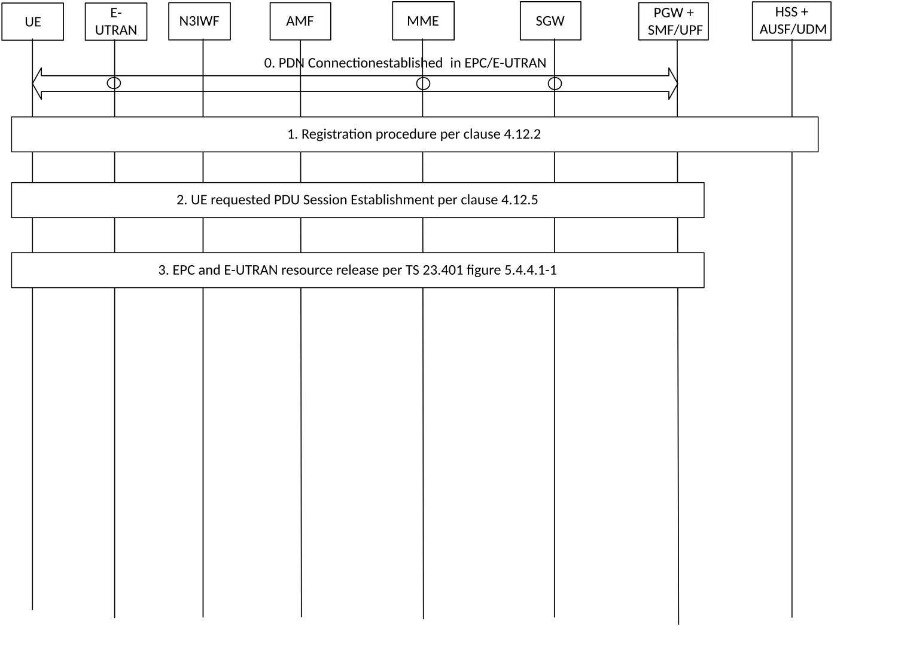
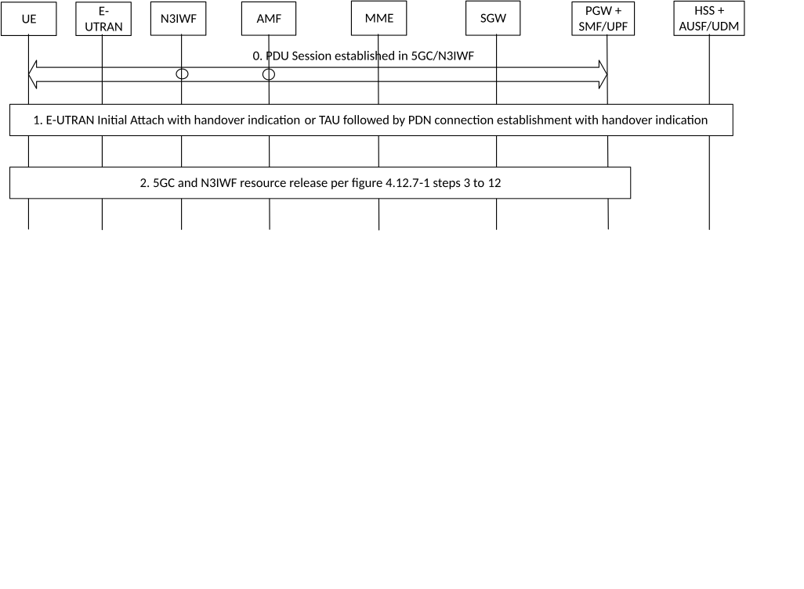

# 4.11.3 Handover procedures between EPS and 5GC-N3IWF

## 4.11.3.1 Handover from EPS to 5GC-N3IWF

Figure 4.11.3.1-1: Handover from EPS to 5GC-N3IWF

0\. Initial status: one or more PDN connections have been established in EPC between the 5G capable UE and the PGW via E-UTRAN.

1\. The UE initiates Registration procedure on untrusted non-3GPP access via N3IWF (with 5G-GUTI is available or SUCI if not) per clause 4.12.2.

2\. The UE initiates a UE requested PDU Session Establishment with Existing PDU Session indication in 5GC via Untrusted non-3GPP Access via N3IWF per clause 4.12.5.

If the Request Type indicates "Existing Emergency PDU Session", the AMF shall use the Emergency Information received from the HSS+UDM which contains SMF+PGW-C FQDN for S5/S8 interface for the emergency PDN connection established in EPS and the AMF shall use the S-NSSAI locally configured in Emergency Configuration Data.

The combined PGW+SMF/UPF initiates a PDN GW initiated bearer deactivation as described in clause 5.4.4.1 of TS 23.401 \[13\] to release the EPC and E-UTRAN resources.

## 4.11.3.2 Handover from 5GC-N3IWF to EPS

Figure 4.11.3.2-1: Handover from 5GC-N3IWF to EPS

0\. Initial status: one or more PDU Sessions have been established in 5GC between the UE and the SMF/UPF via untrusted non-3GPP access and N3IWF. During PDU Session setup and in addition to what is specified in clause 4.3.2.2.1 and clause 4.3.2.2.2, the AMF includes an indication that EPS interworking is supported to the SMF+PGW-C as specified in clause 4.11.5.3 and the SMF+PGW-C sends the FQDN related to the S5/S8 interface to the HSS+UDM which stores it as described in clause 4.11.5.

1\. For the UE to move PDU session(s) from 5GC/N3IWF to EPC/E-UTRAN, the UE's behaviour is as follows:

\- If the UE is operating in single-registration mode (as described in clause 5.17.2.1 of TS 23.501 \[2\]) and the UE is registered via 3GPP access to 5GC;

\- the UE behaves as specified in clause 4.11.1 or 4.11.2 and moves its PDU session from 5GC/N3IWF to EPC/E-UTRAN using the PDN connection establishment with "Handover" indication procedure as described in TS 23.401 \[13\].

\- otherwise, i.e. either the UE is operating in single registration mode and is not registered via 3GPP access to 5GC, or the UE is operating in dual registration mode; and

\- if the UE is not attached to EPC/E-UTRAN, the UE initiates Handover Attach procedure in E-UTRAN as described in TS 23.401 \[13\] for a non-3GPP to EPS handover with "Handover" indication, except note 17.

\- otherwise (i.e. the UE is attached to EPC/E-UTRAN), the UE initiates the PDN Connection establishment with "Handover" indication procedure as described in TS 23.401 \[13\].

2\. The combined PGW+SMF/UPF initiates a network requested PDU Session Release via untrusted non-3GPP access and N3IWF according to Figure 4.12.7-1 steps 3 to 12 to release the 5GC and N3IWF resources with the following exception:

\- the H-SMF indicates in the Nsmf_PDUSession_Update Request that the UE shall not be notified. This shall result in the V-SMF not sending the N1 SM Container (PDU Session Release Command) to the UE.

\- Nsmf_PDUSession_StatusNotify service operation invoked by H-SMF to V-SMF indicates the PDU Session is moved to a different system;

\- Nsmf_PDUSession_SMContexStatusNotify service operation invoked by the (V-)SMF indicates the PDU Session is moved to another system.

\- The Npcf_SMPolicyControl_Delete service operation to PCF shall not be performed.
