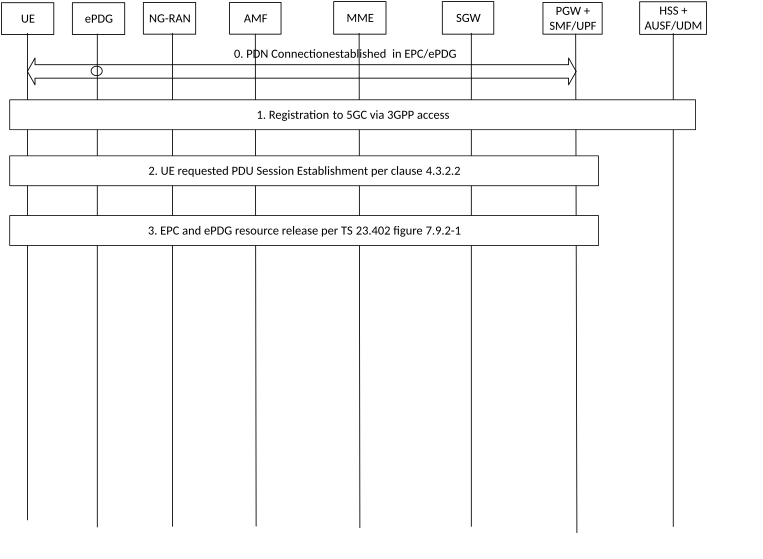
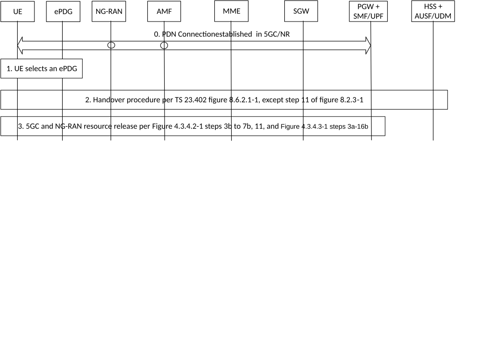

# 4.11.4 Handover procedures between EPC/ePDG and 5GS

## 4.11.4.1 Handover from EPC/ePDG to 5GS

Figure 4.11.4.1-1: Handover from EPC/ePDG to 5GS

0\. Initial status: one or more PDN Connections have been established between the UE and the EPC/ePDG via untrusted non-3GPP access as specified in clauses 7.2.4 and 7.6.3 of TS 23.402 \[26\] with modification described in clauses 4.11.4.3.3 and 4.11.4.3.5.

1\. For the UE to move its PDU session(s) from EPC/ePDG to 5GC/3GPP access, the UE's behaviour is as follows:

\- If the UE is operating in single-registration mode (as described in clause 5.17.2.1 of TS 23.501 \[2\]) and the UE is attached to EPC/E-UTRAN:

\- the UE behaves as specified in clause 4.11.1 or clause 4.11.2 and gets registered to 5GC via 3GPP access.

\- otherwise i.e. either the UE is operating in single registration mode and is not attached to EPC/E-UTRAN, or the UE is operating in dual registration mode; and

\- if the UE is already registered in 5GS via 3GPP access, the UE skips to step 2.

\- otherwise (i.e. UE is not registered in 5GS via 3GPP access), the UE performs Registration procedure of type initial registration in 5GS via 3GPP access as described in clause 4.2.2.2.

2\. The UE initiates a UE requested PDU Session Establishment via 3GPP Access according to clause 4.3.2.2 and includes the "Existing PDU Session" indication or "Existing Emergency PDU Session" and the PDU Session ID.

For Request Type "Existing PDU Session", the UE provides a DNN, the PDU Session ID and S-NSSAI corresponding to the existing PDN connection it wants to transfer from EPC/ePDG to 5GS. The S-NSSAI and PLMN ID sent to the UE are set in the same way as for EPS to 5GS mobility as specified in clause 5.15.7.1 of TS 23.501 \[2\].

If the Request Type indicates "Existing Emergency PDU Session", the AMF shall use the Emergency Information containing SMF+PGW-C FQDN for the S2b interface it has received from the HSS+UDM. The SMF+PGW-C FQDN was sent by PGW-C when the Emergency PDN connection was established in EPC via ePDG and the AMF shall use the S-NSSAI locally configured in Emergency Configuration Data.

3\. The combined PGW+SMF/UPF initiates a PDN GW initiated Resource Allocation Deactivation with GTP on S2b as described in clause 7.9.2 of TS 23.402 \[26\] to release the EPC and ePDG resources when S6b is used. When S6b is not used between SMF+PGW-C and AAA, impacts to step 5 of TS 23.402 \[26\] Figure 7.9.2-1 are captured in clause 4.11.4.3.6.

## 4.11.4.2 Handover from 5GS to EPC/ePDG

Figure 4.11.4.2-1 describes the procedure for handing over a PDU Session from 5GS to EPC/ePDG. The UE shall not request a handover of a PDU session with SSC mode 2 or SSC mode 3 to EPC/ePDG.

Figure 4.11.4.2-1: Handover from 5GS to EPC/ePDG

NOTE: In step 2, the UE can also trigger this procedure when 5G NAS (i.e. N1 mode) capability is disabled while the UE is in 5GS.

0\. Initial status: one or more PDU Sessions have been established between the UE and the SMF/UPF via NG-RAN.

1\. The UE connects to an untrusted non-3GPP access and the N3IWF-ePDG selection process results in selecting an ePDG.

2\. The UE initiates a Handover procedure as described in clause 8.6.2.1 of TS 23.402 \[26\], except step 11 of referenced figure 8.2.3-1 that corresponds to the release of resources in source system.

3\. The combined PGW+SMF/UPF initiates a network requested PDU Session Release via 3GPP access according to Figure 4.3.4.2-1 steps 3b to 7b, step 11 or Figure 4.3.4.3-1 steps 3a-16b to release the 5GC and NG-RAN resources with the following exception:

\- For non-roaming or local breakout in clause 4.3.4.2, the SMF does not include N1 SM Container in Namf_Communication_N1N2MessageTransfer service operation.

\- For home routing roaming in clause 4.3.4.3, the H-SMF indicates in the Nsmf_PDUSession_Update Request that the UE shall not be notified. This shall result in the V-SMF not sending the N1 SM Container (PDU Session Release Command) to the UE.

\- Nsmf_PDUSession_StatusNotify service operation invoked by H-SMF to V-SMF and Nsmf_PDUSession_SMContexStatusNotify service operation invoked by the (V-)SMF to the AMF indicate that the PDU Session is moved to a different system.

\- The Npcf_SMPolicyControl_Delete service operation to PCF shall not be performed.

## 4.11.4.3 Impacts to EPC/ePDG Procedures

### 4.11.4.3.1 General

This clause captures enhancements to procedures in TS 23.402 \[26\] to support interworking with 5GS. The architecture for interworking is shown in clause 4.3.4 of TS 23.501 \[2\]. with the ePDG connected to SMF+PGW-C and UPF+PGW-U using GTP based S2b.

### 4.11.4.3.2 ePDG FQDN construction

Clause 4.5.4.2 of TS 23.402 \[26\] applies with the following modification:

\- Tracking/Location Area Identity FQDN: When the 5GC NAS capable UE uses the Tracking Area of the NG-RAN when the UE is registered with the 5GC when constructing the Tracking Area Identity FQDN.

### 4.11.4.3.3 Initial Attach with GTP on S2b

The procedure in clause 7.2.4 of TS 23.402 \[26\] applies with the following modifications:

\- In Step A.1 IKEv2 tunnel establishment procedure, the 5GC NAS capable UE shall indicate its support of 5GC NAS in IKEv2. The UE allocates a PDU Session ID and also includes it in IKEv2 signalling sent to the ePDG. For 5GC NAS capable UE even if the NAS capability is currently disabled (i.e. N1 mode is disabled), the UE may also allocate a PDU Session ID and include it in IKEv2 signalling sent to the ePDG.

\- In Step A.1, UE's mobility restriction parameters related to 5GS or indication of support for interworking with 5GS for this APN or both as defined for MME in clause 4.11.0a.3 apply to the ePDG and are obtained by the ePDG as part of the reply from the HSS via the 3GPP AAA Server. These parameters and the 5G NAS support indicator from the UE, may be used by the ePDG to determine if a combined SMF+PGW-C or a standalone PGW should be selected.

\- In Step B.1, if the PDN connection is not restricted to interworking with 5GS by user subscription and if PDU Session ID is received from the UE, the ePDG shall send the 5GC Not Restricted Indication, 5GS Interworking Indication and the PDU Session ID to the SMF+PGW-C.

\- In Step B.1, if the SMF+PGW-C supports more than one S-NSSAI and the APN is valid for more than one S-NSSAI, the SMF+PGW-C selects S-NSSAI as specified in clause 4.11.0a.5.

\- In Step D.1 (Create Session Response), if the PDU Session ID is present and 5GC Not Restricted Indication is set, the SMF+PGW-C assigns a S-NSSAI to be associated with the PDN connection as specified in clause 5.15.7.1 of TS 23.501 \[2\]. The SMF+PGW-C sends the S-NSSAI to the ePDG together with a PLMN ID that the S-NSSAI relates to.

\- In Steps B.1 and D.1, if the UE does not support 5GC NAS but has 5GS subscription and a SMF+PGW-C is selected and interaction with UDM, PCF and UPF is required, the SMF+PGW-C assigns PDU Session ID as specified in clause 4.11.0a.5. The SMF+PGW-C shall not provide any 5GS related parameters to the UE.

\- In the IKEv2 Authentication Response message, the ePDG sends S-NSSAI and the PLMN ID that the S-NSSAI relates to, to the UE. The UE associates the received S-NSSAI and the PLMN ID that the S-NSSAI relates to, with the PDN Connection.

\- After step D.1, the SMF+PGW-C provides the PCF ID selected for the PDN connection in the UDM using the Nudm_UECM_Registration service operation.

### 4.11.4.3.3a Initial Attach for emergency session (GTP on S2b)

The procedure in clause 7.2.5 of TS 23.402 \[26\] applies with the following modification:

\- Step 3 (Create Session Request): ePDG determines if interworking with 5GC is supported based on UE's 5G NAS capability and local configuration. In SMF+PGW-C, only one S-NSSAI is configured for the emergency APN. An emergency SMF+PGW-C identity should be configured as part of the Emergency Configuration Data specified in clause 13.5 of TS 23.402 \[26\].

\- Step 6 (Create Session Response), compared to step D.1 of clause 4.11.4.3.3, SMF+PGW-C does not include S-NSSAI in PCO for emergency PDN connection.

### 4.11.4.3.4 Interaction with PCC

When interworking with 5GS is supported and a SMF+PGW-C is selected by the ePDG, policy interactions between PDN GW and PCRF specified in TS 23.402 \[26\] are replaced by equivalent interactions between SMF+PGW-C and PCF as captured in clause 4.11.0a.2.

If SMF+PGW-C is selected and interaction with PCF is required for a UE that does not support 5GC NAS, the SMF+PGW-C determines the PDU Session ID and S-NSSAI in the same way as for PDN connection via MME as specified in clause 4.11.0a.5.

### 4.11.4.3.5 UE initiated Connectivity to Additional PDN with GTP on S2b

The procedure in clause 7.6.3 of TS 23.402 \[26\] references the Initial Attach procedure with GTP on S2b. Impacts to the initial attach procedure with GTP on S2b are captured in clause 4.11.4.3.3 above. If the additional PDN connection is for emergency service, impact as captured in clause 4.11.4.3.3a applies.

### 4.11.4.3.6 Use of N10 interface instead of S6b

This clause applies to scenarios when ePDG is connected to SMF+PGW-C and S6b in not used. It is applicable for procedures specified in TS 23.402 \[26\] including mobility between EPC/ePDG and EPC/EUTRAN and also for mobility between EPC/ePDG and 5GS.

When S6b, as specified in TS 23.402 \[26\], is not deployed between SMF+PGW-C and AAA and the UE creates and deletes a PDN connection via ePDG connected to SMF+PGW-C, the registration and de-registration of PDN GW is performed on the N10 interface instead of the S6b interface.

If SMF+PGW-C is selected for a UE that does not support 5GC NAS, the SMF+PGW-C determines the PDU Session ID and S-NSSAI in the same way as for PDN connection via EPC/EUTRAN as specified in clause 4.11.0a.5.

For roaming scenario with local-breakout (TS 23.501 \[2\], Figure 4.3.4.2.1), the use of N10 interface instead of S6b interface may be based on support of this feature from HSS+UDM to SMF+PGW-C on N10 interface.

The specific impacts to procedures in clauses 7 and 8 of TS 23.402 \[26\] are as follows:

**7.2.4 Initial Attach with GTP on S2b**

\- Instead of Step C.1 in Figure 7.2.4-1 of TS 23.402 \[26\], step 16c (Nudm_UECM_Registration with an optional indication that access is from ePDG) from Figure 4.3.2.2.1-1 are performed between the SMF+PGW-C and HSS+UDM. Based on this indication, the HSS+UDM does not send notification of PGW-C assignment on SWx to AAA.

**7.2.5 Initial Attach for emergency session (GTP on S2b)**

\- Instead of step 5 in Figure 7.2.5-1 of TS 23.402 \[26\], step 16c (Nudm_UECM_Registration with an optional indication that access is from ePDG) from Figure 4.3.2.2.1-1 are performed between the SMF+PGW-C and HSS+UDM. Based on this indication, the HSS+UDM does not send notification of PGW-C assignment on SWx to AAA.

The indication of access from ePDG is forwarded on the interface between UDM and HSS.

**7.4.3 UE/ePDG-initiated Detach Procedure and UE-Requested PDN Disconnection with GTP on S2b**

**7.4.3.1 Non-Roaming, Home Routed Roaming and Local Breakout Case**

\- Instead of Step A.2 in Figure 7.4.3-1 of TS 23.402 \[26\], step 12 (Nudm_UECM_Deregistration) from Figure 4.3.4.2-1 is performed between the SMF+PGW-C and HSS+UDM.

**7.4.4 HSS/AAA-initiated Detach Procedure with GTP on S2b**

**7.4.4.1 Non-Roaming, Home Routed Roaming and Local Breakout Case**

\- Instead of step 3 in Figure 7.4.1-1 of TS 23.402 \[26\] (referenced by Figure 7.4.4-1 of TS 23.402 \[26\]), Step 12 (Nudm_UECM_Deregistration) from Figure 4.3.4.2-1 is performed between the SMF+PGW-C and HSS+UDM

**7.9.2 PDN GW initiated Resource Allocation Deactivation with GTP on S2b**

\- Instead of step 5 in Figure 7.9.2-1 of TS 23.402 \[26\], Step 12 (Nudm_UECM_Deregistration) from Figure 4.3.4.2-1 is performed between the SMF+PGW-C and HSS+UDM.

**8.6.1.1 General Procedure for GTP based S5/S8 for E-UTRAN Access**

\- Step 18 of clause 8.6.1.1 of TS 23.402 \[26\] refers to clause 7.9.2 of TS 23.402 \[26\]. The Nudm_UECM_Deregistration in the impacted referenced clause 7.9.2 above is not performed as resources in the SMF+PGW-C are not released.

**8.6.2.1 3GPP Access to Untrusted Non-3GPP IP Access Handover with GTP on S2b**

\- In Step B.2 of clause 8.6.2.1 of TS 23.402 \[26\], if the registration of the SMF+PGW-C in the HSS+UDM is not already done, step 16c (Nudm_UECM_Registration with an optional indication that access is from ePDG) from Figure 4.3.2.2.1-1 is performed between the SMF+PGW-C and HSS+UDM.

The impacts to procedure in clause 4.11.4.1 (Handover from EPC/ePDG to 5GS) are as follows:

\- For step 0, the impacts to clause 7.2.4 of TS 23.402 \[26\] are captured above.

\- In step 2, if the Request Type indicates "Existing Emergency PDU Session", the AMF shall use the Emergency Information containing SMF+PGW-C FQDN for the S2b interface and the S NSSAI locally configured in Emergency Configuration Data.

\- In step 3, the impacts to clause 7.9.2 of TS 23.402 \[26\] are captured above. Nudm_UECM_Deregistration is not performed by SMF+PGW-C, as resources in the SMF+PGW-C are not released.

The impacts to procedures in clause 4.11.4.2 (Handover from 5GS to EPC/ePDG) are as follows:

\- For step 2, impacts to clause 8.6.2.1 (3GPP Access to Untrusted Non-3GPP IP Access Handover with GTP on S2b) of TS 23.402 \[26\] are captured above and Step 16c of Figure 4.3.2.2.1-1 is not performed as SMF+PGW-C already registered in the HSS+UDM when the UE is in 5GS.

### 4.11.4.3.7 5GC NAS capability (re-)enabled and disabled

When 5G NAS (i.e. N1 mode) capability is (re-)enabled, the UE does not report the UE capability change to ePDG.

NOTE: The ePDG is not aware of the N1 mode Enabled / Disabled status at the UE. If a standalone PGW was previously selected, the ePDG is not able to initiate PDN disconnection with reactivation required for the purpose of re-selecting an SMF+PGW-C.

When N1 is re-enabled, how to handle PDN connection(s) established over EPC/ePDG and without a mapped S-NSSAI is defined in TS 24.501 \[25\].
