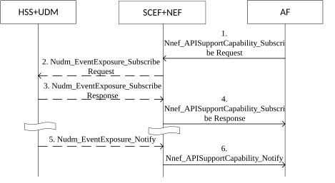
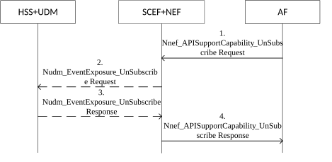
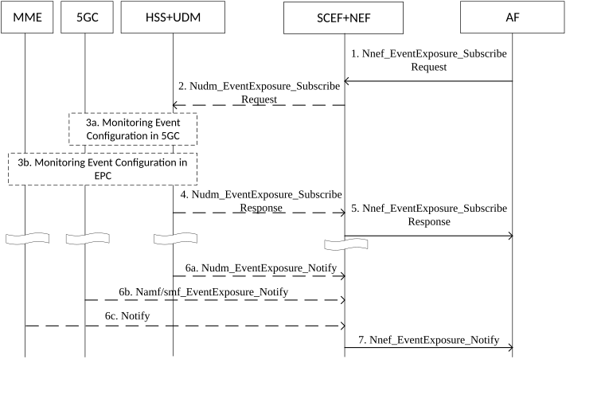

# 4.11.6 Interworking for common network exposure

## 4.11.6.1 Subscription and Notification of availability or expected level of support of a service API

Figure 4.11.6.1 1 represent the information flow subscribing and notifying the availability or expected level of support of a service API.

For the subscription to Nnef_APISupportCapability service, the subscription request may include the Duration of Reporting. If the Duration of Reporting is expired, the SCEF+NEF deletes the subscription without any explicit signalling interaction.

For the CN type Change Event subscription to the HSS+UDM, the subscription request may include the Duration of Reporting. If the Duration of Reporting is expired, the HSS+UDM locally unsubscribe the CN Type Change Event without any explicit signalling interaction.

The SCEF+NEF informs the AF of the API Indication which indicates list of available north-bound API(s).

Figure 4.11.6.1-1: Subscription and Notification of availability or expected level of support of a service API

1\. The AF subscribes to Nnef_APISupportCapability service for a UE or a group of UEs by sending Nnef_APISupportCapability_Subscribe Request (UE ID or External Group ID, Report Type, callback URI, Duration of Reporting) message.

The callback URI parameter is optional and is used in step 6 if provided.

The Report Type can be either One-time report or Continuous report. If this is a subscription for Continuous report type, then the Duration of Reporting may be included. The Duration of Reporting is optional and is used to indicate when the subscription is invalid. If the SCEF+NEF has established direct connection with MME or AMF or SMF, steps 2 - 3 and step 5 are omitted. If this is a subscription for One-time report type and if the Freshness Timer of last One-time report type subscribe request is not expired or a direct connection has been set up with MME or AMF or SMF, the SCEF+NEF determines the CN type locally, steps 2 - 3 are omitted.

2\. SCEF+NEF subscribes the CN Type Change Event to HSS+UDM by sending Nudm_EventExposure_Subscribe Request (CN Type Change, Report Type, UE ID or External Group ID, Duration of Reporting) message.

If Duration of Reporting is received at step 1, it shall include Duration of Reporting in this message.

3\. The HSS+UDM determines the CN type that is serving the indicated UE or the indicated group of UEs based on the registered MME or AMF. The HSS+UDM informs SCEF+NEF of the CN type by sending Nudm_EventExposure_Subscribe Response (CN Type) message. If the Report Type indicates One-time report, the HSS+UDM delete the CN Type Change Event subscription after sending the response with CN Type. The Freshness Timer is set in SCEF+NEF per operator's policy, e.g. based on the statistics of UE activities. If the Report Type indicates Continuous report, HSS+UDM stores the CN Type Change Event subscription.

4\. According to the CN type received or local stored, the SCEF+NEF determines the availability or expected level of support of common north-bound APIs for the indicated UE or the indicated group of UEs. SCEF+NEF responds to AF by sending Nnef_APISupportCapability_Subscribe Response (API Indication).

If the subscription is for One-time report type, then steps 5 - 6 are omitted.

5\. When HSS+UDM detects that the indicated UE is switching between EPC and 5GC the HSS+UDM determines the CN type that is serving the indicated UE or the indicated group of UEs. The HSS+UDM informs SCEF+NEF of the CN type by sending Nudm_EventExposure_Notify (CN type).

The CN type denotes the 5GC or EPC or 5GC+EPC serving the UE or the group of UEs.

6\. According to the CN type received and local detected, the SCEF+NEF node determines the availability or expected level of support of common north-bound APIs for the indicated UE or the indicated group of UEs. SCEF+NEF inform AF of such API information by sending Nnef_APISupportCapability_Notify (API Indication) message.

If callback URI is provided at step 1, then SCEF+NEF will send the Nnef_APISupportCapability_Notify (API Indication) message to the node addressed by callback URI.

Upon reception of API Indication in step 4 or step 6, the AF obtains the availability or expected level of support of a given service for the indicated UE or the indicated group of UEs. If required, the AF can select the valid north-bound API based on such API information.

## 4.11.6.2 Unsubscribing to N11otification of availability or expected level of support of a service API

Figure 4.11.6.2 1 represent the information flow unsubscribing to Continuous report type subscription of the availability or expected level of support of a service API.

If the AF invokes Nnef_APISupportCapability_Subscribe service to SCEF+NEF node with the Duration of Reporting parameter for Continuous report type, the subscription on the SCEF+NEF and HSS+UDM are implicitly unsubscribed if the Duration of Reporting timer expires, i.e. the explicit unsubscribe service operation is not needed.

If the explicit unsubscribe operation is needed, the information flow is as follows.

Figure 4.11.6.2 1: Unsubscribing to notification of the availability or expected level of support of a service API

1\. The AF unsubscribes to Nnef_APISupportCapability service for a UE or a group of UEs by sending APISupportCapability_Unsubscribe Request (UE ID or External Group ID) message.

2\. If SCEF+NEF has subscribed to CN Type Change Event for the indicated UE or the indicated group of UEs, SCEF+NEF unsubscribes the CN Type Change Event by sending Ndum_EventExposure_Unsubscribe Request (CN Type Change, UE ID or External Group ID) message to HSS+UDM.

3\. HSS+UDM deletes the CN Type Change Event subscription for the indicated UE or the indicated group of UEs, HSS+UDM responses to the SCEF+NEF by sending Ndum_EventExposure_Unsubscribe Response (Operation execution result indication) message.

4\. If result indication indicates the operation is successful, the SCEF+NEF deletes the subscription to Nnef_APISupportCapability service. SCEF+NEF acknowledges the operation result by sending Nnef_APISupportCapability_Unsubscribe Response (Operation execution result indication) to AF.

## 4.11.6.3 Configuration of monitoring events for common network exposure

Figure 4.11.6.3-1 represent the information flow to configure monitoring events applicable to both EPC and 5GC using 5GC procedures towards UDM in scenarios where interworking between 5GS and EPC is possible.

Figure 4.11.6.3-1: Configuration of monitoring events for common network exposure

1\. The AF configures a monitoring event via the SCEF+NEF using the Nnef_EventExposure_Subscribe service operation.

2\. SCEF+NEF configures the monitoring event in the UDM+HSS using the Nudm_EventExposure_Subscribe service operation.

The combined SCEF+NEF indicates that the monitoring event is also applicable to EPC (i.e. the event must be reported both by 5GC and EPC). Depending on the type of event, the SCEF+NEF may include a SCEF address (i.e. if the event needs to be configured in the MME and the corresponding notification needs to be sent directly to the SCEF).

3\. The HSS+UDM configures the monitoring event. For events that need to be reported from a serving node (e.g. location change) the HSS+UDM requests the configuration of the monitoring event to the corresponding serving node in the 5GC and EPC. The HSS+UDM uses the corresponding Event Exposure Subscribe service operation to configure monitoring events in 5GC serving NFs (e.g. Namf_EventExposure_Subscribe or Nsmf_EventExposure_Subscribe). The HSS+UDM uses the procedures defined in TS 23.682 \[23\] to configure monitoring events in MME. The HSS+UDM provides the MME with the SCEF address during the configuration of the monitoring event in EPC. If the HSS and UDM are deployed as separate network entities, UDM shall use HSS services to configure the monitoring event in EPC as defined in TS 23.632 \[68\].

4\. The HSS+UDM replies the SCEF+NEF with the indication that the monitoring event was successfully configured in 5GC and EPC by sending the Nudm_EventExposure_Subscribe Response.

5\. The SCEF+NEF responds to AF by sending Nnef_EventExposure_Subscribe Response.

6\. The SCEF+NEF is notified when HSS+UDM or the serving node at the 5GC or EPC detects the corresponding event. The HSS+UDM notifies the SCEF+NEF using the Nudm_EventExposure_Notify service operation. A serving NF in the 5GC notifies the SCEF+NEF using the corresponding Event Exposure Notify service operation (e.g. Namf_EventExposure_Notify or Nsmf_EventExposure_Notify). The MME notifies the SCEF+NEF using the procedures defined in TS 23.682 \[23\] using the SCEF address provided by the HSS+UDM in step 3.

7\. The SCEF+NEF notifies the AF using the Nnef_EventExposure_Notify service operation.
