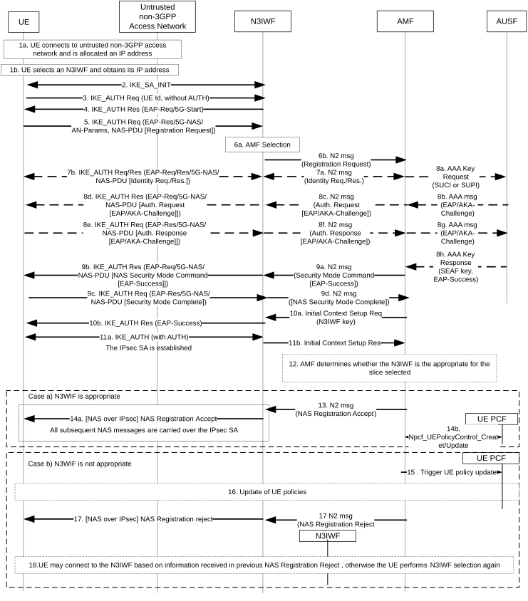

# 4.12.2 Registration via Untrusted non-3GPP Access

## 4.12.2.1 General

Clause 4.12.2 specifies how a UE can register to 5GC via an untrusted non-3GPP Access Network. It is based on the Registration procedure specified in clause 4.2.2.2.2 and it uses a vendor-specific EAP method called "EAP-5G". The EAP-5G packets utilize the "Expanded" EAP type and the existing 3GPP Vendor-Id registered with IANA under the SMI Private Enterprise Code registry. The "EAP-5G" method is used between the UE and the N3IWF and is utilized only for encapsulating NAS messages (not for authentication). If the UE needs to be authenticated, mutual authentication is executed between the UE and AUSF. The details of the authentication procedure are specified in TS 33.501 \[15\].

In Registration and subsequent Registration procedures via untrusted non-3GPP access, the NAS messages are always exchanged between the UE and the AMF. When possible, the UE can be authenticated by reusing the existing UE security context in AMF.

## 4.12.2.2 Registration procedure for untrusted non-3GPP access

The signalling flow in Figure 4.12.2.2-1 does not show all the details of a registration procedure via untrusted non-3GPP access. It shows primarily the steps executed between the UE and N3IWF. All the details of a registration procedure, including interactions with UDM, etc. are specified in clause 4.2.2.2.2.

Figure 4.12.2.2-1: Registration via untrusted non-3GPP access

1\. The UE connects to an untrusted non-3GPP Access Network with any appropriate authentication procedure and it is assigned an IP address. For example, a non-3GPP authentication method can be used, e.g. no authentication (in the case of a free WLAN), EAP with pre-shared key, username/password, etc. When the UE decides to attach to 5GC network, the UE not operating in SNPN access mode for NWu interface selects an N3IWF in a 5G PLMN, as described in clause 6.3.6 of TS 23.501 \[2\]. When the UE decides to attach to 5GC network, the UE operating in SNPN access mode for NWu interface selects an N3IWF in an SNPN, as described in clause 6.3.6.2a of TS 23.501 \[2\].

NOTE 1: The UE Selection of a N3IWF that supports the S-NSSAIs needed by the UE is enabled based on ANDSP configuration defined in TS 23.501 \[2\]. The N3IWF selection based on this information is documented in TS 23.501 \[2\].

2\. The UE proceeds with the establishment of an IPsec Security Association (SA) with the selected N3IWF by initiating an IKE initial exchange according to RFC 7296 \[3\]. After step 2, all subsequent IKE messages are encrypted and integrity protected by using the IKE SA established in this step.

3\. The UE shall initiate an IKE_AUTH exchange by sending an IKE_AUTH request message. The AUTH payload is not included in the IKE_AUTH request message, which indicates that the IKE_AUTH exchange shall use EAP signalling (in this case EAP-5G signalling). If the UE supports MOBIKE, it shall include a Notify payload in the IKE_AUTH request, as specified in RFC 4555 \[40\], indicating that MOBIKE is supported. In addition, as specified in TS 33.501 \[15\], if the UE is provisioned with the N3IWF root certificate, it shall include the CERTREQ payload within the IKE_AUTH request message to request the N3IWF's certificate. In the case of WLAN access, if the UE has an MPS subscription, the UE shall include a Notify payload in the IKE_AUTH request indicating its MPS subscription.

NOTE 2: Based on operator policy, the N3IWF can use the MPS subscription indication at this time to handle this UE with priority.

4\. The N3IWF responds with an IKE_AUTH response message, which includes an EAP-Request/5G-Start packet. The EAP-Request/5G-Start packet informs the UE to initiate an EAP-5G session, i.e. to start sending NAS messages encapsulated within EAP-5G packets. If the N3IWF has received a CERTREQ payload from the UE, the N3IWF shall include the CERT payload in the IKE_AUTH response message containing the N3IWF's certificate. How the UE uses the N3IWF's certificate is specified in TS 33.501 \[15\].

5\. The UE shall send an IKE_AUTH request, which includes an EAP-Response/5G-NAS packet that contains the Access Network parameters (AN parameters) and a Registration Request message. The AN parameters contain information that is used by the N3IWF for selecting an AMF in the 5G core network. This information includes e.g. the GUAMI, the Selected PLMN ID (or PLMN ID and NID, see clause 5.30 of TS 23.501 \[2\]), the Requested NSSAI and the Establishment cause. The Establishment cause provides the reason for requesting a signalling connection with 5GC and the N3IWF may use the Establishment cause to determine the DSCP value on N2.. Whether and how the UE includes the Requested NSSAI as part of the AN parameters is dependent on the value of the Access Stratum Connection Establishment NSSAI Inclusion Mode parameter, as specified in clause 5.15.9 of TS 23.501 \[2\]. The registration request may contain an indication that the UE supports N3IWF selection based on the slices the UE wishes to use over untrusted non-3GPP access (i.e. that the UE supports Extended Home N3IWF identifier configuration and Slice-specific N3IWF prefix configuration). If at step 1 the UE selects the N3IWF based on Tracking/Location Area of same PLMN as described in clause 6.3.6 of TS 23.501 \[2\], the UE may include this TA in the last visited TAI in registration request in order to help the AMF to determine the target N3IWF as described in step 17. If the UE in SNPN access mode for NWu interface performs the Registration procedure for UE onboarding, the UE shall include an indication in the AN parameters that the connection request is for onboarding. The Registration Type "SNPN Onboarding" indicates that the UE wants to perform SNPN Onboarding Registration.

NOTE 3: The N3IWF does not send an EAP-Identity request because the UE includes its identity in the first IKE_AUTH. This is in line with RFC 7296 \[3\] clause 3.16.

6\. The N3IWF shall select an AMF based on the received AN parameters and local policy, as specified in clause 6.3.5 of TS 23.501 \[2\]. The N3IWF shall then forward the Registration Request received from the UE to the selected AMF within an N2 message. This message contains N2 parameters that include the Selected PLMN ID and optionally the Selected NID and the Establishment cause.

NOTE 4: The Selected NID is present when the UE connects to an SNPN via Untrusted non-3GPP access.

7\. The selected AMF may decide to request the SUCI by sending a NAS Identity Request message to UE. This NAS message and all subsequent NAS messages are sent to UE encapsulated within EAP/5G-NAS packets. The AMF may use the Establishment cause to determine the Message Priority header and then the DSCP value for subsequent signalling according to TS 29.500 \[17\].

8\. The AMF may decide to authenticate the UE by invoking an AUSF. In this case, the AMF shall select an AUSF as specified in clause 6.3.4 of TS 23.501 \[2\] based on SUPI or SUCI.

The AUSF executes the authentication of the UE as specified in TS 33.501 \[15\]. The AUSF selects a UDM as described in clause 6.3.8 of TS 23.501 \[2\] and gets the authentication data from UDM. The authentication packets are encapsulated within NAS authentication messages and the NAS authentication messages are encapsulated within EAP/5G-NAS packets. After the successful authentication:

\- In step 8h, the AUSF shall send the anchor key (SEAF key) to AMF which is used by AMF to derive NAS security keys and a security key for N3IWF (N3IWF key). The UE also derives the anchor key (SEAF key) and from that key it derives the NAS security keys and the security key for N3IWF (N3IWF key). The N3IWF key is used by the UE and N3IWF for establishing the IPsec Security Association (in step 11).

\- In step 8h, the AUSF shall also include the SUPI, if in step 8a the AMF provided to AUSF a SUCI.

NOTE 5: EAP-AKA' or 5G-AKA are allowed for the authentication of UE via non-3GPP access, as specified in TS 33.501 \[15\]. Figure 4.12.2.2-1 only shows authentication flow using EAP-AKA'. Authentication methods other than EAP-AKA' or 5G-AKA are also allowed for UE accessing SNPN services via a PLMN, as specified in TS 33.501 \[15\], Annex I, as well as for UE accessing SNPN services directly via Untrusted non-3GPP access.

If the UE in SNPN access mode for NWu interface performs the Registration procedure for UE onboarding, the interaction between AMF and AUSF (step 8a, 8b, 8g and 8h in Figure 4.12.2.2-1) is replaced with step 9-1 or step 9-2 or step 9-3 in Figure 4.2.2.2.4-1, depending on the 5GC architecture that is used for UE onboarding.

9a. The AMF shall send a NAS Security Mode Command to UE in order to activate NAS security. If an EAP-AKA' authentication was successfully executed in step 8, the AMF shall encapsulate the EAP-Success received from AUSF within the NAS Security Mode Command message.

9b. The N3IWF shall forward the NAS Security Mode Command message to UE within an EAP/5G-NAS packet.

9c. The UE completes the EAP-AKA' authentication (if initiated in step 8), creates a NAS security context and an N3IWF key and sends the NAS Security Mode Complete message within an EAP/5G-NAS packet.

9d. The N3IWF relays the NAS Security Mode Complete message to the AMF.

10a. Upon receiving NAS Security Mode Complete, the AMF shall send an NGAP Initial Context Setup Request message that includes the N3IWF key.

10b. This triggers the N3IWF to send an EAP-Success to UE, which completes the EAP-5G session. No further EAP-5G packets are exchanged.

11\. The IPsec SA is established between the UE and N3IWF by using the common N3IWF key that was created in the UE in step 9c and received by the N3IWF in step 10a. This IPsec SA is referred to as the "signalling IPsec SA". After the establishment of the signalling IPsec SA, the N3IWF notifies the AMF that the UE context (including AN security) was created by sending a NGAP Initial Context Setup Response. The signalling IPsec SA shall be configured to operate in tunnel mode and the N3IWF shall assign to UE:

a\) an "inner" IP address; and

b\) a NAS_IP_ADDRESS and a TCP port number.

The N3IWF may apply a DSCP value to this signalling IPsec SA, in which case all IP packets exchanged between the UE and N3IWF via the "signalling IPsec SA" shall be marked with this DSCP value. If the N3IWF has received an indication that the UE supports MOBIKE (see step 3), then the N3IWF shall include a Notify payload in the IKE_AUTH response message sent in step 11a, indicating that MOBIKE shall be supported, as specified in RFC 4555 \[40\].

NOTE 6: The DSCP value is determined by operator policy, and may e.g., be based on the DSCP value on N2.

All subsequent NAS messages exchanged between the UE and N3IWF shall be sent via the signalling IPsec SA and shall be carried over TCP/IP. The UE shall send NAS messages within TCP/IP packets with source address the "inner" IP address of the UE and destination address the NAS_IP_ADDRESS that is received in step 11a. The N3IWF shall send NAS messages within TCP/IP packets with source address the NAS_IP_ADDRESS and destination address the "inner" IP address of the UE. The TCP connection used for reliable NAS transport between the UE and N3IWF shall be initiated by the UE right after the signalling IPsec SA is established in step 11a. The UE shall send the TCP connection request to the NAS_IP_ADDRESS and to the TCP port number specified in TS 24.502 \[41\].

12\. The AMF determines the allowed subset of the Requested NSSAI that is allowed by the Subscribed S-NSSAI(s); the AMF may detect that the N3IWF used by the UE is not compatible with this allowed subset and based on operator's policy configured in the AMF, the AMF determines whether a different N3IWF should be used. If the UE supports slice-based N3IWF selection and the AMF determines to use a different N3IWF, then the AMF proceeds with steps 15-19. Otherwise, i.e. if the AMF determines to use the selected N3IWF that supports part of the allowed subset, the AMF proceeds with steps 13 and 14. In this case, steps 15-19 are skipped.

NOTE 7: The AMF considers the subscribed S-NSSAI(s) before determining to trigger the UE PCF to avoid triggering the UE PCF to update the UE policies for Requested S-NSSAIs that the UE is not subscribed for.

13\. The AMF sends the NAS Registration Accept message in an N2 message sent to the N3IWF. The N2 Message includes the Allowed NSSAI for the access type for the UE. The Allowed NSSAI is a subset of the slices supported by the selected N3IWF.

14\. The N3IWF forwards the NAS Registration Accept message to UE via the established signalling IPsec SA. If the NAS Registration Accept message is received by the N3IWF before the IPsec SA is established, the N3IWF shall store it and forward it to the UE only after the establishment of the signalling IPsec SA.

14b. The AMF may trigger a UE policy association as described in clause 4.2.2.2.2 if a UE policy association does not exist yet. If the UE Registration Request contains an indication that the UE supports N3IWF selection based on the slices the UE wishes to use over untrusted non-3GPP access the AMF indicates to the PCF that the UE supports N3IWF selection based on the slices the UE wishes to use over untrusted non-3GPP access.

Steps 15 to 19 correspond to the case where the AMF has detected that the N3IWF used by the UE is not compatible with the subset of the requested NSSAI that is allowed by the subscribed S-NSSAI(s).

15\. If the AMF is able to select a UE PCF that supports UE policies for slice specific N3IWF selection, the AMF may trigger UE policy association establishment if a suitable UE policy association does not exist yet. The AMF indicates to the PCF that the UE supports N3IWF selection based on the slices the UE wishes to use over untrusted non-3GPP access.

The AMF triggers the UE PCF to update the UE policies for slice specific N3IWF selection.

The AMF requests the PCF to receive a notification when the PCF has completed the update of these UE policies.

16\. The PCF updates the UE policies for slice specific N3IWF selection per the procedure defined in figure 4.2.4.3-1. When the update of these UE policies is completed, the PCF notifies the AMF by invoking Npcf_UEPolicyControl_UpdateNotify.

17\. The AMF sends via the N3IWF a UE Registration Reject indicating that the UE selected N3IWF was not appropriate for the requested slices that the UE is allowed to access to. The AMF optionally may provide target N3IWF information (FQDN and/or IP address) to the UE within the Registration Reject message.

NOTE 8: The AMF uses locally configured N3IWF information to provide target N3IWF information.

NOTE 9: The AMF may determine a target N3IWF that supports the subset of the requested NSSAI that is allowed by the subscribed S-NSSAI(s) based on the list of supported TAs and the corresponding list of supported slices for each TA obtained in N2 interface management procedures as specified in TS 38.413 \[10\]. To determine the target N3IWF, the AMF may take into account UE location corresponding to last visited TAI included in Registration Request as described at step 5 when the UE selects N3IWF based on Tracking/Location Area of same PLMN.

18\. If supported by the UE and if the UE received target N3IWF information in step 17, the UE connects to the target N3IWF, otherwise the UE may perform N3IWF selection again using the updated N3IWF selection information received in step 16. The UE uses the target N3IWF information in the Registration Reject only for the N3IWF selection directly following the rejected registration and UE shall not store for future use.

The AMF provides the Access Type set to "Non-3GPP access" to the UDM when it registers with the UDM and the RAT type determined as specified in clause 5.3.2.3 of TS 23.501 \[2\].

NOTE 10: The Access Type and the RAT type are is set to "Untrusted Non-3GPP access" even when the UE accesses SNPN services via PLMN over 3GPP access.

## 4.12.2.3 Emergency Registration for untrusted non-3GPP Access

Emergency Registration procedure is used by UEs requiring to perform emergency services but cannot gain normal services from the network. These UEs are in limited service state as defined in TS 23.122 \[22\].

The regular registration procedure described in clause 4.12.2 applies with the following differences:

\- If the UE has no SUPI and no valid 5G-GUTI, PEI shall be included instead of its encrypted Permanent User ID (SUCI) in the NAS message.

\- NSSAI shall not be included by the UE. The AMF shall not send the Allowed NSSAI in the Registration Accept message.

\- If the AMF is not configured to support Emergency Registration, the AMF shall reject any Registration Request that indicates Registration type "Emergency Registration".

\- If the AMF is configured to support Emergency Registration for unauthenticated UEs and the UE indicated Registration Type "Emergency Registration", the AMF skips the authentication and security setup or the AMF accepts that the authentication may fail and continues the Emergency Registration procedure.

\- If the authentication is performed successfully, the NAS messages will be protected by the NAS security functions (integrity and ciphering). The AMF shall derive the N3IWF key, per TS 33.501 \[15\] and shall provide it to the N3IWF after the authentication completion using an NGAP Initial Context Setup Request message as in the regular registration procedure.

\- If the authentication is skipped or authentication fails, the NAS messages will not be protected by the NAS security functions (integrity and ciphering). However, the AMF shall create an N3IWF key and shall provide it to the N3IWF after the authentication completion (whenever authentication has failed or has been skipped) using an NGAP Initial Context Setup Request message. The N3IWF shall use it to complete IKE SA establishment and shall acknowledge the AMF by sending an NGAP Initial Context Setup Response message.

NOTE: According to TS 33.501 \[15\], the UE and the AMF independently generate the KAMF (and derived keys) in an implementation defined way and populate the 5G NAS security context with this KAMF to be used when activating a 5G NAS security context."

\- As in step 14 of figure 4.2.2.2.2-1 for Emergency Registration, if the UE was not successfully authenticated, the AMF shall not update the UDM. Also for an Emergency Registration, the AMF shall not check for access restrictions, regional restrictions or subscription restrictions.

\- Steps 16 and 21b of figure 4.2.2.2.2-1 are not performed since AM and UE policy for the UE are not required for Emergency Registration.
