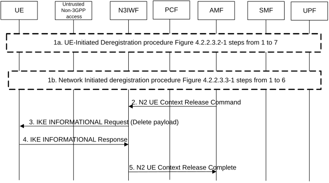

# 4.12.3 Deregistration procedure for untrusted non-3gpp access

Figure 4.12.3-1: Deregistration procedure for untrusted non-3gpp access

1\. The Deregistration procedure is triggered by one of the events:

1a. For UE-initiated Deregistration as in steps from 1 to 7 of Figures 4.2.2.3.2-1.

1b. For network initiated deregistration as in steps from 1 to 6 of Figure 4.2.2.3.3-1.

If the UE is in CM-CONNECTED state either in 3GPP access, non-3GPP access or both,

\- the AMF may explicitly deregister the UE by sending a Deregistration request message ( Deregistration type, access type set to non-3GPP) to the UE as in step 2 of Figure 4.2.2.3.3-1.

\- the UDM may want to request the deletion of the subscribers RM contexts and PDU Sessions with the reason for removal set to subscription withdrawn to the registered AMF as in step 1 of Figure 4.2.2.3.3-1.

2\. AMF to N3IWF: The AMF sends a N2 Context UE Release Command message to the N3IWF with the cause set to Deregistration to release N2 signalling as defined in step 4 of clause 4.12.4.2.

3\. N3IWF to UE: The N3IWF sends INFORMATIONAL Request (Delete payload) message to the UE. The Delete payload is included to indicate the release of the IKE SA.

4\. UE to N3IWF: The UE sends an empty INFORMATIONAL Response message to acknowledge the release of the IKE SA as described in RFC 7296 \[3\]. Non-3GPP access specific resources are released including the IKEv2 tunnel (and the associated IPsec resources) and the local UE contexts in N3IWF (N3 tunnel Id).

5\. N3IWF to AMF: The N3IWF acknowledges the N2 UE Context Release Command message by sending N2 UE Context Release Complete message to the AMF as defined in step 7 of clause 4.12.4.2.
