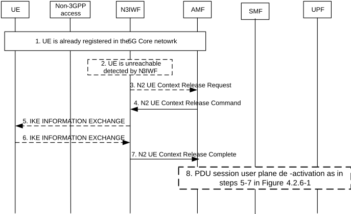

# 4.12.4 N2 procedures via Untrusted non-3GPP Access

## 4.12.4.1 Service Request procedures via Untrusted non-3GPP Access

The Service Request procedure via Untrusted non-3GPP Access shall be used by a UE in CM-IDLE state over non-3GPP access to request the re-establishment of the NAS signalling connection and the re-establishment of the user plane for all or some of the PDU Sessions which are associated to non-3GPP access.

The Service Request procedure via Untrusted non-3GPP Access shall be used by a UE in CM-CONNECTED state over non-3GPP access to request the re-establishment of the user plane for one or more PDU Sessions which are associated to non-3GPP access.

When the UE is in CM-IDLE state over non-3GPP access, the Service Request procedure via Untrusted non-3GPP Access is as described in clause 4.2.3.2 (UE Triggered Service Request) with the following exceptions:

\- The Service Request procedure is never a response to a Paging, i.e. there is no Network Triggered Service Request procedure via Untrusted non-3GPP Access.

\- The (R)AN corresponds to an N3IWF.

\- The UE establishes a "signalling IPsec SA" with the N3IWF by using the procedure specified in clause 4.12.2 for the registration via untrusted non-3GPP access. In particular, the UE includes the Service Request and the AN parameters in an EAP-5G packet, which is further encapsulated in an IKE_AUTH request.

\- The AN parameters include the Selected PLMN ID (or PLMN ID and NID, see clause 5.30 of TS 23.501 \[2\]) and Establishment cause. The Establishment cause provides the reason for requesting a signalling connection with the 5GC. The UE includes GUAMI information in the AN parameters. The N3IWF selects the AMF according to GUAMI information.

\- The N2 parameters sent from N3IWF to AMF include the Establishment cause.

\- The user plane between the UE and N3IWF is established not with RRC signalling but with IKEv2 signalling, as specified in clause 4.12.5 (i.e. by using an IKEv2 Create_Child_SA exchange). The IKEv2 Create Child SA Request may include the Additional QoS Information to reserve non-3GPP specific QoS resources as defined in clause 4.12a.5. The user plane of each PDU Session consists of one or more Child SAs.

When the UE is in CM-CONNECTED state over non-3GPP access, the Service Request procedure via Untrusted non-3GPP Access is as described in clause 4.2.3.2 (UE Triggered Service Request) with the following exceptions:

\- All NAS signalling exchanged between the UE and network is transferred within the established "signalling IPsec SA".

\- The (R)AN corresponds to an N3IWF.

\- The user plane between the UE and N3IWF is established not with RRC signalling but with IKEv2 signalling, as specified in clause 4.12.5 (i.e. by using an IKEv2 Create_Child_SA exchange). The user plane of each PDU Session consists of one or more Child SAs.

When the UE is in CM-CONNECTED state over non-3GPP access and the network receives downlink data for a PDU Session over non-3GPP access that has no user plane, the steps 1-4a in clause 4.2.3.3 (Network Triggered Service Request) shall be performed with the following exceptions:

\- The (R)AN corresponds to an N3IWF.

\- The user plane between the UE and N3IWF is established (in step 4a) with IKEv2 signalling, as specified in clause 4.12.5 (i.e. by using an IKEv2 Create_Child_SA exchange). The user plane of each PDU Session consists of one or more Child SAs.

## 4.12.4.2 Procedure for the UE context release in the N3IWF

This procedure is used to release the N2 signalling connection and the N3 User Plane connection. If the procedure is initiated by the AMF the IKEv2 SA for a UE is being released. The procedure will move the UE from CM-CONNECTED to CM-IDLE in AMF and all UE related context information is deleted in the N3IWF.

Both N3IWF-initiated and AMF-initiated UE context release in the N3IWF procedures are shown in Figure 4.12.4.2-1.

Figure 4.12.4.2-1: Procedure for the UE context release in the N3IWF

1\. The UE has already registered in the 5GC and may have established one or multiple PDU Sessions.

2\. The N3IWF detects that the UE is not reachable.

3\. The N3IWF sends a N2 UE Context Release Request message to the AMF This step is equivalent to step 1b of Figure 4.2.6-1.

NOTE: AN Release procedure can also be triggered by an AMF internal event and in that case step 2 and step 3 do not take place.

4\. AMF to N3IWF: If the AMF receives the N2 UE Context Release Request from N3IWF or if due to an internal AMF event the AMF wants to release N2 signalling, the AMF sends an N2 UE Context Release Command (Cause) to the N3IWF. The cause indicated is cause from step 3 or a cause due to internal AMF event. This step is equivalent to step 2 of Figure 4.2.6-1.

5\. If the IKEv2 tunnel has not been released yet, the N3IWF performs the release of the IPsec tunnel as defined in RFC 7296 \[3\] indicating to release the IKE SA and any Child IPsec SA if existing. The N3IWF sends to the UE the indication of the release reason if received in step 4.

6\. The UE sends an empty INFORMATIONAL Response message to acknowledge the release of the IKE SA as described in RFC 7296 \[3\]. The N3IWF deletes the UE's context after receiving the empty INFORMATIONAL Response message.

7\. N3IWF to AMF: The N3IWF confirms the release of the UE-associated N2-logical connection by returning N2 UE Release Complete (list of PDU Session ID(s) with active N3 user plane) to the AMF as in step 4 defined in clause 4.2.6. The AMF marks the UE as CM-IDLE state in untrusted non-3GPP access.

8\. For each of the PDU Sessions in the N2 UE Context Release Complete, the steps 5 to 7 in clause 4.2.6 are performed (PDU Session Update SM Context). After the AMF receives the Nsmf_PDUSession_UpdateSMContext Response as in step 7 of clause 4.2.6, the AMF considers the N3 connection as released. If list of PDU Session ID(s) with active N3 user plane is included in step 3, then this step is performed before step 4.

## 4.12.4.3 CN-initiated selective deactivation of UP connection of an existing PDU Session associated with Untrusted non-3GPP Access

The procedure described in clause 4.3.7 (CN-initiated selective deactivation of UP connection of an existing PDU Session) is used for CN-initiated selective deactivation of UP connection for an established PDU Session associated with non-3GPP Access of a UE in CM-CONNECTED state, with the following exceptions:

\- The NG-RAN corresponds to an N3IWF.

\- The user plane between the UE and N3IWF, i.e. Child SA(s) for the PDU Session, is released not with RRC signalling but with IKEv2 signalling, as specified in clause 4.12.7.
