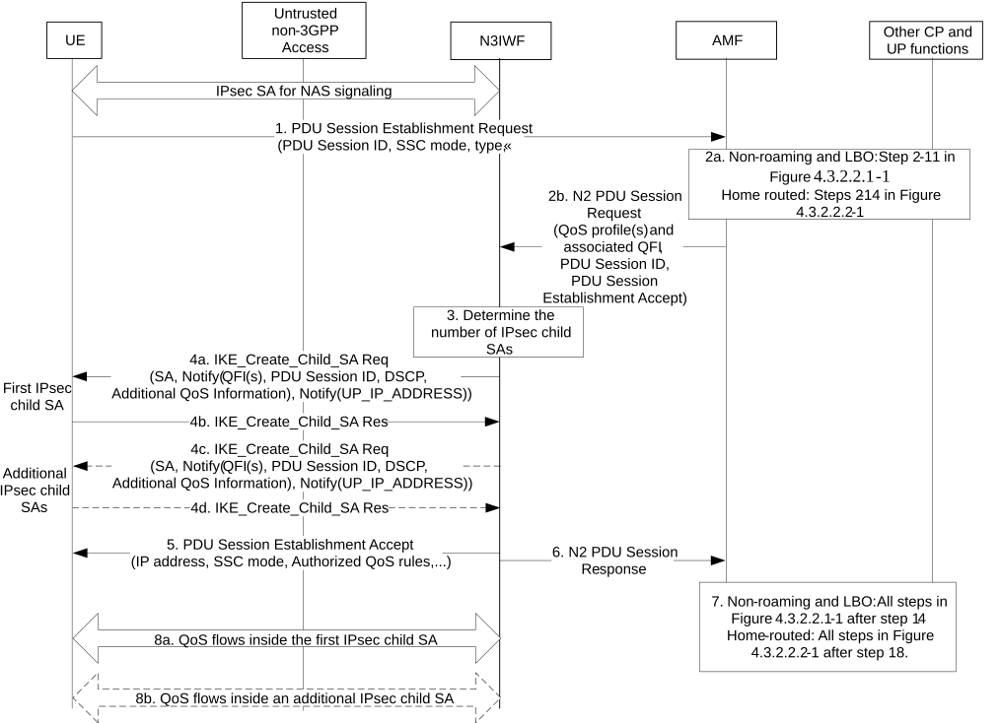

# 4.12.5 UE Requested PDU Session Establishment via Untrusted non-3GPP Access

Clause 4.12.5 specifies how a UE can establish a PDU Session via an untrusted non-3GPP Access Network as well as to hand over an existing PDU Session between 3GPP access and non-3GPP access. The procedure applies in non-roaming, roaming with LBO as well as in home-routed roaming scenarios.

For non-roaming and LBO scenarios, if the UE is simultaneously registered to a 3GPP access in a PLMN different from the PLMN of the N3IWF, the functional entities in the following procedures are located in the PLMN of the N3IWF. For home-routed roaming scenarios, the AMF, V-SMF and associated UPF in VPLMN in the following procedure is located in the PLMN of the N3IWF.

The procedure below is based on the PDU Session Establishment procedure specified in clause 4.3.2.2.1 (for non-roaming and roaming with LBO) and the PDU Session Establishment procedure specified in clause 4.3.2.2.2 (for home-routed roaming).

Figure 4.12.5-1: PDU Session establishment via untrusted non-3GPP access

1\. The UE shall send a PDU Session Establishment Request message to AMF as specified in step 1 of clause 4.3.2.2.1. This message shall be sent to N3IWF via the IPsec SA for NAS signalling (established as specified in clause 4.12.2) and the N3IWF shall transparently forward it to AMF in the 5GC.

2a. In the case of non-roaming or roaming with Local Breakout, steps 2-11 specified in clause 4.3.2.2.1are executed according to the PDU Session Establishment procedure over 3GPP access. In the case of home-routed roaming, steps 2-14 specified in clause 4.3.2.2.2 are executed according to the PDU Session Establishment procedure over 3GPP access.

2b. As described in step 12 of clause 4.3.2.2.1, the AMF shall send a N2 PDU Session Request message to N3IWF to establish the access resources for this PDU Session.

3\. Based on its own policies and configuration and based on the QoS profiles received in the previous step, the N3IWF shall determine the number of IPsec Child SAs to establish and the QoS profiles associated with each IPsec Child SA. For example, the N3IWF may decide to establish one IPsec Child SA and associate all QoS profiles with this IPsec Child SA. In this case, all QoS Flows of the PDU Session would be transferred over one IPsec Child SA.

4a. The N3IWF shall send to UE an IKE Create_Child_SA request according to the IKEv2 specification in RFC 7296 \[3\] to establish the first IPsec Child SA for the PDU Session. The IKE Create_Child_SA request indicates that the requested IPsec Child SA shall operate in tunnel mode. This request shall include a 3GPP-specific Notify payload which contains (a) the QFI(s) associated with the Child SA, (b) the identity of the PDU Session associated with this Child SA, (c) optionally, a DSCP value associated with the Child SA, (d) optionally a Default Child SA indication and (e) optionally, the Additional QoS Information specified in clause 4.12a.5

The IKE Create_Child_SA request shall also include another 3GPP-specific Notify payload, which contains the UP_IP_ADDRESS that is specified in step 8 below.

If a DSCP value is included, then the UE and the N3IWF shall mark all IP packets sent over this Child SA with this DSCP value. There shall be one and only one Default Child SA per PDU session. The UE shall send all QoS Flows to this Child SA for which there is no mapping information to a specific Child SA. The IKE Create_Child_SA request also contains other information (according to RFC 7296 \[3\]) such as the SA payload, the Traffic Selectors (TS) for the N3IWF and the UE, etc.

After receiving the IKE Create_Child_SA request, if the Additional QoS Information is received, the UE may reserve non-3GPP Access Network resources according to the Additional QoS Information.

4b. If the UE accepts the new IPsec Child SA, the UE shall send an IKE Create_Child_SA response according to the IKEv2 specification in RFC 7296 \[3\]. During the IPsec Child SA establishment the UE shall not be assigned an IP address.

4c-4d. If in step 3 the N3IWF determined to establish multiple IPsec Child SAs for the PDU Session, then additional IPsec Child SAs shall be established, each one associated with one or more QFI(s), optionally with a DSCP value, with a UP_IP_ADDRESS and optionally with the Additional QoS Information specified in clause 4.12a.5. For each IPsec Child SA, if the Additional QoS Information is received, the UE may reserve non-3GPP Access Network resources according to the Additional QoS Information for the IPsec Child SA.

5\. After all IPsec Child SAs are established, the N3IWF shall forward to UE via the signalling IPsec SA (see clause 4.12.2.2) the PDU Session Establishment Accept message received in step 2b.

6\. The N3IWF shall send to AMF an N2 PDU Session Response.

7\. In the case of non-roaming or roaming with Local Breakout, all steps specified in clause 4.3.2.2.1 after step 14 are executed according to the PDU Session Establishment procedure over 3GPP access. In the case of home-routed roaming, all steps specified in clause 4.3.2.2.2 after step 18 are executed according to the PDU Session Establishment procedure over 3GPP access.

8\. On the user-plane:

\- When the UE has to transmit an UL PDU, the UE shall determine the QFI associated with the UL PDU (by using the QoS rules of the PDU Session), it shall encapsulate the UL PDU inside a GRE packet and shall forward the GRE packet to N3IWF via the IPsec Child SA associated with this QFI. The header of the GRE packet carries the QFI associated with the UL PDU. The UE shall encapsulate the GRE packet into an IP packet with source address the "inner" IP address of the UE and destination address the UP_IP_ADDRESS associated with the Child SA.

\- When the N3IWF receives a DL PDU via N3, the N3IWF uses the QFI and the identity of the PDU Session in order to determine the IPsec Child SA to use for sending the DL PDU over NWu. The N3IWK encapsulates the DL PDU inside a GRE packet and copies the QFI in the header of the GRE packet. The N3IWF may include also in the GRE header a Reflective QoS Indicator (RQI), which shall be used by the UE to enable reflective QoS. The N3IWF shall encapsulate the GRE packet into an IP packet with source address the UP_IP_ADDRESS associated with the Child SA and destination address the "inner" IP address of the UE.
