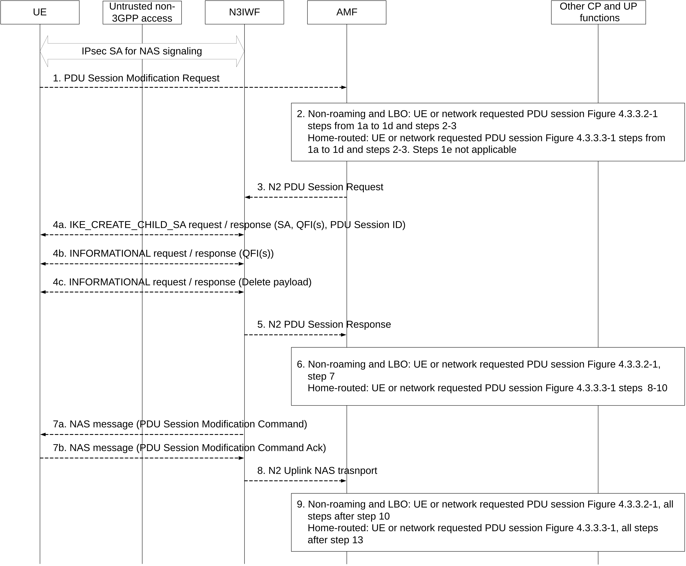

# 4.12.6 UE or Network Requested PDU Session Modification via Untrusted non-3GPP access

The UE or network requested PDU Session Modification procedure via untrusted non-3GPP access is depicted in figure 4.12.6-1. The procedure applies in non-roaming, roaming with LBO as well as in home-routed roaming scenarios.

For non-roaming and LBO scenarios, the functional entities in the following procedures are located in the PLMN of the N3IWF.

The procedure below is based on the PDU Session Modification procedure specified in clause 4.3.3.2 (for non-roaming and roaming with LBO) and on the PDU Session Modification procedure specified in clause 4.3.3.3 (for home-routed roaming).

Figure 4.12.6-1: UE or Network Requested PDU Session Modification via untrusted non-3GPP access

1\. If the PDU Session Modification procedure is initiated by the UE, the UE shall send a PDU Session Modification Request message to AMF as specified in step 1 of clause 4.3.2.2. The message shall be sent to N3IWF via the established IPsec SA for NAS signalling. The N3IWF shall transparently forward the PDU Session Modification Request to AMF/SMF.

2\. In the case of non-roaming or LBO, the steps 1a (from AMF) to 1e and steps 2-3 as per the PDU Session Modification procedure in clause 4.3.3.2 are executed.

In the case of home-routed, the steps 1a (from AMF) to 1d and steps 2-3 as per the PDU Session Modification procedure in clause 4.3.3.3 are executed.

3\. The AMF sends N2 PDU Session Resource Modify Request (N2 SM information received from SMF, NAS message) message to the N3IWF. This step is the same as step 4 in clause 4.3.3.2 (for non-roaming and roaming with Local Breakout) and step 5 in clause 4.3.3.3 (for home-routed roaming).

4\. The N3IWF may issue IKEv2 signalling exchange with the UE that is related with the information received from SMF according to the IKEv2 specification in RFC 7296 \[3\]. Based on the N2 SM information received from the SMF, the N3IWF may perform one of the following:

4a. The N3IWF may decide to create a new Child SA for the new QoS Flow(s). In this case, the N3IWF establishes a new Child SA by sending an IKE_CREATE_CHILD_SA request message, which includes the SA, the PDU Session ID, the QFI(s), optionally a DSCP value and optionally the Additional QoS Information specified in clause 4.12a.5. If the Additional QoS Information is received, the UE may reserve non-3GPP Access Network resources according to the Additional QoS Information.

4b. The N3IWF may decide to add or remove QoS Flow(s) to/from an existing Child SA. In this case, the N3WIF updates the QoS Flow and Child SA mapping information by sending an INFORMATIONAL request message, which includes the QFI(s) associated with the Child SA and optionally the Additional QoS Information specified in clause 4.12a.6, which contains the new QoS information that should be associated with the existing Child SA. If the Additional QoS Information is received, the UE may update the reserved non-3GPP Access Network resources for the existing Child SA according to the Additional QoS Information.

4c. The N3IWF may decide to delete an existing Child SA, e.g. when there is no QoS Flow mapped to this Child SA. In this case, the N3IWF deletes the existing Child SA by sending INFORMATIONAL request message, which includes a Delete payload.

NOTE: If the N3IWF has included the Default Child SA indication during the establishment of one of the Child SAs of the PDU Session, the N3IWF may not update the mapping between QoS Flows Child SAs.

5\. The N3IWF acknowledges N2 PDU Session Request by sending a N2 PDU Session Response Message to the AMF to acknowledge the success or failure of the request.

6\. In the case of non-roaming or LBO, step 7 as per the PDU Session Modification procedure in clause 4.3.3.2 is executed. In the case of home-routed, the steps 8-10 as per the PDU Session Modification procedure in clause 4.3.3.3 are executed.

7\. The N3IWF sends the PDU Session Modification Command to UE (if received in step 3) and receives the response message from UE.

Steps 4a/4c and step 7 may happen consecutively. Steps 7b map happen before step 4b/4d.

8\. The N3IWF forwards the NAS message to the AMF.

9\. For non-roaming and roaming with LBO, all the steps after step 10 in clause 4.3.3.2 are executed according to the general PDU Session Modification procedure. For home-routed roaming, all steps after step 13 in clause 4.3.3.3 are executed according to the general PDU Session Modification procedure.
