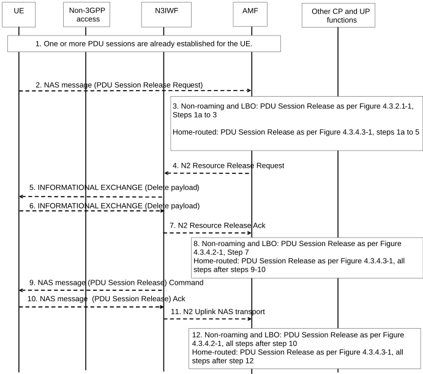

# 4.12.7 UE or network Requested PDU Session Release via Untrusted non-3GPP access

Clause 4.12.7 specifies how a UE or network can release a PDU Session via an untrusted non-3GPP Access Network. The UE requested PDU Session Release procedure via Untrusted non-3GPP access applies in non-roaming, roaming with LBO as well as in home-routed roaming scenarios.

For non-roaming and LBO scenarios, if the UE is simultaneously registered to a 3GPP access in a PLMN different from the PLMN of the N3IWF, the functional entities in the following procedures are located in the PLMN of the N3IWF. For home-routed roaming scenarios, the AMF, V-SMF and associated UPF in VPLMN in the following procedure is located in the PLMN of the N3IWF.

NOTE: If the UE is simultaneously registered to 3GPP access in the same PLMN as non-3GPP access, when non-3GPP access is not available to the UE (e.g. due to out of non-3GPP access coverage) or UE is in CM-IDLE for non-3GPP access, the UE may perform the PDU Session Release procedure via 3GPP access as described in clause 4.3.4.

Figure 4.12.7-1: UE Requested PDU Session Release via Untrusted non-3GPP access

1\. One or more PDU Sessions are already established for the UE using the procedure described in clause 4.12.2.

2\. The UE sends a NAS message (N1 SM container (PDU Session Release Request), PDU Session ID) to the AMF via the N3IWF as defined in clause 4.3.4.

3\. For non-roaming and roaming with LBO, the steps 1a (from AMF) to 4 according to the PDU Session Release procedure defined in clause 4.3.4.2 are executed. For home-routed roaming, the steps 1a (from AMF) to step 7 according to the PDU Session Release procedure defined in clause 4.3.4.3 are executed.

4\. This step is the same as step 4 in clause 4.3.4.2 (non-roaming and LBO) and step 6 in clause 4.3.4.3 (home-routed roaming).

If the message received from the SMF does not include N2 SM Resource Release request, the AMF sends N2 Downlink NAS transport (N1 SM container (PDU Session Release Command), PDU Session ID, Cause) message to the N3IWF and steps 5 to 8 are skipped.

5\. Upon receiving AN session release request message from the AMF, the N3IWF triggers the release of the corresponding Child SA by sending INFORMATIONAL EXCHANGE (Delete Payload) to the UE. Delete payload is included in the message listing the SPIs of the Child SAs to be deleted to this PDU Session as described in RFC 7296 \[3\].

6\. The UE responds with INFORMATIONAL EXCHANGE (Delete Payload) message. Delete payload is included for the paired SAs going in the other direction as described in RFC 7296 \[3\].

7\. This step is the same as step 6 in 4.3.4.2 (non-roaming and LBO) and step 8 in clause 4.3.4.3 (home-routed roaming).

8\. For non-roaming and roaming with LBO, steps 7 according to the PDU Session Release procedure defined in clause 4.3.4.2 are executed. For home-routed roaming, step 9-10 according to the PDU Session Release procedure defined in clause 4.3.4.3 are executed.

9\. The N3IWF delivers the NAS message (N1 SM container (PDU Session Release Command), PDU Session ID, Cause) to the UE.

10\. The UE sends a NAS message (N1 SM container (PDU Session Release Ack), PDU Session ID) to the N3IWF.

11\. This step is the same as step 9 in 4.3.4.2 (non-roaming and LBO) and step 11 in clause 4.3.4.3 (home-routed roaming).

Steps 5 and 9 may happen consecutively. Step 10 may happen before step 6.

12\. For non-roaming and roaming with LBO, all steps after step 10 in the PDU Session Release procedure defined in clause 4.3.4.2 are executed. In the case of home-routed roaming, all steps after step 12 in the PDU Session Release procedure defined in clause 4.3.4.3 are executed.

The network requested PDU Session Release procedure via Untrusted non-3GPP access is the same as the network requested PDU Session Release Procedure specified in clause 4.3.4.2 (for Non-Roaming and Roaming with Local Breakout) with the following differences:

\- The (R)AN corresponds to an N3IWF.

\- In step 5 the N3IWF upon receiving N2 SM request to release the AN resources associated with the PDU Session from the AMF, the N3IWF triggers the release of the corresponding Child SA to the UE as specified in step 5 and 6, in Figure 4.12.7-1.

\- User Location Information is not included in the step 6, 7a, 9, 10a and 12 of the procedure.
