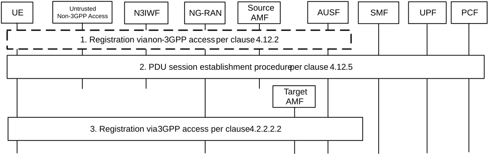

# 4.12.8 Mobility from a non-geographically selected AMF to a geographically selected AMF

This procedure describes the AMF change that takes place when an UE initially served via non-3GPP access by an AMF selected based on non-geographical criteria (e.g. because the UE had no 3GPP access coverage or because only non-geographically selectable N3IWF are deployed) gets 3GPP access and is now to be served by an AMF selected in the same PLMN by the NG-RAN based on geographical criteria.

Figure 4.12.8-1: Mobility from a non-geographically selected AMF to a geographically selected AMF

1\. The UE registers over non-3GPP access, as described in clause 4.12.2. During this procedure:

a An AMF (source AMF) is selected by the N3IWF in step 6a, based on non-geographical criteria (e.g. because the UE has no 3GPP access coverage or because only non-geographically selectable N3IWF are deployed).

b The UE receives, within the Registration Accept message, a 5G-GUTI containing a GUAMI of the non-geographically selected AMF. The UE also receives an Allowed NSSAI and optionally Mapping Of Allowed NSSAI.

2\. The UE may activate PDU Sessions over non-3GPP access, as described in clause 4.12.5.

3\. The UE gets 3GPP access and issues a Registration Request over 3GPP access as defined in step 1 of Figure 4.2.2.2.2-1, providing its 5G-GUTI.

If the 5G-GUTI does not indicate an AMF of the same Region ID as that of the NG-RAN, the NG-RAN selects an AMF Set and an AMF in the AMF Set as described in clause 6.3.5 of TS 23.501 \[2\].

Steps 3 to 22 of Figure 4.2.2.2.2-1 take place including following aspects:

\- step 4 of Figure 4.2.2.2.2-1 takes place i.e. the new AMF invokes the Namf_Communication_UEContextTransfer service operation on the old AMF to request the UE's SUPI and MM Context.

\- in step 5 of Figure 4.2.2.2.2-1, the old AMF includes information about active NGAP association to N3IWF.

\- in step 18 of Figure 4.2.2.2.2-1, the new AMF modifies the NGAP association toward N3IWF.

\- in step 21 of Figure 4.2.2.2.2-1, the Registration Accept message shall include the updated 5G-GUTI that the UE will use to update its 3GPP and non-3GPP registration contexts.
