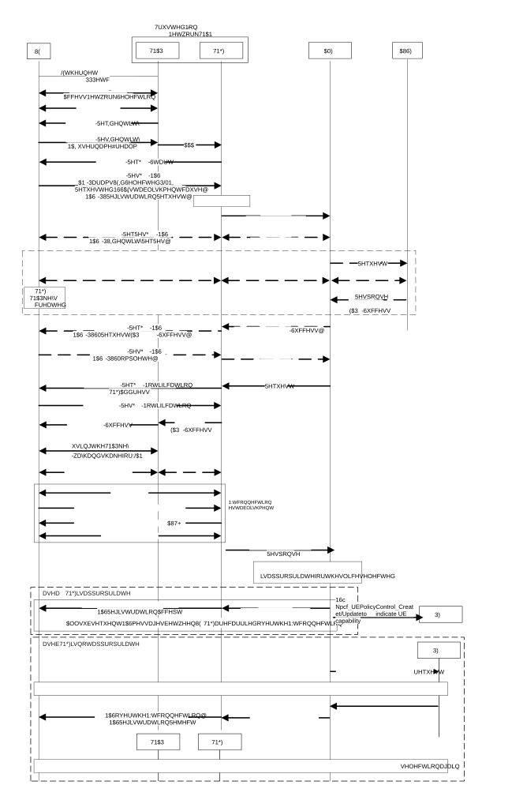

# 4.12a.2 Registration via Trusted non-3GPP Access

## 4.12a.2.1 General

Clause 4.12a.2 specifies how a UE can register to 5GC via a trusted non-3GPP Access Network. The utilized procedure is very similar with the 5GC registration procedure over untrusted non-3GPP access in clause 4.12.2.2 and it is based on the Registration procedure specified in clause 4.2.2.2.2. It uses the same vendor-specific EAP method (called "EAP-5G") as the one specified in clause 4.12.2.1. In this case, the "EAP-5G" method is used between the UE and the TNGF and is utilized for encapsulating NAS messages.

In Registration and subsequent Registration procedures via trusted non-3GPP access, the NAS messages are always exchanged between the UE and the AMF. When possible, the UE can be authenticated by reusing the existing UE security context in AMF.

## 4.12a.2.2 Registration procedure for trusted non-3GPP access

The UE connects to a trusted non-3GPP Access Network (TNAN) and it also registers to 5GC over via this TNAN, by using the EAP-based procedure shown in the figure 4.12a.2.2. This procedure is very similar with the 5GC registration procedure over untrusted non-3GPP access in clause 4.12.2.2. The link between the UE and the TNAN can be any data link (L2) that supports EAP encapsulation, e.g. PPP, PANA, Ethernet, IEEE 802.3, IEEE 802.11, etc. The interface between the TNAP and TNGF is an AAA interface.

Figure 4.12a.2.2-1: Registration via trusted non-3GPP access

0\. The UE which is not operating in SNPN access mode for Yt interface selects a PLMN and a TNAN for connecting to this PLMN by using the Trusted Non-3GPP Access Network selection procedure specified in clause 6.3.12 of TS 23.501 \[2\]. During this procedure, the UE discovers the PLMNs with which the TNAN supports trusted connectivity (e.g. "5G connectivity").

The UE operating in SNPN access mode for Yt interface selects an SNPN and a TNAN for connecting to this SNPN by using the Trusted Non-3GPP Access Network selection procedure specified in clause 5.30.2.13 of TS 23.501 \[2\]. During this procedure, the UE discovers the SNPNs with which the TNAN supports trusted connectivity (e.g. "5G connectivity").

NOTE 1: In this Release, it is assumed that when the trusted non-3GPP access is a trusted WLAN access, the UE is configured (e.g. with the WLANSP rules defined in TS 23.503 \[20\]) to select an TNAN(SSID and TNGF) associated with a non-TRacking Area, which supports one or more of the UE's subscribed S-NSSAIs.

1\. A layer-2 connection is established between the UE and the TNAP. In the case of IEEE Std 802.11 \[48\], this step corresponds to an 802.11 Association. In the case of PPP, this step corresponds to a PPP LCP negotiation. In other types of non-3GPP access (e.g. Ethernet), this step may not be required.

2-3. An EAP procedure is initiated. EAP messages are encapsulated into layer-2 packets, e.g. into IEEE 802.3/802.1x packets, into IEEE 802.11/802.1x packets, into PPP packets, etc. The NAI provided by the UE not operating in SNPN access mode for Yt interface indicates that the UE requests "5G connectivity" to a specific PLMN and is defined in clause 28.7.6 of TS 23.003 \[33\]. In the case of WLAN access, if the UE has an MPS subscription, the UE shall also include an indication of its MPS subscription in the username part of the NAI as per TS 23.003 \[33\]. The NAI provided by the UE operating in SNPN access mode for Yt interface indicates that the UE request "5G connectivity" to a specific SNPN and is defined in clause 28.7.6 of TS 23.003 \[33\]. If the WLANSP rule contains information including TNGF ID to use for specific slices and the UE supports such information, the UE builds the realm of NAI taking the TNGF ID into account. This NAI is defined in clause 28.7.6 of TS 23.003 \[33\] and triggers the TNAP to send an AAA request to a TNGF, which operates as an AAA proxy.

Between the TNAP and TNGF the EAP packets are encapsulated into AAA messages. The AAA request also include the TNAP identifier, which can be treated as the User Location Information defined in clause 5.6.2 of TS 23.501 \[2\]. In order to support usage of the TNAP identifier defined in TS 23.316 \[53\], when a 5G-RG acts as a TNAP , the W-5GAN may, as defined in clause 5.6.2 of TS 23.501 \[2\], provide the 5G RG civic address information in the TNAP identifier.

NOTE 2: In this Release, it is assumed that when the trusted non-3GPP access is a trusted WLAN access, the TNAP selects a TNGF based on the realm (e.g. MCC, MNC and TNGF ID) provided by the UE and also based on the SSID selected by the UE. In a deployment a TNGF may be reached over different SSID(s) where the TNGF supports a Tracking Area and be associated with a set of slices, or an SSID may provide access to one or more TNGF(s), where each of these TNGF(s) can support a different Tracking Area and a different set of slices.

NOTE 3: Based on operator policy, after receiving the indication of MPS subscription from the UE, the TNAN can treat this UE with priority.

4-10. An EAP-5G procedure is executed as the one specified in clause 4.12.2.2 for the untrusted non-3GPP access with the following modifications:

\- The registration request may contain an indication that the UE supports TNGF selection based on the slices the UE wishes to use over trusted non-3GPP access (i.e. that the UE supports Extended WLANSP rule).

\- A TNGF key (instead of an N3IWF key) is created in the UE and in the AMF after the successful authentication. The TNGF key is transferred from the AMF to TNGF in step 10a (within the N2 Initial Context Setup Request). The TNGF derives a TNAP key, which is provided to the TNAP. The TNAP key depends on the non-3GPP access technology (e.g. it is a Pairwise Master Key in the case of IEEE Std 802.11 \[48\]). How these security keys are created, it is specified in TS 33.501 \[15\].

\- In step 5 the UE shall include the Requested NSSAI in the AN parameters only if allowed, according to the conditions defined in clause 5.15.9 of TS 23.501 \[2\], for the trusted non-3GPP access. The UE shall also include a UE Id in the AN parameters, e.g. a 5G-GUTI if available from a prior registration to the same PLMN or SNPN. If the UE in SNPN access mode for Yt interface performs the Registration procedure for UE onboarding, the UE shall include an indication in the AN parameters that the connection request is for onboarding.

\- In the N2 message sent in step 6b, the TNGF includes a UE Location Information (ULI)including the TNAP ID and the UE IP address based on information received in step 3. If the ULI includes the IP address, this is set to a "null" IP address (e.g. 0.0.0.0) because the UE is not yet assigned an IP address. If the TNGF has received the TNAP ID in step 3 over Ta, the TNGF includes the TNAP ID within UE Location Information (ULI) sent to AMF. After the UE is assigned an IP address, the TNGF includes this address in subsequent N2 messages. This N2 message also includes the Selected PLMN ID and optionally the Selected NID and the Establishment cause.

NOTE 4: The Selected NID is present when the UE connects to an SNPN via Trusted non-3GPP access.

\- If the UE in SNPN access mode for Yt interface performs the Registration procedure for UE onboarding, the interaction between AMF and AUSF (step 8a and step 8c in Figure 4.12a.2.2-1) is replaced with step 9-1 or step 9-2 or step 9-3 in Figure 4.2.2.2.4-1, depending on the 5GC architecture that is used for UE onboarding.

\- After receiving the TNGF key from AMF in step 10a, the TNGF shall send to UE an EAP-Request/5G-Notification packet containing the "TNGF Contact Info", which includes the IP address of TNGF. After receiving an EAP-Response/5G-Notification packet from the UE in step 10c, the TNGF shall send message 10d containing the EAP-Success packet.

11\. The TNAP key is used to establish layer-2 security between the UE and TNAP. In the case of IEEE Std 802.11 \[48\], a 4-way handshake is executed, which establishes a security context between the WLAN AP and the UE that is used to protect unicast and multicast traffic over the air.

12\. The UE receives IP configuration from the TNAN, e.g. with DHCP.

13\. At this point, the UE has successfully connected to the TNAN and has obtained IP configuration. The UE sets up a secure NWt connection with the TNGF as follows:

The UE initiates an IKE_INIT exchange using the IP address of TNGF received during the EAP-5G signalling, in step 10b. Subsequently, the UE initiates an IKE_AUTH exchange and provides its identity. The identity provided by the UE in the IKEv2 signalling should be the same as the UE Id included in the AN parameters in step 5. This enables the TNGF to locate the TNGF key that was created before for this UE, during the authentication in step 8. The TNGF key is used for mutual authentication. NULL encryption is negotiated between the UE and the TNGF, as specified in RFC 2410 \[49\].

In step 13c, the TNGF provides to UE (a) an "inner" IP address, (b) a NAS_IP_ADDRESS and a TCP port number and (c) a DSCP value. After this step, an IPsec SA is established between the UE and TNGF. This is referred to as the "signalling IPsec SA" and operates in Tunnel mode. Operation in Tunnel mode enables the use of MOBIKE \[40\] for re-establishing the IPsec SAs when the IP address of the UE changes during mobility events. All IP packets exchanged between the UE and TNGF via the "signalling IPsec SA" shall be marked with the above DSCP value. The UE and the TNAP may map the DSCP value to a QoS level (e.g. to an EDCA Access Class \[48\]) supported by the underlying non-3GPP Access Network. The mapping of a DSCP value to a QoS level of the non-3GPP Access Network is outside the scope of 3GPP.

Right after the establishment of the "signalling IPsec SA", the UE shall setup a TCP connection with the TNGF by using the NAS_IP_ADDRESS and the TCP port number received in step 13c. The UE shall send NAS messages within TCP/IP packets with source address the "inner" IP address of the UE and destination address the NAS_IP_ADDRESS. The TNGF shall send NAS messages within TCP/IP packets with source address the NAS_IP_ADDRESS and destination address the "inner" IP address of the UE.

This concludes the setup of the NWt connection between the UE and the TNGF. All subsequent NAS messages between UE and TNGF are carried over this NWt connection (i.e. encapsulated in TCP/IP/ESP).

14\. After the NWt connection is successfully established, the TNGF responds to AMF with an N2 Initial Context Setup Response message.

15\. The AMF determines the allowed subset of the Requested NSSAI that is allowed by the Subscribed S-NSSAI(s); the AMF may detect that the TNGF used by the UE is not compatible with this allowed subset and based on operator's policy configured in the AMF, the AMF determines whether a different TNGF should be used. If the UE supports slice-based TNGF selection and the AMF determines to use a different TNGF, then the AMF proceeds with steps 17-21. Otherwise, i.e. if the AMF determines to use the selected TNGF that supports part of allowed the subset, the AMF proceeds with step 16. In this case, steps 17-21 are skipped.

NOTE 5: The criteria for the AMF to determine that the TNGF used by the UE is not compatible with the subset of the requested NSSAI that is allowed by the subscribed S-NSSAI(s) is based on local AMF policies. For example the AMF can determine that the TNGF used by the UE is compatible as soon as there is one supported slice in common.

16a-16b. The NAS Registration Accept message is sent by the AMF and is forwarded to UE via the established NWt connection. Now the UE can use the TNAN (a) to transfer non-seamless offload traffic and (b) to establish one or more PDU Sessions.

16c. The AMF may trigger a UE policy association as described in clause 4.2.2.2.2 if a UE policy association does not exist yet. If the UE Registration Request contains an indication that the UE supports TNGF selection based on the slices the UE wishes to use over untrusted non-3GPP access the AMF indicates to the PCF that the UE supports TNGF selection based on the slices the UE wishes to use over trusted non-3GPP access.

Steps 17 to 21 correspond to the case where the AMF has detected that TNGF used by the UE is not compatible with the subset of the requested NSSAI that is allowed by the subscribed S-NSSAI(s).

17\. If the AMF is able to select a UE PCF that supports UE policies for slice specific trusted access selection, the AMF may trigger UE policy association establishment if a suitable UE policy association does not exist yet. The AMF indicates to the PCF that the UE supports TNGF selection based on the slices the UE wishes to use over trusted non-3GPP access.

The AMF triggers the UE PCF to update the UE policies for slice specific trusted access selection.

The AMF requests the PCF to receive a notification when the PCF has completed the update of these UE policies.

18\. The PCF updates the UE policies for slice specific trusted access selection according to the procedure defined in figure 4.2.4.3-1.

19\. When the update of these policies is completed, the PCF notifies the AMF by invoking Npcf_UEPolicyControl_UpdateNotify.

20\. The AMF sends via the TNGF a UE Registration Reject indicating that the selected TNGF was not appropriate for the requested slices that the UE is allowed to access to. The AMF may provide target TNAN information (SSID, TNGF ID) to the UE within the Registration Reject message indicating the UE to build the NAI based on the TNGF ID.

NOTE 6: The AMF may determine a target TNGF that supports the subset of the requested NSSAI that is allowed by the subscribed S-NSSAI(s) based on the list of supported TAs and the corresponding list of supported slices for each TA obtained in N2 interface management procedures as specified in TS 38.413 \[10\] and considering UE location.

21\. If supported by the UE and if the UE received target TNAN information in step 20, the UE connects to the target TNAN, otherwise the UE may perform TNAN selection again using the updated WLANSP rule received in step 18. If the target TNAN information includes TNGF ID, the UE shall build the NAI based on TNGF ID. The UE uses the target TNAN information in the Registration Reject only for the TNAN selection directly following the rejected registration and UE shall not store it for future use.

## 4.12a.2.3 Emergency Registration for trusted non-3GPP Access

Emergency Registration procedure for trusted non-3GPP access shall be supported as specified in clause 4.12.2.3 for untrusted non-3GPP access with the following differences:

\- The regular registration shall refer to clause 4.12a.2.

\- The N3IWF is substituted by the TNGF.

\- The N3IWF key is substituted by the TNGF key.
