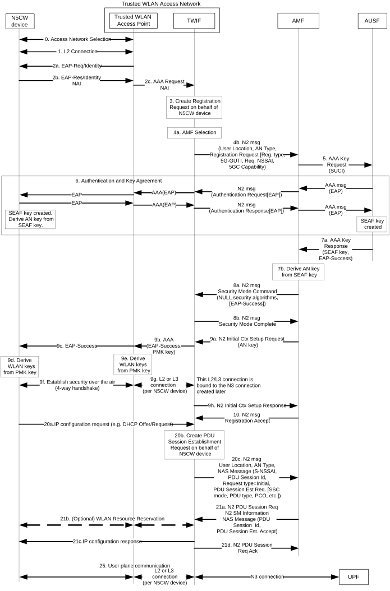

# 4.12b Procedures for devices that do not support 5GC NAS over WLAN access

## 4.12b.1 General

As specified in clause 4.2.8.5 of TS 23.501 \[2\], devices that do not support 5GC NAS signalling over WLAN access (referred to as "Non-5G-Capable over WLAN" devices, or N5CW devices for short), may access 5GC in a PLMN or an SNPN via a trusted WLAN Access Network that supports a Trusted WLAN Interworking Function (TWIF). The following clause specifies how a N5CW device can be registered to 5GC and how it can send data via a PDU Session.

A N5CW device may be 5G-capable over 3GPP access, in which case it is also a 5G UE over 3GPP access.

## 4.12b.2 Initial Registration & PDU Session Establishment

Figure 4.12b.2-1 illustrates how the N5CW device can connect to a trusted WLAN Access Network and simultaneously register to a 5G core network. A single EAP-based authentication procedure is executed for connecting the N5CW device to the trusted WLAN Access Network and for registering the N5CW device to the 5G core network.

Figure 4.12b.2-1: Initial registration and PDU session establishment

0\. The N5CW device selects a PLMN (or SNPN) and a trusted WLAN that supports "5G connectivity-without-NAS" to this PLMN (or SNPN) by using the procedure specified in clause 6.3.12a and clause 5.30.2.15 of TS 23.501 \[2\] for access to PLMN and SNPN, respectively.

Steps 1-10: Initial registration to 5GC.

1\. The N5CW device associates with the selected trusted WLAN and the EAP authentication procedure is initiated.

2\. The N5CW device provides its Network Access Identity (NAI). The Trusted WLAN Access Point (TWAP) selects a Trusted WLAN Interworking Function (TWIF), e.g. based on the received realm and sends an AAA request to the selected TWIF.

If the N5CW device has not registered over 3GPP access to 5GC of the selected PLMN or SNPN when the above procedure is initiated, then the NAI includes the SUCI as specified in clause 28.7.7 of TS 23.003 \[33\]. For example, when accessing a PLMN the NAI can have the following format: NAI=type1.rid678.schid0.useriduser17@nai.5gc-nn.mnc\<MNC\>.mcc\<MCC\>.3gppnetwork.org. If the selected PLMN is VPLMN, the N5CW device should use the decorated NAI format as specified in clause 28.7.9 of TS 23.003 \[33\] to indicate to TWAN which is the selected VPLMN, for example, NAI=nai.5gc-nn.mnc\<MNC_Home\>.mcc\<MCC_Home\>.3gppnetwork.org!type1.rid678.schid0.useriduser17@nai.5gc-nn.mnc\<MNC_visited\>.mcc\<MCC_visited\>.3gppnetwork.org.

If the N5CW device has registered to 5GC over 3GPP access to 5GC of the selected PLMN or SNPN (i.e. it is also a 5G UE) when the above procedure is initiated, then the NAI includes the 5G-GUTI assigned to N5CW device over 3GPP access. This enables the TWIF in step 4a below to select the same AMF as the one serving the N5CW device over 3GPP access.

If the N5CW device accesses to SNPN with the credentials owned by Credentials Holder, the decorated NAI as specified in clause 28.7.9 of TS 23.003 \[33\] should be provided. For example, NAI=nai.5gc-nn.nid\<NID_Home\>.mnc\<MNC_Home\>.mcc\<MCC_Home\>.3gppnetwork.org!type1.rid678.schid0.useriduser17@nai.5gc-nn.nid\<NID_visited\>.mnc\<MNC_visited\>.mcc\<MCC_visited\>.3gppnetwork.org.

The NAI provided by the N5CW device in step 2b indicates that the N5CW device wants "5G connectivity-without-NAS" towards a specific PLMN or SNPN (i.e. the PLMN or SNPN selected in step 0). For example, when accessing a PLMN, the NAI can have the following format: NAI=\<5G-GUTI\>@nai.5gc-nn.mnc\<MNC\>.mcc\<MCC\>.3gppnetwork.org or NAI=nai.5gc-nn.mnc\<MNC_Home\>.mcc\<MCC_Home\>.3gppnetwork.org!type1.rid678.schid0.useriduser17@nai.5gc-nn.mnc\<MNC_visited\>.mcc\<MCC_visited\>.3gppnetwork.org, the N5CW device indicating that it wants "5G connectivity-without-NAS" (5gc-nn) to the PLMN with MCC=\<MCC\> and MNC=\<MNC\> and to the PLMN with MCC=\<MCC_visited\> and MNC=\<MNC_visited\>.

3\. The TWIF creates a 5GC Registration Request message on behalf of the N5CW device. The TWIF uses default values to populate the parameters in the Registration Request message, which are the same for all N5CW devices. The Registration type indicates "Initial Registration".

If the TWIF receives a Decorated NAI, in Registration Request message the TWIF send the NAI which corresponds to the HPLMN by removing the decoration, for example NAI=type1.rid678.schid0.useriduser17@ nai.5gc-nn.mnc\<MNC_Home\>.mcc\<MCC_Home\>.3gppnetwork.org.

4\. The TWIF selects an AMF by using the 5G-GUTI in the NAI, or selects the AMF of the VPLMN indicates by the realm of the decoration in the Decorated NAI, for example "mnc\<MNC_visited\>.mcc\<MCC_visited\>.3gppnetwork.org" or selects the AMF by using the local configuration. TWIF sends an N2 message to the AMF including the Registration Request, the User Location and an AN Type.

If the N5CW device provides a Decorated NAI to the TWIF, the TWIF shall select the AMF in the visited PLMN/SNPN as per decoration part and remove the decoration part from the Decorated NAI (i.e. change the format to NAI format of SUCI as defined in clause 28.7.7 of TS 23.003 \[33\]) and provides it to AMF in the Registration Request. For example, if the NAI is "nai.5gc-nn.nid\<NID_Home\>.mnc\<MNC_Home\>.mcc\<MCC_Home\>.3gppnetwork.org!type1.rid678.schid0.useriduser17@nai.5gc-nn.nid\<NID_visited\>.mnc\<MNC_visited\>.mcc\<MCC_visited\>.3gppnetwork.org.", the TWIF selects the AMF in the SNPN corresponding to "nai.5gc-nn.nid\<NID_visited\>.mnc\<MNC_visited\>.mcc\<MCC_visited\>.3gppnetwork.org." and provides the AMF in the Registration Request with the NAI of "type1.rid678.schid0.useriduser17@ nai.5gc-nn.nid\<NID_Home\>.mnc\<MNC_Home\>.mcc\<MCC_Home\>.3gppnetwork.org".

5\. The AMF triggers an authentication procedure by sending a request to AUSF indicating the AN type.

6\. An EAP authentication procedure takes place between the N5CW device and AUSF. Over the N2 interface, the EAP messages are encapsulated within NAS Authentication messages. The type of EAP authentication procedure is specified in TS 33.501 \[15\].

NOTE: The SUPI used for authentication does not take the format of Decorated NAI.

7\. After a successful authentication, the AUSF sends to AMF the EAP-Success message and the created SEAF key. The AMF derives an AN key from the received SEAF key.

8\. The NAS Security Mode Command (SMC) is sent from the AMF to the TWIF. The selected NAS security algorithms of integrity protection and ciphering are set to NULL.

9\. The AMF sends an N2 Initial Context Setup Request and provides the AN key to TWIF. In turn, the TWIF derives a Pairwise Master Key (PMK) from the AN key and sends the PMK key and the EAP-Success message to the Trusted WLAN Access Point, which forwards the EAP-Success to the N5CW device. The PMK is the key used to secure the WLAN air-interface communication according to IEEE Std 802.11 \[48\]. A layer-2 or layer-3 connection is established between the Trusted WLAN Access Point and the TWIF for transporting all user-plane traffic of the N5CW device to TWIF. This connection is later bound to an N3 connection that is created for this N5CW device.

10\. Finally, the AMF sends a Registration Accept message to TWIF. At this point, the N5CW device is connected to the WLAN Access Network and is registered to 5GC.

Steps 20-21: PDU Session Establishment.

20\. The TWIF creates a PDU Session Establishment Request message on behalf of the N5CW device and sends this message to AMF. This may be triggered by receiving an IP configuration request (e.g. DHCP Offer/Request) from the N5CW device. The TWIF may use default values to populate the parameters in the PDU Session Establishment Request message, but may also skip some PDU session parameters and let the AMF or the SMF determine these parameters based on the N5CW device subscription information received during the registration procedure. This way, default PDU session parameters can be used per N5CW device.

The value of the PDU Session id provided by TWIF in step 20c shall always be the same. It will be a value reserved for the PDU sessions requested by the TWIF and it will be different from the values that can be used by the N5CW device when requesting a PDU session over 3GPP access. This way, the PDU session id provided by the TWIF cannot be the same with the PDU Session ID of any PDU session established by the N5CW device over 3GPP access.

21\. The AMF sends upon request of the SMF an N2 PDU Session Request message to TWIF in order to reserve the appropriate Access Network resources. This N2 message includes the PDU Session Establishment Accept message. In step 21b, the TWIF may reserve WLAN access resources for the user-plane communication between the N5CW device and TWIF. If and how this resource reservation is performed is outside the scope of 3GPP.

After the establishment of the PDU session, the TWIF assigns IP configuration data to N5CW device (e.g. with DHCP). The IP address assigned to N5CW device is the IP address allocated to the PDU session.

Step 25: User plane communication.

The TWIF binds the N5CW device-specific L2/L3 connection created in step 9g with the N3 connection created in step 21. All user-plane traffic sent by the N5CW device is forwarded to TWIF via the L2/L3 connection and then to UPF via the N3 connection. The TWIF operates as a Layer-2 relay.

The TWIF may receive URSP rules (see TS 23.503 \[20\]), which indicate the traffic that should be offloaded locally by TWIF (sent outside the PDU session) and the traffic that should be sent inside the PDU session.

The above procedure supports only one PDU session per N5CW device whose parameters are either configured for all N5CW devices in the TWIF or are derived from default values in the N5CW device subscription.

If the TWIF is co-located with one or more local UPFs then:

\- In step 20c (N2 Uplink NAS Transport), the TWIF may send a TWIF Identities parameter to AMF. The TWIF Identities parameter contains a list of identifiers (i.e. FQDNs or IP addresses) of N3 terminations supported by the TWIF.

\- If received by the AMF, it shall forward it to the SMF when invoking Nsmf_PDUSessionCreateSMContext i.e. at the establishment of the PDU Session. The SMF may use this information to select a local UPF for the PDU Session.

## 4.12b.3 Deregistration procedure

The Deregistration procedure for devices (N5CW devices) that do not support 5G NAS signalling over WLAN access shall be supported as specified in clause 4.12a.3 for the trusted non-3GPP access with the following modifications:

\- The TNAP is substituted by a trusted WLAN access point (TWAP).

\- The TNGF is substituted by the Trusted WLAN Interworking Function (TWIF).

\- The TWIF sends and receives NAS deregistration request/accept messages on behalf of N5CW device.

\- For both UE/Network-initiated deregistration procedures, the TWIF may initiate the release of Yt' connection between the N5CW device and TWIF.

\- UE-initiated deregistration procedure can be initiated by the TWIF, when it has lost connectivity to the N5CW device.

## 4.12b.4 N2 procedures

### 4.12b.4.1 Service Request procedures

The Service Request procedure for devices that do not support 5G NAS signalling over WLAN access shall be used by a TWIF when the CM state in TWIF for a N5CW device is CM-IDLE over Trusted WLAN to request the re-establishment of the NAS signalling connection and the re-establishment of the user plane for all or some of the PDU Sessions which are associated to non-3GPP access.

The Service Request procedure for N5CW devices shall be used by a TWIF when the CM state in TWIF for a N5CW device is CM-CONNECTED over trusted WLAN to request the re-establishment of the user plane for one or more PDU Sessions which are associated to non-3GPP access.

This Service Request procedure shall be supported as specified in clause 4.12a.4.1 for the trusted non-3GPP access with the following modifications:

\- The trusted non-3GPP access is substituted by a trusted WLAN access point (TWAP).

\- The TNGF is substituted by the TWIF.

\- The TWIF sends and receives NAS messages on behalf of N5CW device.

\- The user plane between the N5CW device and TWIF is established with Yt' connection instead of IKEv2 signalling.

### 4.12b.4.2 Procedure for the UE context release in the TWIF

This procedure for releasing the N2 signalling connection and the N3 user plane connection for a N5CW device connected to 5GC via trusted WLAN access, shall be the same as the procedure specified in clause 4.12a.4.2 for the trusted non-3GPP access with the following modifications:

\- The trusted non-3GPP access is substituted by a TWAP.

\- The TNGF is substituted by the TWIF.

\- The TWIF may initiate the release of Yt' connection between the N5CW device and TWIF.

### 4.12b.4.3 CN-initiated selective deactivation of UP connection of an existing PDU Session

The procedure described in clause 4.3.7 (CN-initiated selective deactivation of UP connection of an existing PDU Session) is used for CN-initiated selective deactivation of UP connection for an established PDU Session associated with Trusted WLAN access for a N5CW device in CM-CONNECTED state, with the following exceptions:

\- The NG-RAN corresponds to a TNAN including a TWIF.

\- The user plane between the N5CW device and TWIF is released without neither RRC signalling nor IKEv2 signalling.
