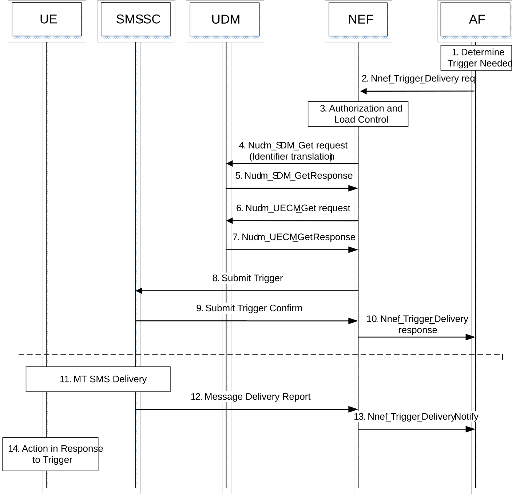

# 4.13.2 Application Triggering

## 4.13.2.1 General

The AF invokes the Nnef_Trigger service to request that the network send an Application trigger to the UE.

## 4.13.2.2 The procedure of "Application Triggering" Service

Figure 4.13.2.2-1: Device triggering procedure via Nnef

1\. The AF determines the need to trigger the device. If the AF has no contact details for the NEF, it shall discover and select NEF services.

2\. The AF invokes the Nnef_Trigger_Delivery request service.

3\. The NEF checks that the AF is authorised to send trigger requests and that the AF has not exceeded its quota or rate of trigger submission over Nnef. If this check fails, the NEF sends an Nnef_Trigger_Delivery response with a cause value indicating the reason for the failure condition and the flow stops at this step. Otherwise, the flow continues with step 4.

4\. The NEF invokes Nudm_SDM_Get (Identifier Translation, GPSI and AF Identifier) to resolve the GPSI to SUPI when the AF is authorized to trigger the UE.

NOTE 1: Optionally, mapping from GPSI (External Id) to GPSI (MSISDN) is also provided for legacy SMS infrastructure not supporting MSISDN-less SMS.

5\. The UDM may invoke the Nudr_DM_Query service to retrieve a list of AF's that are allowed to trigger the UE and determines, based on UDM policy, which identifier (SUPI or MSISDN) should be used to trigger the UE. The UDM provides a Nudm_SDM_Get response (SUPI, optionally MSISDN. If the AF is not allowed to send a trigger message to this UE, or there is no valid subscription information for this user, the NEF sends an Nnef_Trigger_Delivery response with a cause value indicating the reason for the failure condition and the flow stops at this step. Otherwise this flow continues with step 6.

NOTE 2: The presence of an MSISDN in the reply is interpreted as an indication to the NEF that MSISDN is used (instead of IMSI) to identify the UE when sending the SMS to the SMS-SC via T4.

6\. The NEF invokes Nudm_UECM_Get (GPSI, SMS) to retrieve the UE SMSF identities.

7\. The UDM may invoke the Nudr_DM_Query service to retrieve the UE SMSF identities. The UDM provides a Nudm_UECM_Get response with the corresponding UE SMSF identities. UDM policy (possibly dependent on the VPLMN ID) may influence which serving node identities are returned.

NOTE 3: The NEF can cache serving node information for the UE. However, this can increase the probability of trigger delivery attempt failures when the cached serving node information is stale.

8\. The NEF selects a suitable SMS-SC based on configured information. The NEF acts as an MTC-IWF and sends a Submit Trigger (GPSI, SUPI, AF Identifier, trigger reference number, validity period, priority, SMSF serving node ID(s) (if available, are obtained from UDM in step 7), SMS Application port ID, trigger payload, Trigger Indication) message to the SMS-SC.

If the NEF indicates that "Absent subscriber" was received from the UDM, the SMS-SC should not submit the message, but store it directly and send Routing Information for SM to request the UDM to add the SMS-SC address to the Message Waiting List.

9\. The SMS-SC sends a Submit Trigger Confirm message to the NEF to confirm that the submission of the SMS has been accepted by the SMS-SC.

10\. The NEF sends a Nnef_Trigger_Delivery response to the AF to indicate if the Device Trigger Request has been accepted for delivery to the UE.

11\. The SMS_SC performs MT SMS delivery as defined in clause 4.13.3. The SMS-SC may provide the routing information that it received in step 6 to SMS-GMSC to avoid UDM interrogation. The SMS-SC generates the necessary CDR information and includes the AF Identifier. The SMS Application port ID, which is included in the SM User Data Header and the Trigger Indication are included in the CDRs in order to enable differentiated charging. The SMS-SC stores the trigger payload, without routing information. If the message delivery fails and is attempted to be delivered again, UDM interrogation will be performed. If the message delivery fails and the validity period of this trigger message is not set to zero, the SMS-SC shall send a SM Message Delivery Status Report to request the UDM to add the SMS-SC address to the Message Waiting list. When the message delivery is later re-attempted, a new UDM interrogation will be performed by the SMS-GMSC using SUPI or MSISDN. UDM interrogations using SUPI shall not be forwarded or relayed to SMS-Router or IP-SM-GWs. The UDM may include up to four serving node identities (MSC or MME, SGSN, IP-SM-GW, AMF) in the response to SMS-GMSC.

12\. If the message delivery fails (either directly or when validity period of the trigger message expires) or when the message delivery succeeds, the SMS-SC shall send a Message Delivery Report (cause code, trigger reference number, AF Identifier) to the NEF.

13\. The NEF provides a Nnef_Trigger_DeliveryNotify message to the AF with a Delivery Report indicating the trigger delivery outcome (e.g. succeeded, unknown or failed and the reason for the failure). The NEF generates the necessary CDR information including the GPSI and AF Identifier.

14\. In response to the received device trigger, the UE takes specific actions and may take into consideration the content of the trigger payload. This action typically involves initiation of immediate or later communication with the AF.
