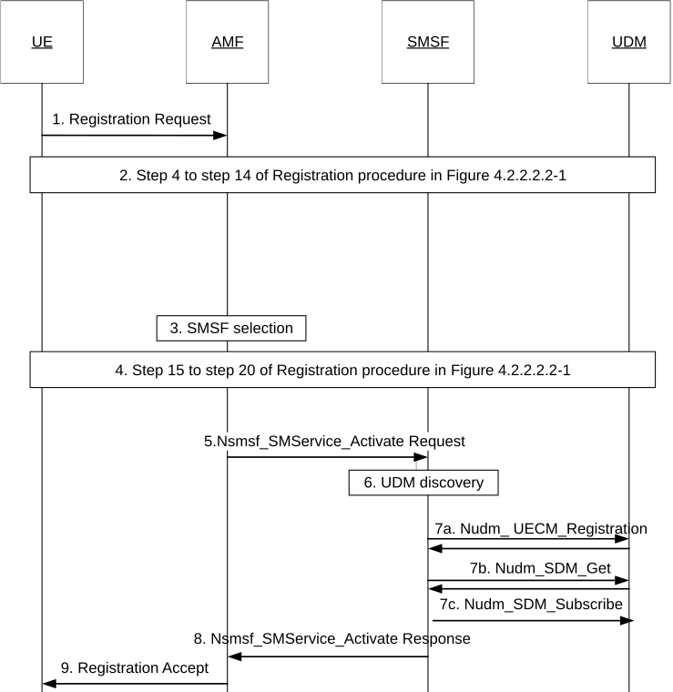
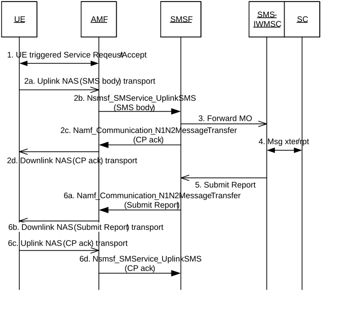
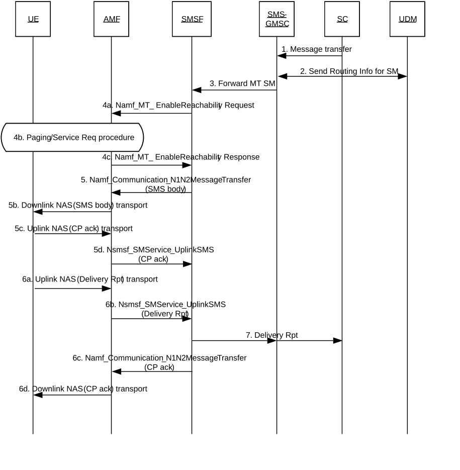

# 4.13.3 SMS over NAS procedures

## 4.13.3.1 Registration procedures for SMS over NAS

Figure 4.13.3.1-1: Registration procedure supporting SMS over NAS

1\. During Registration procedure in 5GS defined in Figure 4.2.2.2.2-1, to enable SMS over NAS transporting, the UE includes an "SMS supported" indication in Registration Request in step 1-3 indicating the UE's capability for SMS over NAS transport. The "SMS supported" indication indicates whether the UE supports SMS delivery over NAS.

2\. Step 4 to step 14 of the Registration procedure in Figure 4.2.2.2.2-1 are performed. The AMF may retrieve the SMS Subscription data and UE Context in SMSF data using Nudm_SDM_Get. This requires that UDM may retrieve this information from UDR by Nudr_DM_Query. The UDM includes the SMSF information in the Nudm_SDM_Get response message if the stored SMSF belongs to the same PLMN of the AMF. After a successful response is received and if SMS service is allowed, the AMF subscribes to be notified using Nudm_SDM_Subscribe when the SMS Subscription data is modified and UDM may subscribe to UDR by Nudr_DM_Subscribe.

The AMF can also receive UE context information containing SMSF Information from old AMF. When AMF re-allocation happens during the Registration procedure, the old AMF transfers SMSF Information to the new AMF as part of UE context in step 5 of Figure 4.2.2.2.2-1.

NOTE 1: The AMF can, instead of the Nudm_SDM_Get service operation, use the Nudm_SDM_Subscribe service operation with an Immediate Report Indication that triggers the UDM to immediately return the subscribed data if the corresponding feature is supported by both the AMF and the UDM.

3\. If the "SMS supported" indication is included in the Registration Request, the AMF checks in the SMS Subscription data that was received in step 2 whether the SMS service is allowed to the UE. If SMS service is allowed and the UE context received in step 2 includes an available SMSF of the serving PLMN, the AMF activates this SMSF Address and continues the registration procedure. If SMS service is allowed but an SMSF of the serving PLMN was not received in step 2, the AMF discovers and selects an SMSF to serve the UE as described in clause 6.3.10 of TS 23.501 \[2\].

4\. Step 15 to step 20 of the Registration procedure in Figure 4.2.2.2.2-1 are performed.

5\. The AMF invokes Nsmsf_SMService_Activate service operation from the SMSF. The invocation includes AMF address, Access Type, RAT Type, Trace Requirements, GPSI (if available) and SUPI. AMF uses the SMSF Information derived from step 3. Trace Requirements is provided if it has been received by AMF as part of subscription data.

6\. The SMSF discovers a UDM as described in clause 6.3.8 of TS 23.501 \[2\].

7a. If the UE context for the current Access Type already exists in the SMSF, the SMSF shall replace the old AMF address with the new AMF address.

Otherwise, the SMSF considers this a Registration request from a new Access Type and the SMSF registers with the UDM using Nudm_UECM_Registration with Access Type. As a result, the UDM stores the following information: SUPI, SMSF identity, SMSF address, Access Type(s) in UE Context in SMSF data. The UDM may further store SMSF Information in UDR by Nudr_DM_Update (SUPI, Subscription Data, UE Context in SMSF data).

If the Nsmsf_SMService_Activate request contains two Access Types and one of them is already registered in the SMSF, the SMSF shall replace the old AMF address with the new AMF address for that Access Type. The SMSF shall then register the other Access Type with the UDM using Nudm_UECM_Registration request.

7b-7c SMSF retrieves SMS Management Subscription data (e.g. SMS teleservice, SMS barring list) using Nudm_SDM_Get and this requires that UDM may get this information from UDR by Nudr_DM_Query (SUPI, Subscription Data, SMS Management Subscription data). After a successful response is received, the SMSF subscribes to be notified using Nudm_SDM_Subscribe when the SMS Management Subscription data is modified and UDM may subscribe to notifications from UDR by Nudr_DM_Subscribe.

SMSF also creates a UE context to store the SMS subscription information and the AMF address that is serving this UE.

NOTE 2: The SMSF can, instead of the Nudm_SDM_Get service operation, use the Nudm_SDM_Subscribe service operation with an Immediate Report Indication that triggers the UDM to immediately return the subscribed data if the corresponding feature is supported by both the SMSF and the UDM.

8\. The SMSF responds back to the AMF with Nsmsf_SMService_Activate service operation response message. The AMF stores the SMSF Information received as part of the UE context.

9\. The AMF includes the "SMS allowed" indication to the UE in the Registration Accept message of step 21 of Figure 4.2.2.2.2-1 only after step 8 in which the AMF has received a positive indication from the selected SMSF.

The "SMS allowed" indication in the Registration Accept message indicates to the UE whether the network allows the SMS message delivery over NAS.

## 4.13.3.2 Deregistration procedures for SMS over NAS

If UE indicates to AMF that it no longer wants to send and receive SMS over NAS (e.g. not including "SMS supported" indication in subsequent Registration Request message) or AMF considers that UE is deregistered on specific Access Type(s) or AMF receives Deregistration Notification from UDM for specific Access Type(s) indicating UE Initial Registration, Subscription Withdrawn or 5GS to EPS Mobility as specified in clause 5.2.3.2.2, then:

\- AMF may, if the UE is not registered at other Access Type at the AMF any more, unsubscribe from SMS Subscription data changes notification with the UDM by means of the Nudm_SDM_Unsubscribe service operation.

\- AMF invokes Nsmsf_SMService_Deactivate service operation to trigger the release of UE Context for SMS on SMSF for the impacted Access Type(s) based on local configurations.

\- AMF may, if the UE is not registered at other Access Type at the AMF anymore, delete or deactivate the stored SMSF address in its UE Context.

\- The SMSF unsubscribes from SMS Management Subscription data changes notification with the UDM by means of the Nudm_SDM_Unsubscribe service operation if the UE is not registered at other Access Type for SMS over NAS service at the SMSF anymore.

\- The SMSF shall invoke Nudm_UECM_Deregistration (SUPI, NF ID, Access Type) service operation from UDM to trigger UDM to delete SMSF address of the UE for the impacted Access Type(s). The SMSF also removes the UE Context for SMS for the impacted Access Type(s), including AMF address.

\- The UDM may update UE context in SMSF in UDR by Nudr_DM_Update (SUPI, Subscription Data, SMS Subscription data, SMSF address). The UDM may remove the corresponding subscription of data change notification in UDR by Nudr_DM_Unsubscribe service operation.

## 4.13.3.3 MO SMS over NAS in CM-IDLE (baseline)

Figure 4.13.3.3-1: MO SMS over NAS

1\. The UE performs domain selection for UE originating SMS as defined in clause 5.16.3.8 of TS 23.501 \[2\] if SMS delivery via non 3GPP access is allowed and possible. If an UE under CM-IDLE state is going to send uplink SMS message, then UE and network perform the UE Triggered Service Request procedure firstly as defined in clause 4.2.3.2 to establish a NAS signalling connection to AMF.

2a. The UE builds the SMS message to be sent as defined in TS 23.040 \[7\] (i.e. the SMS message consists of CP-DATA/RP-DATA/TPDU/SMS-SUBMIT parts). The SMS message is encapsulated in an NAS message with an indication indicating that the NAS message is for SMS transporting. The UE send the NAS message to the AMF.

2b. The AMF forwards the SMS message and SUPI to the SMSF serving the UE over N20 message by invoking Nsmsf_SMService_UplinkSMS service operation. In order to permit the SMSF to create an accurate charging record, the AMF adds the IMEISV, the current UE Location Information (ULI) of the UE as defined in clause 5.6.2 of TS 23.501 \[2\] and if the UE has sent the SMS via 3GPP access, the local time zone.

2c. The SMSF invokes Namf_Communication_N1N2MessageTransfer service operation to forward SMS ack message to AMF.

2d. The AMF forwards the SMS ack message from the SMSF to the UE using downlink unit data message.

3-5. The SMSF checks the SMS management subscription data. If SMS delivery is allowed, the procedure defined in TS 23.040 \[7\] or TS 23.540 \[84\] applies.

6a-6b. The SMSF forwards the submit report to AMF by invoking Namf_Communication_N1N2MessageTransfer service operation which is forwarded to UE via Downlink NAS transport. If the SMSF knows the submit report is the last message to be transferred for UE, the SMSF shall include a last message indication in the Namf_Communication_N1N2MessageTransfer service operation so that the AMF knows no more SMS data is to be forwarded to UE.

NOTE: The behaviour of AMF based on the "last message indication" is implementation specific.

If the UE has more than one SMS message to send, the AMF and SMSF forwards SMS /SMS ack/submit report the same way as described in step 2a-6b.

6c-6d. When no more SMS is to be sent, UE returns a CP-ack as defined in TS 23.040 \[7\] to SMSF. The AMF forwards the SMS ack message by invoking Nsmsf_SMService_UplinkSMS service operation to SMSF.

## 4.13.3.4 Void

## 4.13.3.5 MO SMS over NAS in CM-CONNECTED

MO SMS in CM-CONNECTED State procedure is specified by reusing the MO SMS in CM-IDLE State without the UE Triggered Service Request procedure.

## 4.13.3.6 MT SMS over NAS in CM-IDLE state and RRC_INACTIVE with CN based MT communication state via 3GPP access

Figure 4.13.3.6-1: MT SMS over NAS in CM-IDLE and RRC_INACTIVE state via 3GPP access

1-3 MT SMS interaction between SC/SMS-GMSC/UDM follow the procedure as defined in TS 23.040 \[7\] or TS 23.540 \[84\]. If there are two AMFs serving the UE, one is for 3GPP access and another is for non-3GPP access, there are two SMSF addresses stored in UDM/UDR. The UDM shall return both SMSF addresses.

4\. The SMSF checks the SMS management subscription data. If SMS delivery is allowed, SMSF invokes Namf_MT_EnableUEReachability service operation to AMF. AMF pages the UE using the procedure defined in clause 4.2.3.3. The UE responds to the page with Service Request procedure.

If the AMF indicates SMSF that UE is not reachable (including the cases that UE applies power saving enhancement as described in clause 5.31.7 of TS 23.501 \[2\]), the procedure of the unsuccessful Mobile terminating SMS delivery described in clause 4.13.3.9 is performed and the following steps are skipped. In the case of power saving enhancement, the AMF further stores the information received in the Namf_MT_EnableUEReachability request and pages the UE when UE is considered reachable.

If the UE access to the AMF via both 3GPP access and non-3GPP access, the AMF determines the Access Type to transfer the MT-SMS based on operator local policy.

5a-5b. SMSF forward the SMS message to be sent as defined in TS 23.040 \[7\] (i.e. the SMS message consists of CP‑DATA/RP‑DATA/TPDU/SMS‑DELIVER parts) to AMF by invoking Namf_Communication_N1N2MessageTransfer service operation. The AMF transfers the SMS message to the UE.

5c-5d. The UE acknowledges receipt of the SMS message to the SMSF. For uplink unitdata message toward the SMSF, the AMF invokes Nsmsf_SMService_UplinkSMS service operation to forward the message to SMSF. In order to permit the SMSF to create an accurate charging record, the AMF also includes IMEISV, the current UE Location Information (ULI) of the UE as defined in clause 5.6.2 of TS 23.501 \[2\] and if the SMS is delivered to the UE via 3GPP access, the local time zone.

6a-6b. The UE returns a delivery report as defined in TS 23.040 \[7\]. The delivery report is encapsulated in an NAS message and sent to the AMF which is forwarded to SMSF by invoking Nsmsf_SMService_UplinkSMS service operation.

6c-6d. The SMSF acknowledges receipt of the delivery report to the UE. The SMSF uses Namf_Communication_N1N2MessageTransfer service operation to send SMS CP ack message to the AMF. The AMF encapsulates the SMS message via a NAS message to the UE. If SMSF has more than one SMS to send, the SMSF and the AMF forwards subsequent SMS /SMS ack/ delivery report the same way as described in step 4-6c.

If the SMSF knows the SMS CP ack is the last message to be transferred for UE, the SMSF shall include a last message indication in the Namf_Communication_N1N2MessageTransfer service operation so that the AMF knows no more SMS data is to be forwarded to UE.

NOTE: The behaviour of AMF based on the "last message indication" is implementation specific.

7\. In parallel to steps 6c and 6d, the SMSF delivers the delivery report to SC as defined in TS 23.040 \[7\] or TS 23.540 \[84\].

## 4.13.3.7 MT SMS over NAS in CM-CONNECTED state via 3GPP access

MT SMS in CM-CONNECTED procedure is specified by reusing the MT SMS in CM-IDLE state with the following modification:

\- There is no need for the AMF to perform Paging of the UE and can immediate continue with a message to SMSF via N20 to allow the SMSF to start forward the MT SMS.

\- If the delivery of the NAS PDU containing the SMS fails e.g. if the UE is in RRC_INACTIVE and NG-RAN paging was not successful, the NG-RAN initiate the UE context release in the AN procedure and provide notification of non-delivery to the AMF. The AMF provides an indication of non-delivery to the SMSF.

## 4.13.3.8 MT SMS over NAS via non-3GPP access

MT SMS procedure via non-3GPP access is specified by reusing the MT SMS via 3GPP access in CM-CONNECTED state with the following modification:

\- If the UE access to the network via both 3GPP and non-3GPP accesses and the AMF determines to deliver MT-SMS via non-3GPP access based on operator policy in step 4, the NAS messages is transferred via non-3GPP Access Network.

## 4.13.3.9 Unsuccessful Mobile terminating SMS delivery re-attempt

The procedure of Unsuccessful Mobile terminating SMS delivery re-attempt is defined as follows:

\- For SMS delivery, the SMSF and the UDM support the SMSF and UDM role as specified in TS 23.040 \[7\].

\- If the UE is registered over both 3GPP access and non-3GPP access in the same AMF (i.e. the UE is registered in the same PLMN for both Access Types):

\- if the MT-SMS delivery over one Access Type has failed, the AMF, based on operator local policy, may re-attempt the MT-SMS delivery over the other Access Type before indicating failure to SMSF;

\- if the MT-SMS delivery on both Access Types has failed, the AMF shall inform the SMSF immediately.

\- If the AMF informs the SMSF that it cannot deliver the MT-SMS to the UE (including the cases that UE applies power saving enhancement as described in step 4 of clause 4.13.3.6), the SMSF sends a failure report to the first SMS-GMSC (which can be co-located with IP-SM-GW or SMS Router) as defined in TS 23.040 \[7\] or TS 23.540 \[84\]. If the SMS-GMSC has more than one entity for SMS transport towards the UE, then upon receiving MT-SMS failure report, the SMS-GMSC, based on operator local policy, may re-attempt the MT-SMS delivery via the other entity.

\- After the first SMS-GMSC informs the UDM/HSS that the UE is not able to receive MT-SMS, the UDM shall set the URRP-AMF flag and store the SC address in the MWD list as defined in TS 23.040 \[7\] or TS 23.540 \[84\].

\- If the UE is registered in an AMF and the UDM has not subscribed to UE Reachability Notification in the AMF yet, the UDM immediately initiates a subscription procedure as specified in clause 4.2.5.2.

\- When the AMF detects UE activities, it notifies UDM with UE Activity Notification as described in clause 4.2.5.3. If the UE is registered in an SMSF, the UDM clears its URRP-AMF flag and the UDM/HSS clears the MWD list and alerts related SCs to retry MT-SMS delivery. Otherwise, if the UE is not registered in an SMSF, the UDM clears its URRP-AMF flag but the UDM/HSS keeps the MWD list to notify the SC upon subsequent SMSF registration for the UE.

\- When the SMS-GMSC requests routing information from UDM/HSS for a UE not registered in 5GC, or for a registered UE which has not been yet registered for SMS service, the UDM/HSS responds to the SMS-GMSC that the UE is absent, stores the SC address in the MWD list (if not yet stored) and indicates that to the SC as defined in TS 23.040 \[7\] or TS 23.540 \[84\].

When the UDM receives an Nudm_UECM_Registration Request from an SMSF for a UE for which the MWD list is stored and no URRP-AMF flag is set, the UDM/HSS alerts the related SCs to retry the MT-SMS delivery and clears the MWD list.

NOTE: This scenario assumes that the UE is not in 2G/3G/4G coverage.
