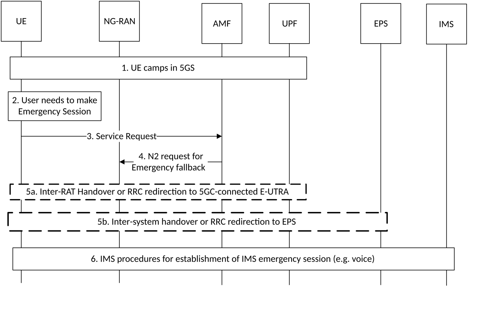

# 4.13.4 Emergency Services

## 4.13.4.1 General

If the 5GS supports Emergency Services, the support is indicated to UE via the Registration Accept message on per-TA-list and per-RAT basis, as described in TS 23.501 \[2\].

If the 5GS supports Emergency Services Fallback, the support is indicated to UE via the Registration Accept message on per-TA-list and per-RAT basis, as described in TS 23.501 \[2\].

The UE shall follow the domain selection rules for emergency session attempts as described in TS 23.167 \[28\].

If the 5GC has indicated Emergency Services Fallback support for the TA and RAT where the UE is currently camping and if the UE supports emergency services fallback, the UE shall initiate the Emergency Services Fallback procedure described in clause 4.13.4.2.

At QoS Flow establishment request for Emergency Services, the procedure described in clause 4.13.6.2 Inter RAT Fallback in 5GC for IMS voice or the procedure described in clause 4.13.6.1 EPS fallback for IMS voice may be triggered by the network, when configured.

## 4.13.4.2 Emergency Services Fallback

The call flow in Figure 4.13.4.2-1 describes the procedure for emergency services fallback.

Figure 4.13.4.2-1: Emergency Services Fallback

1\. UE camps on E-UTRA or NR cell in the 5GS (in either CM-IDLE or CM-CONNECTED state).

2\. UE has a pending IMS emergency session request (e.g. voice) from the upper layers.

3\. If the AMF has indicated support for emergency services using fallback via the Registration Accept message for the current RAT, the UE sends a Service Request message indicating that it requires emergency services fallback. The UE is not required to include the PDU Sessions that are not relevant for the emergency service in the List Of PDU Sessions to be Activated in the Service Request for the emergency service.

NOTE 1: If the UE includes PDU Sessions to be Activated in the Service Request for the emergency service, it will delay the Emergency Services Fallback procedure.

4\. 5GC triggers a request for Emergency Services Fallback by executing an NG-AP procedure in which it indicates to NG-RAN that this is a fallback for emergency services. The AMF based on the support of Emergency Services in EPC or 5GC may indicate the target CN for the RAN node to know whether inter-RAT fallback or inter-system fallback is to be performed. When AMF initiates Redirection for UE(s) that have been successfully authenticated, AMF includes the security context in the request to trigger fallback towards NG-RAN.

5\. Based on the target CN if indicated in message 4 or otherwise based on the RAN configuration, one of the following procedures is executed by NG-RAN:

5a. NG-RAN initiates handover (see clause 4.9.1.3) or redirection to a 5GC-connected E-UTRAN cell, if UE is currently camped on NR.

5b. NG-RAN initiates handover (see clause 4.11.1.2.1) or redirection to E-UTRAN connected to EPS. NG-RAN uses the security context provided by the AMF to secure the redirection procedure.

If the redirection procedure is used either in 5a or 5b the target CN type (EPC or 5GC) is also conveyed to the UE in order to be able to perform the appropriate NAS procedures (S1 or N1 Mode). The UE uses the emergency indication in the RRC message as specified in clause 6.2.2 of TS 36.331 \[16\] and E-UTRAN provides the emergency indication to AMF (during Registration triggered by step 5a) and MME (during Tracking Area Update triggered by step 5b). Both the Registration and the Tracking Area Update requests should contain Follow-on request and active flag respectively to indicate that the UE has "user data pending". For the handover procedure used in step 5b see clause 4.11.1.2.1, step 1.

In step 5b, if the MME does not support emergency services for that UE, the MME should act such that the call for emergency service is likely to succeed promptly, e.g. if the UE successfully completed a combined TA/LA Update with the network, by using the CSFB procedures specified in TS 23.272 \[61\].

NOTE 2: If such a combined TA/LA Update is not successful, or the UE did not request a combined update, then, as specified in TS 23.167 \[28\], the UE autonomously selects a RAT that may (but which might not) support the CS domain.

6\. After handover or redirection to the target cell the UE establishes a PDU Session / PDN connection for IMS emergency services and performs the IMS procedures for establishment of an IMS emergency session (e.g. voice) as defined in TS 23.167 \[28\].

At least for the duration of the emergency voice call, the E-UTRAN connected to EPC is configured to not trigger any handover to 5GS and the target NG-RAN is configured to not trigger inter NG-RAN handover back to source NG-RAN.
