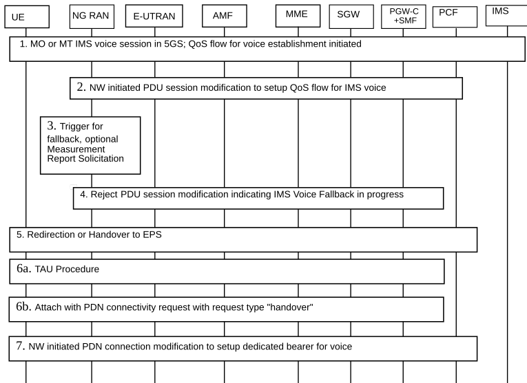
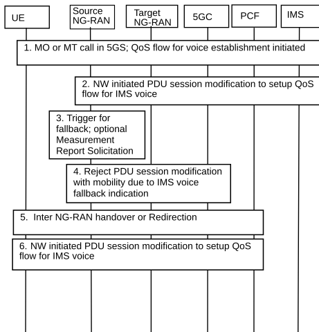
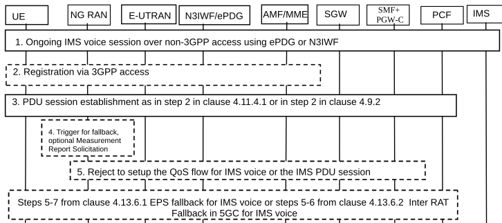

# 4.13.6 Support of IMS Voice

## 4.13.6.1 EPS fallback for IMS voice

Figure 4.13.6.1-1 describes the EPS fallback procedure for IMS voice.

When the UE is served by the 5G System, the UE has one or more ongoing PDU Sessions each including one or more QoS Flows. The serving PLMN AMF has sent an indication towards the UE during the Registration procedure that IMS voice over PS session is supported, see clause 5.16.3.10 of TS 23.501 \[2\] and the UE has registered in the IMS. If N26 is not supported, the serving PLMN AMF sends an indication towards the UE during the Registration procedure that interworking without N26 is supported, see clause 5.17.2.3.1 of TS 23.501 \[2\].

Figure 4.13.6.1-1: EPS Fallback for IMS voice

1\. UE camps on NG-RAN in the 5GS and an MO or MT IMS voice session establishment has been initiated.

2\. Network initiated PDU Session modification to setup QoS flow for voice reaches the NG-RAN (see N2 PDU Session Request in clause 4.3.3).

3\. NG-RAN is configured to support EPS fallback for IMS voice and decides to trigger fallback to EPS, taking into account UE capabilities, indication from AMF that "Redirection for EPS fallback for voice is possible" (received as part of initial context setup, handover resource allocation or path switch request acknowledge as defined in TS 38.413 \[10\]), network configuration (e.g. N26 availability configuration) and radio conditions. If NG-RAN decides not to trigger fallback to EPS, then the procedure stops here and following steps are not executed.

NG-RAN may initiate measurement report solicitation from the UE including E-UTRAN as target.

NOTE: If AMF has indicated that "Redirection for EPS fallback for voice is not possible", then EPS fallback for IMS voice is not performed in step 5. If NG-RAN has not received indication "Redirection for EPS fallback for voice", the decision to execute EPS fallback for IMS voice or not is based on network configuration (e.g. based on N26 availability and other criteria).

4\. NG-RAN responds indicating rejection of the PDU Session modification to setup QoS flow for IMS voice received in step 2 by PDU Session Modification Response message towards the SMF+PGW-C (or H-SMF+P-GW-C via V-SMF, in the case of home routed roaming scenario) via AMF with an indication that mobility due to fallback for IMS voice is ongoing. The SMF+PGW-C maintains the PCC rule(s) associated with the QoS Flow(s) and reports the EPS Fallback event to the PCF if PCF has subscribed to this event.

5\. NG-RAN initiates either handover (see clause 4.11.1.2.1), or AN Release via inter-system redirection to EPS (see clause 4.2.6 and clause 4.11.1.3.2), taking into account UE capabilities. The SMF+PGW-C reports change of the RAT type if subscribed by PCF as specified in clause 4.11.1.2.1, or clause 4.11.1.3.2.

6\. When the UE is connected to EPS, either 6a or 6b is executed:

6a. In the case of 5GS to EPS handover, see clause 4.11.1.2.1 and in the case of inter-system redirection to EPS with N26 interface, see clause 4.11.1.3.2. In either case the UE initiates TAU procedure and the UE includes active flag in the request in the case of inter-system redirection to EPS; or

6b. In the case of inter-system redirection to EPS without N26 interface, see clause 4.11.2.2. If the UE supports Request Type flag "handover" for PDN connectivity request during the attach procedure as described in clause 5.3.2.1 of TS 23.401 \[13\] and has received the indication that interworking without N26 is supported, then the UE initiates Attach with PDN connectivity request with request type "handover".

In the case of inter-system redirection for the emergency service, the UE uses the emergency indication in the RRC message as specified in clause 6.2.2 of TS 36.331 \[16\] and E-UTRAN provides the emergency indication to MME during Tracking Area Update or Attach procedure. For the handover procedure see clause 4.11.1.2.1, step 1.

7\. After completion of the mobility procedure to EPS or as part of the 5GS to EPS handover procedure, the SMF+PGW-C re-initiates the setup of the dedicated bearer(s) for the maintained PCC rule(s) in step 4 including of the dedicated bearer for IMS voice, mapping the 5G QoS to EPC QoS parameters as specified in clause 4.11.1.2.1. The SMF+PGW-C reports about Successful Resource Allocation and Access Network Information if subscribed by PCF.

The IMS signalling related to IMS voice call establishment continues after step 1 as specified in the TS 23.228 \[55\].

At least for the duration of the voice call in EPS the E-UTRAN is configured to not trigger any handover to 5GS.

## 4.13.6.2 Inter RAT Fallback in 5GC for IMS voice

Figure 4.13.6.2-1 describes the RAT fallback procedure in 5GC for IMS voice.

When the UE is served by the 5GC, the UE has one or more ongoing PDU Sessions each including one or more QoS Flows. The serving PLMN AMF has sent an indication towards the UE during the Registration procedure that IMS voice over PS session is supported, see clause 5.16.3.10 of TS 23.501 \[2\] and the UE has registered in the IMS.

Figure 4.13.6.2-1: RAT Fallback for IMS voice

1\. UE camps on source NG-RAN in the 5GS and an MO or MT IMS voice session establishment has been initiated.

2\. Network initiated PDU Session modification to setup QoS flow for IMS voice reaches the source NG-RAN (see N2 PDU Session Request in clause 4.3.3).

3\. If source NG-RAN is configured to support RAT fallback for IMS voice, source NG-RAN decides to trigger RAT fallback, taking into account on UE capabilities, network configuration and radio conditions.

Source NG-RAN may initiate measurement report solicitation from the UE including target NG-RAN.

4\. Source NG-RAN responds indicating rejection of the PDU Session modification to setup QoS flow for IMS voice received in step 2 by PDU Session Response message towards the SMF (or V-SMF, in the case of roaming scenario) via AMF with an indication that mobility due to fallback for IMS voice is ongoing. The SMF maintains the PCC rule(s) associated with the QoS Flow(s).

5\. Source NG-RAN initiates Xn based Inter NG-RAN handover (see clause 4.9.1.2) or N2 based inter NG-RAN handover (see clause 4.9.1.3), or redirection to E-UTRA connected to 5GC (see clause 4.2.6). The SMF reports change of the RAT type if subscribed by PCF.

6\. After completion of the Inter NG-RAN (inter-RAT) handover or redirection to E-UTRA connected to 5GC, the SMF re-initiates the PDU Session modification to setup QoS flow for IMS voice. The SMF reports about Successful Resource Allocation and Access Network Information if subscribed by PCF.

The IMS signalling related to IMS voice call establishment continues after step 1 as specified in TS 23.228 \[55\].

At least for the duration of the IMS voice call the target NG-RAN is configured to not trigger inter NG-RAN handover back to source NG-RAN.

## 4.13.6.3 Transfer of PDU session used for IMS voice from non-3GPP access to 5GS

Figure 4.13.6.3-1: Transfer of PDU session used for IMS voice from non-3GPP access to 5GS

When the UE has an ongoing IMS voice session via non-3GPP access using ePDG or N3IWF and the session is transferred to NG-RAN, depending on the selected RAT in 5GS (NR or E-UTRA) and the support of EPS/inter-RAT fallback in NG-RAN, either the IMS voice session continues over NG-RAN (E-UTRA) or EPS/inter-RAT fallback is triggered.

Steps 1, 2 and 3 apply to either of the above two cases.

1\. UE has ongoing IMS voice session via non-3GPP access using ePDG or N3IWF. UE is triggered to move to 3GPP access and camps in NG-RAN.

2\. If the UE is not registered via 3GPP access, the UE shall initiate Registration procedure as defined in clause 4.2.2.2.2.

3\. UE initiates PDU session establishment for the PDU session used for IMS voice service in order to initiate handover from EPC/ePDG to 5GS as defined in clause 4.11.4.1 step 2 or to initiate handover from N3IWF to 3GPP access in 5GC in step 2 of clauses 4.9.2.1 and 4.9.2.3. The SMF accepts the PDU session transfer from the UE.

NOTE 1: If the UE is aware (e.g. implementation-dependent mechanisms) that voice over NR may not be natively supported in the current Registration area, the UE can attempt to move to E-UTRA to initiate a handover of the IMS PDU Session to EPC or 5GC to continue the IMS voice session. The remaining steps are not executed.

4\. NG-RAN may decide to trigger EPS or inter-RAT fallback, taking into account UE capabilities, indication from AMF that "Redirection for EPS fallback for voice is possible" (received as part of initial context setup as defined in TS 38.413 \[10\]), network configuration (e.g. N26 availability configuration) and radio conditions. NG-RAN may initiate measurement report solicitation from the UE including E-UTRA as target.

If NG-RAN does not trigger EPS or inter-RAT fallback, then the procedure stops here and following steps are not executed.

NOTE 2: If the AMF has indicated that "Redirection for EPS fallback for voice is not possible", then EPS fallback for IMS voice is not performed. If NG-RAN has not received indication "Redirection for EPS fallback for voice", the decision to execute EPS fallback for IMS voice or not is based on network configuration (e.g. based on N26 availability and other criteria).

5\. NG-RAN responds indicating rejection either to set up the QoS flow for IMS voice or the entire PDU session used for IMS voice service as received in step 3 towards the SMF+PGW-C (or H-SMF+P-GW-C via V-SMF, in the case of roaming scenario) via AMF with an indication that mobility due to fallback for IMS voice is ongoing. The SMF+PGW-C reports the EPS Fallback event to the PCF if the PCF has subscribed to this event.

If NG-RAN responds indicating rejection to set up the QoS flow for IMS voice, steps 5-7 from clause 4.13.6.1 are executed if EPS fallback is triggered, or steps 5-6 from clause 4.13.6.2 are executed if inter-RAT Fallback for IMS voice is triggered. The SMF+PGW-C executes the release of resources in non-3GPP AN as specified in step 3 of clauses 4.11.4.1, 4.9.2.1 and 4.9.2.3.

NOTE 3: The timing of executing the release of resources in non-3GPP AN will depend on whether NG-RAN decides to trigger EPS or inter-RAT fallback but will take place at least after step 5.

If NG-RAN rejects entire PDU session used for IMS voice service, the SMF should stop the ongoing procedure and keep the PDN connection / PDU Session at non-3GPP side. The NG-RAN performs AN release with redirection or handover procedure.

In both cases, after receiving the AN release with redirection or completion of the handover procedure the UE initiates TAU procedure. In the case of inter-system redirection to EPS, if the UE decides to re-initiate handover of an IMS voice session over non-3GPP access to EPS after inter-system change from 5GS to EPS is completed, the UE includes active flag in the request.

NOTE 4: Depending on UE implementation, the UE can re-initiate handover of an IMS voice session over non-3GPP access to EPS if the inter-system change from 5GS to EPS is triggered by the NG-RAN and the UE does not receive a response to the PDU session establishment request i.e. when the establishment of the entire PDU session used for voice is rejected by NG-RAN.
