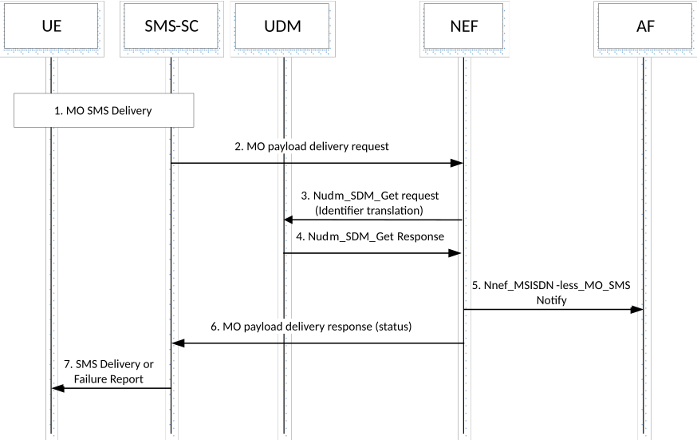

# 4.13.7 MSISDN-less MO SMS

## 4.13.7.1 General

The Nnef_MSISDN-less_MO_SMS service is used by the NEF to send the MSISDN-less MO SMS to the AF.

## 4.13.7.2 The procedure of MSISDN-less MO SMS Service

Figure 4.13.7.2-1: MSISDN-less MO SMS procedure via Nnef

1\. The UE uses SMS over NAS procedures in clause 4.13.3 to send an SMS to the AF.

The service centre address points to the SMS-SC which contains the function described in this procedure, the destination SME address is set to short/long code of the AF and the Application Port ID element of the TP-User-Data field is set to the appropriate value.

For MSISDN-less subscription, the dummy MSISDN is used. This MSISDN and the IMSI of the UE are sent to SMS-SC.

2\. SMS-SC uses the destination SME address (long/short code of the AF) to identify the corresponding NEF based on a pre-configured mapping table. SMS-SC extracts the SMS payload, Application port ID and IMSI of the UE and delivers them to NEF along with the destination SME address (long/short code of the AF). The NEF acts as an MTC-IWF in this procedure.

3\. The NEF invokes Nudm_SDM_Get (Identifier Translation, IMSI, Application Port ID, AF Identifier) to resolve the IMSI and Application Port ID to a GPSI (External Id).

4\. The UDM provides a Nudm_SDM_Get response (GPSI). If the UE is not allowed to send an SMS payload to this AF, or there is no valid subscription information for this user, the flow proceeds to step 6.

5\. The NEF provides a Nnef_MSISDN-less_MO_SMSNotify (SMS payload, GPSI and Application Port ID) message to the AF. The AF is identified with the destination SME address (long/short code of the AF) received from step 2. The payload is delivered directly to the AF, it is not processed by NEF.

6\. The NEF, acting as an MTC-IWF, returns a success or failure delivery indication to SMS-SC.

7\. SMS-SC indicates success/failure back to UE using existing SMS delivery report defined in TS 23.040 \[7\].
