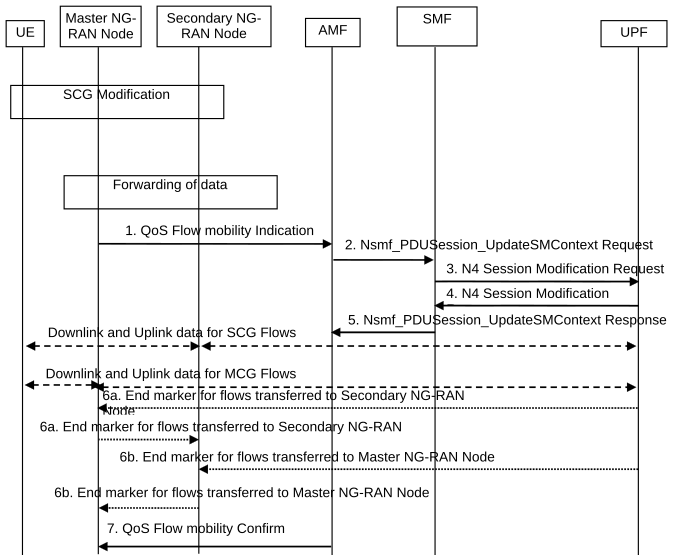

# 4.14 Support for Dual Connectivity

## 4.14.1 RAN Initiated QoS Flow Mobility

This procedure is used to transfer QoS Flows to and from Secondary RAN Node. During this procedure, the SMF and UPF are never re-allocated. The UPF referred in this clause 4.14.1 is the UPF which terminates N3 interface in the 5GC. The presence of IP connectivity between the UPF and the Master RAN node, as well as between the UPF and the Secondary RAN node is assumed.

If QoS Flows for multiple PDU Sessions need to be transferred to or from Secondary RAN Node, the procedure shown in the Figure 4.14.1-1 below is repeated for each PDU Session.

Figure 4.14.1-1: NG-RAN initiated QoS Flow mobility procedure

1\. The Master RAN node sends a N2 QoS Flow mobility Indication (PDU Session ID, QFI(s), AN Tunnel Info, User Location Information) message to the AMF. AN Tunnel Info includes the new RAN tunnel endpoint for the QFI(s) for which the AN Tunnel Info shall be modified. The User Location Information shall include the serving cell's ID and if Dual Connectivity is activated for the UE, the PSCell ID.

2\. AMF to SMF: Nsmf_PDUSession_UpdateSMContext Request (N2 QoS Flow mobility Indication message PDU Session ID).

3\. The SMF sends an N4 Session Modification Request (PDU Session ID(s), QFI(s), AN Tunnel Info for downlink user plane) message to the UPF.

4\. The UPF returns an N4 Session Modification Response (CN Tunnel Info for uplink traffic) message to the SMF after requested QFIs are switched.

NOTE: Step 7 can occur any time after receipt of N4 Session Modification Response at the SMF.

5\. SMF to AMF: Nsmf_PDUSession_UpdateSMContext response (N2 SM information (CN Tunnel Info for uplink traffic)) for QFIs of the PDU Session which have been switched successfully. If none of the requested QFIs have been switched successfully, the SMF shall send an N2 QoS Flow mobility Failure message.

6\. In order to assist the reordering function in the Master RAN node and/or Secondary RAN node, for each affected N3 tunnel the UPF sends one or more "end marker" packets on the old tunnel immediately after switching the tunnel for the QFI. The UPF starts sending downlink packets to the Target NG-RAN.

7\. The AMF relays message 5 to the Master RAN node.
