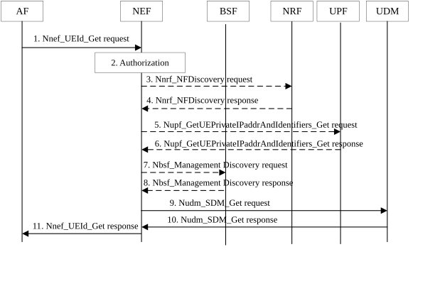

# 4.15.10 AF specific UE ID retrieval

This clause contains the detailed description and the procedures for the AF specific UE ID retrieval. The AF specific UE Identifier is represented by the External Identifier as defined in TS 23.003 \[33\].

NOTE 1: After retrieving AF specific UE ID, the AF can invoke NEF provided services (e.g. location monitoring).

NOTE 2: As described in sub-clauses of clause 4.3.6, NEF can invoke steps 3 to 6 of this procedure to get the assigned UE IP address, SUPI and DNN and S-NSSAI, and if HR-SBO applies, the DNN and S-NSSAI is the HPLMN's, and also an indication that the PDU Session is working in HR-SBO mode.

Figure 4.15.10-1: AF specific UE ID retrieval

1\. AF requests to retrieve UE ID via the Nnef_UEId_Get service operation. The request message shall include UE address (IP address or MAC address) and AF Identifier, it may include, Port Number associated with the IP address, MTC Provider Information, Application Port ID, IP domain. The MTC Provider Information identifies the MTC Service Provider and/or MTC Application. If available, the AF may also provide the corresponding DNN and/or S-NSSAI.

NOTE 3: The MTC Provider Information can be used by any type of Service Providers (MTC or non-MTC) or Corporate or External Parties for, e.g. to distinguish their different customers.

NOTE 4: The combination of IP address and Port Number can be used by 5GC to derive the UE private IP address assigned by 5GC if the UE is behind a NAT, see steps 3-6 below.

NOTE 5: The Application Port ID is as defined in Nnef_Trigger_Delivery.

NOTE 6: The NEF can validate the provided MTC Provider Information and override it to a NEF selected MTC Provider Information based on configuration. How the NEF determines the MTC Provider Information, if not present, is left to implementation (e.g. based on the requesting AF).

2\. The NEF authorizes the AF request. If the authorisation is not granted, the NEF replies to the AF with a Result value indicating authorisation failure; otherwise the NEF proceeds with the following steps. The NEF determines corresponding DNN and/or S-NSSAI information: this may have been provided by the AF or is determined by the NEF based on the requesting AF Identifier, MTC Provider Information.

If the NEF has received a Port Number in step 1, based on configuration, the NEF may recognize the address received is an IP address which is different from the actual private UE IP address assigned by 5GC, i.e. the UE is behind a NAT in UPF. If so, the NEF performs steps 3 to 6. Otherwise, steps 3 to 6 are skipped.

3\. The NEF uses the Nnrf_NFDiscovery service operation to obtain the address of the UPF implementing NAT functionality for the UE (public) IP address. The request includes the UE (public) IP address. The NEF may also include the DNN and S-NSSAI associated with the AF ID, as well as the IP domain.

4\. The NRF responds with a Nnrf_NFDiscovery response message including the UPF address of the UPF implementing NAT functionality for the UE (public) IP address.

5\. The NEF uses the Nupf_GetUEPrivateIPaddrAndIdentifiers_Get service operation to request UE's (private) IP address from the UPF. The request includes the UE (public) IP address and Port Number and optionally IP domain, DNN and S-NSSAI associated with the AF ID.

6\. The UPF responds with the Nupf_GetUEPrivateIPaddrAndIdentifiers_Get response message including UE's IP address and optionally, the IP domain. If the UPF has applied a NAT functionality, the UE's IP address returned by the UPF is the private UE IP address. If IP domain of UE private IP address is returned from UPF, it always takes precedence regardless of whether the IP domain information also provided by AF when it invokes Nnef_UEId_Get service operation. If UPF has the SUPI or GPSI of the UE, the UPF may return SUPI or GPSI and in this case steps 7-8 are skipped.

For HR-SBO case as described in clause 4.3.6.1 and in TS 23.548 \[74\], an indication that the UE PDU session is working in HR-SBO mode, SUPI and HPLMN DNN and S-NSSAI of the PDU session are also provided by UPF.

NOTE 7: The SUPI/GPSI is only available when the SMF provides it to the UPF for the purposes defined in TS 29.244 \[69\].

7-8. The NEF uses the Nbsf_Management_Discovery service operation with UE address and IP domain and /or DNN and/or S-NSSAI to retrieve the session binding information of the UE. If no SUPI is received in the session binding information from the BSF, the NEF replies to the AF with a Result value indicating that the UE ID is not available.

9\. The NEF interacts with UDM to retrieve the AF specific UE Identifier via the Nudm_SDM_Get service operation. The request message includes SUPI or GPSI and at least one of Application Port ID, MTC Provider Information or AF Identifier.

10\. The UDM responds to the NEF with an AF specific UE Identifier represented as an External Identifier for the UE which is uniquely associated with the Application Port ID, MTC provider Information and/or AF Identifier.

11\. The NEF further responds to the AF with the information (including the AF specific UE Identifier represented as an External Identifier) received from the UDM.
