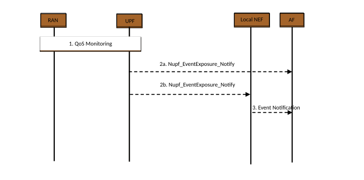

# 4.15.12 Event Exposure using Local NEF

This clause contains the description and the procedure for the exposure of QoS monitoring information via direct interaction between UPF (L-PSA UPF) and Local NEF/AF.

Editor's note: It is FFS whether Local NEF is introduced or NEF is used instead.

Figure 4.15.12-1: Event exposure using Local NEF

1\. The UPF obtains QoS monitoring information as defined in clauses 5.8.2.18 and 5.45 of TS 23.501 \[2\].

2\. The UPF sends the notification related with QoS monitoring information over Nupf_EventExposure_Notify service operation according to the configuration from SMF as defined in clause 5.8.2.18 of TS 23.501 \[2\]. The notification is sent to the Notification Target Address that may correspond (4a) to the AF or (4b) to the Local NEF.

3\. If the Local NEF is used, it reports the QoS monitoring information to the AF by invoking Nnef_EventExposure_Notify service operation.
