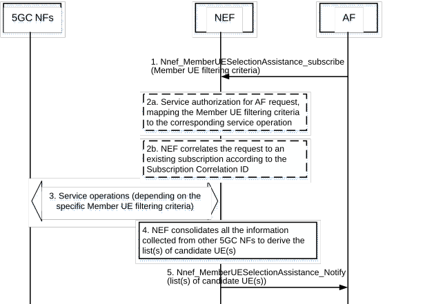
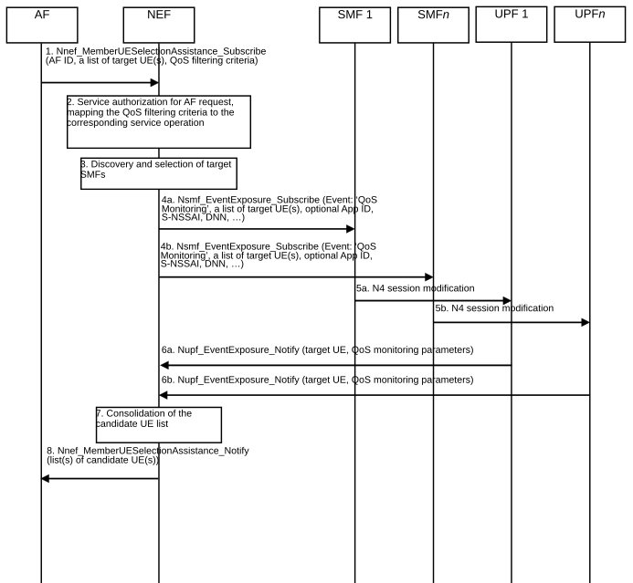
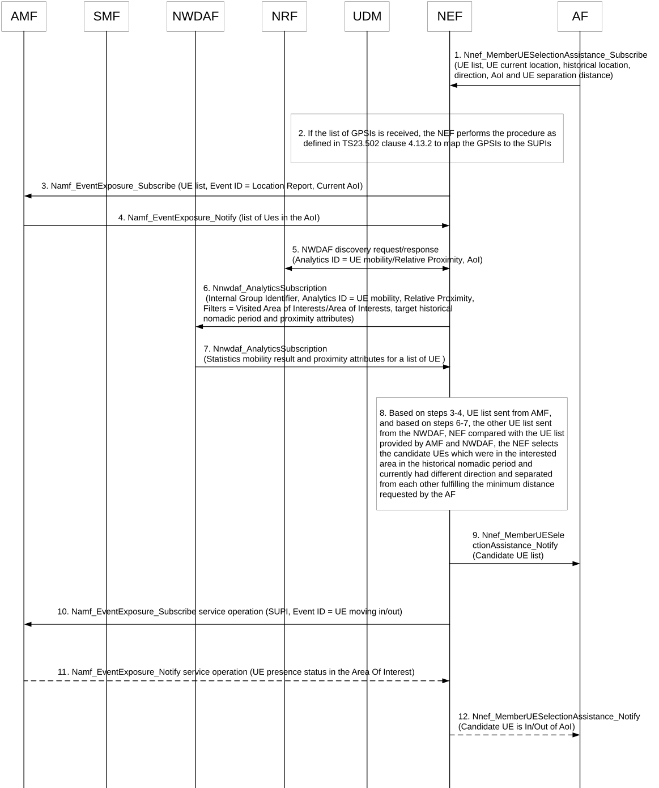
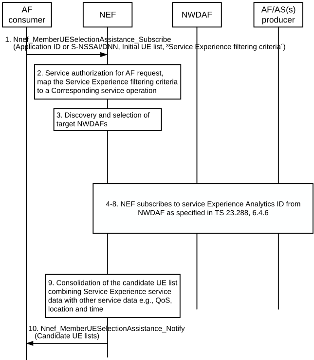
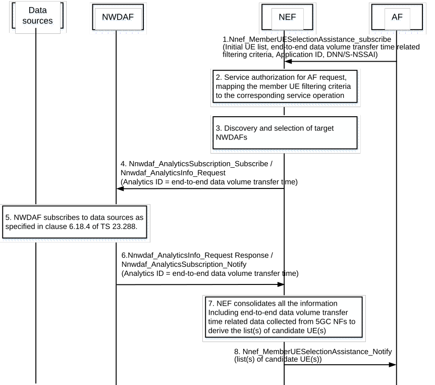
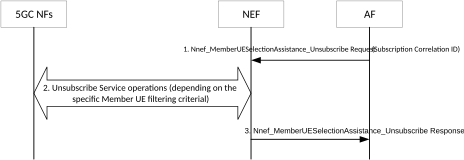

# 4.15.13 Assistance for Member UE selection

## 4.15.13.0 General

Assistance for Member UE selection allows the AF to request the 5GC to filter a list of AF provided target member UEs according to AF provided criteria (Member UE filtering criteria) and to provide one or more list(s) of candidate UEs (and additional information) as response to the AF.

With the initial subscription request, the AF provides a list of target member UEs in the form of a list of GPSIs or a list of UE IP addresses and at least one Member UE filtering criterion as part of the service operation input parameters to assist the candidate UEs selection. Upon receiving the AF request, NEF triggers corresponding 5GC procedures to retrieve from 5GC NFs the information for the UEs in the list of target member UEs. Before sending the list(s) of candidate UEs to the AF, NEF consolidates all the information collected from other 5GC NFs and derives one or more list(s) of candidate UEs and possibly additional information according to the Member UE filtering criteria provided by the AF. The NEF finally provides the one or more list(s) of candidate UEs and possibly additional information to the AF together with a Subscription Correlation ID.

AF may subsequently update the parameters for the Member UE filtering criteria, the Member UE filtering criteria, or the Member UE filtering criteria values. In all cases, AF includes the Subscription Correlation ID in the request, but does not include the list of target member UEs. AF may request to update the parameters (e.g. expiry time, time window for selecting the candidate UEs) for the subscribed Member UE filtering criteria. AF may also request to update the Member UE filtering criteria by adding new Member UE filtering criteria or removing part of the subscribed Member UE filtering criteria. The AF may also request to update the Member UE filtering criteria values.

The Member UE selection assistance capability can be used to assist the AF to select the list of member UEs to support application service (e.g. FL operation) as described in clause 5.46.2 of TS 23.501 \[2\].

Additionally, AF may leverage the 5GC network exposure for Member UE selection without the NEF assistance as described in clause 5.46.2 of TS 23.501 \[2\]. An example of how the AF leverages the 5GC network exposure for Member UE selection is described in (informative) Annex I.

AF may also delete the previous subscription for Member UE selection assistance as described in clause 4.15.13.7.

## 4.15.13.1 Member UE selection assistance subscribe and update procedure

This clause describes the Member UE selection assistance subscribe and update procedure that is generally applicable independently of the Member UE filtering criteria sent by the AF.

Figure 4.15.13.1-1: Member UE selection assistance subscribe and update procedure

1\. AF subscribes the Member UE selection assistance by sending a Nnef_MemberUESelectionAssistance_subscribe request including a list of target member UEs, one or more member UE filtering criteria as listed in Table 4.15.13.2-1 and optionally, time window(s). Subsequently, the AF may only update the Member UE filtering criteria of the subscription as described in clause 4.15.13.0 by invoking Nnef_MemberUESelectionAssistance_subscribe and providing a Subscription Correlation ID, i.e. the AF does not provide the list of target member UEs again.

NOTE: The time window(s) for selecting the candidate UE(s) is used by the NEF when subscribing/requesting to NWDAF. The NEF maps the time window(s) for selecting the candidate UE(s) to the Analytics target period, which should be included in the Nnwdaf_AnalyticsSubscription_Subscribe or Nnwdaf_AnalyticsInfo_Request service operations.

2a. \[CONDITIONAL\] If the AF request does not contain a Subscription Correlation ID, the NEF verifies the authorization of the AF request and identifies which information needs to be collected for each UE in the list of target member UEs and executes the corresponding service operations based on the Member UE filtering criteria provided by the AF, e.g. events, analytics ID(s), notifications, etc.

2b. \[CONDITIONAL\] If the AF request contains a Subscription Correlation ID, the NEF correlates the Nnef_MemberUESelectionAssistance_Subscribe request to an existing subscription according to the Subscription Correlation ID. The NEF updates the Member UE filtering criteria and/or their parameters (as described in clause 4.15.13.0) for the list of target member UEs received in initial subscription (i.e. no Subscription Correlation ID in the subscription request).

3\. NEF interacts with different 5GC network functions to collect the required information for each UE in the list of target member UEs. The set of interactions between the NEF and the 5GC NFs depend on the Member UE filtering criteria provided by the AF. See Table 4.15.13.2-1 for details.

4\. Based on the collected information from other 5GC NFs, the NEF consolidates all the information to derive the list(s) of candidate UEs which fulfil the Member UE filtering criteria in the AF request. The NEF may derive recommended time window(s), considering the validity period(s) of the analytics used for Member UE selection criteria. The recommended time window(s) may be a subset of the time window(s) received from the AF. In different recommended time windows, the list of candidate UEs which fulfil the Member UE filtering criteria may be different.

5\. NEF sends a Nnef_MemberUESelectionAssistance_Notify request to the AF including the list(s) of candidate UEs and possibly additional information. See clause 5.2.6.32.4 for details.

## 4.15.13.2 Member UE Filtering Criteria for 5GS assistance to Member UE selection

Table 4.15.13.2-1 provides a summary of the Member UE filtering criteria that the AF may request.

Table 4.15.13.2-1: Description of Member UE filtering criteria

<table style="width:100%;">
<colgroup>
<col style="width: 20%" />
<col style="width: 21%" />
<col style="width: 37%" />
<col style="width: 21%" />
</colgroup>
<thead>
<tr class="header">
<th>Member UE filtering criteria</th>
<th>Description of filtering criteria for member UEs selected by NEF</th>
<th>UE filtering information</th>
<th>Detailed description clause</th>
</tr>
</thead>
<tbody>
<tr class="odd">
<td>QoS</td>
<td>The Quality of Service of the member UEs match or exceed the QoS of the filtering criteria.</td>
<td>
NF service: Nsmf_EventExposure or Nudm_EvenExposure,

Filter: target=SUPI, traffic descriptor (e.g. Application ID), DNN/S-NSSAI

Event ID: QoS Monitoring
</td>
<td>4.15.13.3</td>
</tr>
<tr class="even">
<td>Access Type and/or RAT Type of the PDU Session</td>
<td>Indicate the Access Type and/or RAT Type of the member UEs for the PDU Session used by the application (e.g. 3GPP/NR, Non-3GPP/WLAN, additional Access Type and RAT Type for MA PDU session).</td>
<td>
NF service: Nsmf_EventExposure

Filter: a list of GPSI(s) or SUPI(s), DNN/S-NSSAI, Event ID: Change of Access Type and/or Change of RAT Type
</td>
<td>5.2.8.3</td>
</tr>
<tr class="odd">
<td>End-to-end data volume transfer time</td>
<td>Indicate the target end-to-end data volume transfer time that refers to a time for completing the transmission of a specific data volume between UE and AF, e.g. the average and variance of End-to-end data volume transfer time.</td>
<td>
NF service: Nnwdaf_AnalyticsSubscription/ Nnwdaf_AnalyticsInfo

Filter: Target = GPSI(s) or SUPI(s)

Analytics ID: E2E data volume transfer time
</td>
<td>4.15.13.6</td>
</tr>
<tr class="even">
<td>UE current location</td>
<td>Indicate the certain area that the member UEs are currently located in.</td>
<td>
NF service: Namf_EventExposure

Filter: a list of GPSI(s) or SUPI(s)

Event ID: Location Report
</td>
<td>4.15.13.4</td>
</tr>
<tr class="odd">
<td>UE historical location</td>
<td>Indicate the certain area that the member UEs appeared in a historical period of time.</td>
<td>
NF service:

Nnwdaf_AnalyticsSubscription / Nnwdaf_AnalyticsInfo

Filter: Visited AoI = Target AOI, target period = historical nomadic period

Analytics ID = UE mobility
</td>
<td>4.15.13.4</td>
</tr>
<tr class="even">
<td>UE direction</td>
<td>Indicate the member UEs should include different moving directions.</td>
<td>
NF service:

Nnwdaf_AnalyticsSubscription / Nnwdaf_AnalyticsInfo

Filter: UE Direction

Analytics ID= UE Mobility
</td>
<td>4.15.13.4</td>
</tr>
<tr class="odd">
<td>
UE separation distance

(NOTE 1)
</td>
<td>Indicate the member UEs should comply with a minimum separation distance between each other.</td>
<td>
NF service:

Nnwdaf_AnalyticsSubscription/

Nnwdaf_AnalyticsInfo

Filter: Proximity Attributes

Analytics ID: Relative Proximity
</td>
<td>4.15.13.4</td>
</tr>
<tr class="even">
<td>Service Experience</td>
<td>Indicates member UEs fulfilling certain Service Experience criteria e.g., MOS value.</td>
<td>
NF service: Nnwdaf_AnalyticsSubscription/ Nnwdaf_AnalyticsInfo

Filter: S-NSSAI, DNN, Application ID, DNAI, AoI, Service Experience Contribution weight, reporting threshold (NOTE 2), Service Experience Type (NOTE 3)

Analytics ID=Service Experience
</td>
<td>4.15.13.5</td>
</tr>
<tr class="odd">
<td>DNN</td>
<td>Indicate the DNN of the member UEs for the PDU Session used by the application.</td>
<td>
NF service: Nsmf_EventExposure

Filter: a list of GPSI(s) or SUPI(s), Event ID: QFI allocation
</td>
<td>5.2.8.3</td>
</tr>
<tr class="even">
<td colspan="4">
NOTE 1: This criterion should only be applied when the number of UEs is in the range of 10's or less.

NOTE 2: The Service Experience Contribution Weights signal the relative importance of each UE's Service Experience value (i.e. MOS), as defined in TS 23.288 [50]. For example, it might be that the service experience of a UE in relation to other UEs may not be as important e.g. because the data provided by such UE is not as critical to the service.

NOTE 3: Indicates the type of service experience analytics, e.g. AI/ML traffic where a customized MoS apply.
</td>
</tr>
</tbody>
</table>

## 4.15.13.3 Specific procedure for QoS Member UE filtering criteria

### 4.15.13.3.1 General

An AF may invoke Nnef_MemberUESelectionAssistance_Subscribe service operation with one QoS filtering criterion for receiving a list of UEs that match or exceed such criteria.

In addition to the mandatory parameters, the AF also includes in the request:

\- QoS filtering criteria.

\- Optionally, an Area of Interest: location area of the candidate UEs.

The QoS filtering criteria includes:

\- a traffic descriptor (e.g. Application ID).

\- Optionally, DNN.

\- Optionally, S-NSSAI.

And one or more of the QoS parameters subject to QoS monitoring (see list in clause 5.45 of TS 23.501 \[2\]).

The determination of the list of UEs that match or exceed the QoS filtering criteria and are optionally located in the AoI in real time, for the duration of the subscription, is further described in clause 4.15.13.3.3.

### 4.15.13.3.2 Void

### 4.15.13.3.3 Member UE Selection Assistance with QoS filtering criteria for real-time QoS Monitoring

At the reception of Nnef_MemberUESelectionAsistance_Subscribe request of step 1, in order to detect the list of UEs that fulfil the QoS filtering criteria in real time, NEF performs real-time QoS monitoring. Unless the QoS flow to be monitored is associated with a default QoS flow, QoS Monitoring needs to be activated in SMF for that QoS Flow before (e.g. by AF Session with required QoS) (see clause 4.15.4.5.1 for details).

Figure 4.15.13.3.3-1: 5GC assistance to Member UE selection for real-time QoS monitoring

1\. AF subscribes to the Member UE selection assistance functionality by sending Nnef_MemberUESelectionAssistance_subscribe request including its AF ID, a list of target UE(s) and the QoS filtering criteria.

2\. NEF uses the AF ID to verify the authorization of the AF request and identifies which information needs to be collected based on the QoS filtering criteria provided by the AF.

3\. If S-NSSAI/DNN are not included in the request from the AF, the NEF derives the S-NSSAI and DNN which this Application has access to. NEF discovers the SMFs that are deployed in the Area of Interest by querying UDM and NRF. The NEF may also restrict the discovery to those SMFs that serve some S-NSSAI and DNN combination.

4\. For each target SMF, NEF sends an Nsmf_EventExposure_Subscribe request (Event: 'QoS monitoring', target member UEs, optionally a traffic descriptor (e.g. Application ID), optionally indication for default QoS flows monitoring, S-NSSAI, DNN, Notification Target Address set to NEF, etc.). Alternatively, NEF may send an Nudm_EventExposure_Subscribe request to the UDM (not shown in Figure 4.15.13.3.3-1).

5\. The SMF may need to send an N4 Session Modification request to UPF for requesting the QoS monitoring for certain flows.

6\. UPF sends an Nupf_EventExposure_Notify request to NEF including an Event Exposure notification, according to the subscription received from SMF.

7\. Based on the Event Exposure reports received from the UPFs, NEF consolidates the received results and derives the list(s) of candidate UE(s) and additional information which fulfil the QoS filtering criteria provided by the AF.

8\. NEF sends a Nnef_MemberUESelectionAssistance_Notify request to the AF including the list(s) of candidate UE(s) and additional information.

## 4.15.13.4 Specific procedure for the 5GC assistance to member UE selection based on the UE's current location, historical location and direction and UE separation distance

Figure 4.15.13.4-1: 5GC assistance to Member UE selection based on the UE's current and historical location, direction and separation distance

1\. AF requests 5GS assistance to support the Member UE selection by considering the UE's historical location, UE's current location, direction and UE separation distance. AF includes the UE lists and the following criteria as part of the member UE selection request:

\- UE historical location: The Target AoI where the UEs have been roving over the historical nomadic period before moving into the FL coverage area.

\- UE current location: The current AoI which is the coverage area of the FL training server where the selected UEs located in to participate in the FL operation.

\- UE Direction: Select the UE with the different direction in the FL coverage Area.

\- UE separation distance: Select UEs that are geographically separated, fulfilling the separation distance no smaller than the certain predefined separation distance.

When providing a target area for e.g. FL operation, the AF may provide sub-areas, and provide a maximum number of UEs that should take part in FL from each sub-area.

2\. NEF translates the GPSIs to SUPIs and maps the filtering criteria into the corresponding UE filtering information.

3-4. The NEF invokes Namf_EventExposure_Subscribe service operation with the UE list, the current AoI and event ID = Location report. AMF will provide a list of UEs that are within the current AoI to the NEF using the Namf_EventExposure_Notify service operation. The NEF obtains the list of possible member UEs from AMF within the current AoI.

5\. In order to identify the appropriate NWDAF which can provide analytics output to derive the visited AOI info and get the UE direction for the possible target member UEs above, the NEF initiates NWDAF discovery request (Analytics ID = UE mobility/Relative Proximity, AOI = Target AOI) with UE list received from step 4.

6-7. The NEF invokes NWDAF Analytics Info request (UE list received from step 4, Analytics ID = UE mobility, Relative Proximity, Filters include "Visited AoI = Target AOI", "target period = historical nomadic period" and "proximity attributes"). In a response, NWDAF provides a list of UEs that were ever roving within the target AOI, at the minimum, over the historical nomadic period. Additionally, NWDAF provides a list of UEs location in the order of which the UE passes through. Thus, the NEF gets the corresponding statistics of UE mobility, the UE's direction and distance between UEs in the group/list.

8-9. Based on the information provided by the AMF and NWDAF, the NEF can determine the FL candidate UEs which are now within the FL coverage area but were roving within the target AOI over the historical nomadic period and UE with the different direction and separated from each other fulfilling the minimum distance threshold as requested by AF. The NEF notifies AF for such UE candidate list.

10\. The NEF also needs to consider the list of UEs which are now within the FL coverage area, but may move out of the FL coverage area. Therefore, for each UE in the candidate list in steps 8-9, the NEF invokes the Namf_EventExposure_Notify service with UE ID = SUPI, Event ID=UE moving in/out of AOI in order to keep tracking the movement of the UE(s).

11-12. If step 10 identifies any UE which is moving out of the FL coverage area, the NEF may update the candidate UEs and notify to the AF.

## 4.15.13.5 Specific procedure for Service Experience Member UE filtering criteria

### 4.15.13.5.1 General

An AF may invoke Nnef_MemberUESelectionAssistance_Subscribe service operation with a Service Experience filtering criteria for receiving a list of UEs that fulfil such criteria.

In addition to the mandatory parameters, the AF may also include in the request:

\- Service Experience filtering criteria.

\- An Area of Interest: location area of the candidate UEs.

\- Time windows for selecting the candidate UEs: start time and stop time.

\- Service Experience contribution weights.

\- Service Experience Type.

The AF may provide a Service Experience filtering criteria, including contribution weights associated to location, e.g. AoI or DNAI, time window, Application ID and Service Experience type e.g. contribution weight may be provided to favour Service Experience type relative to AIML traffic in a particular location.

### 4.15.13.5.2 Member UE Selection Assistance with Service Experience filtering criteria

Figure 4.15.13.5.2-1: 5GC assistance to Member UE selection based on Service Experience

1\. AF subscribes to the Member UE selection assistance functionality by sending Nnef_MemberUESelectionAssistance_subscribe request including the Application Identity, AoI, DNN/S-NSSAI, DNAI(s), Service Experience Type and contribution weights associated to location, time window, Application ID and Service Experience type.

2\. NEF verifies the authorization of the AF Request and identifies which information needs to be collected and executed based on the Service Experience filtering criteria provided by the AF.

3\. If S-NSSAI/DNN and DNAI(s) are not included in the request from the AF, the NEF derives the S-NSSAI, DNN and DNAI(s) which this Application has access to. NEF discovers and selects the NWDAF(s) by invoking Nudm_UECM_Get or Nnrf_NFDiscovery_Request including Analytics ID = Service Experience, AoI, S-NSSAI, etc.

4\. NEF sends an Analytics request/subscribe to NWDAF by invoking a Nnwdaf_AnalyticsInfo_Request or a Nnwdaf_AnalyticsSubscription_Subscribe, including Analytics ID = Service Experience, Application ID, S-NSSAI, DNN, AoI, DNAI(s), and target UEs based on the initial list obtained from the AF.

5-7. Procedures as specified in clause 6.4.6 of TS 23.288 \[50\] are followed.

8\. The NWDAF provides the data analytics, i.e. the observed Service Experience (which can be a range of values) to the consumer NF by means of either Nnwdaf_AnalyticsInfo_Request response or Nnwdaf_AnalyticsSubscription_Notify, depending on the service used in step 4.

9\. Based on the Analytics report received from the NWDAF, NEF consolidates results and derives the list(s) of candidate UE(s). For applying that, NEF may use the Service Experience type provided by the AF consumer in the filtering information and use operator policies to interpret a customized MoS. Additionally, NEF may use the contribution weight associated to an application and a Service Experience Type (e.g. AI/ML traffic) and apply them to a location and time window, as provided by the AF consumer, to be used as reporting thresholds when selecting candidate Member UEs, e.g. the NEF may select a UE with a specific Service Experience Type as a Member UE candidate, if the associated Service Experience fulfils the threshold for Service Experience filtering criteria provided by the AF.

10\. NEF sends a Nnef_MemberUESelectionAssistance_Notify request to the AF including the list(s) of candidate UE(s) and additional information.

## 4.15.13.6 Specific procedure for end-to-end data volume transfer time related member UE filtering criteria

### 4.15.13.6.1 General

An AF may invoke Nnef_MemberUESelectionAssistance_Subscribe service operation with end-to-end data volume transfer time related filtering criteria for receiving a list of UEs that fulfil the filtering criteria.

In addition to the mandatory parameters, the AF may also include in the request:

\- End-to-end data volume transfer time filtering criteria: this may include the average end-to-end data volume transfer time for a specific data volume between UE and AF and/or the variance of the end-to-end data volume transfer time.

\- An Area of Interest: location area of the candidate UEs.

\- Time windows for selecting the candidate UEs: start time and stop time.

\- Data Volume UL/DL: the expected or observed data volume from UE to AF or from AF to UE which may be used to derive the end-to-end data volume transfer time analytics.

\- The target number of data transmission repetitions or target time interval between data transmissions.

\- A request for geographical distribution of UEs.

### 4.15.13.6.2 Member UE Selection assistance with end-to-end data volume transfer time related filtering criteria

Figure 4.15.13.6.2-1: Assistance to member UE selection for end-to-end data volume transfer time related filtering criteria

1\. AF subscribes to the member UE selection assistance functionality by invoking Nnef_MemberUESelectionAssistance_subscribe request including the Application ID, DNN/S NSSAI, AoI, and the end-to-end data volume transfer time related filtering criteria including the average end-to-end data volume transfer time and/or the variance of the transfer time, the Data Volume UL/DL, the target number of data transmission repetitions or target time interval between data transmissions, request for geographical distribution (i.e. the AoIs) of the UEs.

2\. NEF verifies the authorization of the AF Request and identifies which information needs to be collected and executed based on the end-to-end data volume transfer time related filtering criteria provided by the AF.

3\. S-NSSAI/DNN are not included in the request from the AF, the NEF derives the S-NSSAI and DNN which this Application has access to. NEF discovers and selects the NWDAF(s) by invoking Nudm_UECM_Get or Nnrf_NFDiscovery_Request including Analytics ID = E2E data volume transfer time, AoI, S-NSSAI, etc.

4\. NEF sends an Analytics request/subscribe to NWDAF by invoking Nnwdaf_AnalyticsSubscription_Subscribe / Nnwdaf_AnalyticsInfo_Request including Analytics ID = E2E data volume transfer time, Application ID, DNN, S-NSSAI, AoI, and target UEs based on the initial UE list obtained from the AF, the target number of data transmission repetitions or target time interval between data transmissions, the Data Volume UL/DL, request for geographical distribution (i.e. the AoIs) of the UEs, etc.

5\. The NWDAF collects data from multiple sources for end-to-end data volume transfer time analytics as specified in clause 6.18.2 of TS 23.288 \[50\].

6\. The NWDAF provides the required output analytics to the consumer NF as specified in clause 6.18.4 of TS 23.288 \[50\] by means of either Nnwdaf_AnalyticsInfo_Request response or Nnwdaf_AnalyticsSubscription_Notify, depending on the service used in step 4.

7\. Based on the analytics received from the NWDAF, the NEF consolidates results and derives the list(s) of candidate UE(s) that fulfil the filtering criteria requested by the AF. The NEF may use the average and/or the variance of end-to-end data volume transfer time of specific volumes of UL/DL data indicated by the AF to derive the list(s) of candidate UEs that meet the requirements from the AF.

8\. NEF sends a Nnef_MemberUESelectionAssistance_Notify request to the AF including the list(s) of candidate UE(s) and additional information.

## 4.15.13.7 Member UE selection assistance unsubscribe procedure

This clause describes the procedure to delete the subscription for Member UE selection assistance in NEF.

Figure 4.15.13.7-1: Member UE selection assistance unsubscribe procedure

1\. AF requests to delete the previous subscription for Member UE selection assistance by sending Nnef_MemberUESelectionAssistance_unsubscribe request including the Subscription Correlation ID.

2\. NEF interacts with different 5GC network functions to delete the subscription(s) generated for each UE in the list of target member UEs. The set of interactions between NEF and 5GC NFs are dependent on the Member UE filtering criteria that AF had provided in clause 4.15.13.1.

3\. NEF sends a Nnef_MemberUESelectionAssistance_unsubscribe response to the AF with the operation execution result indication.
