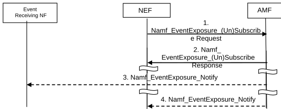

# 4.15.3.2.1 AMF service operations information flow

The procedure is used by the NF to subscribe to notifications and to explicitly cancel a previous subscription. Cancelling is done by sending Namf_EventExposure_UnSubscribe request identifying Subscription Correlation ID. The notification steps 3 and 4 are not applicable in cancellation case.

Figure 4.15.3.2.1-1: Namf_EventExposure_Subscribe, Unsubscribe and Notify operations

1\. A NEF sends a request to subscribe to a (set of) Event ID(s) in AMF in Namf_EventExposure_Subscribe request. The NEF could be the same NF subscribing to receive the event notification reports (i.e. Event Receiving NF) or it could be a different NF. The NEF subscribes to one or several Event(s) (identified by Event ID) and provides the associated notification endpoint of the Event Receiving NF. If the NEF itself is not the Event Receiving NF, the NEF shall additionally provide the notification endpoint of itself besides the notification endpoint of Event Receiving NF. Each notification endpoint is associated with the related (set of) Event ID(s). This is to assure the NEF can receive the notification of subscription change related event (e.g. Subscription Correlation ID Change).

Event Reporting information defines the type of reporting requested. If the reporting event subscription is authorized by the AMF, the AMF records the association of the event trigger and the requester identity.

2\. AMF acknowledges the execution of Namf_EventExposure_Subscribe.

3\. \[Conditional - depending on the Event\] The AMF detects the monitored event occurs and sends the event report by means of Namf_EventExposure_Notify message, to the notification endpoint of the Event Receiving NF.

4\. \[Conditional- depending on the Event\] The AMF detects the subscription change related event occurs, e.g. Subscription Correlation ID change due to AMF reallocation, it sends the event report by means of Namf_EventExposure_Notify message to the NEF.
