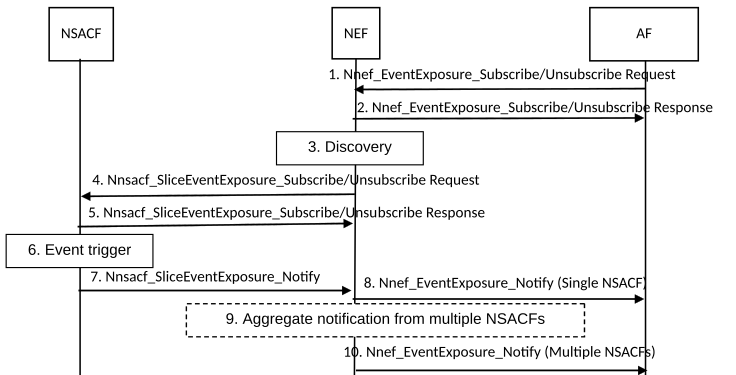
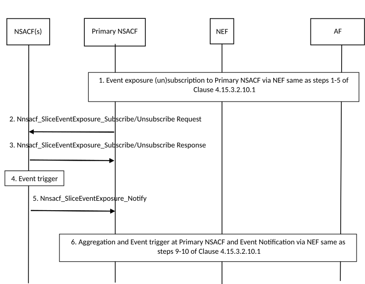

# 4.15.3.2.10 Number of UEs and PDU Sessions per network slice notification procedure

## 4.15.3.2.10.1 Reported value(s) aggregated at NEF

This procedure depicts the case of an AF subscribing to receive the registered number of UEs, or the number of PDU sessions in a specific S-NSSAI. The procedure handles the case when there is a single NSACF in the PLMN responsible for the S-NSSAI (single Service Area) or when there are multiple NSACFs responsible for the S-NSSAI in the PLMN (multiple Service Areas).

Figure 4.15.3.2.10.1-1: Reported value(s) aggregated at NEF per network slice notification procedure

1\. To subscribe or unsubscribe for the number of UEs or the number of PDU Sessions per network slice notification with the NEF, the AF sends Nnef_EventExposure Subscribe/Unsubscribe Request (Event ID, Event Filter, Event Reporting information, S-NSSAI) message to the NEF. The Event ID parameter defines the subscribed event ID, i.e. Number of Registered UEs or Number of Established PDU Sessions. The Event Filter parameter defines the S-NSSAI, in case of a trusted AF or AF-Service-Identifier as defined in TS 29.522 \[87\] for an untrusted AF, for which reporting is required. The Event Reporting information parameter defines the mode of reporting, which includes threshold reporting with a threshold value or periodic reporting with included periodicity time interval. The S-NSSAI is the slice for which the subscription is requested

The AF may request one-time reporting or immediate reporting.

NOTE 1: When immediate reporting but not for one-time reporting is requested, the subscription is maintained after returning the report to the AF. When one-time reporting is requested, the subscription is terminated right after returning the report to the AF.

Notifications related to the threshold based subscriptions behave as follows:

\- A single notification is sent only when the number of registered UEs or the number of established PDU Sessions reaches the threshold. A single notification is sent every time there is a change from being below the threshold to reach the threshold.

\- A single notification is sent only once when the number of registered UEs or the number of established PDU Sessions go below the threshold after reaching it. A single notification is sent every time there is a change from reaching the threshold to coming down below the threshold.

2\. The NEF confirms with Nnef_EventExposure_Subscribe/Unsubscribe Response message to the AF. This message may include the event reporting, if available in the NEF and immediate reporting or one-time reporting was requested by the AF. In the case of Untrusted AF, the NEF includes the AF-Service-Identifier corresponding to the S-NSSAI in the returned notification.

If immediate reporting or one-time reporting is requested, step 2 occurs after step 5 and the subscription response contains the immediate or one-time report. For the case of one-time reporting, no subscription is created at the NEF/NSACF.

3\. The NEF may query the NRF to find the NSACF(s) responsible for the requested S-NSSAI. If needed, the NEF translates the AF-Service-Identifier to the corresponding S-NSSAI prior to performing the query.

4\. If the NEF has not already subscribed to the event from the NSACF for the requested S-NSSAI, the NEF initiates the request Nnsacf_SliceEventExposure_Subscribe/Unsubscribe Request (Event ID, Event Filter, Event Reporting information, immediate reporting, S-NSSAI) to all the NSACFs supporting the requested S-NSSAI. The NEF stores the AF requested Event Reporting Information. If multiple NSACFs are selected for the requested S-NSSAI, the NEF may set the Event Reporting Information to periodic in its request to the NSACFs. If single NSACF is selected, the NEF sets the Event Reporting Information identical to the received request from the AF. The NEF also sets the Event ID and Event Filter identical to the received request from the AF

NOTE 2: The period chosen is selected by the NEF based on its internal logic.

5\. The NSACF(s) confirms with Nnsacf_SliceEventExposure_Subscribe/Unsubscribe Response message to the NEF. This message may include the event reporting if available at NSACF and immediate reporting or one-time reporting was requested by the NEF.

6\. When the reporting condition for a subscribed event is fulfilled, the NSACF triggers a notification towards the NEF.

7\. The NSACF sends the Nnsacf_SliceEventExposure_Notify (Event ID, Event Reporting information) message to the NEF. If the subscription is for event based notification (e.g. based on the monitored event reaching a threshold value), the Event Reporting information parameter contains confirmation for the event fulfilment. If the subscription is for periodic notification or for immediate reporting, the Event Reporting information parameter provides information for the current number of UEs registered with a network slice (e.g. represented in percentage of the maximum number of the UEs registered with the network slice) or information for the current number of PDU Sessions on a network slice (e.g. represented in percentage of the maximum number of the UEs established on the network slice).

8\. When a single NSACF is returned from the discovery procedure, the NEF sends the Nnef_EventExposure_Notify (Event ID, Event Reporting information) message since the reporting condition is fulfilled. In the case of Untrusted AF, the NEF includes the AF-Service-Identifier corresponding to the S-NSSAI in the returned notification.

9\. When multiple NSACFs are selected for the requested NSSAI the NEF performs the aggregation from reporting NSACF(s) and maintain the overall usage of the S-NSSAI for the selected NSACFs as long as the subscription is active.

NOTE 3: If multiple NSACFs are selected for the requested S-NSSAI, the NEF continuously updates the aggregated information to be able to fulfil the incoming subscription request from the AF.

10\. When multiple NSACFs are selected for the requested S-NSSAI and when the reporting condition for a subscribed event by the AF is fulfilled, the NEF sends Nnef_EventExposure_Notify (Event ID, Event Reporting information) message towards the AF. In case of untrusted AF; the NEF includes the AF-Service-Identifier corresponding to the S-NSSAI in the returned notification.

If the hierarchical NSAC architecture is deployed in the PLMN for the NSAC of an S-NSSAI and the number of UEs, number of UE with at least one PDU session/PDN connection, or number of PDU Sessions are aggregated at NEF, the same procedure as above can be reused. In this case Primary NSACF behaves as a normal NSACF.

## 4.15.3.2.10.2 Reported value(s) aggregated at Primary NSACF

If the hierarchical NSAC architecture is deployed in the PLMN for the NSAC of an S-NSSAI, the Primary NSACF needs to be aware of the current status of registered UEs, UE with at least one PDU session/PDN connection, or established PDU sessions at all NSACFs with whom it is interacting, so it can dynamically adapt and adjust the local Maximum number of UEs, local Maximum number of UE with at least one PDU session/PDN connection, or PDU sessions configured at the NSACFs. In this case, it is possible to leverage this capability and provide subscribing AFs to receive the registered number of UEs, number of UE with at least one PDU session/PDN connection, or the number of PDU sessions for the requested S-NSSAI without NEF aggregation. Such a procedure is depicted below.

Figure 4.15.3.2.10.2-1: Reported value(s) aggregated at Primary NSACF per network slice notification procedure

1\. The AF subscribes (or unsubscribe) to the number of UEs, or the number of PDU Sessions per network slice notification to the NEF. The NEF finds the primary NSACF responsible for the requested S-NSSAI. Based on the network configuration, the NEF does not to do the aggregation. The procedure is same as steps 1-5 of clause 4.15.3.2.10.1 with the following differences:

\- Based on the network configuration the NEF is aware that one NSACF can serve entire PLMN for the requested S-NSSAI, i.e. existence of the Primary NSACF. The NEF queries the NRF to find the corresponding primary NSACF responsible for the requested S-NSSAI. Besides the requested S-NSSAI, the Serving Area information of "Entire PLMN" is included as querying parameter. In the case of Trusted AF, the AF can discover and subscribe (or unsubscribe) directly with the Primary NSACF.

\- The NEF sets the Event Reporting Information identical to the received request from the AF. The NEF also sets the Event ID and Event Filter identical to the received request from the AF. The Primary NSACF responsible for the requested S-NSSAI performs the aggregation per network configuration.

2-6. The Primary NSACF subscribes (or unsubscribes) to the number of UEs, or the number of PDU Sessions per network slice notification to all the NSACFs supporting the requested S-NSSAI(s). The procedure is same as steps 4-7 of clause 4.15.3.2.10.1 for multiple NSACFs case with the Primary NSACF replacing the NEF and the following differences:

\- Step 2, based on the received event subscription from NEF, the Primary NSACF triggers the slice event subscription to NSACF(s) if it does not exist before.

\- Step 6, the Primary NSACF performs the aggregated values from reporting NSACF(s) including itself (if available) and maintain the overall usage of the S-NSSAI(s) for the indicated Event ID parameter, i.e. the number of UEs registered with a network slice, number of UE with at least one PDU session/PDN connection, or the number of PDU Sessions established on a network slice, from the selected NSACFs as long as the subscription is active. When the reporting condition for a subscribed event is fulfilled, the Primary NSACF triggers a notification for the event towards the NEF. As values from the NSACF(s) has been aggregated at the Primary NSACF, there is no aggregation to be performed further at the NEF. NEF forwards the received values to AF.

NOTE: For the number of registered UEs per network slice or number of UE with at least one PDU session/PDN connection, the aggregated value includes both the number of registered UE at NSACF(s) and the number of registered UE at Primary NASCF as described in the clause 5.15.11.1.2 of TS 23.501 \[2\]. For the number of established PDU sessions per network slice, the aggregated value only includes the number of established PDU Sessions at the NSACF(s).
