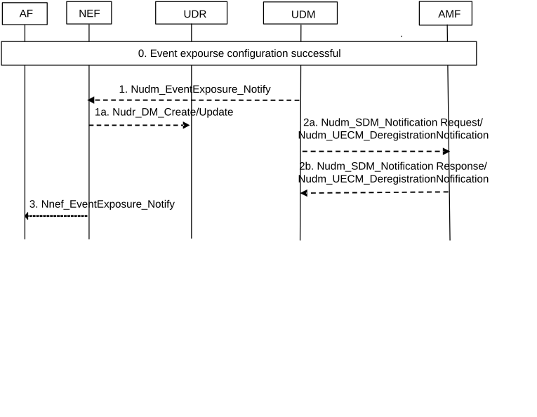

# 4.15.3.2.11 Network-initiated explicit event notification subscription cancel procedure

The procedure is used by the UDM to delete an event notification subscription (see clause 4.15.1).

Figure 4.15.3.2.11-1: Network-initiated event subscription removal procedure

0\. An event notification subscription procedure according to clause 4.15.3.2.2 or clause 4.15.3.2.2 has already executed successfully.

1-1a. If UE subscription is withdrawn in UDM, UE authorisation to the subscribed monitoring event or UE is removed from the subscribed target group, the UDM triggers Nudm_EventExposure_Notify towards the associated notification endpoint indicating the removal of the event notification along with the time stamp. The NEF may store the information in the UDR along with the time stamp using either Nudr_DM_Create or Nudr_DM_Update service operation as appropriate.

In order to remove certain UEs in a group of UEs for which there is an event notification subscription, the UDM provides impacted UE information (e.g. SUPI, MSISDN or External Identity) to the NEF and indicates the removal of the event notification subscription for these UE(s).

2a-2b. If UE subscription information changes (e.g. UE group information changes), the UDM sends Nudm_SDM_Notification request to related serving AMF(s) to update event notification subscription information. If the UE was a group member of a previous accepted group-based event notification subscription, the AMF shall stop the event notifications for the impacted UEs. If Maximum number of Reports is applied, the AMF shall set the number of reports of the indicated UE(s) to Maximum Number of Reports.

If UE subscription data is withdrawn, the UDM sends Nudm_UECM_DeregistrationNotification request to related serving AMF(s) to remove UE subscription information. If the UE was a group member of a previous accepted group-based event notification subscription, the AMF shall keep the accepted group-based event notification subscription unless all UEs subscriptions in the group are withdrawn.

3\. The NEF sends Nnef_EventExposure_Notify to the AF reporting event received by Nudm_EventExposure_Notify.

If the NEF receives UE Identifier(s) in step 1 for a group-based event notification subscription and the Maximum Number of Reports applies to the group-based event notification subscription, the NEF sets the number of reports of the indicated UE(s) to Maximum Number of Reports. The NEF sends Nnef_EventExposure_Notify to the AF and includes MSISDN(s) or External Identifier(s). If NEF determines that the reporting for the group is complete based on the update above, the NEF deletes the associated event notification subscription and requests that the UDM deletes the related event notification subscription for the group.
