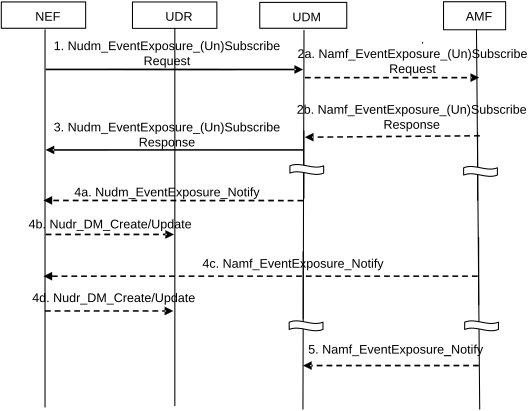

# 4.15.3.2.2 UDM service operations information flow

The procedure is used by the NEF to subscribe to event notifications, to modify group-based subscriptions to event notifications, including removal or addition of certain UEs in a UE group and to explicitly cancel a previous subscription (see clause 4.15.1). Cancelling is done by sending Nudm_EventExposure_Unsubscribe request identifying the subscription to cancel. The notification steps 4 and 5 are not applicable in cancellation case.

Figure 4.15.3.2.2-1: Nudm_EventExposure_Subscribe, Unsubscribe and Notify operations

1\. The NEF subscribes to one or several monitoring events by sending Nudm_EventExposure_Subscribe request. The NEF subscribes to one or several Event(s) (identified by Event ID) and provides the associated notification endpoint of the NEF.

Event Reporting Information defines the type of reporting requested. If the reporting event subscription is authorized by the UDM, the UDM records the association of the event trigger and the requester identity.

The subscription may include Maximum number of reports and/or Maximum duration of reporting IE and optionally MTC Provider Information.

If subscription to group-based event notifications are removed for certain UEs in a group of UEs for which there is an event notification subscription, the NEF provides impacted UE information (e.g. SUPI, MSISDN or External Identity) and operation indication (cancellation) to UDM via Nudm_EventExposure_Subscribe without cancelling the entire group-based event notification subscription. If the Maximum Number of Reports applies to the event subscription, the NEF sets the stored number of reports of the indicated UE(s) to Maximum Number of Reports.

If subscription to group-based event notifications are added for certain UEs in a group of UEs for which there is an event notification subscription, the NEF provides impacted UE information (e.g. SUPI, MSISDN or External Identity) and operation indication (addition) to UDM via Nudm_EventExposure_Subscribe.

2a. \[Conditional\] Some events, require that UDM sends Namf_EventExposure_Subscribe request to the AMF serving that UE. As the UDM itself is not the Event Receiving NF, the UDM shall additionally provide the notification endpoint of itself besides the notification endpoint of NEF. Each notification endpoint is associated with the related (set of) Event ID(s). This is to assure the UDM can receive the notification of subscription change related event.

The UDM sends the Namf_EventExposure_Subscribe request to all serving AMF(s) (if subscription applies to a UE or a group of UE(s)), or to all the AMF(s) in the same PLMN as UDM (if subscription applies to any UE). The UDM stores the subscription even if the target UE or group member UE is not registered at the time of subscription.

NOTE 1: If the single target UE, or group member UE, registers later on with an AMF which does not have event subscription or group event subscription(s) for that UE or UE group, then the UDM creates subscriptions to those event(s) with the AMF during the Registration procedure as specified in clause 4.2.2.2.2.

If the subscription applies to a group of UE(s), the UDM shall include the same notification endpoint of itself, i.e. Notification Target Address (+ Notification Correlation Id), in the subscriptions to all UE's serving AMF(s).

NOTE 2: The same notification endpoint of UDM is to help the AMF identify whether the subscription for the requested group event is same or not when a new group member UE is registered.

If Nudm_EventExposure_Subscribe with update is received in step 1 indicating removal of event notification subscription for certain UEs in a group of UEs for which there is an event notification subscription, the UDM provides impacted UE information (e.g. SUPI, MSISDN) and operation indication (cancellation) to AMF via Namf_EventExposure_Subscribe without cancelling the entire group-based event notification subscription, for the event monitored by AMF.

If Nudm_EventExposure_Subscribe with update is received in step 1 indicating addition of event notification subscription for certain UEs in a group of UEs for which there is an event notification subscription, the UDM provides impacted UE information (e.g. SUPI, MSISDN) and operation indication (addition) to AMF via Namf_EventExposure_Subscribe for the event monitored by AMF.

2b. \[Conditional\] AMF acknowledges the execution of Namf_EventExposure_Subscribe.

3\. UDM acknowledges the execution of Nudm_EventExposure_Subscribe.

If the subscription is applicable to a group of UE(s) and the Maximum number of reports is included in the Event Report information in step 1, the Number of UEs (including all group member UEs irrespective of their registration state) within this group is included in the acknowledgement. If AMF provides the first event report in step 2b, the UDM includes the event report in the acknowledgement.

4a - 4b. \[Conditional - depending on the Event\] The UDM detects the monitored event occurs and sends the event report, by means of Nudm_EventExposure_Notify message, to the associated notification endpoint of the NEF, along with the time stamp. NEF may store the information in the UDR along with the time stamp using either Nudr_DM_Create or Nudr_DM_Update service operation as appropriate.

If Nudm_EventExposure_Subscribe with update is received in step 1 indicating removal of event notification subscription for certain UEs in a group of UEs for which there is an event notification subscription, the UDM shall stop the event notification for the impacted UEs. If Maximum number of Reports is applied, the UDM shall set the number of reports of the indicated UE(s) to Maximum Number of Reports for the events monitored by UDM.

If Nudm_EventExposure_Subscribe with update is received in step 1 indicating addition of event notification subscription for certain UEs in a group of UEs for which there is an event notification subscription, the UDM shall create subscription to the event notification for the impacted UEs so as to detect the monitored event and send the event report for such impacted UEs.

4c - 4d. \[Conditional - depending on the Event\] The AMF detects the monitored event occurs and sends the event report, by means of Namf_EventExposure_Notify message, to the associated notification endpoint of the NEF, along with the time stamp. NEF may store the information in the UDR along with the time stamp using either Nudr_DM_Create or Nudr_DM_Update service operation as appropriate.

If the AMF has a maximum number of reports stored for the UE, the AMF shall decrease its value by one for the reported event.

If Namf_EventExposure_Subscribe with update is received in step 2a indicating removal of event notification subscription for certain UEs in a group of UEs for which there is an event notification subscription, the AMF shall stop the event notifications for the impacted UEs. If Maximum number of Reports is applied, the AMF shall set the number of reports of the indicated UE(s) to Maximum Number of Reports.

If Namf_EventExposure_Subscribe with update is received in step 2a indicating addition of event notification subscription for certain UEs in a group of UEs for which there is an event notification subscription, the AMF shall create subscription to the event notification for the impacted UEs so as to detect the monitored event and send the event report for such impacted UEs.

For both step 4a and step 4c, when the maximum number of reports is reached and if the subscription is applied to a UE, The NEF unsubscribes the monitoring event(s) to the UDM and the UDM unsubscribes the monitoring event(s) to AMF serving that UE.

For both step 4a and step 4c, when the maximum number of reports is reached for an individual group member UE, the NEF uses the Number of UEs received in step 3 and the Maximum number of reports to determine if reporting for the group is complete. If the NEF determines that reporting for the group is complete, the NEF unsubscribes the monitoring event(s) to the UDM and the UDM unsubscribes the monitoring event(s) to all AMF(s) serving the UEs belonging to that group.

NOTE 3: If an expiry time as specified in clause 6.2.6.2.6 of TS 29.518 \[18\] is not included in the event subscription, then the life time of the event subscription needs to be controlled by other means as there is no time based cancellation at all even if any group member UEs fail to register.

When the Maximum duration of reporting expires in the NEF, the UDM and the AMF, then each of these nodes shall locally unsubscribe the monitoring event.

5\. \[Conditional - depending on the Event\] The AMF detects the subscription change related event occurs, e.g. Subscription Correlation ID change due to AMF reallocation or addition of new Subscription Correlation ID due to a new group UE registered, it sends the event report by means of Namf_EventExposure_Notify message to the associated notification endpoint of the UDM.
