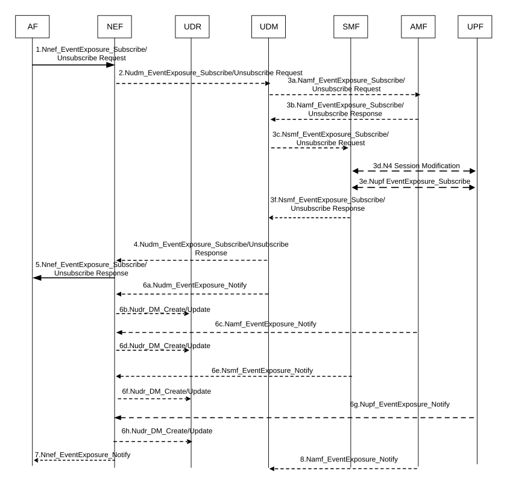

# 4.15.3.2.3 NEF service operations information flow

The procedure is used by the AF to subscribe to event notifications, to modify group-based subscriptions to event notification and to explicitly cancel a previous subscription (see clause 4.15.1). Cancelling is done by sending Nnef_EventExposure_Unsubscribe request identifying the subscription to cancel with Subscription Correlation ID. The notification steps 6 to 8 are not applicable in cancellation case.

Figure 4.15.3.2.3-1: Nnef_EventExposure_Subscribe, Unsubscribe and Notify operations

1\. The AF subscribes to one or several Event(s) (identified by Event ID) and provides the associated notification endpoint of the AF by sending Nnef_EventExposure_Subscribe request.

Event Reporting Information defines the type of reporting requested (e.g. one-time reporting, periodic reporting or event based reporting, for Monitoring Events). If the reporting event subscription is authorized by the NEF, the NEF records the association of the event trigger and the requester identity. The subscription may also include Maximum number of reports and/or Maximum duration of reporting IE and optionally MTC Provider Information.

If subscription to group-based event notifications are removed or added for certain UEs in a group of UEs for which there is an event notification subscription, the AF provides impacted UE information (e.g. SUPI, MSISDN or External Identity) with operation indication which is either cancellation or addition to NEF via Nnef_EventExposure_Subscribe without cancelling the entire group-based event notification subscription.

2\. \[Conditional - depending on authorization in step 1\] The NEF subscribes to received Event(s) (identified by Event ID) and provides the associated notification endpoint of the NEF to UDM by sending Nudm_EventExposure_Subscribe request. The NEF may either receive DNN, S-NSSAI from AF in step 1 or maps the AF-Identifier into DNN and S-NSSAI combination based on local configuration and include DNN, S-NSSAI in the request.

If the reporting event subscription is authorized by the UDM, the UDM records the association of the event trigger and the requester identity. Otherwise, the UDM continues in step 4 indicating failure.

If Nnef_EventExposure_Subscribe with update is received in step 1 indicating removal of event notification subscription for certain UEs in a group of UEs for which there is an event notification subscription, the NEF provides impacted UE information (e.g. SUPI, MSISDN or External Identity) with operation indication (cancellation) to UDM via Nudm_EventExposure_Subscribe without cancelling the entire group-based event notification subscription. If the Maximum Number of Reports applies to the event subscription, the NEF sets the stored number of reports of the indicated UE(s) to Maximum Number of Reports.

If Nnef_EventExposure_Subscribe with update is received in step 1 indicating addition of event notification subscription for certain UEs in a group of UEs for which there is an event notification subscription, the NEF provides impacted UE information (e.g. SUPI, MSISDN or External Identity) with operation indication (addition) to UDM via Nudm_EventExposure_Subscribe.

3a. \[Conditional\] If the requested event (e.g. monitoring of Loss of Connectivity) requires AMF assistance, then the UDM sends the Namf_EventExposure_Subscribe to the AMF serving the requested user. The UDM sends the Namf_EventExposure_Subscribe request to the all serving AMF(s) (if subscription applies to a UE or a group of UE(s)), or all the AMF in the same PLMN as the UDM (if subscription applies to any UE).

NOTE 1: If the UE, which is a member of a group, registers with an AMF which does not have group event subscription(s) for that group, then the UDM creates subscriptions to those event(s) with the AMF during the Registration procedure in clause 4.2.2.2.2.

As the UDM itself is not the Event Receiving NF, the UDM shall additionally provide the notification endpoint of itself besides the notification endpoint of NEF. Each notification endpoint is associated with the related (set of) Event ID(s). This is to assure the UDM can receive the notification of subscription change related event.

If the subscription applies to a group of UE(s), the UDM shall include the same notification endpoint of itself, i.e. Notification Target Address (+ Notification Correlation Id), in the subscriptions to all UE's serving AMF(s).

NOTE 2: The same notification endpoint of UDM is to help the AMF identify whether the subscription for the requested group event is same or not when a new group member UE is registered.

If Nudm_EventExposure_Subscribe with update is received in step 2 indicating removal of event notification subscription for certain UEs in a group of UEs for which there is an event notification subscription, the UDM provides impacted UE information (e.g. SUPI, MSISDN) with operation indication (cancellation) to AMF via Namf_EventExposure_Subscribe without cancelling the entire group-based event notification subscription, for the event monitored by AMF.

If Nudm_EventExposure_Subscribe with update is received in step 2 indicating addition of event notification subscription for certain UEs in a group of UEs for which there is an event notification subscription, the UDM provides impacted UE information (e.g. SUPI, MSISDN) with operation indication (addition) to AMF via Namf_EventExposure_Subscribe for the event monitored by AMF.

3b. \[Conditional\] AMF acknowledges the execution of Namf_EventExposure_Subscribe.

3c. \[Conditional\] If the requested event (e.g. PDU Session Status) requires SMF assistance, then the UDM sends the Nsmf_EventExposure_Subscribe Request message to each SMF where at least one UE identified in step 2 has a PDU session established. The NEF notification endpoint received in step 2 is included in the message.

NOTE 3: In the home routed case, the UDM sends the subscription to the V-SMF via the H-SMF.

3d-e. \[Conditional\] If the requested event is a UPF event, the SMF instructs the UPF to provide the necessary information. Depending on the event (as specified in clause 4.15.4), the SMF uses either N4 Session Modification signalling (step 3d) or Nupf_EventExposure_Subscribe service operation (step 3e). The SMF sends the request to the UPF including the NEF notification endpoint received in step 3c.

3f. \[Conditional\] The SMF acknowledges the execution of Nsmf_EventExposure_Subscribe.

4\. \[Conditional\] UDM acknowledges the execution of Nudm_EventExposure_Subscribe.

If the subscription is applicable to a group of UE(s) and the Maximum number of reports is included in the Event Report information in step 1, the Number of UEs (including all group member UEs irrespective of their registration state) is included in the acknowledgement. If AMF or SMF provides the first event report in step 3b or step 3d, the UDM includes the event report in the acknowledgement.

5\. NEF acknowledges the execution of Nnef_EventExposure_Subscribe to the requester that initiated the request. If the NEF has received the first event report already in step 4, the NEF includes the event report in the acknowledgement.

6a - 6b. \[Conditional - depending on the Event\] The UDM (depending on the Event) detects the event occurs and sends the event report, by means of Nudm_EventExposure_Notify message to the associated notification endpoint of the NEF along with the time stamp. NEF may store the information in the UDR along with the time stamp using either Nudr_DM_Create or Nudr_DM_Update service operation as appropriate.

If Nudm_EventExposure_Subscribe with update is received in step 2 indicating removal of event notification subscription for certain UEs in a group of UEs for which there is an event notification subscription, the UDM shall stop the event notification for the impacted UEs. If Maximum number of Reports is applied, the UDM shall set the number of reports of the indicated UE(s) to Maximum Number of Reports for the events monitored by UDM.

If Nudm_EventExposure_Subscribe with update is received in step 2 indicating addition of event notification subscription for certain UEs in a group of UEs for which there is an event notification subscription, the UDM shall create subscription to the event notification for the impacted UEs so as to detect the monitored event and send the event report for such impacted UEs.

6c - 6d. \[Conditional - depending on the Event\] The AMF detects the event occurs and sends the event report, by means of Namf_EventExposure_Notify message to associated notification endpoint of the NEF along with the time stamp. NEF may store the information in the UDR along with the time stamp using either Nudr_DM_Create or Nudr_DM_Update service operation as appropriate.

If the AMF has a maximum number of reports stored for the UE or the individual member UE, the AMF shall decrease its value by one for the reported event.

If Namf_EventExposure_Subscribe with update is received in step 3a indicating removal of event notification subscription for certain UEs in a group of UEs for which there is an event notification subscription, the AMF shall stop the event notification for the impacted UEs. If Maximum number of Reports is applied, the AMF shall set the number of reports of the indicated UE(s) to Maximum Number of Reports.

If Namf_EventExposure_Subscribe with update is received in step 3a indicating addition of event notification subscription for certain UEs in a group of UEs for which there is an event notification subscription, the AMF shall create subscription to the event notification for the impacted UEs so as to detect the monitored event and send the event report for such impacted UEs.

For both step 6a and step 6c, when the maximum number of reports is reached and if the subscription is applied to a UE, The NEF unsubscribes the monitoring event(s) to the UDM and the UDM unsubscribes the monitoring event(s) to AMF serving for that UE.

For both step 6a and step 6c, when the maximum number of reports is reached for an individual group member UE, the NEF uses the Number of UEs received in step 4 and the Maximum number of reports to determine if reporting for the group is complete. If the NEF determines that reporting for the group is complete, the NEF unsubscribes the monitoring event(s) to the UDM and the UDM unsubscribes the monitoring event(s) to all AMF(s) serving the UEs belonging to that group.

NOTE 4: If an expiry time as specified in clause 6.2.6.2.6 of TS 29.518 \[18\] is not included in the event subscription, then the life time of the event subscription needs to be controlled by other means as there is no time based cancellation at all even if any group member UEs fail to register.

When the Maximum duration of reporting expires in the NEF, the UDM and the AMF, then each of these nodes shall locally unsubscribe the monitoring event.

6e - 6f. \[Conditional - depending on the Event\] When the SMF detects a subscribed event, the SMF sends the event report, by means of Nsmf_EventExposure_Notify message, to the associated notification endpoint of the NEF provided in step 3c. NEF may store the information in the UDR along with the time stamp using either Nudr_DM_Create or Nudr_DM_Update service operation as appropriate.

6g - 6h. \[Conditional - depending on the Event\] When the UPF detects a subscribed event, the UPF sends the event report, by means of Nupf_EventExposure_Notify message, to the associated notification endpoint of the NEF provided by the SMF to UPF as part of step 3c. The NEF may store the information in the UDR along with the time stamp using either Nudr_DM_Create or Nudr_DM_Update service operation as appropriate.

7\. \[Conditional - depending on the Event in steps 6a-6f\] The NEF forwards to the AF the reporting event received by either Nudm_EventExposure_Notify and/or Namf_EventExposure_Notify. In the case of the PDU Session Status event, the NEF maps it to an PDN Connectivity Status notification when reporting to the AF.

8\. \[Conditional - depending on the Event\] The AMF detects the subscription change related event occurs, e.g. Subscription Correlation ID change due to AMF reallocation or addition of new Subscription Correlation ID due to a new group UE registered, it sends the event report, by means of Namf_EventExposure_Notify message to the associated notification endpoint of the UDM.
