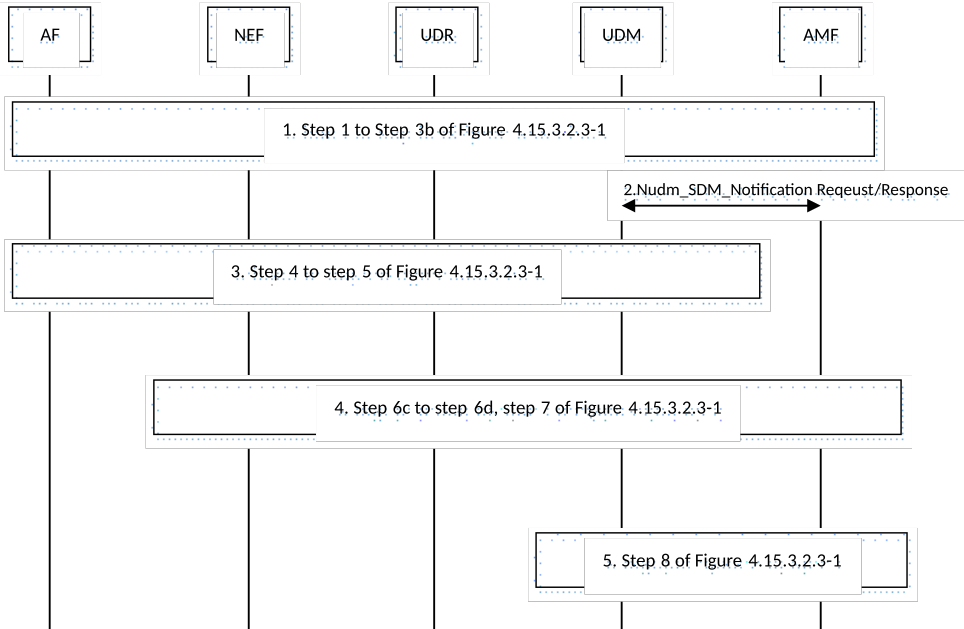

# 4.15.3.2.3b Specific NEF service operations information flow for loss of connectivity and UE reachability

The procedure is used by the AF to subscribe to notifications and to explicitly cancel a previous subscription for loss of connectivity and UE reachability.

Figure 4.15.3.2.3b-1: Nnef_EventExposure_Subscribe, Unsubscribe and Notify operations or loss of connectivity and UE reachability

1\. Step 1 to step 3b of Figure 4.15.3.2.3-1 are performed with the following differences:

\- For Loss of Connectivity, the subscription request may include Maximum Detection Time (see Table 4.15.3.1-1).

\- For UE reachability, the subscription request may include Maximum Latency, Maximum Response Time and/or Suggested number of downlink packets (see Table 4.15.3.1-1). In step 3a of Figure 4.15.3.2.3-1, the UDM may include Maximum Response Time in the subscription request to the AMF.

NOTE 1: It is expected that Maximum Latency, Maximum Response Time and/or Suggested number of downlink packets included in the subscription request is only used by the AF that does not support Parameter Provisioning procedure specified in clause 4.15.6.3a.

\- For UE reachability, the AF may include Idle Status Indication request. If Idle Status Indication request is included, the NEF includes it in Nudm_EventExposure_Subscribe message. If the UDM receives Idle Status Indication request, it includes it in Namf_EventExposure_Subscribe message. If the NEF does not support the requested Idle Status Indication, then depending on operator policies, the NEF rejects the request.

2\. \[Conditional\] If the subscribed periodic registration timer has not been set according to any subscription request, or a Network Configuration as defined in clause 4.15.6.3a the UDM shall set the subscribed periodic registration timer using the Maximum Detection Time or Maximum Latency; otherwise if the subscribed periodic registration timer was previously set by a different subscription identified by a different Notification Target Address (+ Notification Correlation ID), or set by a different Network Configuration identified by a different NEF reference ID for the same UE and if the newly received Maximum Detection Time or Maximum Latency is lower than the provided subscribed periodic registration timer, the UDM shall set the subscribed periodic registration timer using the newly received Maximum Detection Time or Maximum Latency.

If Nudm_EventExposure_Unsubscribe request is performed in step 1, the UDM shall recalculate the subscribed periodic registration timer based on the remaining event subscriptions and/or Network Configurations.

In addition for UE reachability subscription, if the newly received Maximum Response Time is longer than the provided subscribed Active Time (i.e. previously provided Maximum Response Time), the UDM shall set the subscribed Active Time using the newly received Maximum Response Time. If the suggested number of downlink packets is newly received, the UDM shall add the newly received suggested number of downlink packets to the currently used value of suggested number of downlink packets if the aggregated value is within the operator defined range.

If Nudm_EventExposure_Unsubscribe request is performed in step 1, the UDM shall recalculate the subscribed Active Time and/or Suggested Number of Downlink Packets based on the remaining event subscriptions and/or Network Configurations.

If the subscribed periodic registration timer or the subscribed Active Time are set or modified, the UDM sends the Nudm_SDM_Notification request to related serving AMF(s). If the AMF receives a subscribed periodic registration timer value from the UDM, it allocates the received value to the UE as the periodic registration timer at subsequent Registration procedure. The AMF starts monitoring of the expiration of the mobile reachable timer for Loss of Connectivity (if required) and starts monitoring of the UE entering connected mode for UE reachability (if required).

If the suggested number of downlink packets are set or modified, the UDM sends the Nudm_SDM_Notification request to related serving SMF(s). The SMF configures the data buffer at the SMF/UPF according the suggested number of downlink packets.

If the provided value is updated by the UDM, the UDM may notify the NEF (which then notifies the AF) of the actual value that is being applied in the 3GPP network.

3\. Step 4 to step 5 of Figure 4.15.3.2.3-1 are performed.

4\. Step 6c to step 6d of Figure 4.15.3.2.3-1 are performed with the following differences:

\- For Loss of Connectivity, the event is detected when the mobile reachability timer expires or when the UE has provided Unavailability Period Duration during the Registration procedure without including Start of Unavailability Period or when unavailability period starts based on Start of Unavailability Period stored in UE context at AMF or Deregistration procedure as described in clause 5.4.1.4 of TS 23.501 \[2\].

\- For UE reachability, the event is detected when the UE changes to connected mode or when the UE will become reachable for paging.

\- For UE reachability, if Idle Status Indication request was included in step 1 and the AMF supports Idle Status Indication, the AMF includes also the Idle Status Indication.

5\. Step 8 of Figure 4.15.3.2.3-1 is performed.
